Analysis of 3414 pooled colorectal cancer metagenomes
================
2025-08-27

# Run ZiB analysis in q99 mode

## Load dependencies

``` r
library(SummarizedExperiment)
library(tidyverse)
library(strainspy)
library(dplyr)
library(ggplot2)
library(ggvenn)
library(stringr)
```

## Load metadata

``` r
meta_path <- "./data/segata_pooled_3741/combined_metadata.tsv"
meta <- read.csv(meta_path, sep = '\t') 

# set up contrasts/reference levels
meta$disease = factor(meta$disease, levels = c("Control", "CRC", "Adenoma"))
meta$study = factor(meta$study)
meta$cascon = ifelse(meta$cascon == "Case", "Case", "Control")
meta$cascon = factor(meta$cascon, levels = c("Control", "Case"))
meta$country = factor(meta$country)
meta$sex = factor(meta$sex, levels = c("Female", "Male"))
# let's reset tumour stages
meta$tumour_stage_AJCC[meta$tumour_stage_AJCC == ""] = "NoTumour"
meta$tumour_stage_AJCC[meta$disease == "Adenoma"] = "Adenoma"
meta$tumour_stage_AJCC[meta$tumour_stage_AJCC == "CRC_stage_unlabelled"] = "Unstaged"
meta$tumour_stage_AJCC = factor(meta$tumour_stage_AJCC, levels = c("NoTumour", "Adenoma", "0", "I", "II", "III", "IV", "Unstaged"))

meta$tumour_location[meta$disease == "Control"] = "NoTumour"
meta$tumour_location[meta$disease == "Adenoma"] = "Adenoma"
meta$tumour_location = factor(meta$tumour_location, levels = c("NoTumour", "Adenoma", "transverse", "left_sided", "right_sided", "multiple_sites", "nd"))
```

## Load sylph outputs

``` r
sy <- read_sylph("./data/segata_pooled_3741/combined_q_99.tsv.gz") # q99)
```

    ## Detected Sylph query output file.

``` r
sy <- filter_by_presence(sy, min_nonzero = 342) # filter at 10%
```

    ## Retained 20476 rows after filtering

``` r
# annoying renames to match meta V sylph file
colnames(sy) <- gsub("_1", "", colnames(sy))
colnames(sy) <- gsub("_merged", "", colnames(sy))
colData(sy)$Sample_file <- gsub("_1", "", basename(colData(sy)$Sample_file))
colData(sy)$Sample_file <- gsub("_merged", "", colnames(sy))

dim(sy)
```

    ## [1] 20476  3414

``` r
# Checks before merging metadata
all(colnames(sy) %in% meta$run_accession)
```

    ## [1] TRUE

``` r
all(meta$run_accession %in% colnames(sy))
```

    ## [1] TRUE

``` r
sy = modify_metadata(sy, meta)
```

## Fit the model

``` r
design <- as.formula("~ disease + age + sex + BMI + (1 | study)")

save_path <- "output_rds/CRC_zib_q_99_ebp.rds"
# Run with ebp - this looks a bit less noisy
if(file.exists(save_path)){
  ZB_fit <- readRDS(save_path)
} else {
  ebp = compute_eb_priors(sy, strainspy:::nobars_(design), nthreads = parallel::detectCores(),low_cutoff = 0, high_cutoff = Inf)
  ZB_fit <- glmZiBFit(sy, design, MAP_prior = ebp, nthreads = parallel::detectCores())
  saveRDS(ZB_fit, save_path)
}
```

## Visualise Outputs

### Load GTDB taxonomy

``` r
taxonomy <- read_taxonomy("data/TAXONOMY/sylph_DB_taxonomy_99.tsv")
```

## Manhattan and Volcano plots

### Control vs. Adenoma

``` r
plot_manhattan(ZB_fit, taxonomy = taxonomy, aggregate_by_taxa = T, coef = 3)
```

    ## ! # Invaild edge matrix for <phylo>. A <tbl_df> is returned.
    ## ! # Invaild edge matrix for <phylo>. A <tbl_df> is returned.
    ## ! # Invaild edge matrix for <phylo>. A <tbl_df> is returned.
    ## ! # Invaild edge matrix for <phylo>. A <tbl_df> is returned.

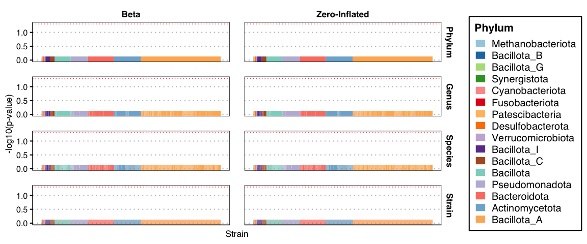<!-- -->

``` r
plot_manhattan(ZB_fit, taxonomy = taxonomy, aggregate_by_taxa = F, coef = 3)
```

    ## ! # Invaild edge matrix for <phylo>. A <tbl_df> is returned.
    ## ! # Invaild edge matrix for <phylo>. A <tbl_df> is returned.
    ## ! # Invaild edge matrix for <phylo>. A <tbl_df> is returned.
    ## ! # Invaild edge matrix for <phylo>. A <tbl_df> is returned.
    ## ! # Invaild edge matrix for <phylo>. A <tbl_df> is returned.
    ## ! # Invaild edge matrix for <phylo>. A <tbl_df> is returned.

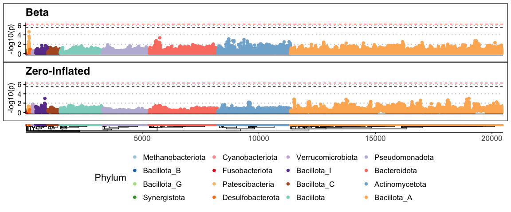<!-- -->

``` r
plot_volcano(ZB_fit, coef = 3)
```

    ## Found 20476 tophits for diseaseAdenoma at alpha = 1 using holm

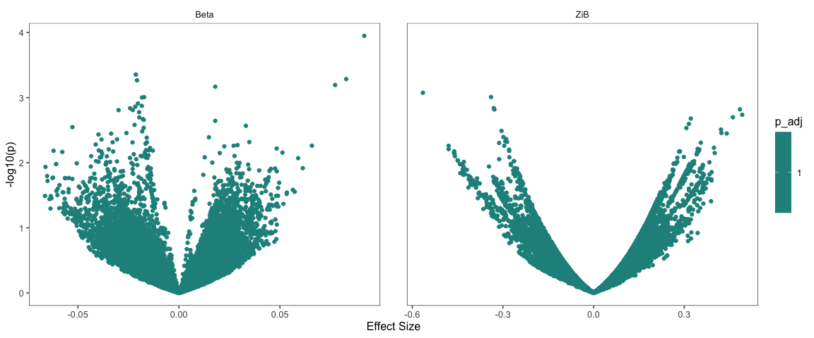<!-- -->

No real signal detected. This agrees with the original paper.

### Control vs. CRC

``` r
plot_manhattan(ZB_fit, taxonomy = taxonomy, aggregate_by_taxa = T, coef = 2) 
```

    ## ! # Invaild edge matrix for <phylo>. A <tbl_df> is returned.
    ## ! # Invaild edge matrix for <phylo>. A <tbl_df> is returned.
    ## ! # Invaild edge matrix for <phylo>. A <tbl_df> is returned.
    ## ! # Invaild edge matrix for <phylo>. A <tbl_df> is returned.

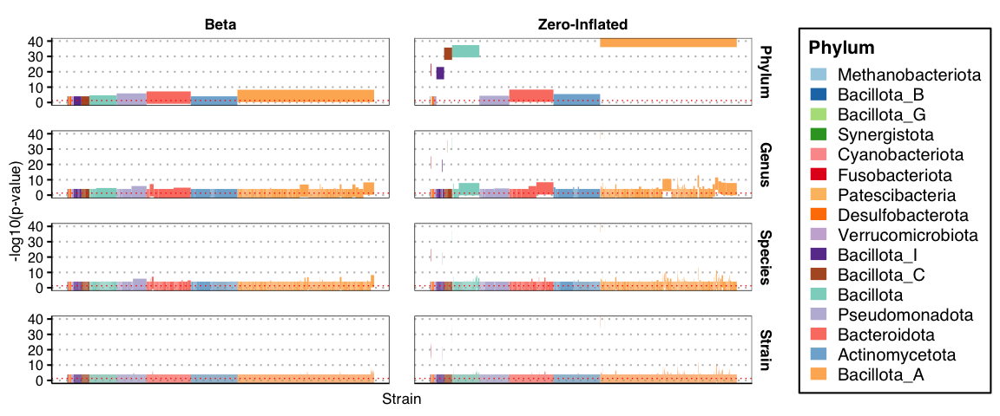<!-- -->

``` r
plot_manhattan(ZB_fit, taxonomy = taxonomy, aggregate_by_taxa = F, coef = 2) 
```

    ## ! # Invaild edge matrix for <phylo>. A <tbl_df> is returned.
    ## ! # Invaild edge matrix for <phylo>. A <tbl_df> is returned.
    ## ! # Invaild edge matrix for <phylo>. A <tbl_df> is returned.
    ## ! # Invaild edge matrix for <phylo>. A <tbl_df> is returned.
    ## ! # Invaild edge matrix for <phylo>. A <tbl_df> is returned.
    ## ! # Invaild edge matrix for <phylo>. A <tbl_df> is returned.

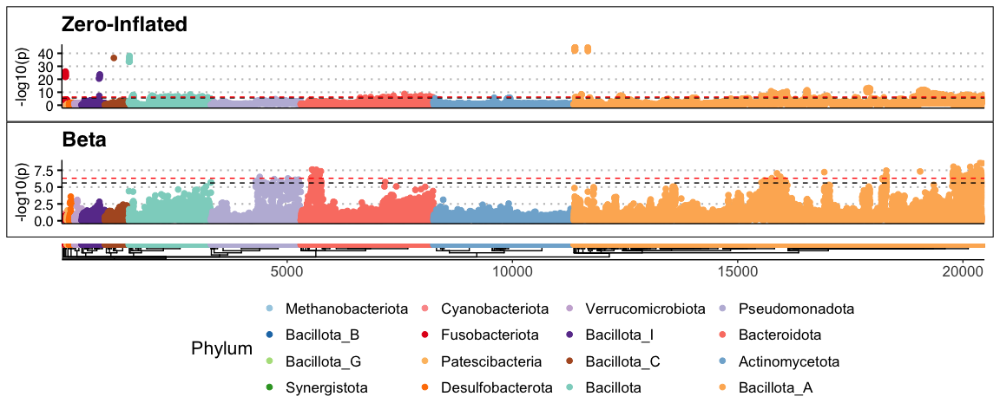<!-- -->

``` r
plot_volcano(ZB_fit, coef = 2)
```

    ## Found 20476 tophits for diseaseCRC at alpha = 1 using holm

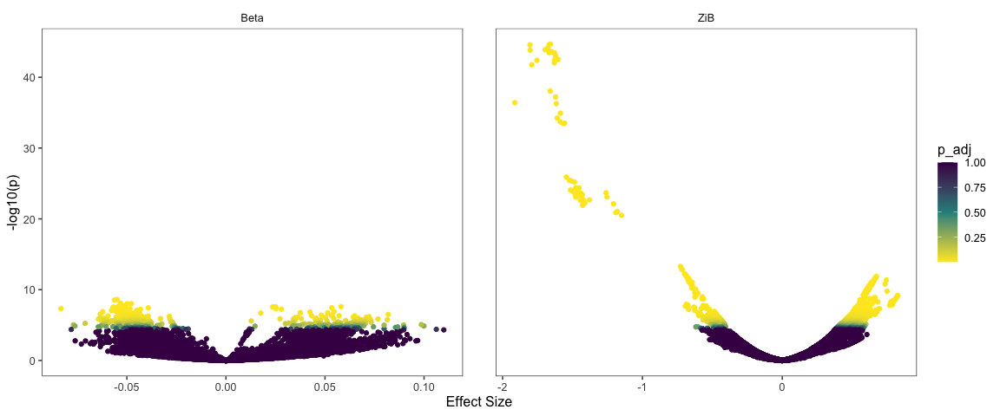<!-- -->

Looks like there are many hits.

## Summarise and inspect

## Build a summary from top hits

``` r
ZIB_th_path = "output_rds/CRC_zib_q_99_ebp_th_filtered.rds"
if(file.exists(ZIB_th_path)){
  th = readRDS(ZIB_th_path)
} else {
  th = top_hits(ZB_fit, coef = 2)
  
  # Do the posthoc test
  # Assumption: A strain is different if their ANI to a given ref is >1.5% different
  th_ph = estimate_effect_sizes(sy, ZB_fit, th, beta_min_ani_diff = 1.5e-3, 
                                nthreads = parallel::detectCores()) 
  
  # contigs with good effect size and enough non-zero samples in Control-CRC groups
  good_contigs = unique(th_ph$Contig_name[is.na(th_ph$Comment) & th_ph$Contrast == "Control - CRC"])
  
  th = th[th$Contig_name %in% good_contigs,]
  
  th$Species = taxonomy$Species[match(th$Genome_file, taxonomy$Genome)]
  saveRDS(th, ZIB_th_path)
  
}
# Signals detected from 70 species
length(sort(table(th$Species), decreasing = T))
```

    ## [1] 70

``` r
# Ask chatGPT for a nice summary table
summary_tbl <- th %>%
  filter(!is.na(Species)) %>%
  group_by(Species) %>%
  summarise(
    N_hits = n(),
    
    Top_adj_p_beta  = min(p_adjust, na.rm = TRUE),
    Top_coef_beta   = coefficient[which.min(p_adjust)],
    Top_se_beta     = std_error[which.min(p_adjust)],
    Top_contig_beta = Contig_name[which.min(p_adjust)],
    
    Top_adj_p_ZI    = min(zi_p_adjust, na.rm = TRUE),
    Top_coef_ZI     = zi_coefficient[which.min(zi_p_adjust)],
    Top_se_ZI       = zi_std_error[which.min(zi_p_adjust)],
    Top_contig_ZI   = Contig_name[which.min(zi_p_adjust)],
    
    .groups = "drop"
  ) %>%
  mutate(
    Min_adj_p = pmin(Top_adj_p_beta, Top_adj_p_ZI, na.rm = TRUE),
    Dominant_component = ifelse(Top_adj_p_beta < Top_adj_p_ZI, "Beta", "ZI"),
    Dominant_contig    = ifelse(Dominant_component == "Beta", Top_contig_beta, Top_contig_ZI),
    Dominant_coef      = ifelse(Dominant_component == "Beta", Top_coef_beta, Top_coef_ZI),
    Dominant_se        = ifelse(Dominant_component == "Beta", Top_se_beta, Top_se_ZI)
  ) %>%
  select(Species, N_hits, Dominant_component, Min_adj_p, Dominant_coef, Dominant_se, Dominant_contig) %>%
  arrange(Min_adj_p)

# Write as tsv for manual perusal
# write.table(summary_tbl, "output_tables/CRC_Z99_ebp_summary.tsv", sep = '\t', col.names = T, row.names = F, quote = F)
```

## ZI component hits

When the `Dominant_component` is ZI, negative and positive
`Dominant_coef` indicates presence and absence in CRC compared to
control.

### Visualise this in a forest plot

``` r
zi_summary <- summary_tbl %>%
  filter(Dominant_component == "ZI") %>%
  arrange(Min_adj_p) %>%
  mutate(
    # Confidence interval before flipping
    CI_low = Dominant_coef - 1.96 * Dominant_se,
    CI_high = Dominant_coef + 1.96 * Dominant_se,
    
    # Flip effect size and CI
    Dominant_coef = -Dominant_coef,
    CI_low = -CI_low,
    CI_high = -CI_high,
    
    # Trend annotation
    Trend = ifelse(Dominant_coef > 0, "\u2191 CRC", "\u2193 CRC")
  ) %>%
  arrange(Trend, desc(Dominant_coef)) %>%
  mutate(Species = factor(Species, levels = rev(unique(Species))))

ggplot(zi_summary, aes(x = Dominant_coef, y = Species, color = Trend)) +
  geom_point(aes(size = N_hits)) +
  geom_errorbarh(aes(xmin = CI_low, xmax = CI_high), height = 0.2) +
  geom_vline(xintercept = 0, linetype = "dashed") +
  scale_color_manual(values = c("\u2191 CRC" = "red", "\u2193 CRC" = "blue")) +
  scale_size_continuous(
    name = "Strains",
    range = c(2, 8),  # tweak for your figure aesthetics
    breaks = c(1, 45, 90),
    labels = c("1", "45", "90"),
    guide = guide_legend(override.aes = list(linetype = 0))  # remove lines from legend
  ) +
  labs(
    x = "Effect size",
    y = "Species",
    color = "Trend"
  ) +
  theme_minimal(base_size = 16)
```

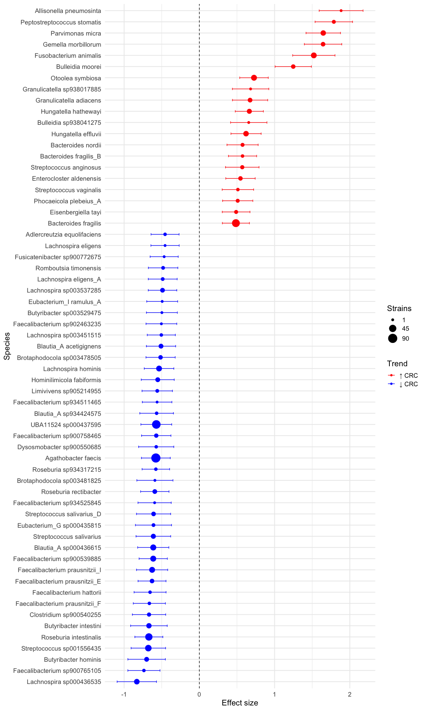<!-- -->

## Beta component hits

When the `Dominant_component` is Beta, negative and positive
`Dominant_coef` indicates lower and higher cANI in CRC compared to
control, reflecting similarity of the strain to the reference. Higher
estimates imply possibly larger strain differences in CRC compared to
controls.

``` r
beta_summary <- summary_tbl %>%
  filter(Dominant_component == "Beta") %>%
  arrange(Min_adj_p) %>%
  mutate(
    CI_low = Dominant_coef - 1.96 * Dominant_se,
    CI_high = Dominant_coef + 1.96 * Dominant_se,
    Trend = ifelse(Dominant_coef > 0, "\u2191 CRC (similar)", "\u2193 CRC (divergent)"),
    Species = factor(Species, levels = rev(unique(Species)))
  ) %>%
  arrange(desc(Dominant_coef)) %>%
  mutate(Species = factor(Species, levels = rev(unique(Species))))

ggplot(beta_summary, aes(x = Dominant_coef, y = Species, color = Trend)) +
  geom_point(aes(size = N_hits)) +
  geom_errorbarh(aes(xmin = CI_low, xmax = CI_high), height = 0.2) +
  geom_vline(xintercept = 0, linetype = "dashed") +
  scale_color_manual(values = c("\u2191 CRC (similar)" = "red",
                                "\u2193 CRC (divergent)" = "blue")) +
  scale_size_continuous(
    name = "Strains",
    range = c(2, 8),
    breaks = c(1, 60, 120),
    labels = c("1", "60", "120")
  ) +
  labs(
    x = "Effect size (difference in ANI, CRC vs HC)",
    y = "Species",
    color = "Trend"
  ) +
  theme_minimal(base_size = 16)
```

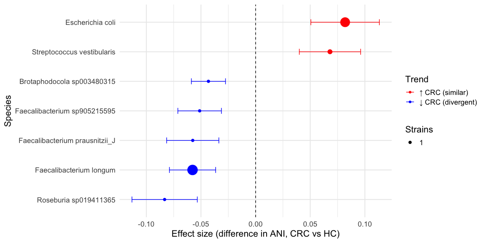<!-- -->

## ANI distribution of the top strain of each beta detected species

``` r
plot_ani_dist(sy, phenotype = 'disease', contigs = beta_summary$Dominant_contig, 
              show_points = T, plot_type = 'box', 
              contig_names = as.character(beta_summary$Species))
```

    ## Warning: Removed 8234 rows containing non-finite outside the scale range
    ## (`stat_boxplot()`).

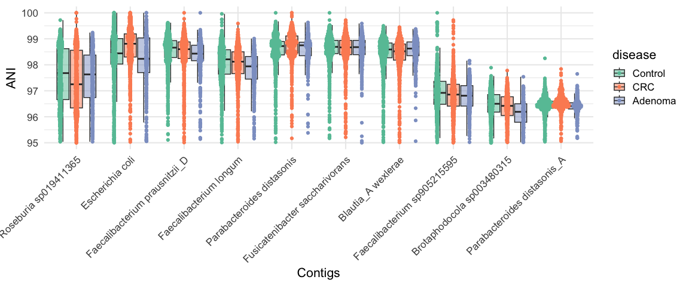<!-- -->

# Associations with other metadata

Since `tumour_stage_AJCC` and `tumour_location` are highly correlated
with `disease`, we’ll first fit separate models on subsets for direct
comparison.

## Tumour location

``` r
# Directly compare left vs. right
meta_lr_acc = which(meta$tumour_location == 'left_sided' | meta$tumour_location == 'right_sided')
lr_acc = meta$run_accession[meta_lr_acc]
meta_lr = meta[meta_lr_acc, c('run_accession', 'study', 'age', 'BMI', 'sex', 'tumour_location')]
meta_lr$tumour_location = factor(as.character(meta_lr$tumour_location), levels = c('left_sided', 'right_sided'))
# Reload sylph q99
sy <- read_sylph("./data/segata_pooled_3741/combined_q_99.tsv.gz") # q99)
```

    ## Detected Sylph query output file.

``` r
# annoying renames to match meta V sylph file
colnames(sy) <- gsub("_1", "", colnames(sy))
colnames(sy) <- gsub("_merged", "", colnames(sy))
colData(sy)$Sample_file <- gsub("_1", "", basename(colData(sy)$Sample_file))
colData(sy)$Sample_file <- gsub("_merged", "", colnames(sy))

# only lVr samples
sy = sy[, sapply(lr_acc, function(x) which(x == colnames(sy)))]
sy <- filter_by_presence(sy, min_nonzero = round(dim(sy)[2]/10)) # filter at 10%
```

    ## Retained 21496 rows after filtering

``` r
dim(sy)
```

    ## [1] 21496   868

``` r
# Checks before merging metadata
all(colnames(sy) %in% meta_lr$run_accession)
```

    ## [1] TRUE

``` r
all(meta_lr$run_accession %in% colnames(sy))
```

    ## [1] TRUE

``` r
sy = modify_metadata(sy, meta_lr)

design <- as.formula("~ tumour_location + age + sex + BMI + (1 | study)")

save_path <- "output_rds/CRC_zib_q_99_ebp_tumour_location_lVr.rds"
# Run with ebp - this looks a bit less noisy
if(file.exists(save_path)){
  ZB_fit_tl <- readRDS(save_path)
} else {
  ebp = compute_eb_priors(sy, strainspy:::nobars_(design), nthreads = parallel::detectCores(),low_cutoff = 0, high_cutoff = Inf)
  ZB_fit_tl <- glmZiBFit(sy,  design, MAP_prior = ebp, nthreads = parallel::detectCores())
  saveRDS(ZB_fit_tl, save_path)
}
```

### Build a summary from top hits

``` r
th_tl = top_hits(ZB_fit_tl, coef = 2)
```

    ## Found 81 tophits for tumour_locationright_sided at alpha = 0.05 using holm

``` r
# There are no strain identity differences, post hoc testing ignored

th_tl$Species = taxonomy$Species[match(th_tl$Genome_file, taxonomy$Genome)]

# Signals detected from 11 species
length(sort(table(th_tl$Species), decreasing = T))
```

    ## [1] 11

``` r
# Ask chatGPT for a nice summary table
summary_tbl <- th_tl %>%
  filter(!is.na(Species)) %>%
  group_by(Species) %>%
  summarise(
    N_hits = n(),
    
    Top_adj_p_beta  = min(p_adjust, na.rm = TRUE),
    Top_coef_beta   = coefficient[which.min(p_adjust)],
    Top_se_beta     = std_error[which.min(p_adjust)],
    Top_contig_beta = Contig_name[which.min(p_adjust)],
    
    Top_adj_p_ZI    = min(zi_p_adjust, na.rm = TRUE),
    Top_coef_ZI     = zi_coefficient[which.min(zi_p_adjust)],
    Top_se_ZI       = zi_std_error[which.min(zi_p_adjust)],
    Top_contig_ZI   = Contig_name[which.min(zi_p_adjust)],
    
    .groups = "drop"
  ) %>%
  mutate(
    Min_adj_p = pmin(Top_adj_p_beta, Top_adj_p_ZI, na.rm = TRUE),
    Dominant_component = ifelse(Top_adj_p_beta < Top_adj_p_ZI, "Beta", "ZI"),
    Dominant_contig    = ifelse(Dominant_component == "Beta", Top_contig_beta, Top_contig_ZI),
    Dominant_coef      = ifelse(Dominant_component == "Beta", Top_coef_beta, Top_coef_ZI),
    Dominant_se        = ifelse(Dominant_component == "Beta", Top_se_beta, Top_se_ZI)
  ) %>%
  select(Species, N_hits, Dominant_component, Min_adj_p, Dominant_coef, Dominant_se, Dominant_contig) %>%
  arrange(Min_adj_p)

# Write as tsv for manual perusal
# write.table(summary_tbl, "output_tables/CRC_Z99_tVl_direct_summary.tsv", sep = '\t', col.names = T, row.names = F, quote = F)
```

There are only presence/absence hits.

### ZI component hits

Negative and positive `Dominant_coef` indicates strain presence in the
guts of patients with Left and Right CRC tumors, respectively.

### Visualise this in a forest plot

``` r
zi_summary <- summary_tbl %>%
  filter(Dominant_component == "ZI") %>%
  arrange(Min_adj_p) %>%
  mutate(
    # Confidence interval before flipping
    CI_low = Dominant_coef - 1.96 * Dominant_se,
    CI_high = Dominant_coef + 1.96 * Dominant_se,
    
    # Flip effect size and CI
    Dominant_coef = -Dominant_coef,
    CI_low = -CI_low,
    CI_high = -CI_high,
    
    # Trend annotation
    Trend = ifelse(Dominant_coef > 0, "\u2191 Right", "\u2193 Left")
  ) %>%
  arrange(Trend, desc(Dominant_coef)) %>%
  mutate(Species = factor(Species, levels = rev(unique(Species))))

ggplot(zi_summary, aes(x = Dominant_coef, y = Species, color = Trend)) +
  geom_point(aes(size = N_hits)) +
  geom_errorbarh(aes(xmin = CI_low, xmax = CI_high), height = 0.2) +
  geom_vline(xintercept = 0, linetype = "dashed") +
  scale_color_manual(values = c("\u2191 Right" = "orange", "\u2193 Left" = "violet")) +
  scale_size_continuous(
    name = "Strains",
    range = c(2, 8),  # tweak for your figure aesthetics
    breaks = c(1, 45, 90),
    labels = c("1", "45", "90"),
    guide = guide_legend(override.aes = list(linetype = 0))  # remove lines from legend
  ) +
  labs(
    x = "Effect size",
    y = "Species",
    color = "Trend"
  ) +
  theme_minimal(base_size = 16)
```

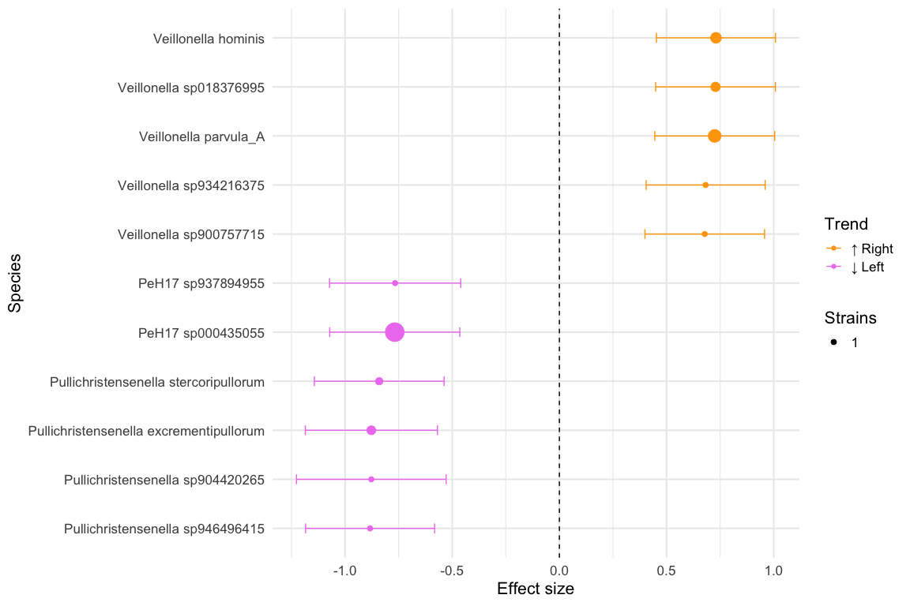<!-- -->

Looks like it is mostly dominated by *Veillonella sp.* and
*Pullichristensenella sp.*. *Veillonella parvula* is one of the top hits
in 10.1016/j.chom.2025.03.012, but we are not detecting any of the other
hits.

## Cancer stage

``` r
table(meta$tumour_stage_AJCC)
```

    ## 
    ## NoTumour  Adenoma        0        I       II      III       IV Unstaged 
    ##     1478      614       90      231      230      258      289      224

``` r
# Directly compare left vs. right
meta_stage_acc = which(meta$tumour_stage_AJCC == '0' | 
                         meta$tumour_stage_AJCC == 'I' | 
                         meta$tumour_stage_AJCC == 'II' | 
                         meta$tumour_stage_AJCC == 'III' | 
                         meta$tumour_stage_AJCC == 'IV')

stage_acc = meta$run_accession[meta_stage_acc]
meta_stage = meta[meta_stage_acc, c('run_accession', 'study', 'age', 'BMI', 'sex', 'tumour_stage_AJCC')]
meta_stage$tumour_stage_AJCC = factor(as.character(meta_stage$tumour_stage_AJCC), levels = c('0', 'I', 'II', 'III', 'IV'))

###################
##### No HITS #####
###################
#### Model 1 - compare stages 1,2,3 and 4 vs. stage 0
# Reload sylph q99
sy <- read_sylph("./data/segata_pooled_3741/combined_q_99.tsv.gz") # q99)
```

    ## Detected Sylph query output file.

``` r
# annoying renames to match meta V sylph file
colnames(sy) <- gsub("_1", "", colnames(sy))
colnames(sy) <- gsub("_merged", "", colnames(sy))
colData(sy)$Sample_file <- gsub("_1", "", basename(colData(sy)$Sample_file))
colData(sy)$Sample_file <- gsub("_merged", "", colnames(sy))

# only lVr samples
sy = sy[, sapply(meta_stage$run_accession, function(x) which(x == colnames(sy)))]
sy <- filter_by_presence(sy, min_nonzero = round(dim(sy)[2]/10)) # filter at 10%
```

    ## Retained 21722 rows after filtering

``` r
dim(sy)
```

    ## [1] 21722  1098

``` r
# Checks before merging metadata
all(colnames(sy) %in% meta_stage$run_accession)
```

    ## [1] TRUE

``` r
all(meta_stage$run_accession %in% colnames(sy))
```

    ## [1] TRUE

``` r
sy = modify_metadata(sy, meta_stage)


save_path <- "output_rds/CRC_zib_q_99_ebp_tumour_stage_0v.rds"
design <- as.formula('~tumour_stage_AJCC + age + sex + BMI + (1 | study)')
# Run with ebp
if(file.exists(save_path)){
  ZB_fit_stage_full <- readRDS(save_path)
} else {
  ebp = compute_eb_priors(sy, strainspy:::nobars_(design), nthreads = parallel::detectCores(),low_cutoff = 0, high_cutoff = Inf)
  ZB_fit_stage_full <- glmZiBFit(sy,  design, MAP_prior = ebp, nthreads = parallel::detectCores())
  saveRDS(ZB_fit_stage_full, save_path)
}

# Variables
top_hits(ZB_fit_stage_full, coef = 2, method = "BH")
```

    ## Warning in top_hits(ZB_fit_stage_full, coef = 2, method = "BH"): Multiple
    ## testing correction using `BH`: No significant associations detected for coef =
    ## 2 at alpha = 0.050000

    ## # A tibble: 0 × 10
    ## # ℹ 10 variables: Contig_name <chr>, Genome_file <chr>, coefficient <dbl>,
    ## #   std_error <dbl>, p_value <dbl>, p_adjust <dbl>, zi_coefficient <dbl>,
    ## #   zi_std_error <dbl>, zi_p_value <dbl>, zi_p_adjust <dbl>

``` r
top_hits(ZB_fit_stage_full, coef = 3, method = "BH")
```

    ## Warning in top_hits(ZB_fit_stage_full, coef = 3, method = "BH"): Multiple
    ## testing correction using `BH`: No significant associations detected for coef =
    ## 3 at alpha = 0.050000

    ## # A tibble: 0 × 10
    ## # ℹ 10 variables: Contig_name <chr>, Genome_file <chr>, coefficient <dbl>,
    ## #   std_error <dbl>, p_value <dbl>, p_adjust <dbl>, zi_coefficient <dbl>,
    ## #   zi_std_error <dbl>, zi_p_value <dbl>, zi_p_adjust <dbl>

``` r
top_hits(ZB_fit_stage_full, coef = 4, method = "BH")
```

    ## Warning in top_hits(ZB_fit_stage_full, coef = 4, method = "BH"): Multiple
    ## testing correction using `BH`: No significant associations detected for coef =
    ## 4 at alpha = 0.050000

    ## # A tibble: 0 × 10
    ## # ℹ 10 variables: Contig_name <chr>, Genome_file <chr>, coefficient <dbl>,
    ## #   std_error <dbl>, p_value <dbl>, p_adjust <dbl>, zi_coefficient <dbl>,
    ## #   zi_std_error <dbl>, zi_p_value <dbl>, zi_p_adjust <dbl>

``` r
top_hits(ZB_fit_stage_full, coef = 5, method = "BH")
```

    ## Warning in top_hits(ZB_fit_stage_full, coef = 5, method = "BH"): Multiple
    ## testing correction using `BH`: No significant associations detected for coef =
    ## 5 at alpha = 0.050000

    ## # A tibble: 0 × 10
    ## # ℹ 10 variables: Contig_name <chr>, Genome_file <chr>, coefficient <dbl>,
    ## #   std_error <dbl>, p_value <dbl>, p_adjust <dbl>, zi_coefficient <dbl>,
    ## #   zi_std_error <dbl>, zi_p_value <dbl>, zi_p_adjust <dbl>

``` r
#### Model 2 - merge stages 0 and 1 as early and compare with 2, 3 and 4.
###################
##### HAS HITS ####
###################
meta_stage$tumour_stage_merged = sapply(as.character(meta_stage$tumour_stage_AJCC), function(x) ifelse( (x=='0'|x=='I'), 'Early', x)) 
meta_stage$tumour_stage_merged = factor(as.character(meta_stage$tumour_stage_merged), levels = c('Early', 'II', 'III', 'IV'))

save_path <- "output_rds/with_intercept/CRC_zib_q_99_ebp_tumour_stage_early0Iv.rds"
design <- as.formula('~tumour_stage_merged + age + sex + BMI + (1 | study)')
sy = modify_metadata(sy, meta_stage)
```

    ## Warning in modify_metadata(sy, meta_stage): The following metadata columns already exist in `se` and will not be modified. To replace with provided meta_data, set run again with `replace = TRUE`:
    ## 
    ## study, age, BMI, sex, tumour_stage_AJCC

``` r
# Run with ebp
if(file.exists(save_path)){
  ZB_fit_stage_early012V <- readRDS(save_path)
} else {
  ebp = compute_eb_priors(sy, strainspy:::nobars_(design), nthreads = parallel::detectCores(),low_cutoff = 0, high_cutoff = Inf)
  ZB_fit_stage_early012V <- glmZiBFit(sy,  design, MAP_prior = ebp, nthreads = parallel::detectCores())
  saveRDS(ZB_fit_stage_early012V, save_path)
}

# Variables
th_stage_1 = cbind(top_hits(ZB_fit_stage_early012V, coef = 2, method = "BH"), model = 'early01V', stage = 2)
```

    ## Found 24 tophits for tumour_stage_mergedII at alpha = 0.05 using BH

``` r
top_hits(ZB_fit_stage_early012V, coef = 3, method = "BH")
```

    ## Warning in top_hits(ZB_fit_stage_early012V, coef = 3, method = "BH"): Multiple
    ## testing correction using `BH`: No significant associations detected for coef =
    ## 3 at alpha = 0.050000

    ## # A tibble: 0 × 10
    ## # ℹ 10 variables: Contig_name <chr>, Genome_file <chr>, coefficient <dbl>,
    ## #   std_error <dbl>, p_value <dbl>, p_adjust <dbl>, zi_coefficient <dbl>,
    ## #   zi_std_error <dbl>, zi_p_value <dbl>, zi_p_adjust <dbl>

``` r
th_stage_2 = cbind(top_hits(ZB_fit_stage_early012V, coef = 4, method = "BH"), model = 'early01V', stage = 4)
```

    ## Found 6 tophits for tumour_stage_mergedIV at alpha = 0.05 using BH

``` r
#### No results - Fig 3B from Segata paper - merge 0, 1 and 2 as early and compare with merged 3 and 4 (late)
meta_stage$tumour_stage_merged_earlyVlate = sapply(as.character(meta_stage$tumour_stage_AJCC), function(x) ifelse( (x=='0'|x=='I'|x=='II'), 'Early', 'Late')) 
meta_stage$tumour_stage_merged_earlyVlate = factor(as.character(meta_stage$tumour_stage_merged_earlyVlate), levels = c('Early', 'Late'))

save_path <- "output_rds/CRC_zib_q_99_ebp_tumour_stage_early012Vlate34.rds"
design <- as.formula('~tumour_stage_merged_earlyVlate + age + sex + BMI + (1 | study)')
sy = modify_metadata(sy, meta_stage)
```

    ## Warning in modify_metadata(sy, meta_stage): The following metadata columns already exist in `se` and will not be modified. To replace with provided meta_data, set run again with `replace = TRUE`:
    ## 
    ## study, age, BMI, sex, tumour_stage_AJCC, tumour_stage_merged

``` r
# Run with ebp
if(file.exists(save_path)){
  ZB_fit_stage_early012Vlate34 <- readRDS(save_path)
} else {
  ebp = compute_eb_priors(sy, strainspy:::nobars_(design), nthreads = parallel::detectCores(),low_cutoff = 0, high_cutoff = Inf)
  ZB_fit_stage_early012Vlate34 <- glmZiBFit(sy,  design, MAP_prior = ebp, nthreads = parallel::detectCores())
  saveRDS(ZB_fit_stage_early012Vlate34, save_path)
}

# Variables
top_hits(ZB_fit_stage_early012Vlate34, coef = 2, method = "BH")
```

    ## Warning in top_hits(ZB_fit_stage_early012Vlate34, coef = 2, method = "BH"):
    ## Multiple testing correction using `BH`: No significant associations detected
    ## for coef = 2 at alpha = 0.050000

    ## # A tibble: 0 × 10
    ## # ℹ 10 variables: Contig_name <chr>, Genome_file <chr>, coefficient <dbl>,
    ## #   std_error <dbl>, p_value <dbl>, p_adjust <dbl>, zi_coefficient <dbl>,
    ## #   zi_std_error <dbl>, zi_p_value <dbl>, zi_p_adjust <dbl>

``` r
#### Has results - Fig 3C from Segata paper - merge 0, 1, 2, 3 as early and compare with 4
meta_stage$tumour_stage_merged_early3Vlate = sapply(as.character(meta_stage$tumour_stage_AJCC), function(x) ifelse( (x=='0'|x=='I'|x=='II'|x=="III"), 'Early', x)) 
meta_stage$tumour_stage_merged_early3Vlate = factor(as.character(meta_stage$tumour_stage_merged_early3Vlate), levels = c('Early', 'IV'))
sy = modify_metadata(sy, meta_stage)
```

    ## Warning in modify_metadata(sy, meta_stage): The following metadata columns already exist in `se` and will not be modified. To replace with provided meta_data, set run again with `replace = TRUE`:
    ## 
    ## study, age, BMI, sex, tumour_stage_AJCC, tumour_stage_merged, tumour_stage_merged_earlyVlate

``` r
save_path <- "output_rds/CRC_zib_q_99_ebp_tumour_stage_early0123V4.rds"
design <- as.formula('~tumour_stage_merged_early3Vlate + age + sex + BMI + (1 | study)')

# Run with ebp
if(file.exists(save_path)){
  ZB_fit_stage_early0123V4 <- readRDS(save_path)
} else {
  ebp = compute_eb_priors(sy, strainspy:::nobars_(design), nthreads = parallel::detectCores(),low_cutoff = 0, high_cutoff = Inf)
  ZB_fit_stage_early0123V4 <- glmZiBFit(sy,  design, MAP_prior = ebp, nthreads = parallel::detectCores())
  saveRDS(ZB_fit_stage_early0123V4, save_path)
}


# Variables
th_stage_3 = cbind(top_hits(ZB_fit_stage_early0123V4, coef = 2, method = "BH"), model = 'early0123V', stage = 4)
```

    ## Found 5 tophits for tumour_stage_merged_early3VlateIV at alpha = 0.05 using BH

``` r
th_stage = rbind(th_stage_1, th_stage_2, th_stage_3)
th_stage$Species = taxonomy$Species[match(th_stage$Genome_file, taxonomy$Genome)]


summary_tbl <- th_stage %>%
  filter(!is.na(Species)) %>%
  group_by(Species, stage) %>%
  summarise(
    N_hits = n(), 
    
    Top_adj_p_beta  = min(p_adjust, na.rm = TRUE),
    Top_coef_beta   = coefficient[which.min(p_adjust)],
    Top_se_beta     = std_error[which.min(p_adjust)],
    Top_contig_beta = Contig_name[which.min(p_adjust)],
    
    Top_adj_p_ZI    = min(zi_p_adjust, na.rm = TRUE),
    Top_coef_ZI     = zi_coefficient[which.min(zi_p_adjust)],
    Top_se_ZI       = zi_std_error[which.min(zi_p_adjust)],
    Top_contig_ZI   = Contig_name[which.min(zi_p_adjust)],
    
    .groups = "drop"
  ) %>%
  mutate(
    stage = stage,
    Min_adj_p = pmin(Top_adj_p_beta, Top_adj_p_ZI, na.rm = TRUE),
    Dominant_component = ifelse(Top_adj_p_beta < Top_adj_p_ZI, "Beta", "ZI"),
    Dominant_contig    = ifelse(Dominant_component == "Beta", Top_contig_beta, Top_contig_ZI),
    Dominant_coef      = ifelse(Dominant_component == "Beta", Top_coef_beta, Top_coef_ZI),
    Dominant_se        = ifelse(Dominant_component == "Beta", Top_se_beta, Top_se_ZI)
  ) %>%
  select(Species, N_hits, stage, Dominant_component, Min_adj_p, Dominant_coef, Dominant_se, Dominant_contig) %>%
  arrange(Min_adj_p)

# Write as tsv for manual perusal
# write.table(summary_tbl, "output_tables/CRC_Z99_ebp_stage_hits_summary.tsv", sep = '\t', col.names = T, row.names = F, quote = F)

plot_ani_dist(sy, phenotype = 'tumour_stage_merged_early3Vlate', contigs = summary_tbl$Dominant_contig, plot_type = 'box', show_points = F, contig_names = strainspy:::clean_contig_names(summary_tbl$Species))
```

    ## Warning: Removed 7430 rows containing non-finite outside the scale range
    ## (`stat_boxplot()`).

    ## Warning: No shared levels found between `names(values)` of the manual scale and the
    ## data's colour values.

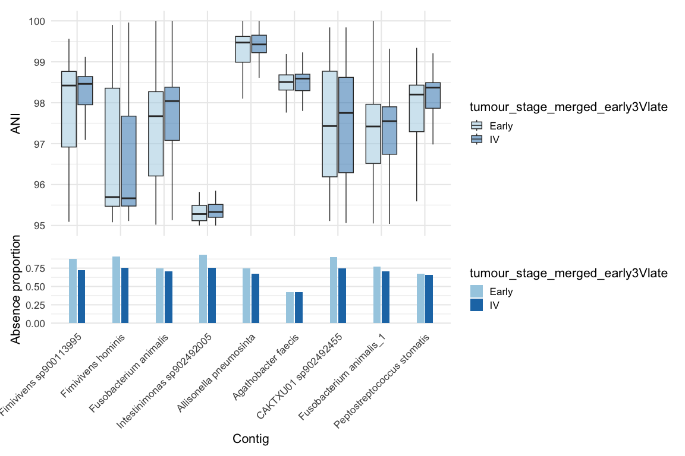<!-- -->

In short, it looks like species such as *Fusobacterium animalis*,
*Peptostreptococcus stomatis* and *Allisonella pneumosintes* grow in
prevalence as CRC progresses from very early stages and remains stable.
Beneficial species such as *Agathobacter faecis* seems to get replaced
by other different strains at later stages - possibly consistent with
treatment intensity.
