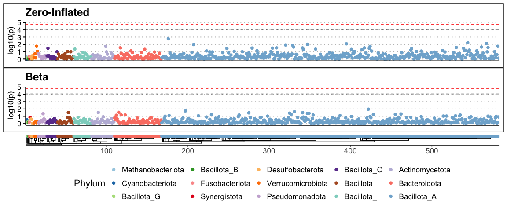
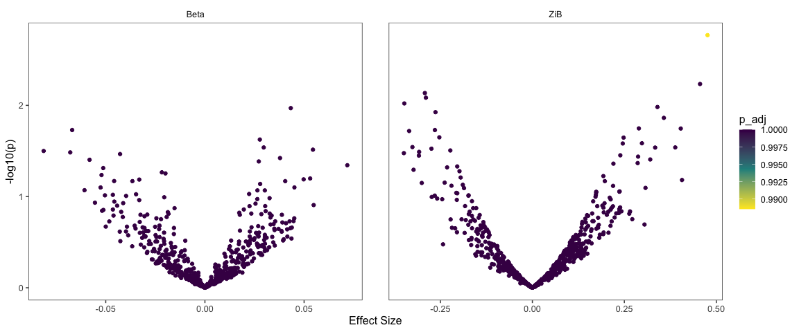
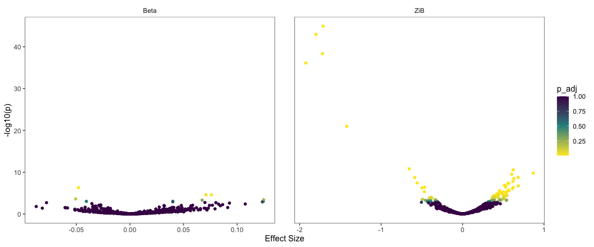
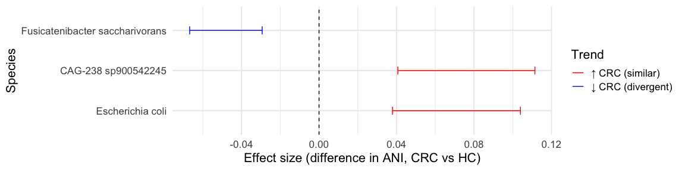
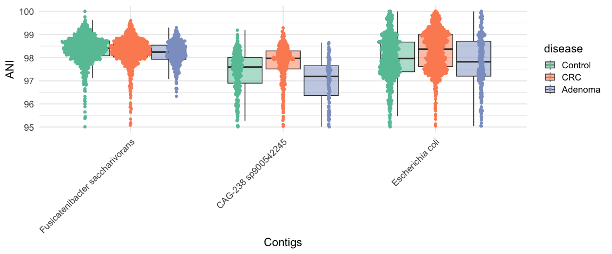

Analysis of 3414 pooled colorectal cancer metagenomes
================
2025-08-27

# Run ZiB analysis in q99 mode

## Load dependencies

``` r
library(SummarizedExperiment)
library(tidyverse)
library(strainspy)
library(dplyr)
```

## Load metadata

``` r
meta_path <- "./data/segata_pooled_3741/combined_metadata.tsv"
meta <- read.csv(meta_path, sep = '\t') 

# set up contrasts/reference levels
meta$disease = factor(meta$disease, levels = c("Control", "CRC", "Adenoma"))
meta$study = factor(meta$study)
meta$cascon = ifelse(meta$cascon == "Case", "Case", "Control")
meta$cascon = factor(meta$cascon, levels = c("Control", "Case"))
meta$country = factor(meta$country)
meta$sex = factor(meta$sex, levels = c("Female", "Male"))
# let's reset tumour stages
meta$tumour_stage_AJCC[meta$tumour_stage_AJCC == ""] = "NoTumour"
meta$tumour_stage_AJCC[meta$disease == "Adenoma"] = "Adenoma"
meta$tumour_stage_AJCC[meta$tumour_stage_AJCC == "CRC_stage_unlabelled"] = "Unstaged"
meta$tumour_stage_AJCC = factor(meta$tumour_stage_AJCC, levels = c("NoTumour", "Adenoma", "0", "I", "II", "III", "IV", "Unstaged"))

meta$tumour_location[meta$disease == "Control"] = "NoTumour"
meta$tumour_location[meta$disease == "Adenoma"] = "Adenoma"
meta$tumour_location = factor(meta$tumour_location, levels = c("NoTumour", "Adenoma", "transverse", "left_sided", "right_sided", "multiple_sites", "nd"))
```

## Load sylph outputs

``` r
sy <- read_sylph("./data/segata_pooled_3741/combined_q_99.tsv.gz") # q99)
```

    ## Detected Sylph query output file.

``` r
sy <- filter_by_presence(sy, min_nonzero = 342) # filter at 10%
```

    ## Retained 20476 rows after filtering

``` r
# annoying renames to match meta V sylph file
colnames(sy) <- gsub("_1", "", colnames(sy))
colnames(sy) <- gsub("_merged", "", colnames(sy))
colData(sy)$Sample_file <- gsub("_1", "", basename(colData(sy)$Sample_file))
colData(sy)$Sample_file <- gsub("_merged", "", colnames(sy))

dim(sy)
```

    ## [1] 20476  3414

## Load GTDB taxonomy

``` r
taxonomy <- read_taxonomy("data/TAXONOMY/sylph_DB_taxonomy_99.tsv")
```

## Fit the model

``` r
# Checks before merging metadata
all(colnames(sy) %in% meta$run_accession)
```

    ## [1] TRUE

``` r
all(meta$run_accession %in% colnames(sy))
```

    ## [1] TRUE

``` r
sy = modify_metadata(sy, meta)

design <- as.formula("~ disease + age + sex + BMI + (1 | study)")

save_path <- "output_rds/CRC_zib_q_99_ebp.rds"
# Run with ebp - this looks a bit less noisy
if(file.exists(save_path)){
  ZB_fit <- readRDS(save_path)
} else {
  # ebp = compute_eb_priors(sy, strainspy:::nobars_(design), nthreads = parallel::detectCores(),low_cutoff = 0, high_cutoff = Inf)
  # ZB_fit <- glmZiBFit(sy,  design, MAP_prior = ebp, nthreads = parallel::detectCores())
  # saveRDS(ZB_fit, save_path)
}
```

## Visualise Outputs

## Manhattan and Volcano plots

### Control vs. Adenoma

``` r
plot_manhattan(ZB_fit, taxonomy = taxonomy, aggregate_by_taxa = T, coef = 3)
```

    ## ! # Invaild edge matrix for <phylo>. A <tbl_df> is returned.
    ## ! # Invaild edge matrix for <phylo>. A <tbl_df> is returned.
    ## ! # Invaild edge matrix for <phylo>. A <tbl_df> is returned.
    ## ! # Invaild edge matrix for <phylo>. A <tbl_df> is returned.

<!-- -->

``` r
plot_manhattan(ZB_fit, taxonomy = taxonomy, aggregate_by_taxa = F, coef = 3)
```

    ## ! # Invaild edge matrix for <phylo>. A <tbl_df> is returned.
    ## ! # Invaild edge matrix for <phylo>. A <tbl_df> is returned.
    ## ! # Invaild edge matrix for <phylo>. A <tbl_df> is returned.
    ## ! # Invaild edge matrix for <phylo>. A <tbl_df> is returned.
    ## ! # Invaild edge matrix for <phylo>. A <tbl_df> is returned.
    ## ! # Invaild edge matrix for <phylo>. A <tbl_df> is returned.

<!-- -->

``` r
plot_volcano(ZB_fit, coef = 3)
```

<!-- -->

No real signal detected. This agrees with the original paper.

### Control vs. CRC

``` r
plot_manhattan(ZB_fit, taxonomy = taxonomy, aggregate_by_taxa = T, coef = 2) 
```

    ## ! # Invaild edge matrix for <phylo>. A <tbl_df> is returned.
    ## ! # Invaild edge matrix for <phylo>. A <tbl_df> is returned.
    ## ! # Invaild edge matrix for <phylo>. A <tbl_df> is returned.
    ## ! # Invaild edge matrix for <phylo>. A <tbl_df> is returned.

<!-- -->

``` r
plot_manhattan(ZB_fit, taxonomy = taxonomy, aggregate_by_taxa = F, coef = 2) 
```

    ## ! # Invaild edge matrix for <phylo>. A <tbl_df> is returned.
    ## ! # Invaild edge matrix for <phylo>. A <tbl_df> is returned.
    ## ! # Invaild edge matrix for <phylo>. A <tbl_df> is returned.
    ## ! # Invaild edge matrix for <phylo>. A <tbl_df> is returned.
    ## ! # Invaild edge matrix for <phylo>. A <tbl_df> is returned.
    ## ! # Invaild edge matrix for <phylo>. A <tbl_df> is returned.

<!-- -->

``` r
plot_volcano(ZB_fit, coef = 2)
```

<!-- -->

Looks like there are many hits.

## Summarise and inspect

## Build a summary from top hits

``` r
th = top_hits(ZB_fit, coef = 2)
th$Species = taxonomy$Species[match(th$Genome_file, taxonomy$Genome)]

# Signals detected from 71 species
length(sort(table(th$Species), decreasing = T))
```

    ## [1] 71

``` r
# Ask chatGPT for a nice summary table
summary_tbl <- th %>%
  filter(!is.na(Species)) %>%
  group_by(Species) %>%
  summarise(
    N_hits = n(),
    
    Top_adj_p_beta  = min(p_adjust, na.rm = TRUE),
    Top_coef_beta   = coefficient[which.min(p_adjust)],
    Top_se_beta     = std_error[which.min(p_adjust)],
    Top_contig_beta = Contig_name[which.min(p_adjust)],
    
    Top_adj_p_ZI    = min(zi_p_adjust, na.rm = TRUE),
    Top_coef_ZI     = zi_coefficient[which.min(zi_p_adjust)],
    Top_se_ZI       = zi_std_error[which.min(zi_p_adjust)],
    Top_contig_ZI   = Contig_name[which.min(zi_p_adjust)],
    
    .groups = "drop"
  ) %>%
  mutate(
    Min_adj_p = pmin(Top_adj_p_beta, Top_adj_p_ZI, na.rm = TRUE),
    Dominant_component = ifelse(Top_adj_p_beta < Top_adj_p_ZI, "Beta", "ZI"),
    Dominant_contig    = ifelse(Dominant_component == "Beta", Top_contig_beta, Top_contig_ZI),
    Dominant_coef      = ifelse(Dominant_component == "Beta", Top_coef_beta, Top_coef_ZI),
    Dominant_se        = ifelse(Dominant_component == "Beta", Top_se_beta, Top_se_ZI)
  ) %>%
  select(Species, N_hits, Dominant_component, Min_adj_p, Dominant_coef, Dominant_se, Dominant_contig) %>%
  arrange(Min_adj_p)

# Write as tsv for manual perusal
# write.table(summary_tbl, "output_tables/CRC_Z99_ebp_summary.tsv", sep = '\t', col.names = T, row.names = F, quote = F)
```

## ZI component hits

When the `Dominant_component` is ZI, negative and positive
`Dominant_coef` indicates presence and absence in CRC compared to
control.

### Visualise this in a forest plot

``` r
zi_summary <- summary_tbl %>%
  filter(Dominant_component == "ZI") %>%
  arrange(Min_adj_p) %>%
  mutate(
    # Confidence interval before flipping
    CI_low = Dominant_coef - 1.96 * Dominant_se,
    CI_high = Dominant_coef + 1.96 * Dominant_se,
    
    # Flip effect size and CI
    Dominant_coef = -Dominant_coef,
    CI_low = -CI_low,
    CI_high = -CI_high,
    
    # Trend annotation
    Trend = ifelse(Dominant_coef > 0, "\u2191 CRC", "\u2193 CRC")
  ) %>%
  arrange(Trend, desc(Dominant_coef)) %>%
  mutate(Species = factor(Species, levels = rev(unique(Species))))

ggplot(zi_summary, aes(x = Dominant_coef, y = Species, color = Trend)) +
  geom_point(aes(size = N_hits)) +
  geom_errorbarh(aes(xmin = CI_low, xmax = CI_high), height = 0.2) +
  geom_vline(xintercept = 0, linetype = "dashed") +
  scale_color_manual(values = c("\u2191 CRC" = "red", "\u2193 CRC" = "blue")) +
  scale_size_continuous(
    name = "Strains",
    range = c(2, 8),  # tweak for your figure aesthetics
    breaks = c(1, 45, 90),
    labels = c("1", "45", "90"),
    guide = guide_legend(override.aes = list(linetype = 0))  # remove lines from legend
  ) +
  labs(
    x = "Effect size",
    y = "Species",
    color = "Trend"
  ) +
  theme_minimal(base_size = 16)
```

<!-- -->

## Beta component hits

When the `Dominant_component` is Beta, negative and positive
`Dominant_coef` indicates lower and higher cANI in CRC compared to
control, reflecting similarity of the strain to the reference.

``` r
beta_summary <- summary_tbl %>%
  filter(Dominant_component == "Beta") %>%
  arrange(Min_adj_p) %>%
  mutate(
    CI_low = Dominant_coef - 1.96 * Dominant_se,
    CI_high = Dominant_coef + 1.96 * Dominant_se,
    Trend = ifelse(Dominant_coef > 0, "\u2191 CRC (similar)", "\u2193 CRC (divergent)"),
    Species = factor(Species, levels = rev(unique(Species)))
  )

ggplot(beta_summary, aes(x = Dominant_coef, y = Species, color = Trend)) +
    geom_point(aes(size = N_hits)) +
    geom_errorbarh(aes(xmin = CI_low, xmax = CI_high), height = 0.2) +
    geom_vline(xintercept = 0, linetype = "dashed") +
    scale_color_manual(values = c("\u2191 CRC (similar)" = "red",
                                  "\u2193 CRC (divergent)" = "blue")) +
    scale_size_continuous(
        name = "Strains",
        range = c(2, 8),
        breaks = c(1, 60, 120),
        labels = c("1", "60", "120")
    ) +
    labs(
        x = "Effect size (difference in ANI, CRC vs HC)",
        y = "Species",
        color = "Trend"
    ) +
    theme_minimal(base_size = 16)
```

<!-- -->

# ANI distribution of the top strain of each beta detected species

``` r
plot_ani_dist(sy, phenotype = 'disease', contigs = beta_summary$Dominant_contig, 
              drop_zeros = T, show_points = T, plot_type = 'box', contig_names = as.character(beta_summary$Species))
```

    ## Warning: Removed 8198 rows containing non-finite outside the scale range
    ## (`stat_boxplot()`).

<!-- -->

# Run ZiB analysis in p95 mode

## Load sylph outputs

``` r
sy <- read_sylph("./data/segata_pooled_3741/combined_p_95.tsv.gz") # q99)
```

    ## Detected Sylph profile output file.

``` r
sy <- filter_by_presence(sy, min_nonzero = 342) # filter at 10%
```

    ## Retained 582 rows after filtering

``` r
# annoying renames to match meta V sylph file
colnames(sy) <- gsub("_1", "", colnames(sy))
colnames(sy) <- gsub("_merged", "", colnames(sy))
colData(sy)$Sample_file <- gsub("_1", "", basename(colData(sy)$Sample_file))
colData(sy)$Sample_file <- gsub("_merged", "", colnames(sy))

dim(sy)
```

    ## [1]  582 3414

## Load GTDB taxonomy

``` r
taxonomy <- read_taxonomy(system.file("extdata", "example_taxonomy.tsv.gz", package = "strainspy"))
```

## Fit the model

``` r
# Checks:
all(colnames(sy) %in% meta$run_accession)
```

    ## [1] TRUE

``` r
all(meta$run_accession %in% colnames(sy))
```

    ## [1] TRUE

``` r
sy = strainspy:::modify_metadata(sy, meta)

design <- as.formula("~ disease + age + sex + BMI + (1 | study)")

save_path <- "output_rds/CRC_zib_p_95_ebp.rds"
# Run with ebp - this looks a bit less noisy
if(file.exists(save_path)){
  ZB_fit <- readRDS(save_path)
} else {
  # ebp = compute_eb_priors(sy, strainspy:::nobars_(design), nthreads = parallel::detectCores(),low_cutoff = 0, high_cutoff = Inf)
  # ZB_fit <- glmZiBFit(sy,  design, MAP_prior = ebp, nthreads = parallel::detectCores())
  # saveRDS(ZB_fit, save_path)
}
```

## Visualise Outputs

## Manhattan and Volcano plots

### Control vs. Adenoma

``` r
plot_manhattan(ZB_fit, taxonomy = taxonomy, aggregate_by_taxa = T, coef = 3)
```

    ## ! # Invaild edge matrix for <phylo>. A <tbl_df> is returned.
    ## ! # Invaild edge matrix for <phylo>. A <tbl_df> is returned.
    ## ! # Invaild edge matrix for <phylo>. A <tbl_df> is returned.
    ## ! # Invaild edge matrix for <phylo>. A <tbl_df> is returned.

<!-- -->

``` r
plot_manhattan(ZB_fit, taxonomy = taxonomy, aggregate_by_taxa = F, coef = 3)
```

    ## ! # Invaild edge matrix for <phylo>. A <tbl_df> is returned.
    ## ! # Invaild edge matrix for <phylo>. A <tbl_df> is returned.
    ## ! # Invaild edge matrix for <phylo>. A <tbl_df> is returned.
    ## ! # Invaild edge matrix for <phylo>. A <tbl_df> is returned.
    ## ! # Invaild edge matrix for <phylo>. A <tbl_df> is returned.
    ## ! # Invaild edge matrix for <phylo>. A <tbl_df> is returned.

<!-- -->

``` r
plot_volcano(ZB_fit, coef = 3)
```

<!-- -->

No real signal detected. This agrees with the original paper.

### Control vs. CRC

``` r
plot_manhattan(ZB_fit, taxonomy = taxonomy, aggregate_by_taxa = T, coef = 2) 
```

    ## ! # Invaild edge matrix for <phylo>. A <tbl_df> is returned.
    ## ! # Invaild edge matrix for <phylo>. A <tbl_df> is returned.
    ## ! # Invaild edge matrix for <phylo>. A <tbl_df> is returned.
    ## ! # Invaild edge matrix for <phylo>. A <tbl_df> is returned.

<!-- -->

``` r
plot_manhattan(ZB_fit, taxonomy = taxonomy, aggregate_by_taxa = F, coef = 2) 
```

    ## ! # Invaild edge matrix for <phylo>. A <tbl_df> is returned.
    ## ! # Invaild edge matrix for <phylo>. A <tbl_df> is returned.
    ## ! # Invaild edge matrix for <phylo>. A <tbl_df> is returned.
    ## ! # Invaild edge matrix for <phylo>. A <tbl_df> is returned.
    ## ! # Invaild edge matrix for <phylo>. A <tbl_df> is returned.
    ## ! # Invaild edge matrix for <phylo>. A <tbl_df> is returned.

<!-- -->

``` r
plot_volcano(ZB_fit, coef = 2)
```

<!-- -->

Looks like there are many hits.

## Summarise and inspect

## Build a summary from top hits

``` r
th = top_hits(ZB_fit, coef = 2)
th$Species = taxonomy$Species[match(th$Genome_file, taxonomy$Genome)]

# Signals detected from 56 species
length(sort(table(th$Species), decreasing = T))
```

    ## [1] 56

``` r
# Ask chatGPT for a nice summary table

# PS: There is going to be only one strain per species here - GTDB95, keep it anyway
summary_tbl <- th %>%
  filter(!is.na(Species)) %>%
  group_by(Species) %>%
  summarise(
    N_hits = n(),
    
    Top_adj_p_beta  = min(p_adjust, na.rm = TRUE),
    Top_coef_beta   = coefficient[which.min(p_adjust)],
    Top_se_beta     = std_error[which.min(p_adjust)],
    Top_contig_beta = Contig_name[which.min(p_adjust)],
    
    Top_adj_p_ZI    = min(zi_p_adjust, na.rm = TRUE),
    Top_coef_ZI     = zi_coefficient[which.min(zi_p_adjust)],
    Top_se_ZI       = zi_std_error[which.min(zi_p_adjust)],
    Top_contig_ZI   = Contig_name[which.min(zi_p_adjust)],
    
    .groups = "drop"
  ) %>%
  mutate(
    Min_adj_p = pmin(Top_adj_p_beta, Top_adj_p_ZI, na.rm = TRUE),
    Dominant_component = ifelse(Top_adj_p_beta < Top_adj_p_ZI, "Beta", "ZI"),
    Dominant_contig    = ifelse(Dominant_component == "Beta", Top_contig_beta, Top_contig_ZI),
    Dominant_coef      = ifelse(Dominant_component == "Beta", Top_coef_beta, Top_coef_ZI),
    Dominant_se        = ifelse(Dominant_component == "Beta", Top_se_beta, Top_se_ZI)
  ) %>%
  select(Species, N_hits, Dominant_component, Min_adj_p, Dominant_coef, Dominant_se, Dominant_contig) %>%
  arrange(Min_adj_p)


# Write as tsv for manual perusal
# write.table(summary_tbl, "output_tables/CRC_Z95_ebp_summary.tsv", sep = '\t', col.names = T, row.names = F, quote = F)
```

## ZI component hits

When the `Dominant_component` is ZI, negative and positive
`Dominant_coef` indicates presence and absence in CRC compared to
control.

### Visualise this in a forest plot

``` r
zi_summary <- summary_tbl %>%
  filter(Dominant_component == "ZI") %>%
  arrange(Min_adj_p) %>%
  mutate(
    # Confidence interval before flipping
    CI_low = Dominant_coef - 1.96 * Dominant_se,
    CI_high = Dominant_coef + 1.96 * Dominant_se,
    
    # Flip effect size and CI
    Dominant_coef = -Dominant_coef,
    CI_low = -CI_low,
    CI_high = -CI_high,
    
    # Trend annotation
    Trend = ifelse(Dominant_coef > 0, "\u2191 CRC", "\u2193 CRC")
  ) %>%
  arrange(Trend, desc(Dominant_coef)) %>%
  mutate(Species = factor(Species, levels = rev(unique(Species))))

ggplot(zi_summary, aes(x = Dominant_coef, y = Species, color = Trend)) +
  # geom_point(aes(size = N_hits)) +
  geom_errorbarh(aes(xmin = CI_low, xmax = CI_high), height = 0.2) +
  geom_vline(xintercept = 0, linetype = "dashed") +
  scale_color_manual(values = c("\u2191 CRC" = "red", "\u2193 CRC" = "blue")) +
  # scale_size_continuous(
  #   name = "Strains",
  #   range = c(2, 8),  # tweak for your figure aesthetics
  #   breaks = c(1, 45, 90),
  #   labels = c("1", "45", "90"),
  #   guide = guide_legend(override.aes = list(linetype = 0))  # remove lines from legend
  # ) +
  labs(
    x = "Effect size",
    y = "Species",
    color = "Trend"
  ) +
  theme_minimal(base_size = 16)
```

<!-- -->

## Beta component hits

When the `Dominant_component` is Beta, negative and positive
`Dominant_coef` indicates lower and higher cANI in CRC compared to
control, reflecting similarity of the strain to the reference.

``` r
beta_summary <- summary_tbl %>%
  filter(Dominant_component == "Beta") %>%
  arrange(Min_adj_p) %>%
  mutate(
    CI_low = Dominant_coef - 1.96 * Dominant_se,
    CI_high = Dominant_coef + 1.96 * Dominant_se,
    Trend = ifelse(Dominant_coef > 0, "\u2191 CRC (similar)", "\u2193 CRC (divergent)"),
    Species = factor(Species, levels = rev(unique(Species)))
  )

ggplot(beta_summary, aes(x = Dominant_coef, y = Species, color = Trend)) +
    # geom_point(aes(size = N_hits)) +
    geom_errorbarh(aes(xmin = CI_low, xmax = CI_high), height = 0.2) +
    geom_vline(xintercept = 0, linetype = "dashed") +
    scale_color_manual(values = c("\u2191 CRC (similar)" = "red",
                                  "\u2193 CRC (divergent)" = "blue")) +
    # scale_size_continuous(
    #     name = "Strains",
    #     range = c(2, 8),
    #     breaks = c(1, 60, 120),
    #     labels = c("1", "60", "120")
    # ) +
    labs(
        x = "Effect size (difference in ANI, CRC vs HC)",
        y = "Species",
        color = "Trend"
    ) +
    theme_minimal(base_size = 16)
```

<!-- -->

# ANI distribution of the top strain of each beta detected species

``` r
plot_ani_dist(sy, phenotype = 'disease', contigs = beta_summary$Dominant_contig, 
              drop_zeros = T, show_points = T, plot_type = 'box', contig_names = as.character(beta_summary$Species))
```

    ## Warning: Removed 4046 rows containing non-finite outside the scale range
    ## (`stat_boxplot()`).

<!-- -->
