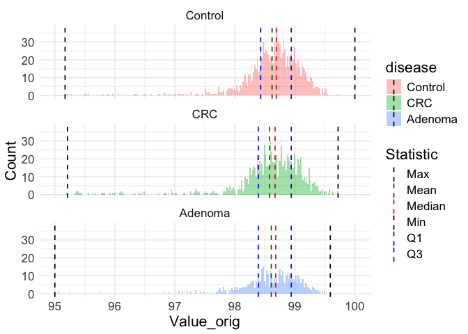
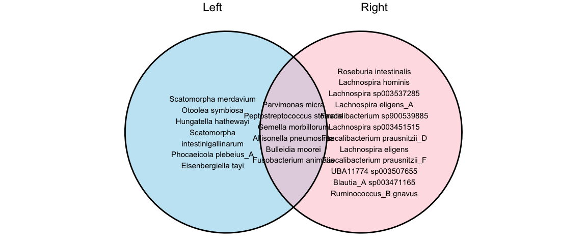
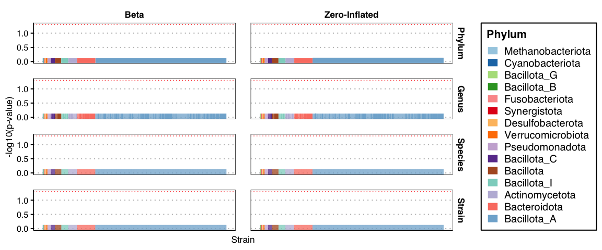
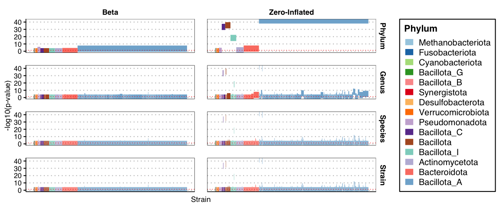
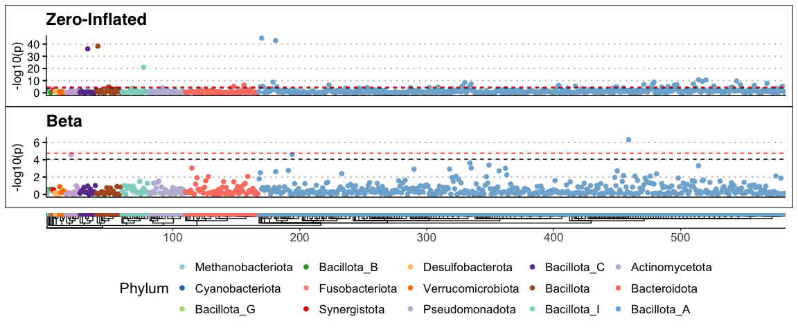
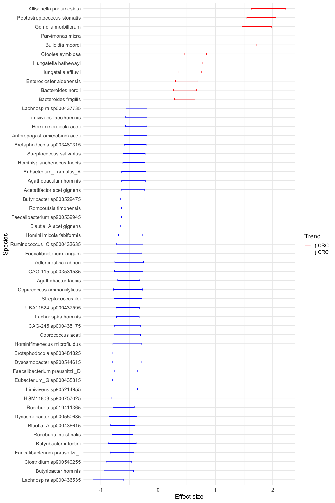
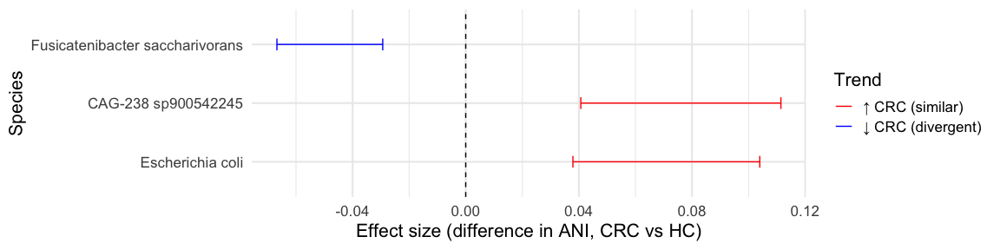

Analysis of 3414 pooled colorectal cancer metagenomes
================
2025-08-27

# Run ZiB analysis in q99 mode

## Load dependencies

``` r
library(SummarizedExperiment)
library(tidyverse)
library(strainspy)
library(dplyr)
library(ggplot2)
library(ggvenn)
library(stringr)
```

## Load metadata

``` r
meta_path <- "./data/segata_pooled_3741/combined_metadata.tsv"
meta <- read.csv(meta_path, sep = '\t') 

# set up contrasts/reference levels
meta$disease = factor(meta$disease, levels = c("Control", "CRC", "Adenoma"))
meta$study = factor(meta$study)
meta$cascon = ifelse(meta$cascon == "Case", "Case", "Control")
meta$cascon = factor(meta$cascon, levels = c("Control", "Case"))
meta$country = factor(meta$country)
meta$sex = factor(meta$sex, levels = c("Female", "Male"))
# let's reset tumour stages
meta$tumour_stage_AJCC[meta$tumour_stage_AJCC == ""] = "NoTumour"
meta$tumour_stage_AJCC[meta$disease == "Adenoma"] = "Adenoma"
meta$tumour_stage_AJCC[meta$tumour_stage_AJCC == "CRC_stage_unlabelled"] = "Unstaged"
meta$tumour_stage_AJCC = factor(meta$tumour_stage_AJCC, levels = c("NoTumour", "Adenoma", "0", "I", "II", "III", "IV", "Unstaged"))

meta$tumour_location[meta$disease == "Control"] = "NoTumour"
meta$tumour_location[meta$disease == "Adenoma"] = "Adenoma"
meta$tumour_location = factor(meta$tumour_location, levels = c("NoTumour", "Adenoma", "transverse", "left_sided", "right_sided", "multiple_sites", "nd"))
```

## Load sylph outputs

``` r
sy <- read_sylph("./data/segata_pooled_3741/combined_q_99.tsv.gz") # q99)
```

    ## Detected Sylph query output file.

``` r
sy <- filter_by_presence(sy, min_nonzero = 342) # filter at 10%
```

    ## Retained 20476 rows after filtering

``` r
# annoying renames to match meta V sylph file
colnames(sy) <- gsub("_1", "", colnames(sy))
colnames(sy) <- gsub("_merged", "", colnames(sy))
colData(sy)$Sample_file <- gsub("_1", "", basename(colData(sy)$Sample_file))
colData(sy)$Sample_file <- gsub("_merged", "", colnames(sy))

dim(sy)
```

    ## [1] 20476  3414

``` r
# Checks before merging metadata
all(colnames(sy) %in% meta$run_accession)
```

    ## [1] TRUE

``` r
all(meta$run_accession %in% colnames(sy))
```

    ## [1] TRUE

``` r
sy = modify_metadata(sy, meta)
```

## Fit the model

``` r
design <- as.formula("~ disease + age + sex + BMI + (1 | study)")

save_path <- "output_rds/CRC_zib_q_99_ebp.rds"
# Run with ebp - this looks a bit less noisy
if(file.exists(save_path)){
  ZB_fit <- readRDS(save_path)
} else {
  ebp = compute_eb_priors(sy, strainspy:::nobars_(design), nthreads = parallel::detectCores(),low_cutoff = 0, high_cutoff = Inf)
  ZB_fit <- glmZiBFit(sy,  design, MAP_prior = ebp, nthreads = parallel::detectCores())
  saveRDS(ZB_fit, save_path)
}
```

## Visualise Outputs

### Load GTDB taxonomy

``` r
taxonomy <- read_taxonomy("data/TAXONOMY/sylph_DB_taxonomy_99.tsv")
```

## Manhattan and Volcano plots

### Control vs. Adenoma

``` r
plot_manhattan(ZB_fit, taxonomy = taxonomy, aggregate_by_taxa = T, coef = 3)
```

    ## ! # Invaild edge matrix for <phylo>. A <tbl_df> is returned.
    ## ! # Invaild edge matrix for <phylo>. A <tbl_df> is returned.
    ## ! # Invaild edge matrix for <phylo>. A <tbl_df> is returned.
    ## ! # Invaild edge matrix for <phylo>. A <tbl_df> is returned.

<!-- -->

``` r
plot_manhattan(ZB_fit, taxonomy = taxonomy, aggregate_by_taxa = F, coef = 3)
```

    ## ! # Invaild edge matrix for <phylo>. A <tbl_df> is returned.
    ## ! # Invaild edge matrix for <phylo>. A <tbl_df> is returned.
    ## ! # Invaild edge matrix for <phylo>. A <tbl_df> is returned.
    ## ! # Invaild edge matrix for <phylo>. A <tbl_df> is returned.
    ## ! # Invaild edge matrix for <phylo>. A <tbl_df> is returned.
    ## ! # Invaild edge matrix for <phylo>. A <tbl_df> is returned.

<!-- -->

``` r
plot_volcano(ZB_fit, coef = 3)
```

<!-- -->

No real signal detected. This agrees with the original paper.

### Control vs. CRC

``` r
plot_manhattan(ZB_fit, taxonomy = taxonomy, aggregate_by_taxa = T, coef = 2) 
```

    ## ! # Invaild edge matrix for <phylo>. A <tbl_df> is returned.
    ## ! # Invaild edge matrix for <phylo>. A <tbl_df> is returned.
    ## ! # Invaild edge matrix for <phylo>. A <tbl_df> is returned.
    ## ! # Invaild edge matrix for <phylo>. A <tbl_df> is returned.

<!-- -->

``` r
plot_manhattan(ZB_fit, taxonomy = taxonomy, aggregate_by_taxa = F, coef = 2) 
```

    ## ! # Invaild edge matrix for <phylo>. A <tbl_df> is returned.
    ## ! # Invaild edge matrix for <phylo>. A <tbl_df> is returned.
    ## ! # Invaild edge matrix for <phylo>. A <tbl_df> is returned.
    ## ! # Invaild edge matrix for <phylo>. A <tbl_df> is returned.
    ## ! # Invaild edge matrix for <phylo>. A <tbl_df> is returned.
    ## ! # Invaild edge matrix for <phylo>. A <tbl_df> is returned.

<!-- -->

``` r
plot_volcano(ZB_fit, coef = 2)
```

<!-- -->

Looks like there are many hits.

## Summarise and inspect

## Build a summary from top hits

``` r
th = top_hits(ZB_fit, coef = 2)
th$Species = taxonomy$Species[match(th$Genome_file, taxonomy$Genome)]

# Signals detected from 71 species
length(sort(table(th$Species), decreasing = T))
```

    ## [1] 71

``` r
# Ask chatGPT for a nice summary table
summary_tbl <- th %>%
  filter(!is.na(Species)) %>%
  group_by(Species) %>%
  summarise(
    N_hits = n(),
    
    Top_adj_p_beta  = min(p_adjust, na.rm = TRUE),
    Top_coef_beta   = coefficient[which.min(p_adjust)],
    Top_se_beta     = std_error[which.min(p_adjust)],
    Top_contig_beta = Contig_name[which.min(p_adjust)],
    
    Top_adj_p_ZI    = min(zi_p_adjust, na.rm = TRUE),
    Top_coef_ZI     = zi_coefficient[which.min(zi_p_adjust)],
    Top_se_ZI       = zi_std_error[which.min(zi_p_adjust)],
    Top_contig_ZI   = Contig_name[which.min(zi_p_adjust)],
    
    .groups = "drop"
  ) %>%
  mutate(
    Min_adj_p = pmin(Top_adj_p_beta, Top_adj_p_ZI, na.rm = TRUE),
    Dominant_component = ifelse(Top_adj_p_beta < Top_adj_p_ZI, "Beta", "ZI"),
    Dominant_contig    = ifelse(Dominant_component == "Beta", Top_contig_beta, Top_contig_ZI),
    Dominant_coef      = ifelse(Dominant_component == "Beta", Top_coef_beta, Top_coef_ZI),
    Dominant_se        = ifelse(Dominant_component == "Beta", Top_se_beta, Top_se_ZI)
  ) %>%
  select(Species, N_hits, Dominant_component, Min_adj_p, Dominant_coef, Dominant_se, Dominant_contig) %>%
  arrange(Min_adj_p)

# Write as tsv for manual perusal
# write.table(summary_tbl, "output_tables/CRC_Z99_ebp_summary.tsv", sep = '\t', col.names = T, row.names = F, quote = F)
```

## ZI component hits

When the `Dominant_component` is ZI, negative and positive
`Dominant_coef` indicates presence and absence in CRC compared to
control.

### Visualise this in a forest plot

``` r
zi_summary <- summary_tbl %>%
  filter(Dominant_component == "ZI") %>%
  arrange(Min_adj_p) %>%
  mutate(
    # Confidence interval before flipping
    CI_low = Dominant_coef - 1.96 * Dominant_se,
    CI_high = Dominant_coef + 1.96 * Dominant_se,
    
    # Flip effect size and CI
    Dominant_coef = -Dominant_coef,
    CI_low = -CI_low,
    CI_high = -CI_high,
    
    # Trend annotation
    Trend = ifelse(Dominant_coef > 0, "\u2191 CRC", "\u2193 CRC")
  ) %>%
  arrange(Trend, desc(Dominant_coef)) %>%
  mutate(Species = factor(Species, levels = rev(unique(Species))))

ggplot(zi_summary, aes(x = Dominant_coef, y = Species, color = Trend)) +
  geom_point(aes(size = N_hits)) +
  geom_errorbarh(aes(xmin = CI_low, xmax = CI_high), height = 0.2) +
  geom_vline(xintercept = 0, linetype = "dashed") +
  scale_color_manual(values = c("\u2191 CRC" = "red", "\u2193 CRC" = "blue")) +
  scale_size_continuous(
    name = "Strains",
    range = c(2, 8),  # tweak for your figure aesthetics
    breaks = c(1, 45, 90),
    labels = c("1", "45", "90"),
    guide = guide_legend(override.aes = list(linetype = 0))  # remove lines from legend
  ) +
  labs(
    x = "Effect size",
    y = "Species",
    color = "Trend"
  ) +
  theme_minimal(base_size = 16)
```

<!-- -->

## Beta component hits

When the `Dominant_component` is Beta, negative and positive
`Dominant_coef` indicates lower and higher cANI in CRC compared to
control, reflecting similarity of the strain to the reference. Higher
estimates imply possibly larger strain differences in CRC compared to
controls.

``` r
# We should convert this from logit to ANI ratios for ideal sorting!

beta_summary <- summary_tbl %>%
  filter(Dominant_component == "Beta") %>%
  arrange(Min_adj_p) %>%
  mutate(
    CI_low = Dominant_coef - 1.96 * Dominant_se,
    CI_high = Dominant_coef + 1.96 * Dominant_se,
    Trend = ifelse(Dominant_coef > 0, "\u2191 CRC (similar)", "\u2193 CRC (divergent)"),
    Species = factor(Species, levels = rev(unique(Species)))
  ) %>%
  arrange(desc(abs(Dominant_coef))) %>%
  mutate(Species = factor(Species, levels = rev(unique(Species))))

ggplot(beta_summary, aes(x = Dominant_coef, y = Species, color = Trend)) +
  geom_point(aes(size = N_hits)) +
  geom_errorbarh(aes(xmin = CI_low, xmax = CI_high), height = 0.2) +
  geom_vline(xintercept = 0, linetype = "dashed") +
  scale_color_manual(values = c("\u2191 CRC (similar)" = "red",
                                "\u2193 CRC (divergent)" = "blue")) +
  scale_size_continuous(
    name = "Strains",
    range = c(2, 8),
    breaks = c(1, 60, 120),
    labels = c("1", "60", "120")
  ) +
  labs(
    x = "Effect size (difference in ANI, CRC vs HC)",
    y = "Species",
    color = "Trend"
  ) +
  theme_minimal(base_size = 16)
```

<!-- -->

## ANI distribution of the top strain of each beta detected species

``` r
plot_ani_dist(sy, phenotype = 'disease', contigs = beta_summary$Dominant_contig, 
              drop_zeros = T, show_points = T, plot_type = 'box', contig_names = as.character(beta_summary$Species))
```

    ## Warning: Removed 8198 rows containing non-finite outside the scale range
    ## (`stat_boxplot()`).

<!-- -->

The top hit from *Fusicatenibacter saccharivorans* looks a bit dodgy.

## Histogram of *Fusicatenibacter saccharivorans* ANI

``` r
dat = colData(sy)
idx = which(sy@NAMES == beta_summary$Dominant_contig[grep("Fusicatenibacter saccharivorans", beta_summary$Species)]) 
dat$Value_orig = assay(sy)[idx,]

quick_histo <- function(dat){
  summ <- as.data.frame(dat) %>%
    filter(Value_orig != 0) %>%
    group_by(disease) %>%
    summarise(
      Min   = min(Value_orig),
      Q1    = quantile(Value_orig, 0.25),
      Median= median(Value_orig),
      Mean  = mean(Value_orig),
      Q3    = quantile(Value_orig, 0.75),
      Max   = max(Value_orig),
      .groups = "drop"
    ) %>%
    tidyr::pivot_longer(-disease, names_to = "stat", values_to = "value")
  
  
  ggplot(dat[dat$Value_orig != 0, ], aes(x = Value_orig, fill = disease)) +
    geom_histogram(position = "identity", alpha = 0.4, bins = 250) +
    geom_vline(data = summ, aes(xintercept = value, color = stat),
               linetype = "dashed", size = 0.6, show.legend = TRUE) +
    facet_wrap(~ disease, ncol = 1) +
    theme_minimal() +
    labs(x = "Value_orig", y = "Count",
         color = "Statistic") +
    scale_color_manual(values = c(
      Min    = "black",
      Q1     = "blue",
      Median = "red",
      Mean   = "darkgreen",
      Q3     = "blue",
      Max    = "black"
    )) + theme(text = element_text(size = 16))
}

quick_histo(dat)
```

    ## Warning: Using `size` aesthetic for lines was deprecated in ggplot2 3.4.0.
    ## ℹ Please use `linewidth` instead.
    ## This warning is displayed once every 8 hours.
    ## Call `lifecycle::last_lifecycle_warnings()` to see where this warning was
    ## generated.

<!-- -->

The difference between Control and CRC is really small, worthwhile
attempting to fit a stricter model.

## Check if a set of studies is driving signal here

``` r
dat$Value = strainspy:::offset_ANI(dat$Value_orig/100)
# Use internal calls directly with MLE
fit_FS_MLE = glmmTMB::glmmTMB(
  formula = as.formula('Value ~ disease*study + age + sex + BMI'),
  ziformula = as.formula('~disease + age + sex + BMI'),
  data = dat,
  family = glmmTMB::beta_family(link = "logit")
)
```

    ## dropping columns from rank-deficient conditional model: diseaseAdenoma:studyc2_COLOBIOME, diseaseAdenoma:studyc6__IIGM_TU, diseaseAdenoma:studyGuptaA_2019, diseaseAdenoma:studyLiuNN_2022, diseaseAdenoma:studyThomasAM_2018b, diseaseAdenoma:studyVogtmannE_2016, diseaseAdenoma:studyWirbelJ_2018, diseaseAdenoma:studyYangJ_2020, diseaseAdenoma:studyYuJ_2015, diseaseCRC:studyZellerG_2014, diseaseAdenoma:studyZellerG_2014

``` r
summary(fit_FS_MLE)
```

    ##  Family: beta  ( logit )
    ## Formula:          Value ~ disease * study + age + sex + BMI
    ## Zero inflation:         ~disease + age + sex + BMI
    ## Data: dat
    ## 
    ##       AIC       BIC    logLik -2*log(L)  df.resid 
    ##  -17509.6  -17224.8    8801.8  -17603.6      3117 
    ## 
    ## 
    ## Dispersion parameter for beta family (): 1.05e+03 
    ## 
    ## Conditional model:
    ##                                      Estimate Std. Error z value Pr(>|z|)    
    ## (Intercept)                         3.9428154  0.0546846   72.10  < 2e-16 ***
    ## diseaseCRC                         -0.1536146  0.0410733   -3.74 0.000184 ***
    ## diseaseAdenoma                     -0.0082507  0.0434027   -0.19 0.849234    
    ## studyc2_COLOBIOME                  -0.0859636  0.2162475   -0.40 0.690981    
    ## studyc3_IIGM_CZ                    -0.1086427  0.0560399   -1.94 0.052542 .  
    ## studyc4_IIGM_IT                    -0.2916121  0.0619639   -4.71 2.52e-06 ***
    ## studyc5_NSHII                      -0.2197475  0.0466258   -4.71 2.44e-06 ***
    ## studyc6__IIGM_TU                   -0.1081962  0.0631226   -1.71 0.086517 .  
    ## studyFengQ_2015                    -0.0807461  0.0539366   -1.50 0.134378    
    ## studyGuptaA_2019                   -0.9622866  0.0836470  -11.50  < 2e-16 ***
    ## studyLiuNN_2022                    -0.1636802  0.0505938   -3.24 0.001216 ** 
    ## studyThomasAM_2018b                -0.0979783  0.0608326   -1.61 0.107262    
    ## studyVogtmannE_2016                -0.2047398  0.0547348   -3.74 0.000184 ***
    ## studyWirbelJ_2018                  -0.0844071  0.0525909   -1.60 0.108499    
    ## studyYachidaS_2019                 -0.2035423  0.0468553   -4.34 1.40e-05 ***
    ## studyYangJ_2020                    -0.2003745  0.0498645   -4.02 5.86e-05 ***
    ## studyYuJ_2015                      -0.1395850  0.0539038   -2.59 0.009611 ** 
    ## studyZellerG_2014                  -0.1633321  0.0345230   -4.73 2.23e-06 ***
    ## age                                 0.0001183  0.0004385    0.27 0.787343    
    ## sexMale                            -0.0099709  0.0097174   -1.03 0.304854    
    ## BMI                                -0.0013825  0.0008996   -1.54 0.124345    
    ## diseaseCRC:studyc2_COLOBIOME        0.1567650  0.2160529    0.73 0.468093    
    ## diseaseAdenoma:studyc2_COLOBIOME           NA         NA      NA       NA    
    ## diseaseCRC:studyc3_IIGM_CZ          0.0997612  0.0606405    1.65 0.099944 .  
    ## diseaseAdenoma:studyc3_IIGM_CZ     -0.0641336  0.0733207   -0.87 0.381737    
    ## diseaseCRC:studyc4_IIGM_IT          0.0877779  0.0800756    1.10 0.272997    
    ## diseaseAdenoma:studyc4_IIGM_IT      0.2032768  0.1351063    1.50 0.132435    
    ## diseaseCRC:studyc5_NSHII            0.1286657  0.0673849    1.91 0.056209 .  
    ## diseaseAdenoma:studyc5_NSHII       -0.0012560  0.0458102   -0.03 0.978128    
    ## diseaseCRC:studyc6__IIGM_TU        -0.0593232  0.0899773   -0.66 0.509695    
    ## diseaseAdenoma:studyc6__IIGM_TU            NA         NA      NA       NA    
    ## diseaseCRC:studyFengQ_2015          0.1525117  0.0594319    2.57 0.010283 *  
    ## diseaseAdenoma:studyFengQ_2015      0.0432180  0.0617533    0.70 0.484022    
    ## diseaseCRC:studyGuptaA_2019         0.3172341  0.1000028    3.17 0.001513 ** 
    ## diseaseAdenoma:studyGuptaA_2019            NA         NA      NA       NA    
    ## diseaseCRC:studyLiuNN_2022          0.0712415  0.0539740    1.32 0.186861    
    ## diseaseAdenoma:studyLiuNN_2022             NA         NA      NA       NA    
    ## diseaseCRC:studyThomasAM_2018b      0.1248006  0.0688954    1.81 0.070071 .  
    ## diseaseAdenoma:studyThomasAM_2018b         NA         NA      NA       NA    
    ## diseaseCRC:studyVogtmannE_2016      0.1510678  0.0604241    2.50 0.012415 *  
    ## diseaseAdenoma:studyVogtmannE_2016         NA         NA      NA       NA    
    ## diseaseCRC:studyWirbelJ_2018        0.0164042  0.0649358    0.25 0.800561    
    ## diseaseAdenoma:studyWirbelJ_2018           NA         NA      NA       NA    
    ## diseaseCRC:studyYachidaS_2019       0.1272838  0.0452070    2.82 0.004869 ** 
    ## diseaseAdenoma:studyYachidaS_2019   0.0208024  0.0533082    0.39 0.696367    
    ## diseaseCRC:studyYangJ_2020          0.0435649  0.0516918    0.84 0.399350    
    ## diseaseAdenoma:studyYangJ_2020             NA         NA      NA       NA    
    ## diseaseCRC:studyYuJ_2015            0.0457735  0.0565516    0.81 0.418279    
    ## diseaseAdenoma:studyYuJ_2015               NA         NA      NA       NA    
    ## diseaseCRC:studyZellerG_2014               NA         NA      NA       NA    
    ## diseaseAdenoma:studyZellerG_2014           NA         NA      NA       NA    
    ## ---
    ## Signif. codes:  0 '***' 0.001 '**' 0.01 '*' 0.05 '.' 0.1 ' ' 1
    ## 
    ## Zero-inflation model:
    ##                  Estimate Std. Error z value Pr(>|z|)   
    ## (Intercept)    -0.8993386  0.3420471  -2.629  0.00856 **
    ## diseaseCRC      0.3122044  0.1068856   2.921  0.00349 **
    ## diseaseAdenoma  0.0148110  0.1355028   0.109  0.91296   
    ## age            -0.0107829  0.0043939  -2.454  0.01413 * 
    ## sexMale        -0.2445539  0.1010559  -2.420  0.01552 * 
    ## BMI             0.0006101  0.0096364   0.063  0.94951   
    ## ---
    ## Signif. codes:  0 '***' 0.001 '**' 0.01 '*' 0.05 '.' 0.1 ' ' 1

Looks like the signal is dominated by some studies. `GuptaA_2019` has a
large effect size with a small p-value.

``` r
dat_ss <- as.data.frame(dat) %>% 
  filter(study == "GuptaA_2019")

quick_histo(dat_ss)
```

<!-- -->

The other significant studies: `YachidaS_2019`. `FengQ_2015` and
`VogtmannE_2016` have smaller effect sizes, but in the same direction.

``` r
dat_ss <- as.data.frame(dat) %>% 
  filter(study == "GuptaA_2019" | 
           study == "YachidaS_2019" |
           study == "FengQ_2015" |
           study == "VogtmannE_2016")

quick_histo(dat_ss)
```

<!-- -->

While there is considerable overlap in ANI, now the two distributions
look different, explaining the overall association signal to an extent.
It is possible to analyse the whole dataset using a stricter model using
a random slope + intercept. We’ll skip this for now…

``` r
# design <- as.formula("~ disease + age + sex + BMI + (1 + disease | study)")
# 
# save_path <- "output_rds/CRC_zib_q_99_ebp_Wslope.rds"
# # Run with ebp - this looks a bit less noisy
# if(file.exists(save_path)){
#   ZB_fit_slope <- readRDS(save_path)
# } else {
#   # ebp = compute_eb_priors(sy, strainspy:::nobars_(design), nthreads = parallel::detectCores(),low_cutoff = 0, high_cutoff = Inf)
#   ZB_fit_slope <- glmZiBFit(sy,  design, nthreads = parallel::detectCores(), MAP_prior = ebp)
#   saveRDS(ZB_fit_slope, save_path)
# }
```

# Associations with other metadata

Since `tumour_stage_AJCC` and `tumour_location` are highly correlated
with `disease`, we’ll first fit separate models on subsets for direct
comparison.

## Tumour location

``` r
# Directly compare left vs. right
meta_lr_acc = which(meta$tumour_location == 'left_sided' | meta$tumour_location == 'right_sided')
lr_acc = meta$run_accession[meta_lr_acc]
meta_lr = meta[meta_lr_acc, c('run_accession', 'study', 'age', 'BMI', 'sex', 'tumour_location')]
meta_lr$tumour_location = factor(as.character(meta_lr$tumour_location), levels = c('left_sided', 'right_sided'))
# Reload sylph q99
sy <- read_sylph("./data/segata_pooled_3741/combined_q_99.tsv.gz") # q99)
```

    ## Detected Sylph query output file.

``` r
# annoying renames to match meta V sylph file
colnames(sy) <- gsub("_1", "", colnames(sy))
colnames(sy) <- gsub("_merged", "", colnames(sy))
colData(sy)$Sample_file <- gsub("_1", "", basename(colData(sy)$Sample_file))
colData(sy)$Sample_file <- gsub("_merged", "", colnames(sy))

# only lVr samples
sy = sy[, sapply(lr_acc, function(x) which(x == colnames(sy)))]
sy <- filter_by_presence(sy, min_nonzero = round(dim(sy)[2]/10)) # filter at 10%
```

    ## Retained 21496 rows after filtering

``` r
dim(sy)
```

    ## [1] 21496   868

``` r
# Checks before merging metadata
all(colnames(sy) %in% meta_lr$run_accession)
```

    ## [1] TRUE

``` r
all(meta_lr$run_accession %in% colnames(sy))
```

    ## [1] TRUE

``` r
sy = modify_metadata(sy, meta_lr)

design <- as.formula("~ tumour_location + age + sex + BMI + (1 | study)")

save_path <- "output_rds/CRC_zib_q_99_ebp_tumour_location_lVr.rds"
# Run with ebp - this looks a bit less noisy
if(file.exists(save_path)){
  ZB_fit_tl <- readRDS(save_path)
} else {
  ebp = compute_eb_priors(sy, strainspy:::nobars_(design), nthreads = parallel::detectCores(),low_cutoff = 0, high_cutoff = Inf)
  ZB_fit_tl <- glmZiBFit(sy,  design, MAP_prior = ebp, nthreads = parallel::detectCores())
  saveRDS(ZB_fit_tl, save_path)
}
```

### Build a summary from top hits

``` r
th_tl = top_hits(ZB_fit_tl, coef = 2)
th_tl$Species = taxonomy$Species[match(th_tl$Genome_file, taxonomy$Genome)]

# Signals detected from 11 species
length(sort(table(th_tl$Species), decreasing = T))
```

    ## [1] 11

``` r
# Ask chatGPT for a nice summary table
summary_tbl <- th_tl %>%
  filter(!is.na(Species)) %>%
  group_by(Species) %>%
  summarise(
    N_hits = n(),
    
    Top_adj_p_beta  = min(p_adjust, na.rm = TRUE),
    Top_coef_beta   = coefficient[which.min(p_adjust)],
    Top_se_beta     = std_error[which.min(p_adjust)],
    Top_contig_beta = Contig_name[which.min(p_adjust)],
    
    Top_adj_p_ZI    = min(zi_p_adjust, na.rm = TRUE),
    Top_coef_ZI     = zi_coefficient[which.min(zi_p_adjust)],
    Top_se_ZI       = zi_std_error[which.min(zi_p_adjust)],
    Top_contig_ZI   = Contig_name[which.min(zi_p_adjust)],
    
    .groups = "drop"
  ) %>%
  mutate(
    Min_adj_p = pmin(Top_adj_p_beta, Top_adj_p_ZI, na.rm = TRUE),
    Dominant_component = ifelse(Top_adj_p_beta < Top_adj_p_ZI, "Beta", "ZI"),
    Dominant_contig    = ifelse(Dominant_component == "Beta", Top_contig_beta, Top_contig_ZI),
    Dominant_coef      = ifelse(Dominant_component == "Beta", Top_coef_beta, Top_coef_ZI),
    Dominant_se        = ifelse(Dominant_component == "Beta", Top_se_beta, Top_se_ZI)
  ) %>%
  select(Species, N_hits, Dominant_component, Min_adj_p, Dominant_coef, Dominant_se, Dominant_contig) %>%
  arrange(Min_adj_p)

# Write as tsv for manual perusal
# write.table(summary_tbl, "output_tables/CRC_Z99_tVl_direct_summary.tsv", sep = '\t', col.names = T, row.names = F, quote = F)
```

There are only presence/absence hits.

### ZI component hits

Negative and positive `Dominant_coef` indicates strain presence in the
guts of patients with Left and Right CRC tumors, respectively.

### Visualise this in a forest plot

``` r
zi_summary <- summary_tbl %>%
  filter(Dominant_component == "ZI") %>%
  arrange(Min_adj_p) %>%
  mutate(
    # Confidence interval before flipping
    CI_low = Dominant_coef - 1.96 * Dominant_se,
    CI_high = Dominant_coef + 1.96 * Dominant_se,
    
    # Flip effect size and CI
    Dominant_coef = -Dominant_coef,
    CI_low = -CI_low,
    CI_high = -CI_high,
    
    # Trend annotation
    Trend = ifelse(Dominant_coef > 0, "\u2191 Right", "\u2193 Left")
  ) %>%
  arrange(Trend, desc(Dominant_coef)) %>%
  mutate(Species = factor(Species, levels = rev(unique(Species))))

ggplot(zi_summary, aes(x = Dominant_coef, y = Species, color = Trend)) +
  geom_point(aes(size = N_hits)) +
  geom_errorbarh(aes(xmin = CI_low, xmax = CI_high), height = 0.2) +
  geom_vline(xintercept = 0, linetype = "dashed") +
  scale_color_manual(values = c("\u2191 Right" = "orange", "\u2193 Left" = "violet")) +
  scale_size_continuous(
    name = "Strains",
    range = c(2, 8),  # tweak for your figure aesthetics
    breaks = c(1, 45, 90),
    labels = c("1", "45", "90"),
    guide = guide_legend(override.aes = list(linetype = 0))  # remove lines from legend
  ) +
  labs(
    x = "Effect size",
    y = "Species",
    color = "Trend"
  ) +
  theme_minimal(base_size = 16)
```

<!-- -->

Looks like it is mostly dominated by *Veillonella sp.* and
*Pullichristensenella sp.*. *Veillonella parvula* is one of the top hits
in 10.1016/j.chom.2025.03.012, but we are not detecting any of the other
hits.

## Cancer stage

``` r
table(meta$tumour_stage_AJCC)
```

    ## 
    ## NoTumour  Adenoma        0        I       II      III       IV Unstaged 
    ##     1478      614       90      231      230      258      289      224

``` r
# Directly compare left vs. right
meta_stage_acc = which(meta$tumour_stage_AJCC == '0' | 
                         meta$tumour_stage_AJCC == 'I' | 
                         meta$tumour_stage_AJCC == 'II' | 
                         meta$tumour_stage_AJCC == 'III' | 
                         meta$tumour_stage_AJCC == 'IV')

stage_acc = meta$run_accession[meta_stage_acc]
meta_stage = meta[meta_stage_acc, c('run_accession', 'study', 'age', 'BMI', 'sex', 'tumour_stage_AJCC')]

#### Model 1 - compare stages 1,2,3 and 4 vs. stage 0
# No results
meta_stage$tumour_stage_AJCC = factor(as.character(meta_stage$tumour_stage_AJCC), levels = c('0', 'I', 'II', 'III', 'IV')) 
ZB_fit_stage_full = readRDS("output_rds/CRC_zib_q_99_ebp_tumour_stage_0v.rds")

# Variables
ZB_fit_stage_full@priors@priors_df$coef[ZB_fit_stage_full@priors@priors_df$class == "fixef"]
```

    ## [1] "(Intercept)"          "tumour_stage_AJCCI"   "tumour_stage_AJCCII" 
    ## [4] "tumour_stage_AJCCIII" "tumour_stage_AJCCIV"  "age"                 
    ## [7] "sexMale"              "BMI"

``` r
top_hits(ZB_fit_stage_full, coef = 2, method = "BH")
```

    ## Warning in top_hits(ZB_fit_stage_full, coef = 2, method = "BH"): Multiple
    ## testing correction using `BH`: No significant associations detected for coef =
    ## 2 at alpha = 0.050000

    ## # A tibble: 0 × 10
    ## # ℹ 10 variables: Contig_name <chr>, Genome_file <chr>, coefficient <dbl>,
    ## #   std_error <dbl>, p_value <dbl>, p_adjust <dbl>, zi_coefficient <dbl>,
    ## #   zi_std_error <dbl>, zi_p_value <dbl>, zi_p_adjust <dbl>

``` r
top_hits(ZB_fit_stage_full, coef = 3, method = "BH")
```

    ## Warning in top_hits(ZB_fit_stage_full, coef = 3, method = "BH"): Multiple
    ## testing correction using `BH`: No significant associations detected for coef =
    ## 3 at alpha = 0.050000

    ## # A tibble: 0 × 10
    ## # ℹ 10 variables: Contig_name <chr>, Genome_file <chr>, coefficient <dbl>,
    ## #   std_error <dbl>, p_value <dbl>, p_adjust <dbl>, zi_coefficient <dbl>,
    ## #   zi_std_error <dbl>, zi_p_value <dbl>, zi_p_adjust <dbl>

``` r
top_hits(ZB_fit_stage_full, coef = 4, method = "BH")
```

    ## Warning in top_hits(ZB_fit_stage_full, coef = 4, method = "BH"): Multiple
    ## testing correction using `BH`: No significant associations detected for coef =
    ## 4 at alpha = 0.050000

    ## # A tibble: 0 × 10
    ## # ℹ 10 variables: Contig_name <chr>, Genome_file <chr>, coefficient <dbl>,
    ## #   std_error <dbl>, p_value <dbl>, p_adjust <dbl>, zi_coefficient <dbl>,
    ## #   zi_std_error <dbl>, zi_p_value <dbl>, zi_p_adjust <dbl>

``` r
top_hits(ZB_fit_stage_full, coef = 5, method = "BH")
```

    ## Warning in top_hits(ZB_fit_stage_full, coef = 5, method = "BH"): Multiple
    ## testing correction using `BH`: No significant associations detected for coef =
    ## 5 at alpha = 0.050000

    ## # A tibble: 0 × 10
    ## # ℹ 10 variables: Contig_name <chr>, Genome_file <chr>, coefficient <dbl>,
    ## #   std_error <dbl>, p_value <dbl>, p_adjust <dbl>, zi_coefficient <dbl>,
    ## #   zi_std_error <dbl>, zi_p_value <dbl>, zi_p_adjust <dbl>

``` r
#### Model 2 - merge stages 0 and 1 as early and compare with 2, 3 and 4.
# Has results
meta_stage$tumour_stage_merged = sapply(as.character(meta_stage$tumour_stage_AJCC), function(x) ifelse( (x=='0'|x=='I'), 'Early', x)) 
meta_stage$tumour_stage_merged = factor(as.character(meta_stage$tumour_stage_merged), levels = c('Early', 'II', 'III', 'IV'))
ZB_fit_stage_early012V = readRDS("output_rds/CRC_zib_q_99_ebp_tumour_stage_early0Iv.rds")

# Variables
ZB_fit_stage_early012V@priors@priors_df$coef[ZB_fit_stage_early012V@priors@priors_df$class == "fixef"]
```

    ## [1] "(Intercept)"            "tumour_stage_mergedII"  "tumour_stage_mergedIII"
    ## [4] "tumour_stage_mergedIV"  "age"                    "sexMale"               
    ## [7] "BMI"

``` r
th_stage_1 = cbind(top_hits(ZB_fit_stage_early012V, coef = 2, method = "BH"), model = 'early01V', stage = 2)
top_hits(ZB_fit_stage_early012V, coef = 3, method = "BH")
```

    ## Warning in top_hits(ZB_fit_stage_early012V, coef = 3, method = "BH"): Multiple
    ## testing correction using `BH`: No significant associations detected for coef =
    ## 3 at alpha = 0.050000

    ## # A tibble: 0 × 10
    ## # ℹ 10 variables: Contig_name <chr>, Genome_file <chr>, coefficient <dbl>,
    ## #   std_error <dbl>, p_value <dbl>, p_adjust <dbl>, zi_coefficient <dbl>,
    ## #   zi_std_error <dbl>, zi_p_value <dbl>, zi_p_adjust <dbl>

``` r
th_stage_2 = cbind(top_hits(ZB_fit_stage_early012V, coef = 4, method = "BH"), model = 'early01V', stage = 4)

#### No results - Fig 3B from Segata paper - merge 0, 1 and 2 as early and compare with merged 3 and 4 (late)
meta_stage$tumour_stage_merged_earlyVlate = sapply(as.character(meta_stage$tumour_stage_AJCC), function(x) ifelse( (x=='0'|x=='I'|x=='II'), 'Early', 'Late')) 
meta_stage$tumour_stage_merged_earlyVlate = factor(as.character(meta_stage$tumour_stage_merged_earlyVlate), levels = c('Early', 'Late'))
ZB_fit_stage_early012Vlate34 = readRDS("output_rds/CRC_zib_q_99_ebp_tumour_stage_early012Vlate34.rds")

# Variables
ZB_fit_stage_early012Vlate34@priors@priors_df$coef[ZB_fit_stage_early012Vlate34@priors@priors_df$class == "fixef"]
```

    ## [1] "(Intercept)"                        "tumour_stage_merged_earlyVlateLate"
    ## [3] "age"                                "sexMale"                           
    ## [5] "BMI"

``` r
top_hits(ZB_fit_stage_early012Vlate34, coef = 2, method = "BH")
```

    ## Warning in top_hits(ZB_fit_stage_early012Vlate34, coef = 2, method = "BH"):
    ## Multiple testing correction using `BH`: No significant associations detected
    ## for coef = 2 at alpha = 0.050000

    ## # A tibble: 0 × 10
    ## # ℹ 10 variables: Contig_name <chr>, Genome_file <chr>, coefficient <dbl>,
    ## #   std_error <dbl>, p_value <dbl>, p_adjust <dbl>, zi_coefficient <dbl>,
    ## #   zi_std_error <dbl>, zi_p_value <dbl>, zi_p_adjust <dbl>

``` r
#### Has results - Fig 3C from Segata paper - merge 0, 1, 2, 3 as early and compare with 4
meta_stage$tumour_stage_merged_early3Vlate = sapply(as.character(meta_stage$tumour_stage_AJCC), function(x) ifelse( (x=='0'|x=='I'|x=='II'|x=="III"), 'Early', x)) 
meta_stage$tumour_stage_merged_early3Vlate = factor(as.character(meta_stage$tumour_stage_merged_early3Vlate), levels = c('Early', 'IV'))
ZB_fit_stage_early0123V4 = readRDS("output_rds/CRC_zib_q_99_ebp_tumour_stage_early0123V4.rds")

# Variables
ZB_fit_stage_early0123V4@priors@priors_df$coef[ZB_fit_stage_early0123V4@priors@priors_df$class == "fixef"]
```

    ## [1] "(Intercept)"                       "tumour_stage_merged_early3VlateIV"
    ## [3] "age"                               "sexMale"                          
    ## [5] "BMI"

``` r
th_stage_3 = cbind(top_hits(ZB_fit_stage_early0123V4, coef = 2, method = "BH"), model = 'early0123V', stage = 4)

th_stage = rbind(th_stage_1, th_stage_2, th_stage_3)
th_stage$Species = taxonomy$Species[match(th_stage$Genome_file, taxonomy$Genome)]


summary_tbl <- th_stage %>%
  filter(!is.na(Species)) %>%
  group_by(Species, stage) %>%
  summarise(
    N_hits = n(),
    
    Top_adj_p_beta  = min(p_adjust, na.rm = TRUE),
    Top_coef_beta   = coefficient[which.min(p_adjust)],
    Top_se_beta     = std_error[which.min(p_adjust)],
    Top_contig_beta = Contig_name[which.min(p_adjust)],
    
    Top_adj_p_ZI    = min(zi_p_adjust, na.rm = TRUE),
    Top_coef_ZI     = zi_coefficient[which.min(zi_p_adjust)],
    Top_se_ZI       = zi_std_error[which.min(zi_p_adjust)],
    Top_contig_ZI   = Contig_name[which.min(zi_p_adjust)],
    
    .groups = "drop"
  ) %>%
  mutate(
    stage = stage,
    Min_adj_p = pmin(Top_adj_p_beta, Top_adj_p_ZI, na.rm = TRUE),
    Dominant_component = ifelse(Top_adj_p_beta < Top_adj_p_ZI, "Beta", "ZI"),
    Dominant_contig    = ifelse(Dominant_component == "Beta", Top_contig_beta, Top_contig_ZI),
    Dominant_coef      = ifelse(Dominant_component == "Beta", Top_coef_beta, Top_coef_ZI),
    Dominant_se        = ifelse(Dominant_component == "Beta", Top_se_beta, Top_se_ZI)
  ) %>%
  select(Species, N_hits, stage, Dominant_component, Min_adj_p, Dominant_coef, Dominant_se, Dominant_contig) %>%
  arrange(Min_adj_p)


# Write as tsv for manual perusal
write.table(summary_tbl, "output_tables/CRC_Z99_ebp_stage_hits_summary.tsv", sep = '\t', col.names = T, row.names = F, quote = F)
```

In short, it looks like species such as *Fusobacterium animalis*,
*Peptostreptococcus stomatis* and *Allisonella pneumosintes* grow in
prevalence as CRC progresses from very early stages and remains stable.
Beneficial species such as *Agathobacter faecis* seems to get replaced
by other different strains at later stages - possibly consistent with
treatment intensity.

# Additional Analyses

## A full model of tumour location.

Following the approach in 10.1016/j.chom.2025.03.012, attempt to compare
the impact of tumour location by comparing with healthy controls.

``` r
# Compare left and right vs. control
# Reload sylph q99
sy <- read_sylph("./data/segata_pooled_3741/combined_q_99.tsv.gz") # q99)
```

    ## Detected Sylph query output file.

``` r
# annoying renames to match meta V sylph file
colnames(sy) <- gsub("_1", "", colnames(sy))
colnames(sy) <- gsub("_merged", "", colnames(sy))
colData(sy)$Sample_file <- gsub("_1", "", basename(colData(sy)$Sample_file))
colData(sy)$Sample_file <- gsub("_merged", "", colnames(sy))

sy <- filter_by_presence(sy, min_nonzero = round(dim(sy)[2]/10)) # filter at 10%
```

    ## Retained 20498 rows after filtering

``` r
dim(sy)
```

    ## [1] 20498  3414

``` r
# Checks before merging metadata
all(colnames(sy) %in% meta$run_accession)
```

    ## [1] TRUE

``` r
all(meta$run_accession %in% colnames(sy))
```

    ## [1] TRUE

``` r
sy = modify_metadata(sy, meta)

design <- as.formula("~ tumour_location + age + sex + BMI + (1 | study)")

save_path <- "output_rds/CRC_zib_q_99_ebp_tumour_location_full_model.rds"
# Run with ebp - this looks a bit less noisy
if(file.exists(save_path)){
  ZB_fit_tl_full <- readRDS(save_path)
} else {
  # ebp = compute_eb_priors(sy, strainspy:::nobars_(design), nthreads = parallel::detectCores(),low_cutoff = 0, high_cutoff = Inf)
  # ZB_fit_tl_full <- glmZiBFit(sy,  design, MAP_prior = ebp, nthreads = parallel::detectCores())
  # saveRDS(ZB_fit_tl_full, save_path)
}
```

Tabulate the left and right components separately.

``` r
ZB_fit_tl_full@priors@priors_df$coef[ZB_fit_tl_full@priors@priors_df$class == "fixef"]
```

    ##  [1] "(Intercept)"                   "tumour_locationAdenoma"       
    ##  [3] "tumour_locationtransverse"     "tumour_locationleft_sided"    
    ##  [5] "tumour_locationright_sided"    "tumour_locationmultiple_sites"
    ##  [7] "tumour_locationnd"             "age"                          
    ##  [9] "sexMale"                       "BMI"

``` r
# idx 4 and 5

th_location_full = rbind(cbind(top_hits(ZB_fit_tl_full, coef = 4, method = 'bonferroni'), location = "left"), cbind(top_hits(ZB_fit_tl_full, coef = 5, method = 'bonferroni'), location = "right"))
th_location_full$Species = taxonomy$Species[match(th_location_full$Genome_file, taxonomy$Genome)]

species_left  <- th_location_full %>% filter(location == "left") %>% pull(Species) %>% unique()
species_right <- th_location_full %>% filter(location == "right") %>% pull(Species) %>% unique()
species_list_wrapped <- lapply(list(Left  = species_left, Right = species_right), function(x) str_wrap(x, width = 30))

ggvenn(
  species_list_wrapped,
  fill_color = c("skyblue", "pink"),
  show_elements = TRUE,
  text_size = 4, label_sep = '\n'
)
```

<!-- -->

We cannot call these direct differences between left and right tumours,
this is all compared to control.

## Run ZiB analysis in p95 mode

## Load sylph outputs

``` r
sy <- read_sylph("./data/segata_pooled_3741/combined_p_95.tsv.gz") # q99)
```

    ## Detected Sylph profile output file.

``` r
sy <- filter_by_presence(sy, min_nonzero = 342) # filter at 10%
```

    ## Retained 582 rows after filtering

``` r
# annoying renames to match meta V sylph file
colnames(sy) <- gsub("_1", "", colnames(sy))
colnames(sy) <- gsub("_merged", "", colnames(sy))
colData(sy)$Sample_file <- gsub("_1", "", basename(colData(sy)$Sample_file))
colData(sy)$Sample_file <- gsub("_merged", "", colnames(sy))

dim(sy)
```

    ## [1]  582 3414

``` r
# Checks:
all(colnames(sy) %in% meta$run_accession)
```

    ## [1] TRUE

``` r
all(meta$run_accession %in% colnames(sy))
```

    ## [1] TRUE

``` r
sy = strainspy:::modify_metadata(sy, meta)
```

## Load GTDB taxonomy

``` r
taxonomy <- read_taxonomy(system.file("extdata", "example_taxonomy.tsv.gz", package = "strainspy"))
```

## Fit the model

``` r
design <- as.formula("~ disease + age + sex + BMI + (1 | study)")

save_path <- "output_rds/CRC_zib_p_95_ebp.rds"
# Run with ebp - this looks a bit less noisy
if(file.exists(save_path)){
  ZB_fit <- readRDS(save_path)
} else {
  # ebp = compute_eb_priors(sy, strainspy:::nobars_(design), nthreads = parallel::detectCores(),low_cutoff = 0, high_cutoff = Inf)
  # ZB_fit <- glmZiBFit(sy,  design, MAP_prior = ebp, nthreads = parallel::detectCores())
  # saveRDS(ZB_fit, save_path)
}
```

## Visualise Outputs

## Manhattan and Volcano plots

### Control vs. Adenoma

``` r
plot_manhattan(ZB_fit, taxonomy = taxonomy, aggregate_by_taxa = T, coef = 3)
```

    ## ! # Invaild edge matrix for <phylo>. A <tbl_df> is returned.
    ## ! # Invaild edge matrix for <phylo>. A <tbl_df> is returned.
    ## ! # Invaild edge matrix for <phylo>. A <tbl_df> is returned.
    ## ! # Invaild edge matrix for <phylo>. A <tbl_df> is returned.

<!-- -->

``` r
plot_manhattan(ZB_fit, taxonomy = taxonomy, aggregate_by_taxa = F, coef = 3)
```

    ## ! # Invaild edge matrix for <phylo>. A <tbl_df> is returned.
    ## ! # Invaild edge matrix for <phylo>. A <tbl_df> is returned.
    ## ! # Invaild edge matrix for <phylo>. A <tbl_df> is returned.
    ## ! # Invaild edge matrix for <phylo>. A <tbl_df> is returned.
    ## ! # Invaild edge matrix for <phylo>. A <tbl_df> is returned.
    ## ! # Invaild edge matrix for <phylo>. A <tbl_df> is returned.

<!-- -->

``` r
plot_volcano(ZB_fit, coef = 3)
```

<!-- -->

No real signal detected. This agrees with the original paper.

### Control vs. CRC

``` r
plot_manhattan(ZB_fit, taxonomy = taxonomy, aggregate_by_taxa = T, coef = 2) 
```

    ## ! # Invaild edge matrix for <phylo>. A <tbl_df> is returned.
    ## ! # Invaild edge matrix for <phylo>. A <tbl_df> is returned.
    ## ! # Invaild edge matrix for <phylo>. A <tbl_df> is returned.
    ## ! # Invaild edge matrix for <phylo>. A <tbl_df> is returned.

<!-- -->

``` r
plot_manhattan(ZB_fit, taxonomy = taxonomy, aggregate_by_taxa = F, coef = 2) 
```

    ## ! # Invaild edge matrix for <phylo>. A <tbl_df> is returned.
    ## ! # Invaild edge matrix for <phylo>. A <tbl_df> is returned.
    ## ! # Invaild edge matrix for <phylo>. A <tbl_df> is returned.
    ## ! # Invaild edge matrix for <phylo>. A <tbl_df> is returned.
    ## ! # Invaild edge matrix for <phylo>. A <tbl_df> is returned.
    ## ! # Invaild edge matrix for <phylo>. A <tbl_df> is returned.

<!-- -->

``` r
plot_volcano(ZB_fit, coef = 2)
```

<!-- -->

Looks like there are many hits.

## Summarise and inspect

## Build a summary from top hits

``` r
th = top_hits(ZB_fit, coef = 2)
th$Species = taxonomy$Species[match(th$Genome_file, taxonomy$Genome)]

# Signals detected from 56 species
length(sort(table(th$Species), decreasing = T))
```

    ## [1] 56

``` r
# Ask chatGPT for a nice summary table

# PS: There is going to be only one strain per species here - GTDB95, keep it anyway
summary_tbl <- th %>%
  filter(!is.na(Species)) %>%
  group_by(Species) %>%
  summarise(
    N_hits = n(),
    
    Top_adj_p_beta  = min(p_adjust, na.rm = TRUE),
    Top_coef_beta   = coefficient[which.min(p_adjust)],
    Top_se_beta     = std_error[which.min(p_adjust)],
    Top_contig_beta = Contig_name[which.min(p_adjust)],
    
    Top_adj_p_ZI    = min(zi_p_adjust, na.rm = TRUE),
    Top_coef_ZI     = zi_coefficient[which.min(zi_p_adjust)],
    Top_se_ZI       = zi_std_error[which.min(zi_p_adjust)],
    Top_contig_ZI   = Contig_name[which.min(zi_p_adjust)],
    
    .groups = "drop"
  ) %>%
  mutate(
    Min_adj_p = pmin(Top_adj_p_beta, Top_adj_p_ZI, na.rm = TRUE),
    Dominant_component = ifelse(Top_adj_p_beta < Top_adj_p_ZI, "Beta", "ZI"),
    Dominant_contig    = ifelse(Dominant_component == "Beta", Top_contig_beta, Top_contig_ZI),
    Dominant_coef      = ifelse(Dominant_component == "Beta", Top_coef_beta, Top_coef_ZI),
    Dominant_se        = ifelse(Dominant_component == "Beta", Top_se_beta, Top_se_ZI)
  ) %>%
  select(Species, N_hits, Dominant_component, Min_adj_p, Dominant_coef, Dominant_se, Dominant_contig) %>%
  arrange(Min_adj_p)


# Write as tsv for manual perusal
# write.table(summary_tbl, "output_tables/CRC_Z95_ebp_summary.tsv", sep = '\t', col.names = T, row.names = F, quote = F)
```

## ZI component hits

When the `Dominant_component` is ZI, negative and positive
`Dominant_coef` indicates presence and absence in CRC compared to
control.

### Visualise this in a forest plot

``` r
zi_summary <- summary_tbl %>%
  filter(Dominant_component == "ZI") %>%
  arrange(Min_adj_p) %>%
  mutate(
    # Confidence interval before flipping
    CI_low = Dominant_coef - 1.96 * Dominant_se,
    CI_high = Dominant_coef + 1.96 * Dominant_se,
    
    # Flip effect size and CI
    Dominant_coef = -Dominant_coef,
    CI_low = -CI_low,
    CI_high = -CI_high,
    
    # Trend annotation
    Trend = ifelse(Dominant_coef > 0, "\u2191 CRC", "\u2193 CRC")
  ) %>%
  arrange(Trend, desc(Dominant_coef)) %>%
  mutate(Species = factor(Species, levels = rev(unique(Species))))

ggplot(zi_summary, aes(x = Dominant_coef, y = Species, color = Trend)) +
  # geom_point(aes(size = N_hits)) +
  geom_errorbarh(aes(xmin = CI_low, xmax = CI_high), height = 0.2) +
  geom_vline(xintercept = 0, linetype = "dashed") +
  scale_color_manual(values = c("\u2191 CRC" = "red", "\u2193 CRC" = "blue")) +
  # scale_size_continuous(
  #   name = "Strains",
  #   range = c(2, 8),  # tweak for your figure aesthetics
  #   breaks = c(1, 45, 90),
  #   labels = c("1", "45", "90"),
  #   guide = guide_legend(override.aes = list(linetype = 0))  # remove lines from legend
  # ) +
  labs(
    x = "Effect size",
    y = "Species",
    color = "Trend"
  ) +
  theme_minimal(base_size = 16)
```

<!-- -->

## Beta component hits

When the `Dominant_component` is Beta, negative and positive
`Dominant_coef` indicates lower and higher cANI in CRC compared to
control, reflecting similarity of the strain to the reference.

``` r
beta_summary <- summary_tbl %>%
  filter(Dominant_component == "Beta") %>%
  arrange(Min_adj_p) %>%
  mutate(
    CI_low = Dominant_coef - 1.96 * Dominant_se,
    CI_high = Dominant_coef + 1.96 * Dominant_se,
    Trend = ifelse(Dominant_coef > 0, "\u2191 CRC (similar)", "\u2193 CRC (divergent)"),
    Species = factor(Species, levels = rev(unique(Species)))
  )

ggplot(beta_summary, aes(x = Dominant_coef, y = Species, color = Trend)) +
  # geom_point(aes(size = N_hits)) +
  geom_errorbarh(aes(xmin = CI_low, xmax = CI_high), height = 0.2) +
  geom_vline(xintercept = 0, linetype = "dashed") +
  scale_color_manual(values = c("\u2191 CRC (similar)" = "red",
                                "\u2193 CRC (divergent)" = "blue")) +
  # scale_size_continuous(
  #     name = "Strains",
  #     range = c(2, 8),
  #     breaks = c(1, 60, 120),
  #     labels = c("1", "60", "120")
  # ) +
  labs(
    x = "Effect size (difference in ANI, CRC vs HC)",
    y = "Species",
    color = "Trend"
  ) +
  theme_minimal(base_size = 16)
```

<!-- -->

## ANI distribution of the top strain of each beta detected species

``` r
plot_ani_dist(sy, phenotype = 'disease', contigs = beta_summary$Dominant_contig, 
              drop_zeros = T, show_points = T, plot_type = 'box', contig_names = as.character(beta_summary$Species))
```

    ## Warning: Removed 4046 rows containing non-finite outside the scale range
    ## (`stat_boxplot()`).

<!-- -->

p95 looks less sensitive. We should stick with q99
