Simulations with spiked E. coli strain analysed using Sylph Query
================
2025-06-17

### Load data and prepare for simulations

``` r
library(strainspy)
# Queries
d_q95 <- read_sylph("ecoli_sims/test/sylph_q_95.tsv")
```

    ## Detected Sylph query output file.

``` r
d_q98 <- read_sylph("ecoli_sims/test/sylph_q_98.tsv")
```

    ## Detected Sylph query output file.

``` r
d_q99 <- read_sylph("ecoli_sims/test/sylph_q_99.tsv")
```

    ## Detected Sylph query output file.

``` r
# spiked samples
ss = readLines("ecoli_sims/test/sampled.txt")

# add the metadata
d_q95 = strainspy:::modify_metadata(se = d_q95, meta_data = data.frame(run_accession = colnames(d_q95),
                       spiked = as.factor(sapply(colnames(d_q95), function(x) x%in% ss))))

d_q98 = strainspy:::modify_metadata(se = d_q98, meta_data = data.frame(run_accession = colnames(d_q98),
                       spiked = as.factor(sapply(colnames(d_q98), function(x) x%in% ss))))

d_q99 = strainspy:::modify_metadata(se = d_q99, meta_data = data.frame(run_accession = colnames(d_q99),
                       spiked = as.factor(sapply(colnames(d_q99), function(x) x%in% ss))))


d_q95 <- filter_by_presence(d_q95, min_nonzero = 20)
```

    ## Retained 1737 rows after filtering

``` r
d_q98 <- filter_by_presence(d_q98, min_nonzero = 50)
```

    ## Retained 6124 rows after filtering

``` r
d_q99 <- filter_by_presence(d_q99, min_nonzero = 100)
```

    ## Retained 9320 rows after filtering

``` r
# taxonomies
tax_95 = read_taxonomy(system.file("extdata", "example_taxonomy.tsv.gz", package = "strainspy"))
tax_98 = read_taxonomy("data/TAXONOMY/sylph_DB_taxonomy_98.tsv")
tax_99 = read_taxonomy("data/TAXONOMY/sylph_DB_taxonomy_99.tsv")

design <- as.formula(" ~ spiked")
```

## Fit ZIB models

### query 95

``` r
save_path = "output_rds/spike_ecoli_zib_q_95.rds"
if(file.exists(save_path)){
  fit_zib_95 <- readRDS(save_path)
} else {
  system.time({
    fit_zib_95 <- glmZiBFit(d_q95, design, nthreads = parallel::detectCores())
  })
  saveRDS(fit_zib_95, save_path)
}

plot_manhattan(fit_zib_95, taxonomy = tax_95, method = "BH")
```

    ## ! # Invaild edge matrix for <phylo>. A <tbl_df> is returned.
    ## ! # Invaild edge matrix for <phylo>. A <tbl_df> is returned.
    ## ! # Invaild edge matrix for <phylo>. A <tbl_df> is returned.
    ## ! # Invaild edge matrix for <phylo>. A <tbl_df> is returned.

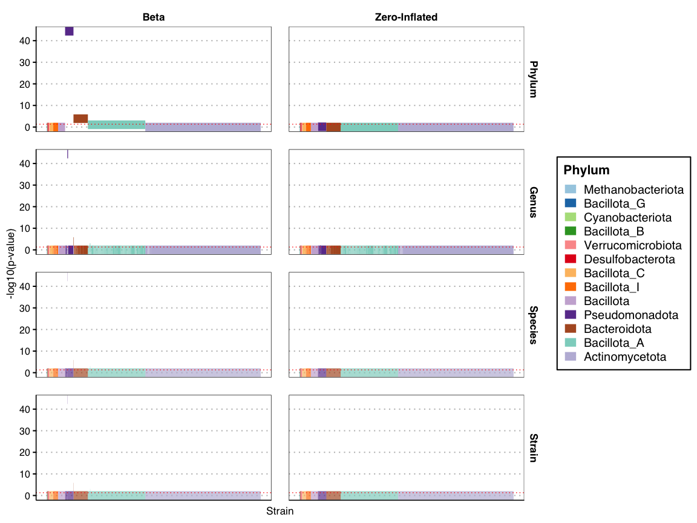

``` r
plot_manhattan(fit_zib_95, taxonomy = tax_95, aggregate_by_taxa = F)
```

    ## ! # Invaild edge matrix for <phylo>. A <tbl_df> is returned.
    ## ! # Invaild edge matrix for <phylo>. A <tbl_df> is returned.
    ## ! # Invaild edge matrix for <phylo>. A <tbl_df> is returned.
    ## ! # Invaild edge matrix for <phylo>. A <tbl_df> is returned.
    ## ! # Invaild edge matrix for <phylo>. A <tbl_df> is returned.
    ## ! # Invaild edge matrix for <phylo>. A <tbl_df> is returned.

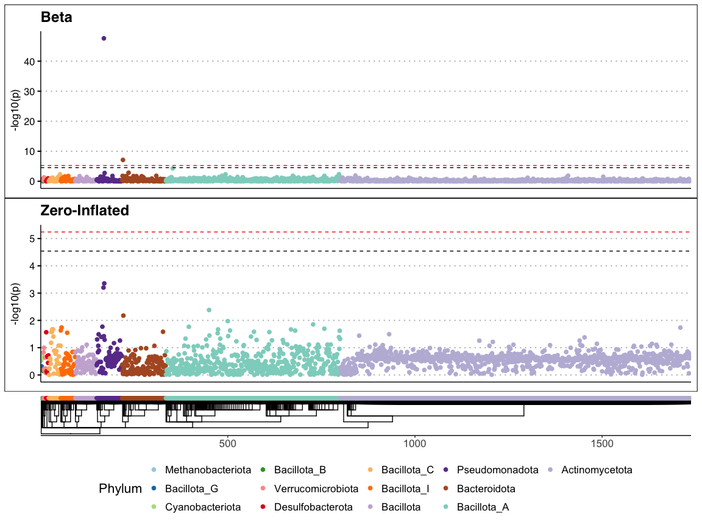

``` r
plot_volcano(fit_zib_95, label = T)
```

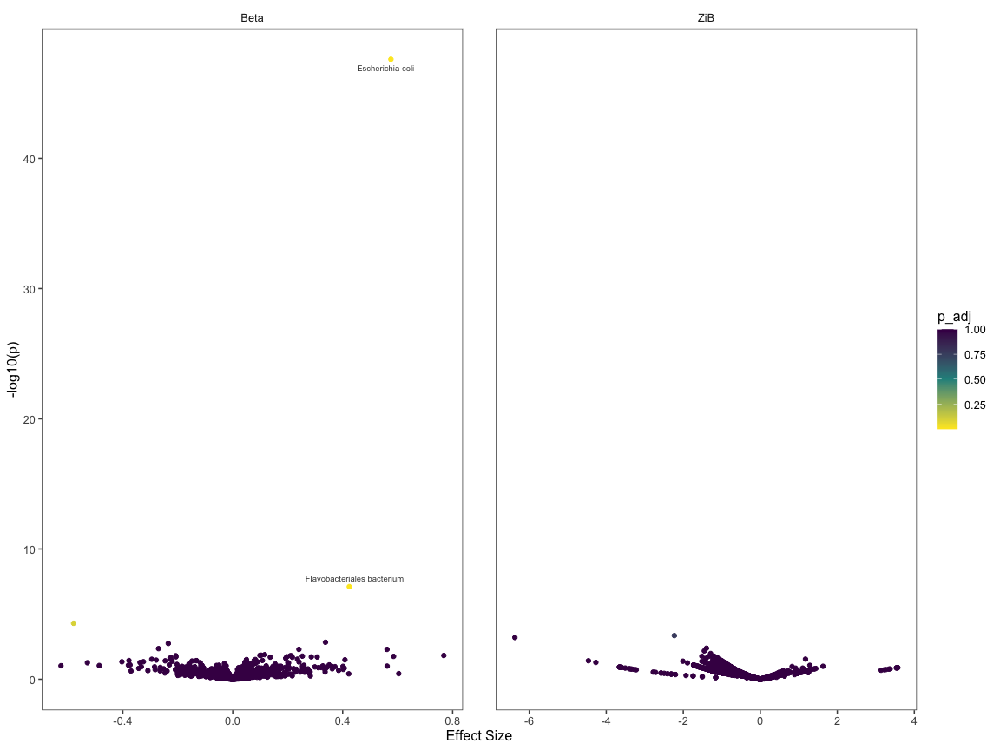

``` r
plot_ani_dist(d_q95, phenotype = 'spiked', contigs = top_hits(fit_zib_95)$Contig_name, drop_zeros = F, show_points = T, plot_type = 'violin')
```

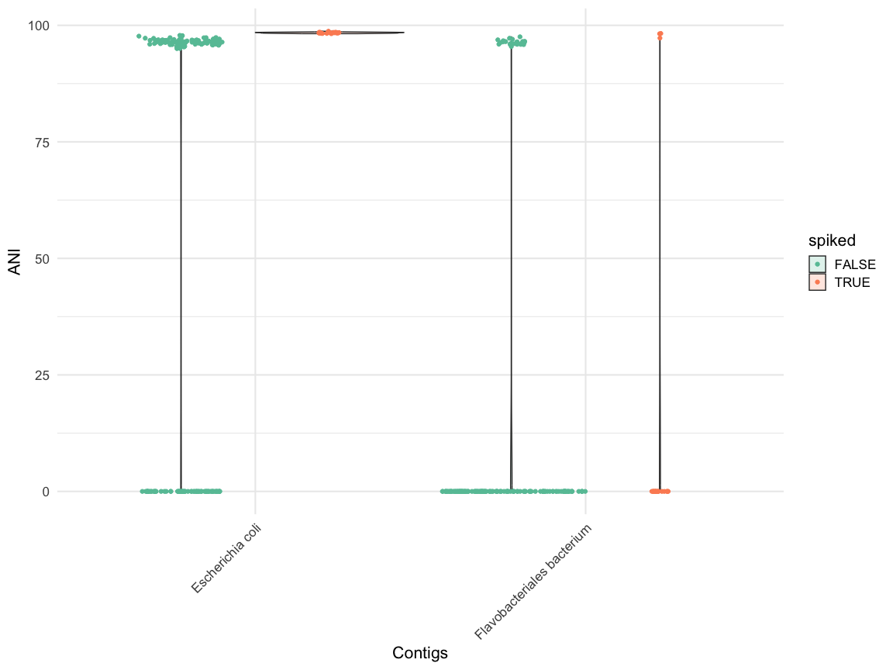

``` r
plot_ani_dist(d_q95, phenotype = 'spiked', contigs = top_hits(fit_zib_95)$Contig_name, drop_zeros = T, show_points = T, plot_type = 'violin')
```

    ## Warning: Removed 218 rows containing non-finite outside the scale range
    ## (`stat_ydensity()`).


### query 98

``` r
save_path = "output_rds/spike_ecoli_zib_q_98.rds"
if(file.exists(save_path)){
  fit_zib_98 <- readRDS(save_path)
} else {
  system.time({
    fit_zib_98 <- glmZiBFit(d_q98, design, nthreads = parallel::detectCores())
  })
  saveRDS(fit_zib_98, save_path)
}


plot_manhattan(fit_zib_98, taxonomy = tax_98, method = "BH")
```

    ## ! # Invaild edge matrix for <phylo>. A <tbl_df> is returned.
    ## ! # Invaild edge matrix for <phylo>. A <tbl_df> is returned.
    ## ! # Invaild edge matrix for <phylo>. A <tbl_df> is returned.
    ## ! # Invaild edge matrix for <phylo>. A <tbl_df> is returned.

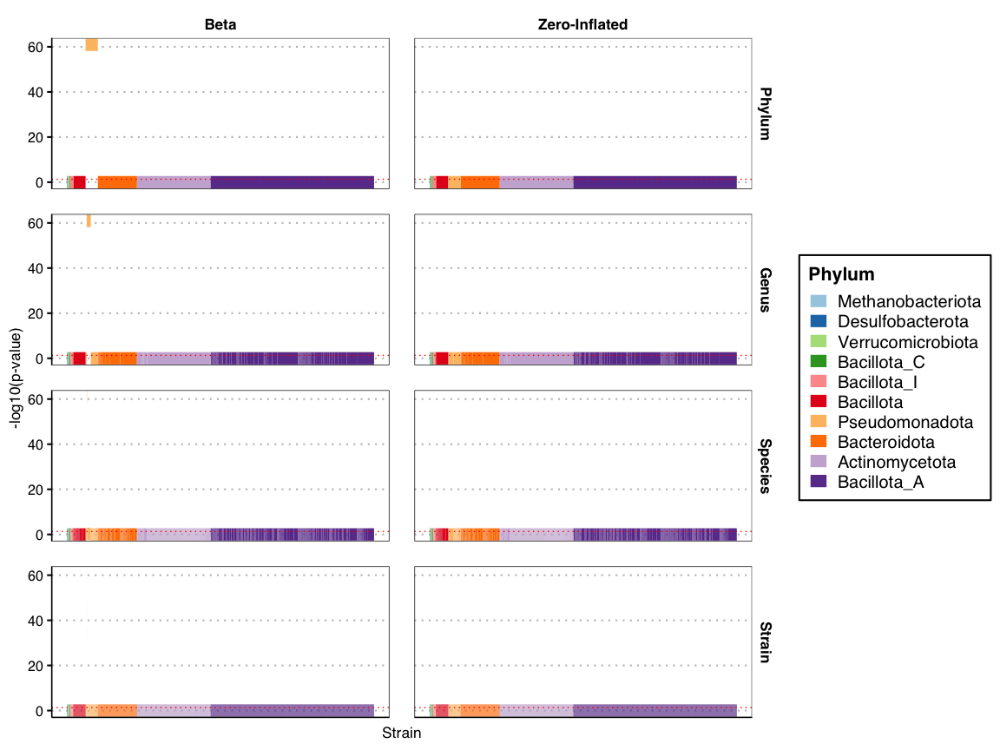

``` r
plot_volcano(fit_zib_98, label = T)
```

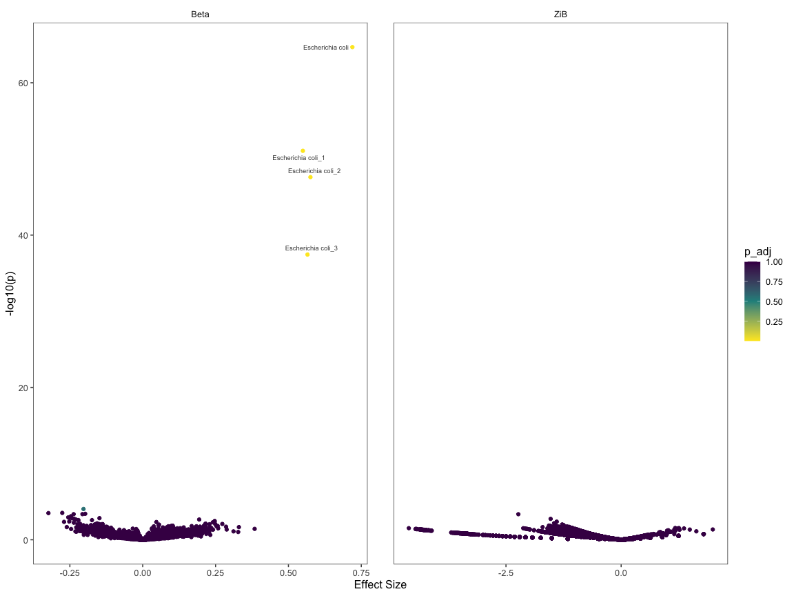

``` r
plot_ani_dist(d_q98, phenotype = 'spiked', contigs = top_hits(fit_zib_98, alpha = 0.05)$Contig_name)
```

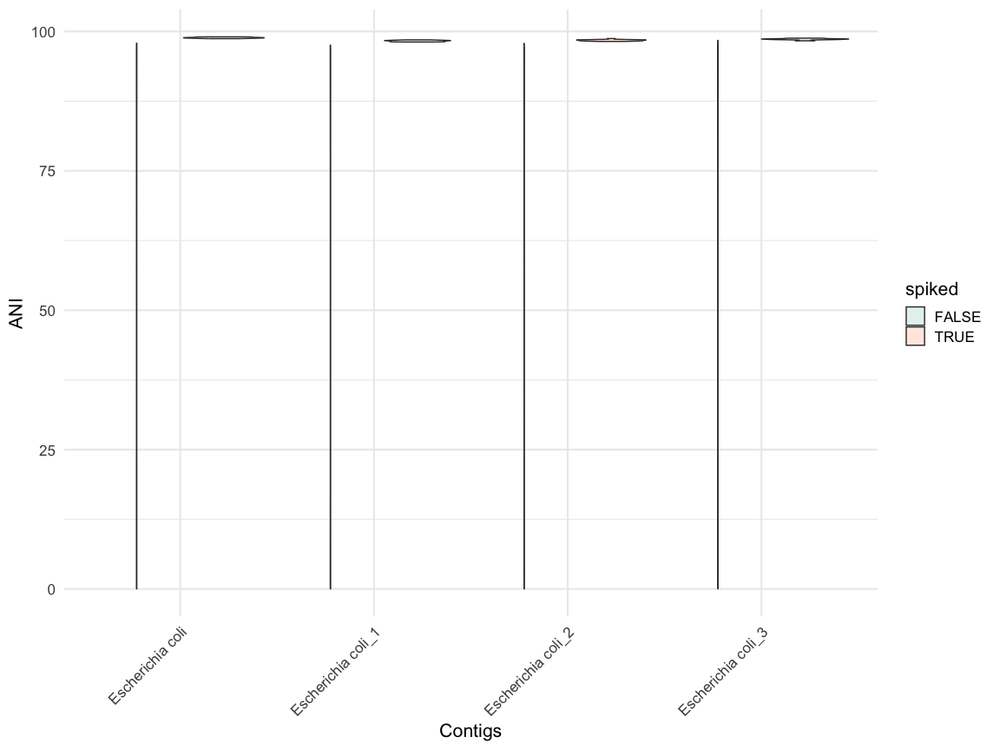

``` r
plot_ani_dist(d_q98, phenotype = 'spiked', contigs = top_hits(fit_zib_98, alpha = 0.05)$Contig_name, drop_zeros = T)
```

    ## Warning: Removed 282 rows containing non-finite outside the scale range
    ## (`stat_ydensity()`).

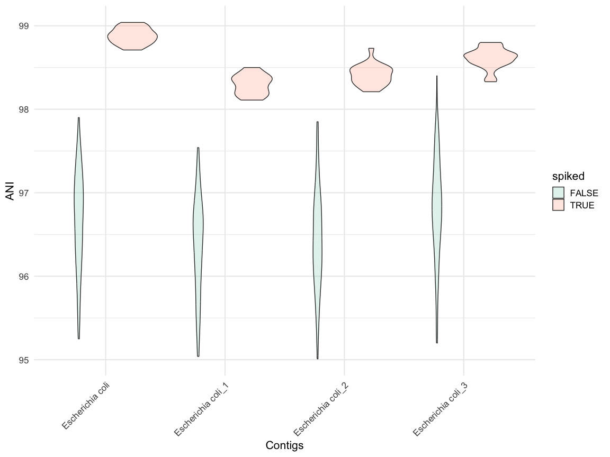

### query 99

``` r
save_path = "output_rds/spike_ecoli_zib_q_99.rds"
if(file.exists(save_path)){
  fit_zib_99 <- readRDS(save_path)
} else {
  system.time({
    fit_zib_99 <- glmZiBFit(d_q99, design, nthreads = parallel::detectCores())
  })
  saveRDS(fit_zib_99, save_path)
}

plot_manhattan(fit_zib_99, taxonomy = tax_99, method = "BH")
```

    ## ! # Invaild edge matrix for <phylo>. A <tbl_df> is returned.
    ## ! # Invaild edge matrix for <phylo>. A <tbl_df> is returned.
    ## ! # Invaild edge matrix for <phylo>. A <tbl_df> is returned.
    ## ! # Invaild edge matrix for <phylo>. A <tbl_df> is returned.

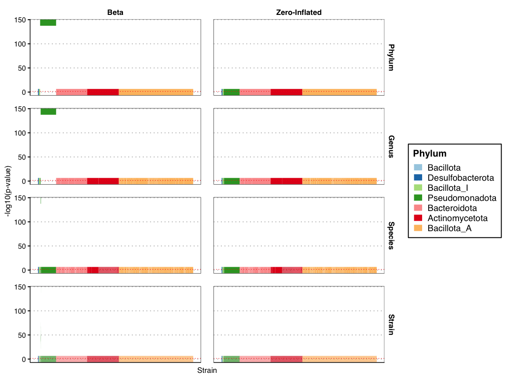

``` r
plot_manhattan(fit_zib_99, taxonomy = tax_99, aggregate_by_taxa = F)
```

    ## ! # Invaild edge matrix for <phylo>. A <tbl_df> is returned.
    ## ! # Invaild edge matrix for <phylo>. A <tbl_df> is returned.
    ## ! # Invaild edge matrix for <phylo>. A <tbl_df> is returned.
    ## ! # Invaild edge matrix for <phylo>. A <tbl_df> is returned.
    ## ! # Invaild edge matrix for <phylo>. A <tbl_df> is returned.
    ## ! # Invaild edge matrix for <phylo>. A <tbl_df> is returned.

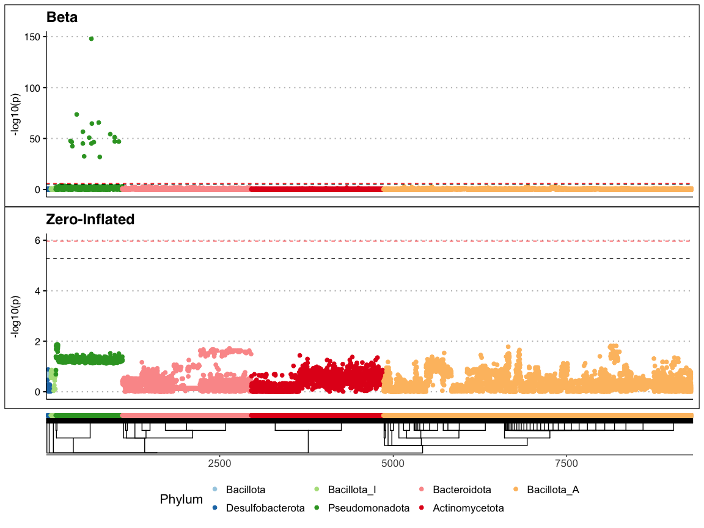

``` r
plot_volcano(fit_zib_99, label = T)
```

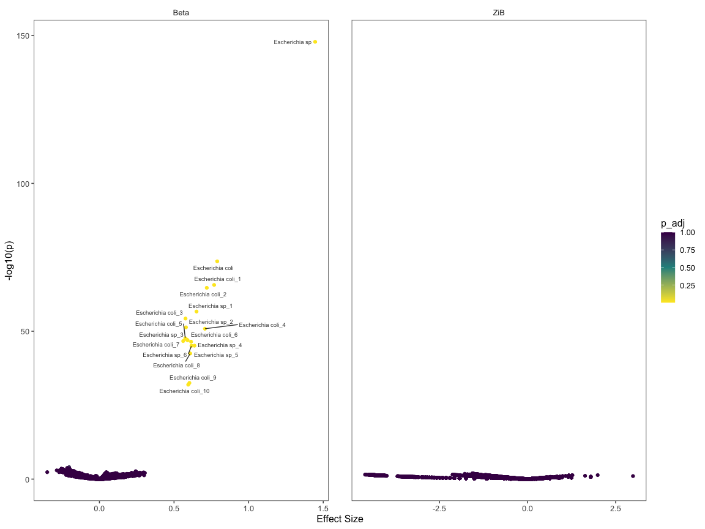

``` r
plot_ani_dist(d_q99, phenotype = 'spiked', contigs = top_hits(fit_zib_99)$Contig_name)
```

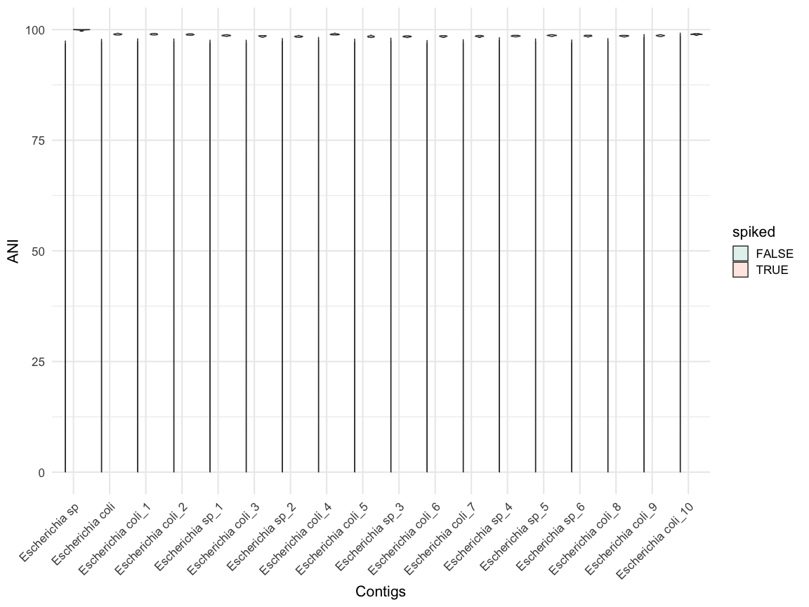

``` r
plot_ani_dist(d_q99, phenotype = 'spiked', contigs = top_hits(fit_zib_99)$Contig_name, drop_zeros = T)
```

    ## Warning: Removed 1258 rows containing non-finite outside the scale range
    ## (`stat_ydensity()`).

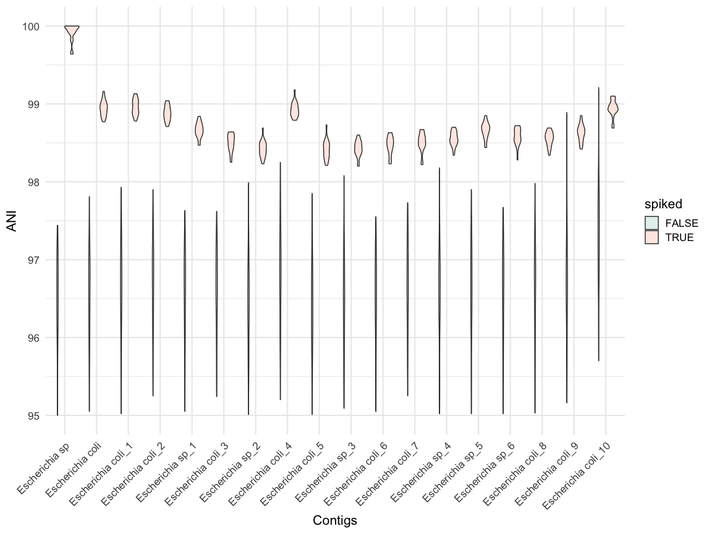

## Fit OB models

### query 95

``` r
save_path = "output_rds/spike_ecoli_ob_q_95.rds"
if(file.exists(save_path)){
  fit_ob_95 <- readRDS(save_path)
} else {
  system.time({
    fit_ob_95 <- glmObFit(d_q95, design, nthreads = parallel::detectCores())
  })
  saveRDS(fit_ob_95, save_path)
}

plot_manhattan(fit_ob_95, taxonomy = tax_95, method = "BH", tax_levels = c("Phylum", "Order", "Class", "Genus"))
```

    ## ! # Invaild edge matrix for <phylo>. A <tbl_df> is returned.
    ## ! # Invaild edge matrix for <phylo>. A <tbl_df> is returned.
    ## ! # Invaild edge matrix for <phylo>. A <tbl_df> is returned.
    ## ! # Invaild edge matrix for <phylo>. A <tbl_df> is returned.

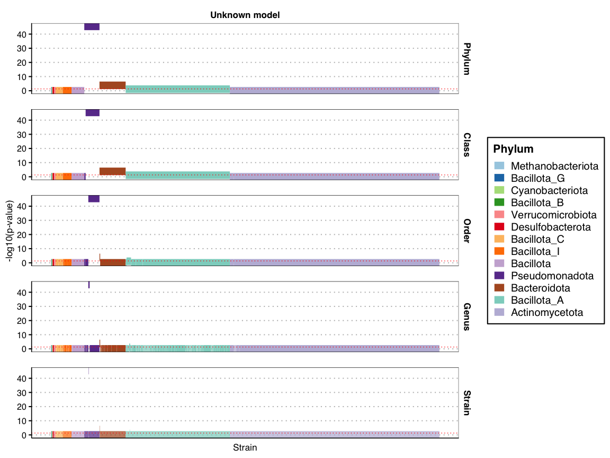

``` r
plot_manhattan(fit_ob_95, taxonomy = tax_95, aggregate_by_taxa = F)
```

    ## ! # Invaild edge matrix for <phylo>. A <tbl_df> is returned.
    ## ! # Invaild edge matrix for <phylo>. A <tbl_df> is returned.
    ## ! # Invaild edge matrix for <phylo>. A <tbl_df> is returned.
    ## ! # Invaild edge matrix for <phylo>. A <tbl_df> is returned.

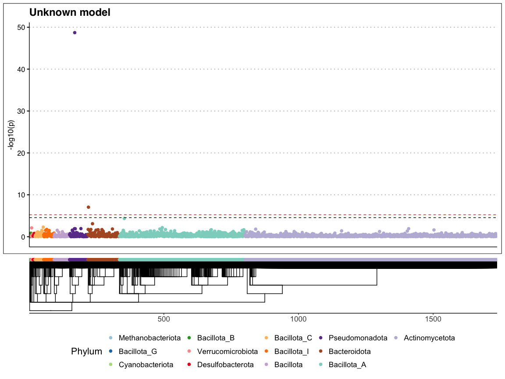

``` r
plot_volcano(fit_ob_95, label = T)
```

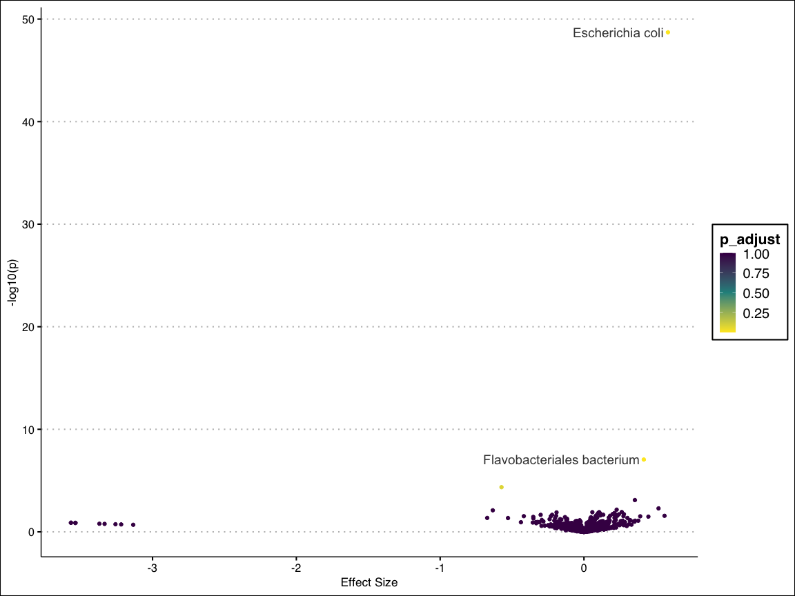

``` r
plot_ani_dist(d_q95, phenotype = 'spiked', contigs = top_hits(fit_ob_95, alpha = 0.05)$Contig_name, drop_zeros = F, show_points = T, plot_type = 'violin')
```


``` r
plot_ani_dist(d_q95, phenotype = 'spiked', contigs = top_hits(fit_ob_95, alpha = 0.05)$Contig_name, drop_zeros = T, show_points = T, plot_type = 'violin')
```

    ## Warning: Removed 218 rows containing non-finite outside the scale range
    ## (`stat_ydensity()`).

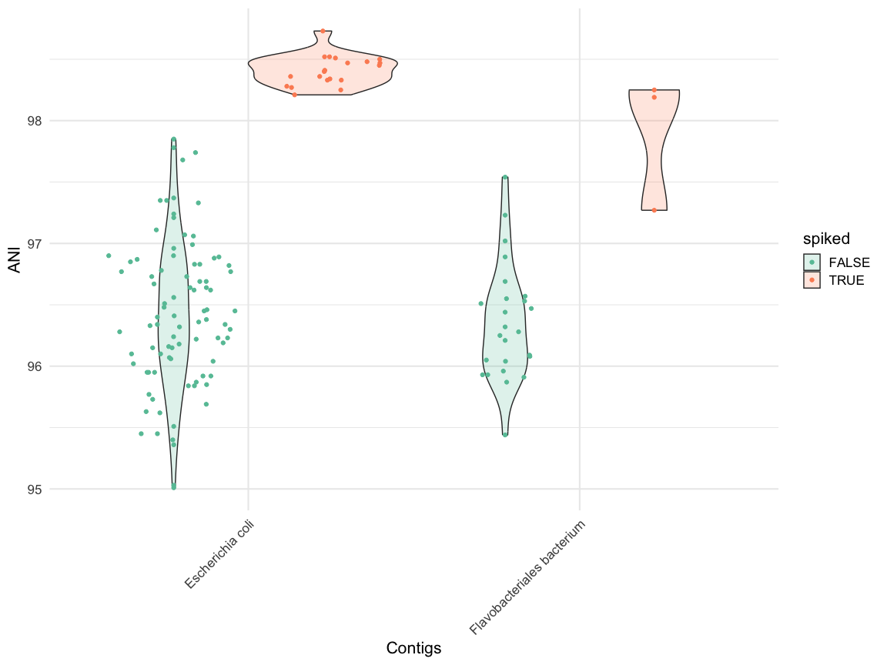

### query 98

``` r
save_path = "output_rds/spike_ecoli_ob_q_98.rds"
if(file.exists(save_path)){
  fit_ob_98 <- readRDS(save_path)
} else {
  system.time({
    fit_ob_98 <- glmObFit(d_q98, design, nthreads = parallel::detectCores())
  })
  saveRDS(fit_ob_98, save_path)
}


plot_manhattan(fit_ob_98, taxonomy = tax_98, method = "BH", tax_levels = c("Phylum", "Order", "Class", "Genus", "Species"))
```

    ## ! # Invaild edge matrix for <phylo>. A <tbl_df> is returned.
    ## ! # Invaild edge matrix for <phylo>. A <tbl_df> is returned.
    ## ! # Invaild edge matrix for <phylo>. A <tbl_df> is returned.
    ## ! # Invaild edge matrix for <phylo>. A <tbl_df> is returned.

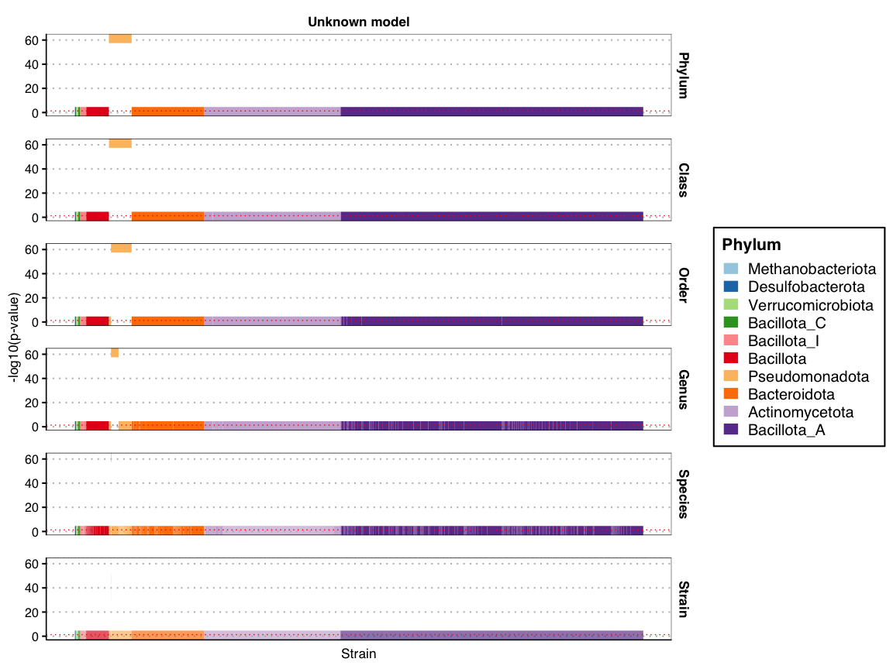

``` r
plot_manhattan(fit_ob_98, taxonomy = tax_98, aggregate_by_taxa = F)
```

    ## ! # Invaild edge matrix for <phylo>. A <tbl_df> is returned.
    ## ! # Invaild edge matrix for <phylo>. A <tbl_df> is returned.
    ## ! # Invaild edge matrix for <phylo>. A <tbl_df> is returned.
    ## ! # Invaild edge matrix for <phylo>. A <tbl_df> is returned.

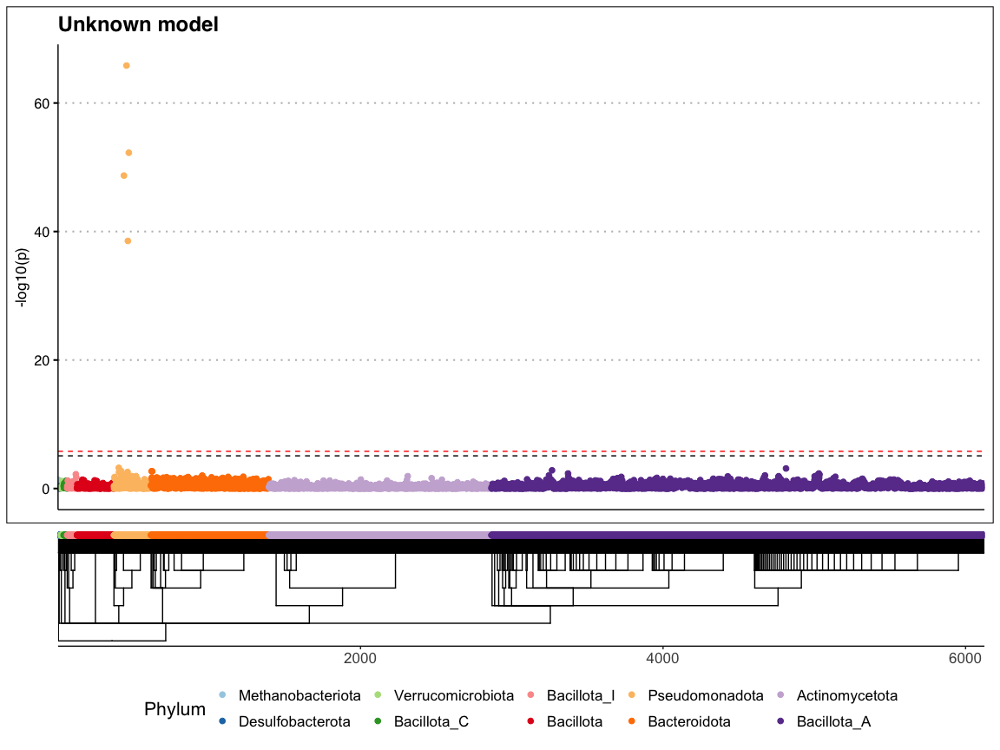

``` r
plot_volcano(fit_ob_98, label = T)
```

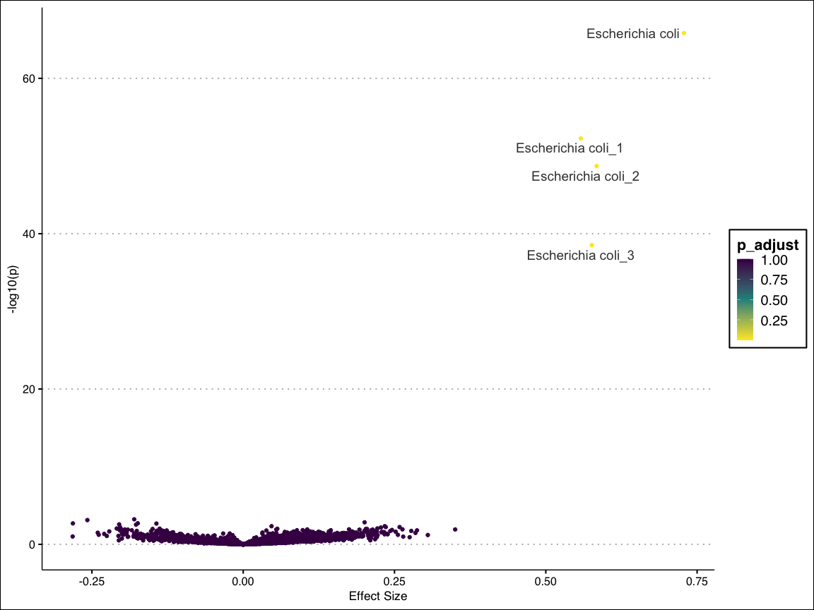

``` r
plot_ani_dist(d_q98, phenotype = 'spiked', contigs = top_hits(fit_ob_98, alpha = 0.05)$Contig_name, show_points = T, plot_type = 'violin')
```

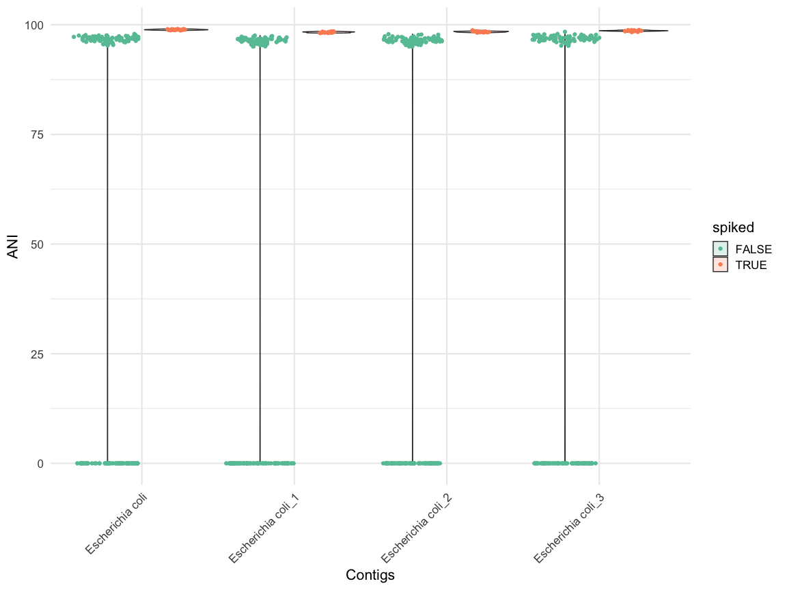

``` r
plot_ani_dist(d_q98, phenotype = 'spiked', contigs = top_hits(fit_ob_98, alpha = 0.05)$Contig_name, drop_zeros = T, show_points = T, plot_type = 'violin')
```

    ## Warning: Removed 282 rows containing non-finite outside the scale range
    ## (`stat_ydensity()`).

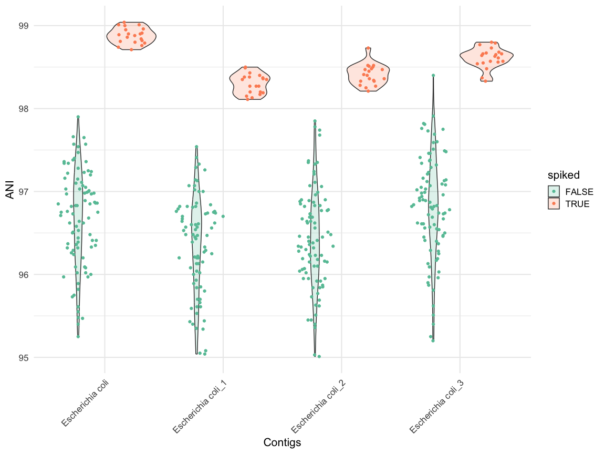

### query 99

``` r
save_path = "output_rds/spike_ecoli_ob_q_99.rds"
if(file.exists(save_path)){
  fit_ob_99 <- readRDS(save_path)
} else {
  system.time({
    fit_ob_99 <- glmObFit(d_q99, design, nthreads = parallel::detectCores())
  })
  saveRDS(fit_ob_99, save_path)
}

plot_manhattan(fit_ob_99, taxonomy = tax_99, tax_levels = c("Phylum", "Order", "Class", "Genus", "Species"))
```

    ## ! # Invaild edge matrix for <phylo>. A <tbl_df> is returned.
    ## ! # Invaild edge matrix for <phylo>. A <tbl_df> is returned.
    ## ! # Invaild edge matrix for <phylo>. A <tbl_df> is returned.
    ## ! # Invaild edge matrix for <phylo>. A <tbl_df> is returned.

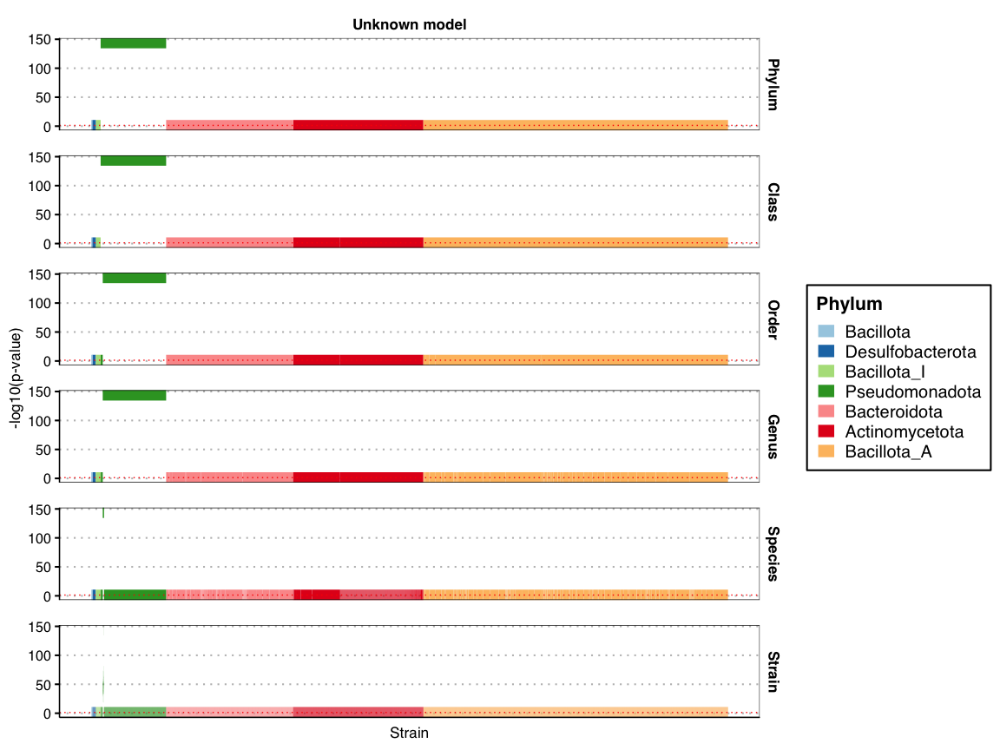

``` r
plot_manhattan(fit_ob_99, taxonomy = tax_99, aggregate_by_taxa = F)
```

    ## ! # Invaild edge matrix for <phylo>. A <tbl_df> is returned.
    ## ! # Invaild edge matrix for <phylo>. A <tbl_df> is returned.
    ## ! # Invaild edge matrix for <phylo>. A <tbl_df> is returned.
    ## ! # Invaild edge matrix for <phylo>. A <tbl_df> is returned.

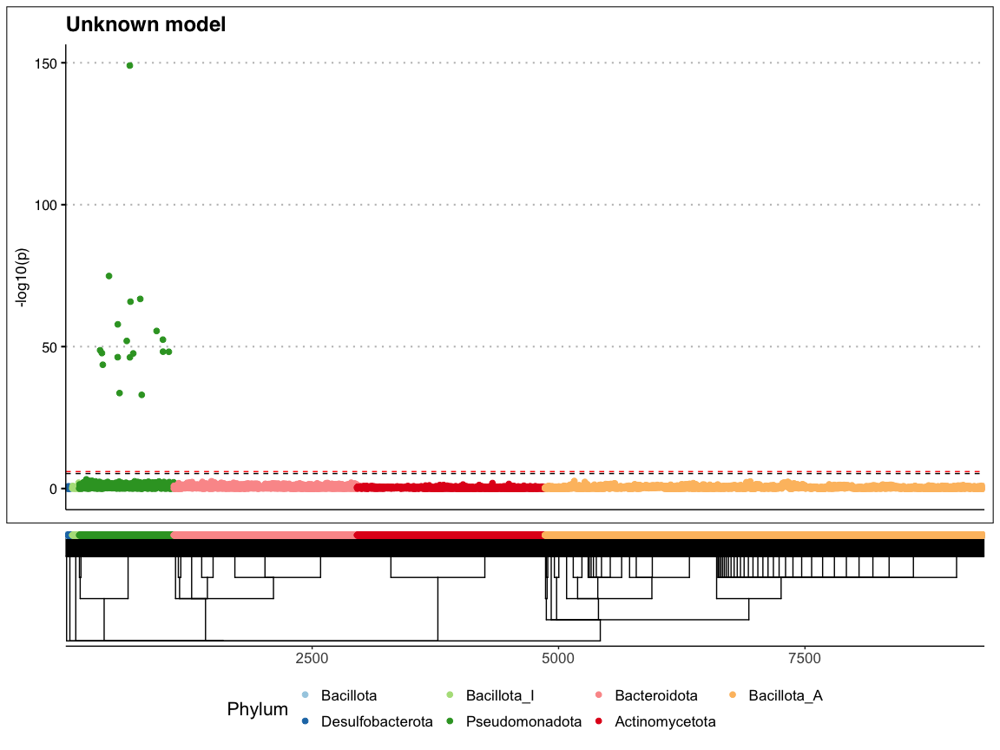

``` r
plot_volcano(fit_ob_99, label = T)
```

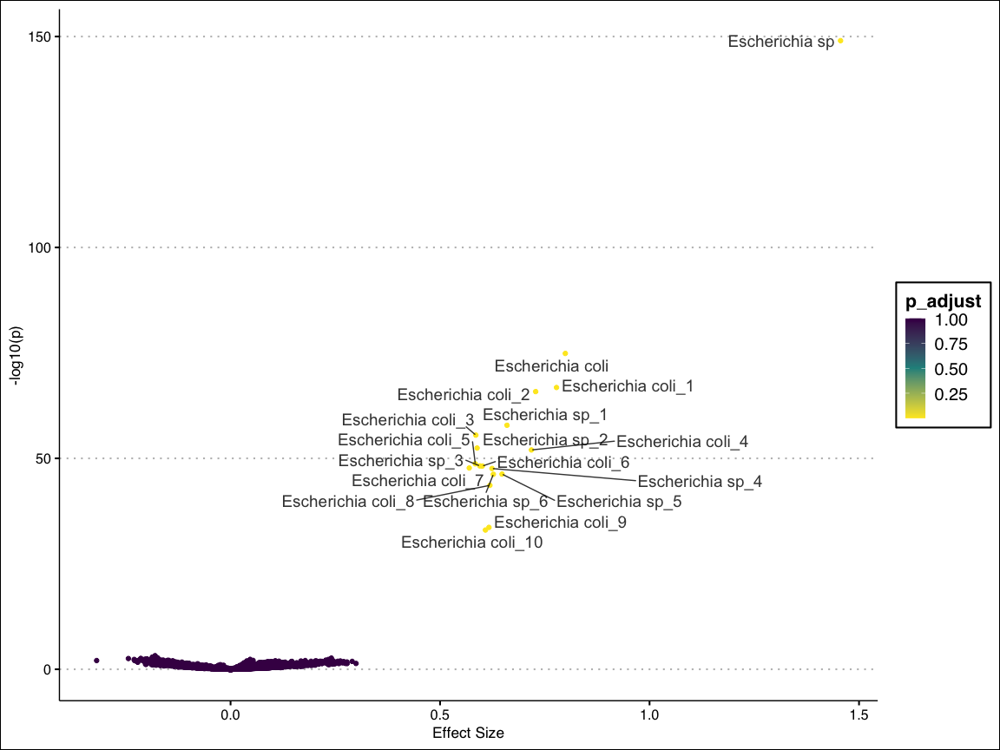

``` r
plot_ani_dist(d_q99, phenotype = 'spiked', contigs = top_hits(fit_ob_99, alpha = 0.05)$Contig_name, drop_zeros = F, show_points = T, plot_type = 'violin')
```

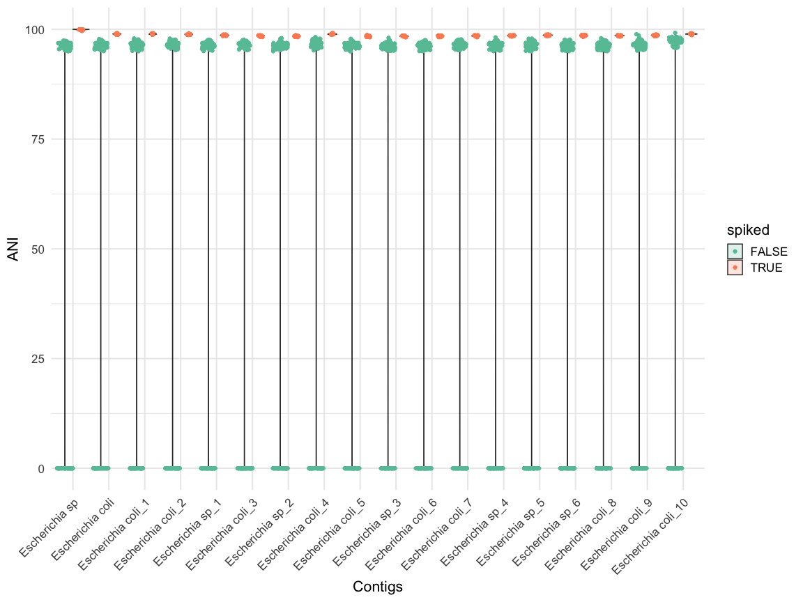

``` r
plot_ani_dist(d_q99, phenotype = 'spiked', contigs = top_hits(fit_ob_99, alpha = 0.05)$Contig_name, drop_zeros = T, show_points = T, plot_type = 'violin')
```

    ## Warning: Removed 1258 rows containing non-finite outside the scale range
    ## (`stat_ydensity()`).

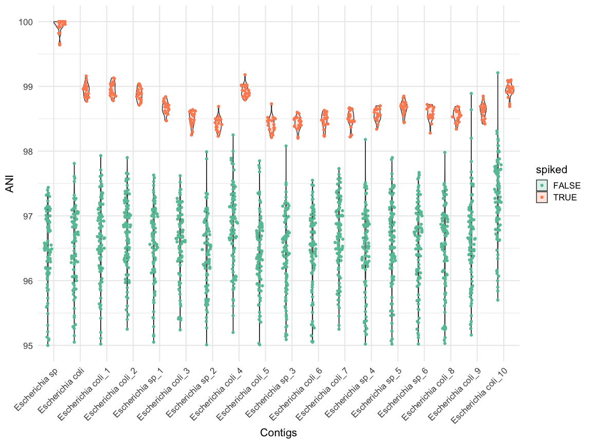
