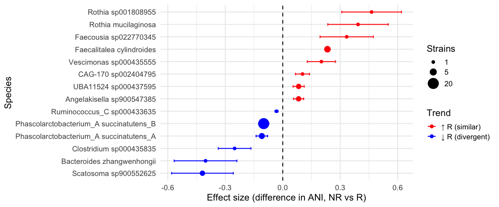
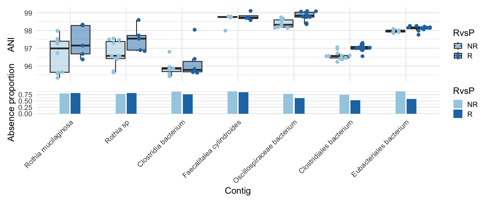
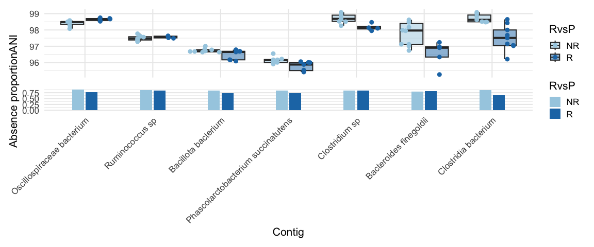
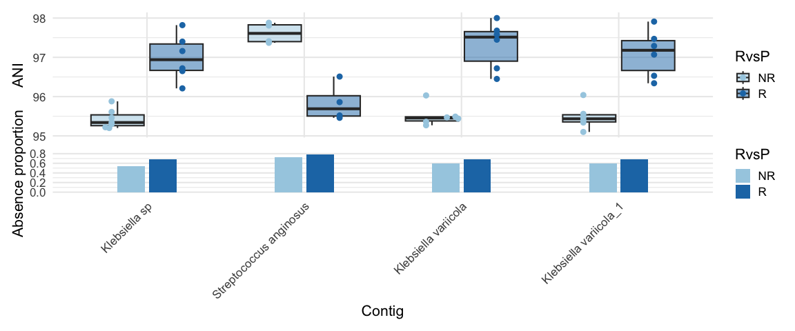
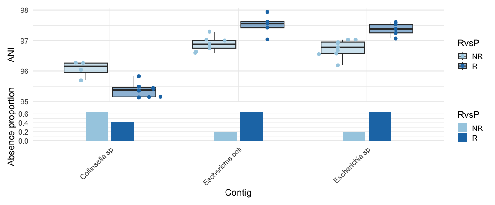
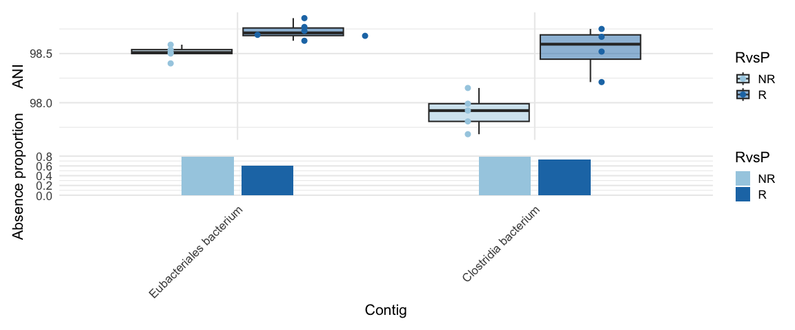
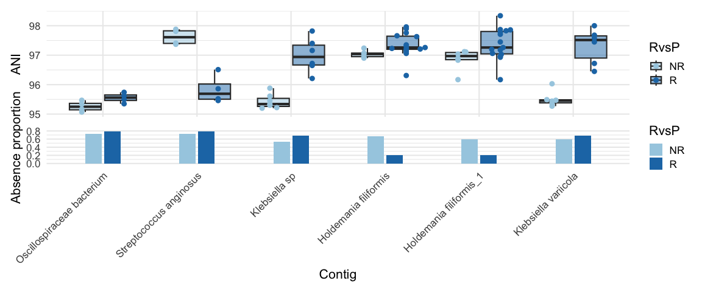
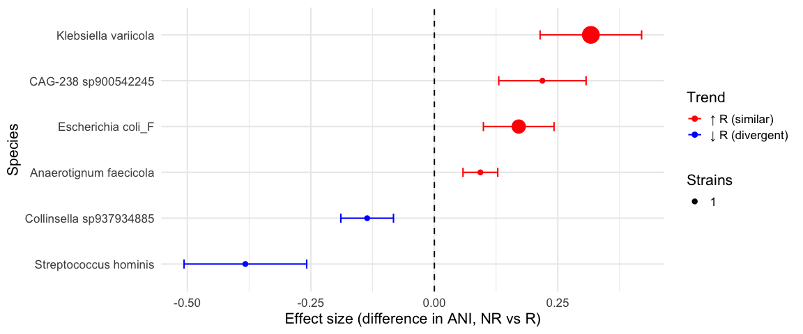

Associations between gut microbial strains and cancer immunotherapy
outcomes - a study in rare cancers and melanoma
================
2026-06-20

## Load dependencies

``` r
library(strainspy)
library(SummarizedExperiment)
library(caret)
library(glmnet) # elastic net
library(ggrepel)
library(ranger) # RF
library(pROC)
library(doParallel)
library(foreach)
library(parallel)
library(ggplot2)
library(tidyr)
library(dplyr)
library(ggtree)
library(ggsci)
```

# Association testing

Classic StrainSpy applied to rare cancer and melanoma data in different
combinations

## Load the metadata for rare cancers

``` r
# Gunjur et al. data
meta_path_ash <- "./data/ash_pancancer/metadata_full.tsv"
meta_ash <- read.csv(meta_path_ash, sep = '\t') 
meta_ash = cbind(run_acc = meta_ash$run_accession, meta_ash)

# Outcome
meta_ash$RvsP = "R"
meta_ash$RvsP[which(meta_ash$BOR == "PD" | meta_ash$BOR == "cPD")] = "NR" 
meta_ash$RvsP = factor(meta_ash$RvsP, levels = c("NR", "R"))
```

### Load Sylph outputs

``` r
sy_ash <- read_sylph("./data/ash_pancancer/combined_q_99.tsv.gz") # q99)
```

    ## Detected Sylph query output file.

``` r
# annoying renames to match meta V sylph file
colnames(sy_ash) <- gsub("_1", "", colnames(sy_ash))
colData(sy_ash)$Sample_file <- gsub("_1", "", basename(colData(sy_ash)$Sample_file))

# Reorder meta_ash 
meta_ash = meta_ash[match(colnames(sy_ash), meta_ash$run_accession), ]
# get rid of SD
rmidx = which(meta_ash$BOR == "SD")
if(length(rmidx) > 0){
  meta_ash = meta_ash[-rmidx, ]
  sy_ash = sy_ash[, -rmidx]
}

sy_ash <- filter_by_presence(sy_ash, min_nonzero = 8) # filter at 10%
```

    ## Retained 19139 rows after filtering

``` r
dim(sy_ash)
```

    ## [1] 19139    77

``` r
# Checks before merging metadata
all(colnames(sy_ash) %in% meta_ash$run_accession)
```

    ## [1] TRUE

``` r
all(meta_ash$run_accession %in% colnames(sy_ash))
```

    ## [1] TRUE

``` r
sy_ash = modify_metadata(sy_ash, meta_ash)
```

### Run StrainSpy

``` r
design <- as.formula("~ RvsP + histology_cohort.x + age + sex + BMI") 

save_path <- "output_rds/ASH_zib_q_99_ebp.rds"

if(file.exists(save_path)){
  ZB_fit <- readRDS(save_path)
} else {
  # Run with weak prior for prediction
  ebp = compute_eb_priors(sy_ash, design, nthreads = 10L, low_cutoff = 0, high_cutoff = Inf)
  ZB_fit <- glmZiBFit(sy_ash, design, nthreads = parallel::detectCores(), MAP_prior = ebp)
  saveRDS(ZB_fit, save_path)
}

# These are strainspy predictors from Pancx data
th = top_hits = top_hits(ZB_fit, coef = 2, alpha = 0.05)
```

    ## Found 167 tophits for RvsPR at alpha = 0.05 using holm

## Inspect StrainSpy hits species/genera

``` r
tax_99 = read_taxonomy("data/TAXONOMY/sylph_DB_taxonomy_99.tsv")

th_ph = comp_ani_diff_and_posthoc_test(sy_ash, ZB_fit, th)
```

    ##   |                                                                              |                                                                      |   0%  |                                                                              |                                                                      |   1%  |                                                                              |=                                                                     |   1%  |                                                                              |=                                                                     |   2%  |                                                                              |==                                                                    |   2%  |                                                                              |==                                                                    |   3%  |                                                                              |===                                                                   |   4%  |                                                                              |===                                                                   |   5%  |                                                                              |====                                                                  |   5%  |                                                                              |====                                                                  |   6%  |                                                                              |=====                                                                 |   7%  |                                                                              |=====                                                                 |   8%  |                                                                              |======                                                                |   8%  |                                                                              |======                                                                |   9%  |                                                                              |=======                                                               |  10%  |                                                                              |========                                                              |  11%  |                                                                              |========                                                              |  12%  |                                                                              |=========                                                             |  13%  |                                                                              |==========                                                            |  14%  |                                                                              |==========                                                            |  15%  |                                                                              |===========                                                           |  16%  |                                                                              |============                                                          |  17%  |                                                                              |=============                                                         |  18%  |                                                                              |=============                                                         |  19%  |                                                                              |==============                                                        |  20%  |                                                                              |===============                                                       |  21%  |                                                                              |===============                                                       |  22%  |                                                                              |================                                                      |  22%  |                                                                              |================                                                      |  23%  |                                                                              |=================                                                     |  24%  |                                                                              |=================                                                     |  25%  |                                                                              |==================                                                    |  25%  |                                                                              |==================                                                    |  26%  |                                                                              |===================                                                   |  27%  |                                                                              |===================                                                   |  28%  |                                                                              |====================                                                  |  28%  |                                                                              |====================                                                  |  29%  |                                                                              |=====================                                                 |  29%  |                                                                              |=====================                                                 |  30%  |                                                                              |=====================                                                 |  31%  |                                                                              |======================                                                |  31%  |                                                                              |======================                                                |  32%  |                                                                              |=======================                                               |  32%  |                                                                              |=======================                                               |  33%  |                                                                              |=======================                                               |  34%  |                                                                              |========================                                              |  34%  |                                                                              |========================                                              |  35%  |                                                                              |=========================                                             |  35%  |                                                                              |=========================                                             |  36%  |                                                                              |==========================                                            |  37%  |                                                                              |==========================                                            |  38%  |                                                                              |===========================                                           |  38%  |                                                                              |===========================                                           |  39%  |                                                                              |============================                                          |  40%  |                                                                              |=============================                                         |  41%  |                                                                              |=============================                                         |  42%  |                                                                              |==============================                                        |  43%  |                                                                              |===============================                                       |  44%  |                                                                              |===============================                                       |  45%  |                                                                              |================================                                      |  46%  |                                                                              |=================================                                     |  47%  |                                                                              |==================================                                    |  48%  |                                                                              |==================================                                    |  49%  |                                                                              |===================================                                   |  50%  |                                                                              |====================================                                  |  51%  |                                                                              |====================================                                  |  52%  |                                                                              |=====================================                                 |  53%  |                                                                              |======================================                                |  54%  |                                                                              |=======================================                               |  55%  |                                                                              |=======================================                               |  56%  |                                                                              |========================================                              |  57%  |                                                                              |=========================================                             |  58%  |                                                                              |=========================================                             |  59%  |                                                                              |==========================================                            |  60%  |                                                                              |===========================================                           |  61%  |                                                                              |===========================================                           |  62%  |                                                                              |============================================                          |  62%  |                                                                              |============================================                          |  63%  |                                                                              |=============================================                         |  64%  |                                                                              |=============================================                         |  65%  |                                                                              |==============================================                        |  65%  |                                                                              |==============================================                        |  66%  |                                                                              |===============================================                       |  66%  |                                                                              |===============================================                       |  67%  |                                                                              |===============================================                       |  68%  |                                                                              |================================================                      |  68%  |                                                                              |================================================                      |  69%  |                                                                              |=================================================                     |  69%  |                                                                              |=================================================                     |  70%  |                                                                              |=================================================                     |  71%  |                                                                              |==================================================                    |  71%  |                                                                              |==================================================                    |  72%  |                                                                              |===================================================                   |  72%  |                                                                              |===================================================                   |  73%  |                                                                              |====================================================                  |  74%  |                                                                              |====================================================                  |  75%  |                                                                              |=====================================================                 |  75%  |                                                                              |=====================================================                 |  76%  |                                                                              |======================================================                |  77%  |                                                                              |======================================================                |  78%  |                                                                              |=======================================================               |  78%  |                                                                              |=======================================================               |  79%  |                                                                              |========================================================              |  80%  |                                                                              |=========================================================             |  81%  |                                                                              |=========================================================             |  82%  |                                                                              |==========================================================            |  83%  |                                                                              |===========================================================           |  84%  |                                                                              |============================================================          |  85%  |                                                                              |============================================================          |  86%  |                                                                              |=============================================================         |  87%  |                                                                              |==============================================================        |  88%  |                                                                              |==============================================================        |  89%  |                                                                              |===============================================================       |  90%  |                                                                              |================================================================      |  91%  |                                                                              |================================================================      |  92%  |                                                                              |=================================================================     |  92%  |                                                                              |=================================================================     |  93%  |                                                                              |==================================================================    |  94%  |                                                                              |==================================================================    |  95%  |                                                                              |===================================================================   |  95%  |                                                                              |===================================================================   |  96%  |                                                                              |====================================================================  |  97%  |                                                                              |====================================================================  |  98%  |                                                                              |===================================================================== |  98%  |                                                                              |===================================================================== |  99%  |                                                                              |======================================================================|  99%  |                                                                              |======================================================================| 100%

``` r
# Interestingly, these are all beta hits (differences in strain identity)
table(th_ph$hit_component)
```

    ## 
    ## beta 
    ##  167

``` r
th_ph_full = strainspy:::add_tax2tophits(th_ph, tax_99, c("Genus", "Species"))

tbl_full = table(th_ph_full$Species)
sort(tbl_full[tbl_full>5], decreasing = T)
```

    ## 
    ## Phascolarctobacterium_A succinatutens_B                     CAG-302 sp934162325 
    ##                                      20                                       9 
    ##       Lachnoclostridium_B faecipullorum                 Ruminococcus_C callidus 
    ##                                       9                                       6

``` r
tbl_full = table(th_ph_full$Genus)
sort(tbl_full[tbl_full>5], decreasing = T)
```

    ## 
    ## Phascolarctobacterium_A           Streptococcus              Prevotella 
    ##                      23                      20                      13 
    ##                 CAG-302     Lachnoclostridium_B          Ruminococcus_C 
    ##                      12                       9                       7

``` r
# Although there are interesting looking strains, we should remove poorly supported ones
th_ph_filt = th_ph_full[is.na(th_ph_full$Comment), ]

tbl = table(th_ph_filt$Species)
sort(tbl, decreasing = T)
```

    ## 
    ## Phascolarctobacterium_A succinatutens_B               Faecalitalea cylindroides 
    ##                                      20                                       4 
    ## Phascolarctobacterium_A succinatutens_A               Angelakisella sp900547385 
    ##                                       3                                       2 
    ##                   Scatosoma sp900552625                    UBA11524 sp000437595 
    ##                                       2                                       2 
    ##              Bacteroides zhangwenhongii                     CAG-170 sp002404795 
    ##                                       1                                       1 
    ##                 Clostridium sp000435835                   Faecousia sp022770345 
    ##                                       1                                       1 
    ##                     Rothia mucilaginosa                      Rothia sp001808955 
    ##                                       1                                       1 
    ##              Ruminococcus_C sp000433635                  Vescimonas sp000435555 
    ##                                       1                                       1

``` r
tbl = table(th_ph_filt$Genus)
sort(tbl, decreasing = T)
```

    ## 
    ## Phascolarctobacterium_A            Faecalitalea           Angelakisella 
    ##                      23                       4                       2 
    ##                  Rothia               Scatosoma                UBA11524 
    ##                       2                       2                       2 
    ##             Bacteroides                 CAG-170             Clostridium 
    ##                       1                       1                       1 
    ##               Faecousia          Ruminococcus_C              Vescimonas 
    ##                       1                       1                       1

# Inspect effect sizes

``` r
th_ph_ord = th_ph_filt[order(abs(th_ph_filt$ANI_Difference) , decreasing = T),]

summary_tbl <- th_ph_filt %>%
  filter(!is.na(Species)) %>%
  group_by(Species) %>%
  summarise(
    N_hits = n(),
    
    Top_adj_p_beta  = min(p_adjust, na.rm = TRUE),
    Top_coef_beta   = coefficient[which.min(p_adjust)],
    Top_se_beta     = std_error[which.min(p_adjust)],
    Top_contig_beta = Contig_name[which.min(p_adjust)],
    
    Top_adj_p_ZI    = min(zi_p_adjust, na.rm = TRUE),
    Top_coef_ZI     = zi_coefficient[which.min(zi_p_adjust)],
    Top_se_ZI       = zi_std_error[which.min(zi_p_adjust)],
    Top_contig_ZI   = Contig_name[which.min(zi_p_adjust)],
    
    
    .groups = "drop"
  ) %>%
  mutate(
    Min_adj_p = pmin(Top_adj_p_beta, Top_adj_p_ZI, na.rm = TRUE),
    Dominant_component = ifelse(Top_adj_p_beta < Top_adj_p_ZI, "Beta", "ZI"),
    Dominant_contig    = ifelse(Dominant_component == "Beta", Top_contig_beta, Top_contig_ZI),
    Dominant_coef      = ifelse(Dominant_component == "Beta", Top_coef_beta, Top_coef_ZI),
    Dominant_se        = ifelse(Dominant_component == "Beta", Top_se_beta, Top_se_ZI)
  ) %>%
  select(Species, N_hits, Dominant_component, Min_adj_p, Dominant_coef, Dominant_se, Dominant_contig) %>%
  arrange(Min_adj_p)

beta_summary <- summary_tbl %>%
  filter(Dominant_component == "Beta") %>%
  arrange(Min_adj_p) %>%
  mutate(
    CI_low = Dominant_coef - 1.96 * Dominant_se,
    CI_high = Dominant_coef + 1.96 * Dominant_se,
    Trend = ifelse(Dominant_coef > 0, "\u2191 R (similar)", "\u2193 R (divergent)"),
    Species = factor(Species, levels = rev(unique(Species)))
  ) %>%
  arrange(desc(Dominant_coef)) %>%
  mutate(Species = factor(Species, levels = rev(unique(Species))))

ggplot(beta_summary, aes(x = Dominant_coef, y = Species, color = Trend)) +
  geom_point(aes(size = N_hits)) +
  geom_errorbarh(aes(xmin = CI_low, xmax = CI_high), width = 0.2) +
  geom_vline(xintercept = 0, linetype = "dashed") +
  scale_color_manual(values = c("\u2191 R (similar)" = "red",
                                "\u2193 R (divergent)" = "blue")) +
  scale_size_continuous(
    name = "Strains",
    range = c(2, 8),
    breaks = c(1, 5, 20),
    labels = c("1", "5", "20")
  ) +
  labs(
    x = "Effect size (difference in ANI, NR vs R)",
    y = "Species",
    color = "Trend"
  ) +
  theme_minimal(base_size = 16)
```

    ## Warning: `geom_errorbarh()` was deprecated in ggplot2 4.0.0.
    ## ℹ Please use the `orientation` argument of `geom_errorbar()` instead.
    ## This warning is displayed once per session.
    ## Call `lifecycle::last_lifecycle_warnings()` to see where this warning was
    ## generated.

<!-- -->

``` r
# Some of these hits appear interesting
plot_ani_dist(sy_ash, 'RvsP', beta_summary$Dominant_contig[1:7])
```

    ## Warning: Removed 422 rows containing non-finite outside the scale range
    ## (`stat_boxplot()`).

<!-- -->

``` r
plot_ani_dist(sy_ash, 'RvsP', beta_summary$Dominant_contig[8:14])
```

    ## Warning: Removed 443 rows containing non-finite outside the scale range
    ## (`stat_boxplot()`).

<!-- -->

Hits in Rothia sp, specifically Rothia mucilaginosa, previously detected
modulating CRC immunotherapy response - reported previously is an
abundance (presence/absence) signal, but we see a difference in strain
identity -
<https://journals.plos.org/plosone/article?id=10.1371/journal.pone.0307639>

Hits in Phascolarctobacterium and Ruminococcus have been previously
detected modulating lung cancer immunotherapy response -
<https://link.springer.com/article/10.1186/s40164-023-00442-x>

Bacteroides sp. - well studied and understood role in modulating CTLA-4
blockade - <https://www.science.org/doi/10.1126/science.aad1329> - our
hit is from a weird and less known species - but the genus is correct.
ANI can theoretically tag links like this.

There are some other papers discussing Phascolarctobacterium and
Clostridium hits, but they don’t look very specific and our hits are
again from not well classified species
(<https://www.nature.com/articles/s41586-019-0878-z>,
<https://www.nature.com/articles/s41591-022-01694-6>,
<https://www.tandfonline.com/doi/full/10.1080/2162402X.2022.2081010>)

## Rare cancer + Melanoma - combined dataset

``` r
meta_path <- "./data/ash_pancancer/metadata_full.tsv"
meta_pan <- read.csv(meta_path, sep = '\t') 
meta_pan = cbind(run_acc = meta_pan$run_accession, meta_pan)
# From paper:
# RvsP = CR or PR VS. PD or cPD - excluded patients with a BOR of stable disease (SD) (n=29)

# Outcome
meta_pan$RvsP = "R"
meta_pan$RvsP[which(meta_pan$BOR == "PD" | meta_pan$BOR == "cPD")] = "NR" 
meta_pan$RvsP = factor(meta_pan$RvsP, levels = c("NR", "R"))

# Melanoma meta
meta_m = read.csv("data/melanoma_pooled/meta_melanoma_sm.csv")

meta = rbind(data.frame(X = meta_pan$run_acc, c_type = "RARE", type = meta_pan$histology_cohort.x, therapy_type = "combination", RvsP = meta_pan$RvsP), 
             data.frame(X = meta_m$X, c_type = "MEL", type = meta_m$Study_simplified, therapy_type = meta_m$ICB, RvsP = meta_m$ORR))
meta$therapy_type <- ifelse(meta$therapy_type %in% c("aPD1/aCTLA", "combination"), "CICB", ifelse(meta$therapy_type == "aPD1", "PD1", "other"))
meta$therapy_type[is.na(meta$therapy_type)] = "other" # Get this of the NAs 

sy <- read_sylph("./data/ash_pancancer/merged_pan_melanoma.tsv.gz") # q99)
```

    ## Detected Sylph query output file.

``` r
# annoying renames to match meta V sylph file
colnames(sy) <- gsub("_1", "", colnames(sy))
colData(sy)$Sample_file <- gsub("_1", "", basename(colData(sy)$Sample_file))

# Reorder meta 
meta = meta[match(colnames(sy), meta$X), ]

sy <- filter_by_presence(sy, min_nonzero = 53) # filter at 10%
```

    ## Retained 19691 rows after filtering

``` r
dim(sy)
```

    ## [1] 19691   526

``` r
# Checks before merging metadata
all(colnames(sy) %in% meta$X)
```

    ## [1] TRUE

``` r
all(meta$X %in% colnames(sy))
```

    ## [1] TRUE

``` r
sy = modify_metadata(sy, meta, replace = T)
```

### Other association tests

``` r
#### DO NOT RE-RUN BELOW - NO HITS ####


## Full dataset (526 samples) ### No hits for this ##
# design <- as.formula("~ RvsP") # no hits
# design <- as.formula("~ RvsP + c_type") # no hits
# design <- as.formula("~ RvsP + type") # no hits
# design <- as.formula("~ RvsP + type + therapy_type") # no hits
# 
# if(file.exists(save_path)){
#   ZB_fit <- readRDS(save_path)
# } else {
#   # Run with weak prior for prediction
#   ebp = compute_eb_priors(sy, design, nthreads = 10L, low_cutoff = 0, high_cutoff = Inf)
#   ZB_fit <- glmZiBFit(sy, design, nthreads = parallel::detectCores(), MAP_prior = ebp)
#   saveRDS(ZB_fit, save_path)
# }


# Drop Spencer and retry (359 samples)
# sy_nospecer = sy[,sy$type!="Spencer_2021"]
# sy_nospecer <- filter_by_presence(sy_nospecer, min_nonzero = 36) # filter at 10%
# 
# # Drop rare cancers + spencer and retry
# sy_nospecer_norare = sy_nospecer[,sy_nospecer$c_type!="RARE"]
# sy_nospecer_norare <- filter_by_presence(sy_nospecer_norare, min_nonzero = 25) # filter at 10%
# 
# design <- as.formula("~ RvsP + type + therapy_type") # still no hits
# 
# save_path <- "output_rds/ASH+mela_zib_q_99_ebp.rds"
# 
# if(file.exists(save_path)){
#   ZB_fit <- readRDS(save_path)
# } else {
#   # Run with weak prior for prediction
#   ebp = compute_eb_priors(sy_nospecer_norare, design, nthreads = 10L, low_cutoff = 0, high_cutoff = Inf)
#   ZB_fit <- glmZiBFit(sy_nospecer_norare, design, nthreads = parallel::detectCores(), MAP_prior = ebp)
#   saveRDS(ZB_fit, save_path)
# }

# Try individual melanoma datasets as well - There are some hits here
op_th_melanoma_ind = data.frame()
sets = c("Frankel_2017","Gopalakrishnan_2018","Lee_2022","Matson_2018","McCulloch_2022","Spencer_2021")
design <- as.formula("~ RvsP") 
for (set in sets){
  sy1 = sy[,which(sy$type == set)]
  dim(sy1)
  sy1 = filter_by_presence(sy1, ceiling(dim(sy1)[2]/10))
  
  save_path <- file.path("output_rds", paste("melanoma_", set, ".rds", sep = ""))
  # design <- as.formula("~ RvsP") # no hits
  if(file.exists(save_path)){
    ZB_fit <- readRDS(save_path)
  } else {
    # Run with weak prior for prediction
    ebp = compute_eb_priors(sy1, design, nthreads = 10L, low_cutoff = 0, high_cutoff = Inf)
    ZB_fit <- glmZiBFit(sy1, design, nthreads = parallel::detectCores(), MAP_prior = ebp)
    saveRDS(ZB_fit, save_path)
  }
  th_out = top_hits(ZB_fit)
  if(nrow(th_out) > 0)
  {
    th_out = comp_ani_diff_and_posthoc_test(sy1, ZB_fit, th_out) # drop poorly supported ones on the fly
    op_th_melanoma_ind = rbind(op_th_melanoma_ind, 
                               cbind(th_out, dset = set)
    )
  }
}
```

    ## Retained 18865 rows after filtering
    ## Found 37 tophits for RvsPR at alpha = 0.05 using holm 
    ##   |                                                                              |                                                                      |   0%  |                                                                              |==                                                                    |   3%  |                                                                              |====                                                                  |   5%  |                                                                              |======                                                                |   8%  |                                                                              |========                                                              |  11%  |                                                                              |=========                                                             |  14%  |                                                                              |===========                                                           |  16%  |                                                                              |=============                                                         |  19%  |                                                                              |===============                                                       |  22%  |                                                                              |=================                                                     |  24%  |                                                                              |===================                                                   |  27%  |                                                                              |=====================                                                 |  30%  |                                                                              |=======================                                               |  32%  |                                                                              |=========================                                             |  35%  |                                                                              |==========================                                            |  38%  |                                                                              |============================                                          |  41%  |                                                                              |==============================                                        |  43%  |                                                                              |================================                                      |  46%  |                                                                              |==================================                                    |  49%  |                                                                              |====================================                                  |  51%  |                                                                              |======================================                                |  54%  |                                                                              |========================================                              |  57%  |                                                                              |==========================================                            |  59%  |                                                                              |============================================                          |  62%  |                                                                              |=============================================                         |  65%  |                                                                              |===============================================                       |  68%  |                                                                              |=================================================                     |  70%  |                                                                              |===================================================                   |  73%  |                                                                              |=====================================================                 |  76%  |                                                                              |=======================================================               |  78%  |                                                                              |=========================================================             |  81%  |                                                                              |===========================================================           |  84%  |                                                                              |=============================================================         |  86%  |                                                                              |==============================================================        |  89%  |                                                                              |================================================================      |  92%  |                                                                              |==================================================================    |  95%  |                                                                              |====================================================================  |  97%  |                                                                              |======================================================================| 100%
    ## 
    ## Retained 15631 rows after filtering
    ## Found 305 tophits for RvsPR at alpha = 0.05 using holm 
    ##   |                                                                              |                                                                      |   0%  |                                                                              |                                                                      |   1%  |                                                                              |=                                                                     |   1%  |                                                                              |=                                                                     |   2%  |                                                                              |==                                                                    |   2%  |                                                                              |==                                                                    |   3%  |                                                                              |===                                                                   |   4%  |                                                                              |===                                                                   |   5%  |                                                                              |====                                                                  |   5%  |                                                                              |====                                                                  |   6%  |                                                                              |=====                                                                 |   7%  |                                                                              |=====                                                                 |   8%  |                                                                              |======                                                                |   8%  |                                                                              |======                                                                |   9%  |                                                                              |=======                                                               |  10%  |                                                                              |========                                                              |  11%  |                                                                              |========                                                              |  12%  |                                                                              |=========                                                             |  12%  |                                                                              |=========                                                             |  13%  |                                                                              |==========                                                            |  14%  |                                                                              |==========                                                            |  15%  |                                                                              |===========                                                           |  15%  |                                                                              |===========                                                           |  16%  |                                                                              |============                                                          |  17%  |                                                                              |============                                                          |  18%  |                                                                              |=============                                                         |  18%  |                                                                              |=============                                                         |  19%  |                                                                              |==============                                                        |  19%  |                                                                              |==============                                                        |  20%  |                                                                              |==============                                                        |  21%  |                                                                              |===============                                                       |  21%  |                                                                              |===============                                                       |  22%  |                                                                              |================                                                      |  22%  |                                                                              |================                                                      |  23%  |                                                                              |=================                                                     |  24%  |                                                                              |=================                                                     |  25%  |                                                                              |==================                                                    |  25%  |                                                                              |==================                                                    |  26%  |                                                                              |===================                                                   |  27%  |                                                                              |===================                                                   |  28%  |                                                                              |====================                                                  |  28%  |                                                                              |====================                                                  |  29%  |                                                                              |=====================                                                 |  30%  |                                                                              |======================                                                |  31%  |                                                                              |======================                                                |  32%  |                                                                              |=======================                                               |  32%  |                                                                              |=======================                                               |  33%  |                                                                              |========================                                              |  34%  |                                                                              |========================                                              |  35%  |                                                                              |=========================                                             |  35%  |                                                                              |=========================                                             |  36%  |                                                                              |==========================                                            |  37%  |                                                                              |==========================                                            |  38%  |                                                                              |===========================                                           |  38%  |                                                                              |===========================                                           |  39%  |                                                                              |============================                                          |  39%  |                                                                              |============================                                          |  40%  |                                                                              |============================                                          |  41%  |                                                                              |=============================                                         |  41%  |                                                                              |=============================                                         |  42%  |                                                                              |==============================                                        |  42%  |                                                                              |==============================                                        |  43%  |                                                                              |===============================                                       |  44%  |                                                                              |===============================                                       |  45%  |                                                                              |================================                                      |  45%  |                                                                              |================================                                      |  46%  |                                                                              |=================================                                     |  47%  |                                                                              |=================================                                     |  48%  |                                                                              |==================================                                    |  48%  |                                                                              |==================================                                    |  49%  |                                                                              |===================================                                   |  50%  |                                                                              |====================================                                  |  51%  |                                                                              |====================================                                  |  52%  |                                                                              |=====================================                                 |  52%  |                                                                              |=====================================                                 |  53%  |                                                                              |======================================                                |  54%  |                                                                              |======================================                                |  55%  |                                                                              |=======================================                               |  55%  |                                                                              |=======================================                               |  56%  |                                                                              |========================================                              |  57%  |                                                                              |========================================                              |  58%  |                                                                              |=========================================                             |  58%  |                                                                              |=========================================                             |  59%  |                                                                              |==========================================                            |  59%  |                                                                              |==========================================                            |  60%  |                                                                              |==========================================                            |  61%  |                                                                              |===========================================                           |  61%  |                                                                              |===========================================                           |  62%  |                                                                              |============================================                          |  62%  |                                                                              |============================================                          |  63%  |                                                                              |=============================================                         |  64%  |                                                                              |=============================================                         |  65%  |                                                                              |==============================================                        |  65%  |                                                                              |==============================================                        |  66%  |                                                                              |===============================================                       |  67%  |                                                                              |===============================================                       |  68%  |                                                                              |================================================                      |  68%  |                                                                              |================================================                      |  69%  |                                                                              |=================================================                     |  70%  |                                                                              |==================================================                    |  71%  |                                                                              |==================================================                    |  72%  |                                                                              |===================================================                   |  72%  |                                                                              |===================================================                   |  73%  |                                                                              |====================================================                  |  74%  |                                                                              |====================================================                  |  75%  |                                                                              |=====================================================                 |  75%  |                                                                              |=====================================================                 |  76%  |                                                                              |======================================================                |  77%  |                                                                              |======================================================                |  78%  |                                                                              |=======================================================               |  78%  |                                                                              |=======================================================               |  79%  |                                                                              |========================================================              |  79%  |                                                                              |========================================================              |  80%  |                                                                              |========================================================              |  81%  |                                                                              |=========================================================             |  81%  |                                                                              |=========================================================             |  82%  |                                                                              |==========================================================            |  82%  |                                                                              |==========================================================            |  83%  |                                                                              |===========================================================           |  84%  |                                                                              |===========================================================           |  85%  |                                                                              |============================================================          |  85%  |                                                                              |============================================================          |  86%  |                                                                              |=============================================================         |  87%  |                                                                              |=============================================================         |  88%  |                                                                              |==============================================================        |  88%  |                                                                              |==============================================================        |  89%  |                                                                              |===============================================================       |  90%  |                                                                              |================================================================      |  91%  |                                                                              |================================================================      |  92%  |                                                                              |=================================================================     |  92%  |                                                                              |=================================================================     |  93%  |                                                                              |==================================================================    |  94%  |                                                                              |==================================================================    |  95%  |                                                                              |===================================================================   |  95%  |                                                                              |===================================================================   |  96%  |                                                                              |====================================================================  |  97%  |                                                                              |====================================================================  |  98%  |                                                                              |===================================================================== |  98%  |                                                                              |===================================================================== |  99%  |                                                                              |======================================================================|  99%  |                                                                              |======================================================================| 100%
    ## 
    ## Retained 19319 rows after filtering

    ## Warning in top_hits(ZB_fit): Multiple testing correction using `holm`: No
    ## significant associations detected for coef = 2 at alpha = 0.050000

    ## Retained 17963 rows after filtering
    ## Found 44 tophits for RvsPR at alpha = 0.05 using holm 
    ##   |                                                                              |                                                                      |   0%  |                                                                              |==                                                                    |   2%  |                                                                              |===                                                                   |   5%  |                                                                              |=====                                                                 |   7%  |                                                                              |======                                                                |   9%  |                                                                              |========                                                              |  11%  |                                                                              |==========                                                            |  14%  |                                                                              |===========                                                           |  16%  |                                                                              |=============                                                         |  18%  |                                                                              |==============                                                        |  20%  |                                                                              |================                                                      |  23%  |                                                                              |==================                                                    |  25%  |                                                                              |===================                                                   |  27%  |                                                                              |=====================                                                 |  30%  |                                                                              |======================                                                |  32%  |                                                                              |========================                                              |  34%  |                                                                              |=========================                                             |  36%  |                                                                              |===========================                                           |  39%  |                                                                              |=============================                                         |  41%  |                                                                              |==============================                                        |  43%  |                                                                              |================================                                      |  45%  |                                                                              |=================================                                     |  48%  |                                                                              |===================================                                   |  50%  |                                                                              |=====================================                                 |  52%  |                                                                              |======================================                                |  55%  |                                                                              |========================================                              |  57%  |                                                                              |=========================================                             |  59%  |                                                                              |===========================================                           |  61%  |                                                                              |=============================================                         |  64%  |                                                                              |==============================================                        |  66%  |                                                                              |================================================                      |  68%  |                                                                              |=================================================                     |  70%  |                                                                              |===================================================                   |  73%  |                                                                              |====================================================                  |  75%  |                                                                              |======================================================                |  77%  |                                                                              |========================================================              |  80%  |                                                                              |=========================================================             |  82%  |                                                                              |===========================================================           |  84%  |                                                                              |============================================================          |  86%  |                                                                              |==============================================================        |  89%  |                                                                              |================================================================      |  91%  |                                                                              |=================================================================     |  93%  |                                                                              |===================================================================   |  95%  |                                                                              |====================================================================  |  98%  |                                                                              |======================================================================| 100%
    ## 
    ## Retained 18582 rows after filtering
    ## Found 3 tophits for RvsPR at alpha = 0.05 using holm 
    ##   |                                                                              |                                                                      |   0%  |                                                                              |=======================                                               |  33%  |                                                                              |===============================================                       |  67%  |                                                                              |======================================================================| 100%
    ## 
    ## Retained 16037 rows after filtering

    ## Warning in top_hits(ZB_fit): Multiple testing correction using `holm`: No
    ## significant associations detected for coef = 2 at alpha = 0.050000

``` r
op_th_melanoma_ind = op_th_melanoma_ind[is.na(op_th_melanoma_ind$Comment), ]
op_th_melanoma_ind = strainspy:::add_tax2tophits(op_th_melanoma_ind, taxonomy = tax_99, c("Genus", "Species"))
```

Looks like there are some hits in (1) Frankel_2017 (2)
Gopalakrishnan_2018 (3) Matson_2018

### Visualise

``` r
plot_ani_dist(sy[,which(sy$type == "Frankel_2017")], phenotype = 'RvsP', op_th_melanoma_ind$Contig_name[op_th_melanoma_ind$dset == "Frankel_2017"])
```

    ## Warning: Removed 91 rows containing non-finite outside the scale range
    ## (`stat_boxplot()`).

<!-- -->

``` r
plot_ani_dist(sy[,which(sy$type == "Gopalakrishnan_2018")], phenotype = 'RvsP', op_th_melanoma_ind$Contig_name[op_th_melanoma_ind$dset == "Gopalakrishnan_2018"])
```

    ## Warning: Removed 35 rows containing non-finite outside the scale range
    ## (`stat_boxplot()`).

<!-- -->

``` r
plot_ani_dist(sy[,which(sy$type == "Matson_2018")], phenotype = 'RvsP', op_th_melanoma_ind$Contig_name[op_th_melanoma_ind$dset == "Matson_2018"])
```

    ## Warning: Removed 58 rows containing non-finite outside the scale range
    ## (`stat_boxplot()`).

<!-- -->

They look a bit different. Retest with therapy type as a covariate

``` r
op_th_melanoma_ind_tt = data.frame()
sets = c("Frankel_2017","Gopalakrishnan_2018","Lee_2022","Matson_2018","McCulloch_2022","Spencer_2021")
design <- as.formula("~ RvsP + therapy_type") 
for (set in sets){
  sy1 = sy[,which(sy$type == set)]
  dim(sy1)
  sy1 = filter_by_presence(sy1, ceiling(dim(sy1)[2]/10))
  
  ttbl = table(sy1$therapy_type)
  
  if(min(c( ttbl[['CICB']], ttbl[['PD1']]))  > 0.1*dim(sy1)[2]){ # 10% minimum rule
    save_path <- file.path("output_rds", paste("melanoma_tt_", set, ".rds", sep = ""))
    # design <- as.formula("~ RvsP") # no hits
    if(file.exists(save_path)){
      ZB_fit <- readRDS(save_path)
    } else {
      # Run with weak prior for prediction
      ebp = compute_eb_priors(sy1, design, nthreads = 10L, low_cutoff = 0, high_cutoff = Inf)
      ZB_fit <- glmZiBFit(sy1, design, nthreads = parallel::detectCores(), MAP_prior = ebp)
      saveRDS(ZB_fit, save_path)
    }
    th_out = top_hits(ZB_fit)
    if(nrow(th_out) > 0)
    {
      th_out = comp_ani_diff_and_posthoc_test(sy1, ZB_fit, th_out) # drop poorly supported ones on the fly
      op_th_melanoma_ind_tt = rbind(op_th_melanoma_ind_tt, 
                                    cbind(th_out, dset = set)
      )
    }
  } else {
    cat("Not enough samples for the two therapy types")
  }
  
}
```

    ## Retained 18865 rows after filtering
    ## Found 69 tophits for RvsPR at alpha = 0.05 using holm 
    ##   |                                                                              |                                                                      |   0%  |                                                                              |=                                                                     |   1%  |                                                                              |==                                                                    |   3%  |                                                                              |===                                                                   |   4%  |                                                                              |====                                                                  |   6%  |                                                                              |=====                                                                 |   7%  |                                                                              |======                                                                |   9%  |                                                                              |=======                                                               |  10%  |                                                                              |========                                                              |  12%  |                                                                              |=========                                                             |  13%  |                                                                              |==========                                                            |  14%  |                                                                              |===========                                                           |  16%  |                                                                              |============                                                          |  17%  |                                                                              |=============                                                         |  19%  |                                                                              |==============                                                        |  20%  |                                                                              |===============                                                       |  22%  |                                                                              |================                                                      |  23%  |                                                                              |=================                                                     |  25%  |                                                                              |==================                                                    |  26%  |                                                                              |===================                                                   |  28%  |                                                                              |====================                                                  |  29%  |                                                                              |=====================                                                 |  30%  |                                                                              |======================                                                |  32%  |                                                                              |=======================                                               |  33%  |                                                                              |========================                                              |  35%  |                                                                              |=========================                                             |  36%  |                                                                              |==========================                                            |  38%  |                                                                              |===========================                                           |  39%  |                                                                              |============================                                          |  41%  |                                                                              |=============================                                         |  42%  |                                                                              |==============================                                        |  43%  |                                                                              |===============================                                       |  45%  |                                                                              |================================                                      |  46%  |                                                                              |=================================                                     |  48%  |                                                                              |==================================                                    |  49%  |                                                                              |====================================                                  |  51%  |                                                                              |=====================================                                 |  52%  |                                                                              |======================================                                |  54%  |                                                                              |=======================================                               |  55%  |                                                                              |========================================                              |  57%  |                                                                              |=========================================                             |  58%  |                                                                              |==========================================                            |  59%  |                                                                              |===========================================                           |  61%  |                                                                              |============================================                          |  62%  |                                                                              |=============================================                         |  64%  |                                                                              |==============================================                        |  65%  |                                                                              |===============================================                       |  67%  |                                                                              |================================================                      |  68%  |                                                                              |=================================================                     |  70%  |                                                                              |==================================================                    |  71%  |                                                                              |===================================================                   |  72%  |                                                                              |====================================================                  |  74%  |                                                                              |=====================================================                 |  75%  |                                                                              |======================================================                |  77%  |                                                                              |=======================================================               |  78%  |                                                                              |========================================================              |  80%  |                                                                              |=========================================================             |  81%  |                                                                              |==========================================================            |  83%  |                                                                              |===========================================================           |  84%  |                                                                              |============================================================          |  86%  |                                                                              |=============================================================         |  87%  |                                                                              |==============================================================        |  88%  |                                                                              |===============================================================       |  90%  |                                                                              |================================================================      |  91%  |                                                                              |=================================================================     |  93%  |                                                                              |==================================================================    |  94%  |                                                                              |===================================================================   |  96%  |                                                                              |====================================================================  |  97%  |                                                                              |===================================================================== |  99%  |                                                                              |======================================================================| 100%
    ## 
    ## Retained 15631 rows after filtering
    ## Not enough samples for the two therapy typesRetained 19319 rows after filtering

    ## Warning in top_hits(ZB_fit): Multiple testing correction using `holm`: No
    ## significant associations detected for coef = 2 at alpha = 0.050000

    ## Retained 17963 rows after filtering
    ## Not enough samples for the two therapy typesRetained 18582 rows after filtering
    ## Not enough samples for the two therapy typesRetained 16037 rows after filtering
    ## Not enough samples for the two therapy types

``` r
op_th_melanoma_ind_tt = op_th_melanoma_ind_tt[is.na(op_th_melanoma_ind_tt$Comment), ]

op_th_melanoma_ind_tt = strainspy:::add_tax2tophits(op_th_melanoma_ind_tt, taxonomy = tax_99, c("Genus", "Species"))

# Only hits in Frankel
plot_ani_dist(sy[,which(sy$type == "Frankel_2017")], phenotype = 'RvsP', op_th_melanoma_ind_tt$Contig_name[op_th_melanoma_ind_tt$dset == "Frankel_2017"])
```

    ## Warning: Removed 122 rows containing non-finite outside the scale range
    ## (`stat_boxplot()`).

<!-- -->

### Summary plots

``` r
summary_tbl_mel <- op_th_melanoma_ind %>%
  filter(!is.na(Species)) %>%
  group_by(Species) %>%
  summarise(
    N_hits = n(),
    
    Top_adj_p_beta  = min(p_adjust, na.rm = TRUE),
    Top_coef_beta   = coefficient[which.min(p_adjust)],
    Top_se_beta     = std_error[which.min(p_adjust)],
    Top_contig_beta = Contig_name[which.min(p_adjust)],
    
    Top_adj_p_ZI    = min(zi_p_adjust, na.rm = TRUE),
    Top_coef_ZI     = zi_coefficient[which.min(zi_p_adjust)],
    Top_se_ZI       = zi_std_error[which.min(zi_p_adjust)],
    Top_contig_ZI   = Contig_name[which.min(zi_p_adjust)],
    
    
    .groups = "drop"
  ) %>%
  mutate(
    Min_adj_p = pmin(Top_adj_p_beta, Top_adj_p_ZI, na.rm = TRUE),
    Dominant_component = ifelse(Top_adj_p_beta < Top_adj_p_ZI, "Beta", "ZI"),
    Dominant_contig    = ifelse(Dominant_component == "Beta", Top_contig_beta, Top_contig_ZI),
    Dominant_coef      = ifelse(Dominant_component == "Beta", Top_coef_beta, Top_coef_ZI),
    Dominant_se        = ifelse(Dominant_component == "Beta", Top_se_beta, Top_se_ZI)
  ) %>%
  select(Species, N_hits, Dominant_component, Min_adj_p, Dominant_coef, Dominant_se, Dominant_contig) %>%
  arrange(Min_adj_p)

beta_summary_mel <- summary_tbl_mel %>%
  filter(Dominant_component == "Beta") %>%
  arrange(Min_adj_p) %>%
  mutate(
    CI_low = Dominant_coef - 1.96 * Dominant_se,
    CI_high = Dominant_coef + 1.96 * Dominant_se,
    Trend = ifelse(Dominant_coef > 0, "\u2191 R (similar)", "\u2193 R (divergent)"),
    Species = factor(Species, levels = rev(unique(Species)))
  ) %>%
  arrange(desc(Dominant_coef)) %>%
  mutate(Species = factor(Species, levels = rev(unique(Species))))

ggplot(beta_summary_mel, aes(x = Dominant_coef, y = Species, color = Trend)) +
  geom_point(aes(size = N_hits)) +
  geom_errorbarh(aes(xmin = CI_low, xmax = CI_high), width = 0.2) +
  geom_vline(xintercept = 0, linetype = "dashed") +
  scale_color_manual(values = c("\u2191 R (similar)" = "red",
                                "\u2193 R (divergent)" = "blue")) +
  scale_size_continuous(
    name = "Strains",
    range = c(2, 8),
    breaks = c(1, 5, 20),
    labels = c("1", "5", "20")
  ) +
  labs(
    x = "Effect size (difference in ANI, NR vs R)",
    y = "Species",
    color = "Trend"
  ) +
  theme_minimal(base_size = 16)
```

<!-- -->
