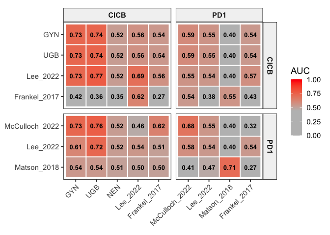
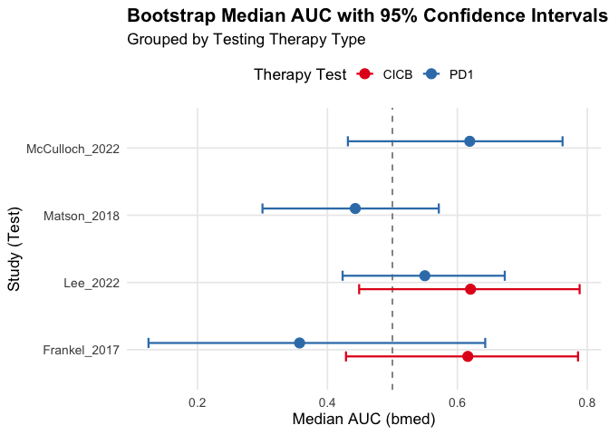
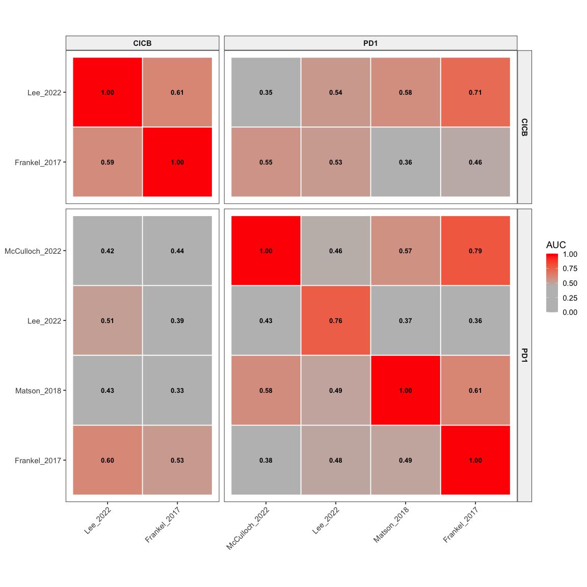
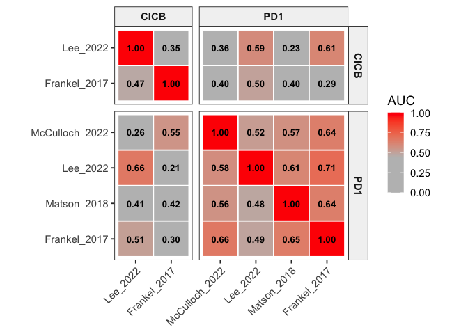
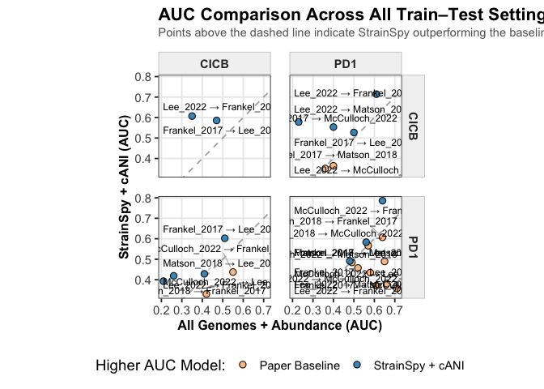
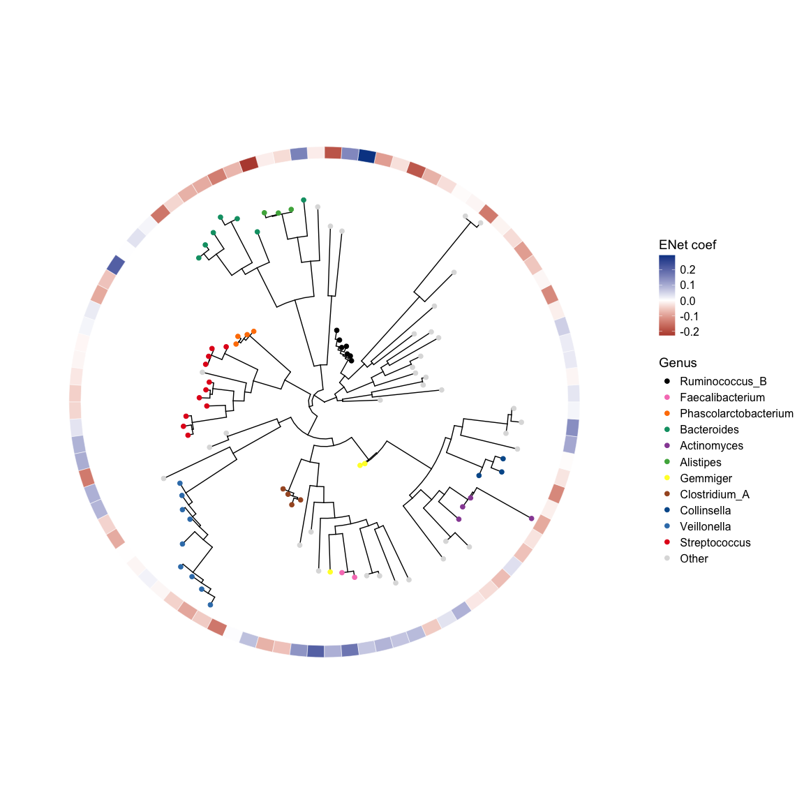
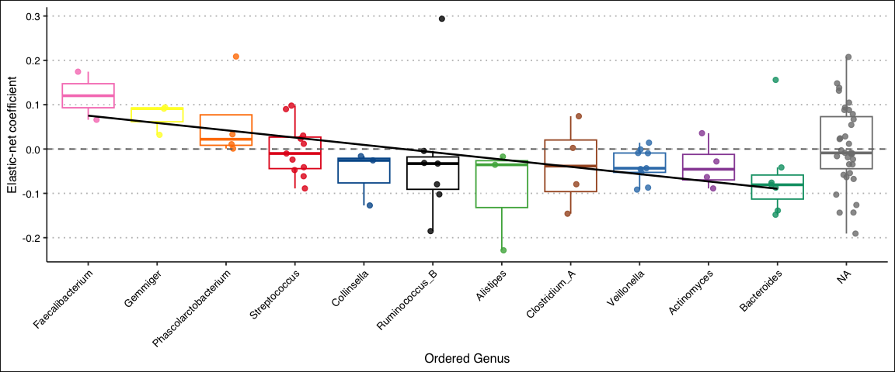

Using gut microbial strains to predict cancer immunotherapy outcomes - a
study in rare cancers and melanoma
================
2026-06-16

## Load dependencies

``` r
library(strainspy)
library(SummarizedExperiment)
library(caret)
library(glmnet) # elastic net
library(ggrepel)
library(ranger) # RF
library(pROC)
library(doParallel)
library(foreach)
library(parallel)
library(ggplot2)
library(tidyr)
library(dplyr)
library(ggtree)
library(ggsci)
```

# Prediction

Instead of building a set of predictors using all genomes found through
assembly, GTDB, etc. we’ll use StrainSpy with GTDB reference and find a
small subset of significant hits in rare cancers and use those strain
ANIs to predict outcomes in Melanoma. This avoids dat lekage and
attempts to recreate Gunjur et al. Fig 4d using a different approach

## Set up some functions

We will be using Elastic net for everything - less resource intensive,
but probably less accurate.

``` r
run_enet <- function(train_idx, test_idx, meta, sy, feature_names, return_fit = F) {
  
  train_mx <- strainspy::prep_for_prediction(
    sy[, train_idx],
    'RvsP',
    feature_names
  )
  
  cl <- makePSOCKcluster(detectCores() - 1)
  registerDoParallel(cl)
  
  set.seed(1988)
  fit <- caret::train(
    RvsP ~ .,
    data = train_mx,
    method = "glmnet",
    preProcess = c("center", "scale"),
    metric = "ROC",
    trControl = caret::trainControl(
      method = "cv",
      classProbs = TRUE,
      summaryFunction = twoClassSummary,
      savePredictions = "final"
    )
  )
  
  if(return_fit) {
    # If return_fit, we only use the test_idx to see if it has both classes
    return(fit)
  }
  
  
  test_mx <- strainspy::prep_for_prediction(
    sy[, test_idx],
    'RvsP',
    feature_names
  )
  
  # Skip if test labels are all one class
  if (length(unique(test_mx$RvsP)) < 2) {
    warning("Test class only has one type of label")
    return(NA)
  }
  
  
  preds <- predict(fit, test_mx, type = "prob")$R
  roc_obj <- roc(test_mx$RvsP, preds, levels = c("NR","R"))
  as.numeric(auc(roc_obj))
}

print_auc <- function(boot_auc, ret = F){
  point_est <- median(boot_auc)
  ci_lower  <- quantile(boot_auc, 0.025)
  ci_upper  <- quantile(boot_auc, 0.975)
  
  cat("AUC =", round(point_est, 3), "[95% CI:", round(ci_lower, 3), "-", round(ci_upper, 3), "]\n")
  
  if(ret){
    return(c(point_est, ci_lower, ci_upper))
  }
}

evaluate_test_set <- function(fit, test_idx, sy, th_filt_names, B = 1000) {
  if (length(test_idx) == 0) return(c(0, 0, 0))
  
  # Prepare data and predict
  test_mx <- strainspy::prep_for_prediction(sy[, test_idx, drop = FALSE], 'RvsP', th_filt_names)
  pred_probs <- predict(fit, test_mx, type = "prob")$R
  
  nr_idx <- which(test_mx$RvsP == "NR")
  r_idx  <- which(test_mx$RvsP == "R")
  
  n_nr <- length(nr_idx)
  n_r  <- length(r_idx)
  
  # Bootstrap loop
  boot_auc <- replicate(B, {
    # Sample from NR and R separately to maintain exact class proportions
    boot_nr <- sample(nr_idx, size = n_nr, replace = TRUE)
    boot_r  <- sample(r_idx,  size = n_r,  replace = TRUE)
    
    # Combine them into our bootstrap index vector
    boot_idx <- c(boot_nr, boot_r)
    
    # Compute AUC cleanly without worrying about class vanishing
    roc_obj <- roc(test_mx$RvsP[boot_idx], pred_probs[boot_idx], 
                   levels = c("NR", "R"), direction = "<", quiet = TRUE)
    as.numeric(auc(roc_obj))
  })
  
  boot_auc <- boot_auc[!is.na(boot_auc)]
  if (length(boot_auc) == 0) return(c(0, 0, 0))
  
  return(print_auc(boot_auc, ret = TRUE)) # Returns c(bmed, lci, uci)
}


make_paper_heatmap = function(Op){
  ggplot(Op, aes(Test, Train, fill = plot_value)) +
    
    geom_tile(color = "white", linewidth = 0.6) +
    
    geom_text(
      aes(label = ifelse(is.na(plot_value), "", sprintf("%.2f", plot_value))),
      size = 3.5,
      fontface = "bold"
    ) +
    
    scale_fill_gradientn(
      colours = c("grey", "grey", "#ff0000"), 
      values = scales::rescale(c(0.2, 0.55, 1)),
      limits = c(0, 1),
      name = "AUC",
      na.value = "black"
    ) +
    
    coord_fixed() +
    
    facet_grid(
      therapy_train ~ therapy_test,
      scales = "free",
      space = "free"
    ) +
    
    
    theme_bw(base_size = 14) +
    
    theme(
      panel.grid = element_blank(),
      axis.title = element_blank(),
      axis.text.x = element_text(angle = 45, hjust = 1),
      strip.background = element_rect(fill = "grey95"),
      strip.text = element_text(face = "bold")
    )
}
```

## Classic cross prediction

``` r
# Load the merged dataset
meta_path <- "./data/ash_pancancer/metadata_full.tsv"
meta_pan <- read.csv(meta_path, sep = '\t') 
meta_pan = cbind(run_acc = meta_pan$run_accession, meta_pan)
# From paper:
# RvsP = CR or PR VS. PD or cPD - excluded patients with a BOR of stable disease (SD) (n=29)

# Outcome
meta_pan$RvsP = "R"
meta_pan$RvsP[which(meta_pan$BOR == "PD" | meta_pan$BOR == "cPD")] = "NR" 
meta_pan$RvsP = factor(meta_pan$RvsP, levels = c("NR", "R"))

# Melanoma meta
meta_m = read.csv("data/melanoma_pooled/meta_melanoma_sm.csv")

meta = rbind(data.frame(X = meta_pan$run_acc, c_type = "RARE", type = meta_pan$histology_cohort.x, therapy_type = "combination", RvsP = meta_pan$RvsP), 
             data.frame(X = meta_m$X, c_type = "MEL", type = meta_m$Study_simplified, therapy_type = meta_m$ICB, RvsP = meta_m$ORR))
meta$therapy_type <- ifelse(meta$therapy_type %in% c("aPD1/aCTLA", "combination"), "CICB", ifelse(meta$therapy_type == "aPD1", "PD1", "other"))
meta$therapy_type[is.na(meta$therapy_type)] = "other" # Get this of the NAs 

sy <- read_sylph("./data/ash_pancancer/merged_pan_melanoma.tsv.gz") # q99)
```

    ## Detected Sylph query output file.

``` r
# annoying renames to match meta V sylph file
colnames(sy) <- gsub("_1", "", colnames(sy))
colData(sy)$Sample_file <- gsub("_1", "", basename(colData(sy)$Sample_file))

# Reorder meta 
meta = meta[match(colnames(sy), meta$X), ]

# Checks before merging metadata
all(colnames(sy) %in% meta$X)
```

    ## [1] TRUE

``` r
all(meta$X %in% colnames(sy))
```

    ## [1] TRUE

``` r
sy = modify_metadata(sy, meta, replace = T)

# Keep only the relevant samples
keep_pan_samples = meta_pan$run_acc[meta_pan$BOR != "SD"]
keep_mela_samples = readLines("data/melanoma_pooled/gunjur_samples.txt")

sy = sy[ , colnames(sy) %in% c(keep_pan_samples, keep_mela_samples)]
sy = filter_by_presence(sy, ceiling(dim(sy)[2]/10))
```

    ## Retained 21063 rows after filtering

``` r
dim(sy)
```

    ## [1] 21063   241

``` r
dset = unique(sy$type)
B = 1000
therapy_types <- c("CICB", "PD1")
design = as.formula('~ RvsP')
Op = data.frame()

for(train_dset_nm in dset){
  for (train_type in therapy_types) {
    
    train_idx <- which(sy$type == train_dset_nm & sy$therapy_type == train_type)
    
    sy_train = sy[, train_idx]
    sy_train = filter_by_presence(sy_train, ceiling(dim(sy_train)[2]/10))
    
    if(length(train_idx) > 20) { # We can train with this
      
      cat("Running strainspy for", train_type, "in", train_dset_nm, "\n")
      
      save_path = paste("output_rds/pred_enet_imm_fit_train_", train_dset_nm, "_",  train_type ,".rds", sep = "")
      if(file.exists(save_path)){
        ZB_fit = readRDS(save_path)
      } else {
        ebp = compute_eb_priors(sy_train, design = design, nthreads = parallel::detectCores(), low_cutoff = 0, high_cutoff = Inf)
        ZB_fit = glmZiBFit(sy_train, design = design, MAP_prior = ebp, nthreads = parallel::detectCores())
        
        saveRDS(ZB_fit, save_path)
      }
      
      # If the model is trained, we can test with it
      
      # Selecting features. If the fit has significant features, use those
      th = top_hits(ZB_fit)
      th = comp_ani_diff_and_posthoc_test(sy_train, ZB_fit, th)
      th = th[is.na(th$Comment),]
      
      if(nrow(th) > 2){
        feature_names = th$Contig_name[1:min(100,nrow(th))] 
      } else { # If we don't have any significant features, let's select a subset
        # cat("No singificant hits for therapy", train_type, "in", train_dset_nm, "\n")
        # next
        th = top_hits(ZB_fit, alpha = 1)[1:150, ] # This is arbitrary
        th = comp_ani_diff_and_posthoc_test(sy_train, ZB_fit, th)
        th = th[is.na(th$Comment),]
      }
      
      
      
      
      
      
      enet_mdl = run_enet(train_idx = train_idx, test_idx = "", sy = sy, meta = meta, return_fit = T, feature_names)
      
      
      for (test_dset_nm in dset) {
        for (test_type in therapy_types) {
          # Determine test indices based on type criteria (preserving your original != 'CICB' logic for 'Other')
          test_idx <- which(sy$type == test_dset_nm & sy$therapy_type == test_type)
          
          # 4. Evaluate metrics
          if (length(test_idx) > 0) {
            cat("Training:", train_dset_nm, ", Therapy:", train_type, " | Testing:", test_dset_nm, ", Therapy:", test_type, "\n")
            tmp <- evaluate_test_set(fit = enet_mdl, test_idx = test_idx, sy = sy, th_filt_names = feature_names, B = B)
            Op <- rbind(Op, data.frame(
              Train         = train_dset_nm,
              Test          = test_dset_nm,
              bmed          = tmp[1],
              lci           = tmp[2],
              uci           = tmp[3],
              therapy_test  = test_type,
              therapy_train = train_type
            ))    
          } else {
            cat("No samples of therapy", test_type, "in", test_dset_nm, "\n")
          }
          
          
        }
      }
      
    } else {
      cat("Not enough samples of therapy", train_type, "in", train_dset_nm, "\n")
      next
    }
    
  }
  
}
```

    ## Retained 17570 rows after filtering
    ## Running strainspy for CICB in GYN 
    ## Found 158 tophits for RvsPR at alpha = 0.05 using holm 
    ##   |                                                                              |                                                                      |   0%  |                                                                              |                                                                      |   1%  |                                                                              |=                                                                     |   1%  |                                                                              |=                                                                     |   2%  |                                                                              |==                                                                    |   3%  |                                                                              |===                                                                   |   4%  |                                                                              |====                                                                  |   5%  |                                                                              |====                                                                  |   6%  |                                                                              |=====                                                                 |   7%  |                                                                              |=====                                                                 |   8%  |                                                                              |======                                                                |   8%  |                                                                              |======                                                                |   9%  |                                                                              |=======                                                               |   9%  |                                                                              |=======                                                               |  10%  |                                                                              |========                                                              |  11%  |                                                                              |========                                                              |  12%  |                                                                              |=========                                                             |  13%  |                                                                              |==========                                                            |  14%  |                                                                              |==========                                                            |  15%  |                                                                              |===========                                                           |  15%  |                                                                              |===========                                                           |  16%  |                                                                              |============                                                          |  16%  |                                                                              |============                                                          |  17%  |                                                                              |============                                                          |  18%  |                                                                              |=============                                                         |  18%  |                                                                              |=============                                                         |  19%  |                                                                              |==============                                                        |  20%  |                                                                              |===============                                                       |  21%  |                                                                              |===============                                                       |  22%  |                                                                              |================                                                      |  22%  |                                                                              |================                                                      |  23%  |                                                                              |=================                                                     |  24%  |                                                                              |=================                                                     |  25%  |                                                                              |==================                                                    |  25%  |                                                                              |==================                                                    |  26%  |                                                                              |===================                                                   |  27%  |                                                                              |===================                                                   |  28%  |                                                                              |====================                                                  |  28%  |                                                                              |====================                                                  |  29%  |                                                                              |=====================                                                 |  30%  |                                                                              |======================                                                |  31%  |                                                                              |======================                                                |  32%  |                                                                              |=======================                                               |  32%  |                                                                              |=======================                                               |  33%  |                                                                              |=======================                                               |  34%  |                                                                              |========================                                              |  34%  |                                                                              |========================                                              |  35%  |                                                                              |=========================                                             |  35%  |                                                                              |=========================                                             |  36%  |                                                                              |==========================                                            |  37%  |                                                                              |===========================                                           |  38%  |                                                                              |===========================                                           |  39%  |                                                                              |============================                                          |  40%  |                                                                              |============================                                          |  41%  |                                                                              |=============================                                         |  41%  |                                                                              |=============================                                         |  42%  |                                                                              |==============================                                        |  42%  |                                                                              |==============================                                        |  43%  |                                                                              |===============================                                       |  44%  |                                                                              |===============================                                       |  45%  |                                                                              |================================                                      |  46%  |                                                                              |=================================                                     |  47%  |                                                                              |==================================                                    |  48%  |                                                                              |==================================                                    |  49%  |                                                                              |===================================                                   |  49%  |                                                                              |===================================                                   |  50%  |                                                                              |===================================                                   |  51%  |                                                                              |====================================                                  |  51%  |                                                                              |====================================                                  |  52%  |                                                                              |=====================================                                 |  53%  |                                                                              |======================================                                |  54%  |                                                                              |=======================================                               |  55%  |                                                                              |=======================================                               |  56%  |                                                                              |========================================                              |  57%  |                                                                              |========================================                              |  58%  |                                                                              |=========================================                             |  58%  |                                                                              |=========================================                             |  59%  |                                                                              |==========================================                            |  59%  |                                                                              |==========================================                            |  60%  |                                                                              |===========================================                           |  61%  |                                                                              |===========================================                           |  62%  |                                                                              |============================================                          |  63%  |                                                                              |=============================================                         |  64%  |                                                                              |=============================================                         |  65%  |                                                                              |==============================================                        |  65%  |                                                                              |==============================================                        |  66%  |                                                                              |===============================================                       |  66%  |                                                                              |===============================================                       |  67%  |                                                                              |===============================================                       |  68%  |                                                                              |================================================                      |  68%  |                                                                              |================================================                      |  69%  |                                                                              |=================================================                     |  70%  |                                                                              |==================================================                    |  71%  |                                                                              |==================================================                    |  72%  |                                                                              |===================================================                   |  72%  |                                                                              |===================================================                   |  73%  |                                                                              |====================================================                  |  74%  |                                                                              |====================================================                  |  75%  |                                                                              |=====================================================                 |  75%  |                                                                              |=====================================================                 |  76%  |                                                                              |======================================================                |  77%  |                                                                              |======================================================                |  78%  |                                                                              |=======================================================               |  78%  |                                                                              |=======================================================               |  79%  |                                                                              |========================================================              |  80%  |                                                                              |=========================================================             |  81%  |                                                                              |=========================================================             |  82%  |                                                                              |==========================================================            |  82%  |                                                                              |==========================================================            |  83%  |                                                                              |==========================================================            |  84%  |                                                                              |===========================================================           |  84%  |                                                                              |===========================================================           |  85%  |                                                                              |============================================================          |  85%  |                                                                              |============================================================          |  86%  |                                                                              |=============================================================         |  87%  |                                                                              |==============================================================        |  88%  |                                                                              |==============================================================        |  89%  |                                                                              |===============================================================       |  90%  |                                                                              |===============================================================       |  91%  |                                                                              |================================================================      |  91%  |                                                                              |================================================================      |  92%  |                                                                              |=================================================================     |  92%  |                                                                              |=================================================================     |  93%  |                                                                              |==================================================================    |  94%  |                                                                              |==================================================================    |  95%  |                                                                              |===================================================================   |  96%  |                                                                              |====================================================================  |  97%  |                                                                              |===================================================================== |  98%  |                                                                              |===================================================================== |  99%  |                                                                              |======================================================================|  99%  |                                                                              |======================================================================| 100%

    ## Prepared data: 27 samples and 5 predictors.

    ## Warning in nominalTrainWorkflow(x = x, y = y, wts = weights, info = trainInfo,
    ## : There were missing values in resampled performance measures.

    ## Training: GYN , Therapy: CICB  | Testing: GYN , Therapy: CICB

    ## Prepared data: 27 samples and 5 predictors.

    ## AUC = 0.728 [95% CI: 0.546 - 0.926 ]
    ## No samples of therapy PD1 in GYN 
    ## Training: GYN , Therapy: CICB  | Testing: UGB , Therapy: CICB

    ## Prepared data: 32 samples and 5 predictors.

    ## AUC = 0.739 [95% CI: 0.579 - 0.908 ]
    ## No samples of therapy PD1 in UGB 
    ## Training: GYN , Therapy: CICB  | Testing: NEN , Therapy: CICB

    ## Prepared data: 18 samples and 5 predictors.

    ## AUC = 0.519 [95% CI: 0.387 - 0.688 ]
    ## No samples of therapy PD1 in NEN 
    ## Training: GYN , Therapy: CICB  | Testing: Lee_2022 , Therapy: CICB

    ## Prepared data: 22 samples and 5 predictors.

    ## AUC = 0.562 [95% CI: 0.298 - 0.806 ]
    ## Training: GYN , Therapy: CICB  | Testing: Lee_2022 , Therapy: PD1

    ## Prepared data: 46 samples and 5 predictors.

    ## AUC = 0.554 [95% CI: 0.374 - 0.696 ]
    ## No samples of therapy CICB in McCulloch_2022 
    ## Training: GYN , Therapy: CICB  | Testing: McCulloch_2022 , Therapy: PD1

    ## Prepared data: 29 samples and 5 predictors.

    ## AUC = 0.589 [95% CI: 0.387 - 0.759 ]
    ## Training: GYN , Therapy: CICB  | Testing: Frankel_2017 , Therapy: CICB

    ## Prepared data: 22 samples and 5 predictors.

    ## AUC = 0.54 [95% CI: 0.321 - 0.719 ]
    ## Training: GYN , Therapy: CICB  | Testing: Frankel_2017 , Therapy: PD1

    ## Prepared data: 11 samples and 5 predictors.

    ## AUC = 0.536 [95% CI: 0.286 - 0.75 ]
    ## No samples of therapy CICB in Matson_2018 
    ## Training: GYN , Therapy: CICB  | Testing: Matson_2018 , Therapy: PD1

    ## Prepared data: 24 samples and 5 predictors.

    ## AUC = 0.4 [95% CI: 0.25 - 0.5 ]
    ## Retained 21063 rows after filtering
    ## Not enough samples of therapy PD1 in GYN 
    ## Retained 18703 rows after filtering
    ## Running strainspy for CICB in UGB 
    ## Found 113 tophits for RvsPR at alpha = 0.05 using holm 
    ##   |                                                                              |                                                                      |   0%  |                                                                              |=                                                                     |   1%  |                                                                              |=                                                                     |   2%  |                                                                              |==                                                                    |   3%  |                                                                              |==                                                                    |   4%  |                                                                              |===                                                                   |   4%  |                                                                              |====                                                                  |   5%  |                                                                              |====                                                                  |   6%  |                                                                              |=====                                                                 |   7%  |                                                                              |======                                                                |   8%  |                                                                              |======                                                                |   9%  |                                                                              |=======                                                               |  10%  |                                                                              |=======                                                               |  11%  |                                                                              |========                                                              |  12%  |                                                                              |=========                                                             |  12%  |                                                                              |=========                                                             |  13%  |                                                                              |==========                                                            |  14%  |                                                                              |===========                                                           |  15%  |                                                                              |===========                                                           |  16%  |                                                                              |============                                                          |  17%  |                                                                              |============                                                          |  18%  |                                                                              |=============                                                         |  19%  |                                                                              |==============                                                        |  19%  |                                                                              |==============                                                        |  20%  |                                                                              |===============                                                       |  21%  |                                                                              |===============                                                       |  22%  |                                                                              |================                                                      |  23%  |                                                                              |=================                                                     |  24%  |                                                                              |=================                                                     |  25%  |                                                                              |==================                                                    |  26%  |                                                                              |===================                                                   |  27%  |                                                                              |====================                                                  |  28%  |                                                                              |====================                                                  |  29%  |                                                                              |=====================                                                 |  30%  |                                                                              |======================                                                |  31%  |                                                                              |======================                                                |  32%  |                                                                              |=======================                                               |  33%  |                                                                              |========================                                              |  34%  |                                                                              |========================                                              |  35%  |                                                                              |=========================                                             |  35%  |                                                                              |=========================                                             |  36%  |                                                                              |==========================                                            |  37%  |                                                                              |===========================                                           |  38%  |                                                                              |===========================                                           |  39%  |                                                                              |============================                                          |  40%  |                                                                              |============================                                          |  41%  |                                                                              |=============================                                         |  42%  |                                                                              |==============================                                        |  42%  |                                                                              |==============================                                        |  43%  |                                                                              |===============================                                       |  44%  |                                                                              |================================                                      |  45%  |                                                                              |================================                                      |  46%  |                                                                              |=================================                                     |  47%  |                                                                              |=================================                                     |  48%  |                                                                              |==================================                                    |  49%  |                                                                              |===================================                                   |  50%  |                                                                              |====================================                                  |  51%  |                                                                              |=====================================                                 |  52%  |                                                                              |=====================================                                 |  53%  |                                                                              |======================================                                |  54%  |                                                                              |======================================                                |  55%  |                                                                              |=======================================                               |  56%  |                                                                              |========================================                              |  57%  |                                                                              |========================================                              |  58%  |                                                                              |=========================================                             |  58%  |                                                                              |==========================================                            |  59%  |                                                                              |==========================================                            |  60%  |                                                                              |===========================================                           |  61%  |                                                                              |===========================================                           |  62%  |                                                                              |============================================                          |  63%  |                                                                              |=============================================                         |  64%  |                                                                              |=============================================                         |  65%  |                                                                              |==============================================                        |  65%  |                                                                              |==============================================                        |  66%  |                                                                              |===============================================                       |  67%  |                                                                              |================================================                      |  68%  |                                                                              |================================================                      |  69%  |                                                                              |=================================================                     |  70%  |                                                                              |==================================================                    |  71%  |                                                                              |==================================================                    |  72%  |                                                                              |===================================================                   |  73%  |                                                                              |====================================================                  |  74%  |                                                                              |=====================================================                 |  75%  |                                                                              |=====================================================                 |  76%  |                                                                              |======================================================                |  77%  |                                                                              |=======================================================               |  78%  |                                                                              |=======================================================               |  79%  |                                                                              |========================================================              |  80%  |                                                                              |========================================================              |  81%  |                                                                              |=========================================================             |  81%  |                                                                              |==========================================================            |  82%  |                                                                              |==========================================================            |  83%  |                                                                              |===========================================================           |  84%  |                                                                              |===========================================================           |  85%  |                                                                              |============================================================          |  86%  |                                                                              |=============================================================         |  87%  |                                                                              |=============================================================         |  88%  |                                                                              |==============================================================        |  88%  |                                                                              |===============================================================       |  89%  |                                                                              |===============================================================       |  90%  |                                                                              |================================================================      |  91%  |                                                                              |================================================================      |  92%  |                                                                              |=================================================================     |  93%  |                                                                              |==================================================================    |  94%  |                                                                              |==================================================================    |  95%  |                                                                              |===================================================================   |  96%  |                                                                              |====================================================================  |  96%  |                                                                              |====================================================================  |  97%  |                                                                              |===================================================================== |  98%  |                                                                              |===================================================================== |  99%  |                                                                              |======================================================================| 100%
    ## 
    ## Found 18703 tophits for RvsPR at alpha = 1 using holm 
    ##   |                                                                              |                                                                      |   0%  |                                                                              |                                                                      |   1%  |                                                                              |=                                                                     |   1%  |                                                                              |=                                                                     |   2%  |                                                                              |==                                                                    |   3%  |                                                                              |===                                                                   |   4%  |                                                                              |===                                                                   |   5%  |                                                                              |====                                                                  |   5%  |                                                                              |====                                                                  |   6%  |                                                                              |=====                                                                 |   7%  |                                                                              |======                                                                |   8%  |                                                                              |======                                                                |   9%  |                                                                              |=======                                                               |   9%  |                                                                              |=======                                                               |  10%  |                                                                              |=======                                                               |  11%  |                                                                              |========                                                              |  11%  |                                                                              |========                                                              |  12%  |                                                                              |=========                                                             |  13%  |                                                                              |==========                                                            |  14%  |                                                                              |==========                                                            |  15%  |                                                                              |===========                                                           |  15%  |                                                                              |===========                                                           |  16%  |                                                                              |============                                                          |  17%  |                                                                              |=============                                                         |  18%  |                                                                              |=============                                                         |  19%  |                                                                              |==============                                                        |  19%  |                                                                              |==============                                                        |  20%  |                                                                              |==============                                                        |  21%  |                                                                              |===============                                                       |  21%  |                                                                              |===============                                                       |  22%  |                                                                              |================                                                      |  23%  |                                                                              |=================                                                     |  24%  |                                                                              |=================                                                     |  25%  |                                                                              |==================                                                    |  25%  |                                                                              |==================                                                    |  26%  |                                                                              |===================                                                   |  27%  |                                                                              |====================                                                  |  28%  |                                                                              |====================                                                  |  29%  |                                                                              |=====================                                                 |  29%  |                                                                              |=====================                                                 |  30%  |                                                                              |=====================                                                 |  31%  |                                                                              |======================                                                |  31%  |                                                                              |======================                                                |  32%  |                                                                              |=======================                                               |  33%  |                                                                              |========================                                              |  34%  |                                                                              |========================                                              |  35%  |                                                                              |=========================                                             |  35%  |                                                                              |=========================                                             |  36%  |                                                                              |==========================                                            |  37%  |                                                                              |===========================                                           |  38%  |                                                                              |===========================                                           |  39%  |                                                                              |============================                                          |  39%  |                                                                              |============================                                          |  40%  |                                                                              |============================                                          |  41%  |                                                                              |=============================                                         |  41%  |                                                                              |=============================                                         |  42%  |                                                                              |==============================                                        |  43%  |                                                                              |===============================                                       |  44%  |                                                                              |===============================                                       |  45%  |                                                                              |================================                                      |  45%  |                                                                              |================================                                      |  46%  |                                                                              |=================================                                     |  47%  |                                                                              |==================================                                    |  48%  |                                                                              |==================================                                    |  49%  |                                                                              |===================================                                   |  49%  |                                                                              |===================================                                   |  50%  |                                                                              |===================================                                   |  51%  |                                                                              |====================================                                  |  51%  |                                                                              |====================================                                  |  52%  |                                                                              |=====================================                                 |  53%  |                                                                              |======================================                                |  54%  |                                                                              |======================================                                |  55%  |                                                                              |=======================================                               |  55%  |                                                                              |=======================================                               |  56%  |                                                                              |========================================                              |  57%  |                                                                              |=========================================                             |  58%  |                                                                              |=========================================                             |  59%  |                                                                              |==========================================                            |  59%  |                                                                              |==========================================                            |  60%  |                                                                              |==========================================                            |  61%  |                                                                              |===========================================                           |  61%  |                                                                              |===========================================                           |  62%  |                                                                              |============================================                          |  63%  |                                                                              |=============================================                         |  64%  |                                                                              |=============================================                         |  65%  |                                                                              |==============================================                        |  65%  |                                                                              |==============================================                        |  66%  |                                                                              |===============================================                       |  67%  |                                                                              |================================================                      |  68%  |                                                                              |================================================                      |  69%  |                                                                              |=================================================                     |  69%  |                                                                              |=================================================                     |  70%  |                                                                              |=================================================                     |  71%  |                                                                              |==================================================                    |  71%  |                                                                              |==================================================                    |  72%  |                                                                              |===================================================                   |  73%  |                                                                              |====================================================                  |  74%  |                                                                              |====================================================                  |  75%  |                                                                              |=====================================================                 |  75%  |                                                                              |=====================================================                 |  76%  |                                                                              |======================================================                |  77%  |                                                                              |=======================================================               |  78%  |                                                                              |=======================================================               |  79%  |                                                                              |========================================================              |  79%  |                                                                              |========================================================              |  80%  |                                                                              |========================================================              |  81%  |                                                                              |=========================================================             |  81%  |                                                                              |=========================================================             |  82%  |                                                                              |==========================================================            |  83%  |                                                                              |===========================================================           |  84%  |                                                                              |===========================================================           |  85%  |                                                                              |============================================================          |  85%  |                                                                              |============================================================          |  86%  |                                                                              |=============================================================         |  87%  |                                                                              |==============================================================        |  88%  |                                                                              |==============================================================        |  89%  |                                                                              |===============================================================       |  89%  |                                                                              |===============================================================       |  90%  |                                                                              |===============================================================       |  91%  |                                                                              |================================================================      |  91%  |                                                                              |================================================================      |  92%  |                                                                              |=================================================================     |  93%  |                                                                              |==================================================================    |  94%  |                                                                              |==================================================================    |  95%  |                                                                              |===================================================================   |  95%  |                                                                              |===================================================================   |  96%  |                                                                              |====================================================================  |  97%  |                                                                              |===================================================================== |  98%  |                                                                              |===================================================================== |  99%  |                                                                              |======================================================================|  99%  |                                                                              |======================================================================| 100%

    ## Prepared data: 32 samples and 5 predictors.

    ## Warning in nominalTrainWorkflow(x = x, y = y, wts = weights, info = trainInfo,
    ## : There were missing values in resampled performance measures.

    ## Training: UGB , Therapy: CICB  | Testing: GYN , Therapy: CICB

    ## Prepared data: 27 samples and 5 predictors.

    ## AUC = 0.728 [95% CI: 0.546 - 0.926 ]
    ## No samples of therapy PD1 in GYN 
    ## Training: UGB , Therapy: CICB  | Testing: UGB , Therapy: CICB

    ## Prepared data: 32 samples and 5 predictors.

    ## AUC = 0.739 [95% CI: 0.579 - 0.908 ]
    ## No samples of therapy PD1 in UGB 
    ## Training: UGB , Therapy: CICB  | Testing: NEN , Therapy: CICB

    ## Prepared data: 18 samples and 5 predictors.

    ## AUC = 0.519 [95% CI: 0.387 - 0.688 ]
    ## No samples of therapy PD1 in NEN 
    ## Training: UGB , Therapy: CICB  | Testing: Lee_2022 , Therapy: CICB

    ## Prepared data: 22 samples and 5 predictors.

    ## AUC = 0.562 [95% CI: 0.298 - 0.806 ]
    ## Training: UGB , Therapy: CICB  | Testing: Lee_2022 , Therapy: PD1

    ## Prepared data: 46 samples and 5 predictors.

    ## AUC = 0.551 [95% CI: 0.366 - 0.691 ]
    ## No samples of therapy CICB in McCulloch_2022 
    ## Training: UGB , Therapy: CICB  | Testing: McCulloch_2022 , Therapy: PD1

    ## Prepared data: 29 samples and 5 predictors.

    ## AUC = 0.589 [95% CI: 0.387 - 0.759 ]
    ## Training: UGB , Therapy: CICB  | Testing: Frankel_2017 , Therapy: CICB

    ## Prepared data: 22 samples and 5 predictors.

    ## AUC = 0.54 [95% CI: 0.321 - 0.719 ]
    ## Training: UGB , Therapy: CICB  | Testing: Frankel_2017 , Therapy: PD1

    ## Prepared data: 11 samples and 5 predictors.

    ## AUC = 0.536 [95% CI: 0.286 - 0.75 ]
    ## No samples of therapy CICB in Matson_2018 
    ## Training: UGB , Therapy: CICB  | Testing: Matson_2018 , Therapy: PD1

    ## Prepared data: 24 samples and 5 predictors.

    ## AUC = 0.4 [95% CI: 0.25 - 0.5 ]
    ## Retained 21063 rows after filtering
    ## Not enough samples of therapy PD1 in UGB 
    ## Retained 17856 rows after filtering
    ## Not enough samples of therapy CICB in NEN 
    ## Retained 21063 rows after filtering
    ## Not enough samples of therapy PD1 in NEN 
    ## Retained 20056 rows after filtering
    ## Running strainspy for CICB in Lee_2022 
    ## Found 162 tophits for RvsPR at alpha = 0.05 using holm 
    ##   |                                                                              |                                                                      |   0%  |                                                                              |                                                                      |   1%  |                                                                              |=                                                                     |   1%  |                                                                              |=                                                                     |   2%  |                                                                              |==                                                                    |   2%  |                                                                              |==                                                                    |   3%  |                                                                              |===                                                                   |   4%  |                                                                              |===                                                                   |   5%  |                                                                              |====                                                                  |   6%  |                                                                              |=====                                                                 |   7%  |                                                                              |======                                                                |   8%  |                                                                              |======                                                                |   9%  |                                                                              |=======                                                               |  10%  |                                                                              |========                                                              |  11%  |                                                                              |========                                                              |  12%  |                                                                              |=========                                                             |  12%  |                                                                              |=========                                                             |  13%  |                                                                              |==========                                                            |  14%  |                                                                              |==========                                                            |  15%  |                                                                              |===========                                                           |  15%  |                                                                              |===========                                                           |  16%  |                                                                              |============                                                          |  17%  |                                                                              |=============                                                         |  18%  |                                                                              |=============                                                         |  19%  |                                                                              |==============                                                        |  20%  |                                                                              |===============                                                       |  21%  |                                                                              |===============                                                       |  22%  |                                                                              |================                                                      |  22%  |                                                                              |================                                                      |  23%  |                                                                              |=================                                                     |  24%  |                                                                              |=================                                                     |  25%  |                                                                              |==================                                                    |  25%  |                                                                              |==================                                                    |  26%  |                                                                              |===================                                                   |  27%  |                                                                              |===================                                                   |  28%  |                                                                              |====================                                                  |  28%  |                                                                              |====================                                                  |  29%  |                                                                              |=====================                                                 |  30%  |                                                                              |======================                                                |  31%  |                                                                              |======================                                                |  32%  |                                                                              |=======================                                               |  33%  |                                                                              |========================                                              |  34%  |                                                                              |========================                                              |  35%  |                                                                              |=========================                                             |  35%  |                                                                              |=========================                                             |  36%  |                                                                              |==========================                                            |  37%  |                                                                              |==========================                                            |  38%  |                                                                              |===========================                                           |  38%  |                                                                              |===========================                                           |  39%  |                                                                              |============================                                          |  40%  |                                                                              |=============================                                         |  41%  |                                                                              |=============================                                         |  42%  |                                                                              |==============================                                        |  43%  |                                                                              |===============================                                       |  44%  |                                                                              |================================                                      |  45%  |                                                                              |================================                                      |  46%  |                                                                              |=================================                                     |  47%  |                                                                              |=================================                                     |  48%  |                                                                              |==================================                                    |  48%  |                                                                              |==================================                                    |  49%  |                                                                              |===================================                                   |  49%  |                                                                              |===================================                                   |  50%  |                                                                              |===================================                                   |  51%  |                                                                              |====================================                                  |  51%  |                                                                              |====================================                                  |  52%  |                                                                              |=====================================                                 |  52%  |                                                                              |=====================================                                 |  53%  |                                                                              |======================================                                |  54%  |                                                                              |======================================                                |  55%  |                                                                              |=======================================                               |  56%  |                                                                              |========================================                              |  57%  |                                                                              |=========================================                             |  58%  |                                                                              |=========================================                             |  59%  |                                                                              |==========================================                            |  60%  |                                                                              |===========================================                           |  61%  |                                                                              |===========================================                           |  62%  |                                                                              |============================================                          |  62%  |                                                                              |============================================                          |  63%  |                                                                              |=============================================                         |  64%  |                                                                              |=============================================                         |  65%  |                                                                              |==============================================                        |  65%  |                                                                              |==============================================                        |  66%  |                                                                              |===============================================                       |  67%  |                                                                              |================================================                      |  68%  |                                                                              |================================================                      |  69%  |                                                                              |=================================================                     |  70%  |                                                                              |==================================================                    |  71%  |                                                                              |==================================================                    |  72%  |                                                                              |===================================================                   |  72%  |                                                                              |===================================================                   |  73%  |                                                                              |====================================================                  |  74%  |                                                                              |====================================================                  |  75%  |                                                                              |=====================================================                 |  75%  |                                                                              |=====================================================                 |  76%  |                                                                              |======================================================                |  77%  |                                                                              |======================================================                |  78%  |                                                                              |=======================================================               |  78%  |                                                                              |=======================================================               |  79%  |                                                                              |========================================================              |  80%  |                                                                              |=========================================================             |  81%  |                                                                              |=========================================================             |  82%  |                                                                              |==========================================================            |  83%  |                                                                              |===========================================================           |  84%  |                                                                              |===========================================================           |  85%  |                                                                              |============================================================          |  85%  |                                                                              |============================================================          |  86%  |                                                                              |=============================================================         |  87%  |                                                                              |=============================================================         |  88%  |                                                                              |==============================================================        |  88%  |                                                                              |==============================================================        |  89%  |                                                                              |===============================================================       |  90%  |                                                                              |================================================================      |  91%  |                                                                              |================================================================      |  92%  |                                                                              |=================================================================     |  93%  |                                                                              |==================================================================    |  94%  |                                                                              |===================================================================   |  95%  |                                                                              |===================================================================   |  96%  |                                                                              |====================================================================  |  97%  |                                                                              |====================================================================  |  98%  |                                                                              |===================================================================== |  98%  |                                                                              |===================================================================== |  99%  |                                                                              |======================================================================|  99%  |                                                                              |======================================================================| 100%
    ## 
    ## Found 20056 tophits for RvsPR at alpha = 1 using holm 
    ##   |                                                                              |                                                                      |   0%  |                                                                              |                                                                      |   1%  |                                                                              |=                                                                     |   1%  |                                                                              |=                                                                     |   2%  |                                                                              |==                                                                    |   3%  |                                                                              |===                                                                   |   4%  |                                                                              |===                                                                   |   5%  |                                                                              |====                                                                  |   5%  |                                                                              |====                                                                  |   6%  |                                                                              |=====                                                                 |   7%  |                                                                              |======                                                                |   8%  |                                                                              |======                                                                |   9%  |                                                                              |=======                                                               |   9%  |                                                                              |=======                                                               |  10%  |                                                                              |=======                                                               |  11%  |                                                                              |========                                                              |  11%  |                                                                              |========                                                              |  12%  |                                                                              |=========                                                             |  13%  |                                                                              |==========                                                            |  14%  |                                                                              |==========                                                            |  15%  |                                                                              |===========                                                           |  15%  |                                                                              |===========                                                           |  16%  |                                                                              |============                                                          |  17%  |                                                                              |=============                                                         |  18%  |                                                                              |=============                                                         |  19%  |                                                                              |==============                                                        |  19%  |                                                                              |==============                                                        |  20%  |                                                                              |==============                                                        |  21%  |                                                                              |===============                                                       |  21%  |                                                                              |===============                                                       |  22%  |                                                                              |================                                                      |  23%  |                                                                              |=================                                                     |  24%  |                                                                              |=================                                                     |  25%  |                                                                              |==================                                                    |  25%  |                                                                              |==================                                                    |  26%  |                                                                              |===================                                                   |  27%  |                                                                              |====================                                                  |  28%  |                                                                              |====================                                                  |  29%  |                                                                              |=====================                                                 |  29%  |                                                                              |=====================                                                 |  30%  |                                                                              |=====================                                                 |  31%  |                                                                              |======================                                                |  31%  |                                                                              |======================                                                |  32%  |                                                                              |=======================                                               |  33%  |                                                                              |========================                                              |  34%  |                                                                              |========================                                              |  35%  |                                                                              |=========================                                             |  35%  |                                                                              |=========================                                             |  36%  |                                                                              |==========================                                            |  37%  |                                                                              |===========================                                           |  38%  |                                                                              |===========================                                           |  39%  |                                                                              |============================                                          |  39%  |                                                                              |============================                                          |  40%  |                                                                              |============================                                          |  41%  |                                                                              |=============================                                         |  41%  |                                                                              |=============================                                         |  42%  |                                                                              |==============================                                        |  43%  |                                                                              |===============================                                       |  44%  |                                                                              |===============================                                       |  45%  |                                                                              |================================                                      |  45%  |                                                                              |================================                                      |  46%  |                                                                              |=================================                                     |  47%  |                                                                              |==================================                                    |  48%  |                                                                              |==================================                                    |  49%  |                                                                              |===================================                                   |  49%  |                                                                              |===================================                                   |  50%  |                                                                              |===================================                                   |  51%  |                                                                              |====================================                                  |  51%  |                                                                              |====================================                                  |  52%  |                                                                              |=====================================                                 |  53%  |                                                                              |======================================                                |  54%  |                                                                              |======================================                                |  55%  |                                                                              |=======================================                               |  55%  |                                                                              |=======================================                               |  56%  |                                                                              |========================================                              |  57%  |                                                                              |=========================================                             |  58%  |                                                                              |=========================================                             |  59%  |                                                                              |==========================================                            |  59%  |                                                                              |==========================================                            |  60%  |                                                                              |==========================================                            |  61%  |                                                                              |===========================================                           |  61%  |                                                                              |===========================================                           |  62%  |                                                                              |============================================                          |  63%  |                                                                              |=============================================                         |  64%  |                                                                              |=============================================                         |  65%  |                                                                              |==============================================                        |  65%  |                                                                              |==============================================                        |  66%  |                                                                              |===============================================                       |  67%  |                                                                              |================================================                      |  68%  |                                                                              |================================================                      |  69%  |                                                                              |=================================================                     |  69%  |                                                                              |=================================================                     |  70%  |                                                                              |=================================================                     |  71%  |                                                                              |==================================================                    |  71%  |                                                                              |==================================================                    |  72%  |                                                                              |===================================================                   |  73%  |                                                                              |====================================================                  |  74%  |                                                                              |====================================================                  |  75%  |                                                                              |=====================================================                 |  75%  |                                                                              |=====================================================                 |  76%  |                                                                              |======================================================                |  77%  |                                                                              |=======================================================               |  78%  |                                                                              |=======================================================               |  79%  |                                                                              |========================================================              |  79%  |                                                                              |========================================================              |  80%  |                                                                              |========================================================              |  81%  |                                                                              |=========================================================             |  81%  |                                                                              |=========================================================             |  82%  |                                                                              |==========================================================            |  83%  |                                                                              |===========================================================           |  84%  |                                                                              |===========================================================           |  85%  |                                                                              |============================================================          |  85%  |                                                                              |============================================================          |  86%  |                                                                              |=============================================================         |  87%  |                                                                              |==============================================================        |  88%  |                                                                              |==============================================================        |  89%  |                                                                              |===============================================================       |  89%  |                                                                              |===============================================================       |  90%  |                                                                              |===============================================================       |  91%  |                                                                              |================================================================      |  91%  |                                                                              |================================================================      |  92%  |                                                                              |=================================================================     |  93%  |                                                                              |==================================================================    |  94%  |                                                                              |==================================================================    |  95%  |                                                                              |===================================================================   |  95%  |                                                                              |===================================================================   |  96%  |                                                                              |====================================================================  |  97%  |                                                                              |===================================================================== |  98%  |                                                                              |===================================================================== |  99%  |                                                                              |======================================================================|  99%  |                                                                              |======================================================================| 100%

    ## Prepared data: 22 samples and 5 predictors.

    ## Training: Lee_2022 , Therapy: CICB  | Testing: GYN , Therapy: CICB

    ## Prepared data: 27 samples and 5 predictors.

    ## AUC = 0.728 [95% CI: 0.546 - 0.926 ]
    ## No samples of therapy PD1 in GYN 
    ## Training: Lee_2022 , Therapy: CICB  | Testing: UGB , Therapy: CICB

    ## Prepared data: 32 samples and 5 predictors.

    ## AUC = 0.768 [95% CI: 0.594 - 0.942 ]
    ## No samples of therapy PD1 in UGB 
    ## Training: Lee_2022 , Therapy: CICB  | Testing: NEN , Therapy: CICB

    ## Prepared data: 18 samples and 5 predictors.

    ## AUC = 0.519 [95% CI: 0.387 - 0.688 ]
    ## No samples of therapy PD1 in NEN 
    ## Training: Lee_2022 , Therapy: CICB  | Testing: Lee_2022 , Therapy: CICB

    ## Prepared data: 22 samples and 5 predictors.

    ## AUC = 0.694 [95% CI: 0.438 - 0.897 ]
    ## Training: Lee_2022 , Therapy: CICB  | Testing: Lee_2022 , Therapy: PD1

    ## Prepared data: 46 samples and 5 predictors.

    ## AUC = 0.544 [95% CI: 0.372 - 0.699 ]
    ## No samples of therapy CICB in McCulloch_2022 
    ## Training: Lee_2022 , Therapy: CICB  | Testing: McCulloch_2022 , Therapy: PD1

    ## Prepared data: 29 samples and 5 predictors.

    ## AUC = 0.554 [95% CI: 0.321 - 0.738 ]
    ## Training: Lee_2022 , Therapy: CICB  | Testing: Frankel_2017 , Therapy: CICB

    ## Prepared data: 22 samples and 5 predictors.

    ## AUC = 0.562 [95% CI: 0.357 - 0.75 ]
    ## Training: Lee_2022 , Therapy: CICB  | Testing: Frankel_2017 , Therapy: PD1

    ## Prepared data: 11 samples and 5 predictors.

    ## AUC = 0.571 [95% CI: 0.357 - 0.857 ]
    ## No samples of therapy CICB in Matson_2018 
    ## Training: Lee_2022 , Therapy: CICB  | Testing: Matson_2018 , Therapy: PD1

    ## Prepared data: 24 samples and 5 predictors.

    ## AUC = 0.4 [95% CI: 0.25 - 0.5 ]
    ## Retained 20380 rows after filtering
    ## Running strainspy for PD1 in Lee_2022 
    ## Found 38 tophits for RvsPR at alpha = 0.05 using holm 
    ##   |                                                                              |                                                                      |   0%  |                                                                              |==                                                                    |   3%  |                                                                              |====                                                                  |   5%  |                                                                              |======                                                                |   8%  |                                                                              |=======                                                               |  11%  |                                                                              |=========                                                             |  13%  |                                                                              |===========                                                           |  16%  |                                                                              |=============                                                         |  18%  |                                                                              |===============                                                       |  21%  |                                                                              |=================                                                     |  24%  |                                                                              |==================                                                    |  26%  |                                                                              |====================                                                  |  29%  |                                                                              |======================                                                |  32%  |                                                                              |========================                                              |  34%  |                                                                              |==========================                                            |  37%  |                                                                              |============================                                          |  39%  |                                                                              |=============================                                         |  42%  |                                                                              |===============================                                       |  45%  |                                                                              |=================================                                     |  47%  |                                                                              |===================================                                   |  50%  |                                                                              |=====================================                                 |  53%  |                                                                              |=======================================                               |  55%  |                                                                              |=========================================                             |  58%  |                                                                              |==========================================                            |  61%  |                                                                              |============================================                          |  63%  |                                                                              |==============================================                        |  66%  |                                                                              |================================================                      |  68%  |                                                                              |==================================================                    |  71%  |                                                                              |====================================================                  |  74%  |                                                                              |=====================================================                 |  76%  |                                                                              |=======================================================               |  79%  |                                                                              |=========================================================             |  82%  |                                                                              |===========================================================           |  84%  |                                                                              |=============================================================         |  87%  |                                                                              |===============================================================       |  89%  |                                                                              |================================================================      |  92%  |                                                                              |==================================================================    |  95%  |                                                                              |====================================================================  |  97%  |                                                                              |======================================================================| 100%
    ## 
    ## Found 20380 tophits for RvsPR at alpha = 1 using holm 
    ##   |                                                                              |                                                                      |   0%  |                                                                              |                                                                      |   1%  |                                                                              |=                                                                     |   1%  |                                                                              |=                                                                     |   2%  |                                                                              |==                                                                    |   3%  |                                                                              |===                                                                   |   4%  |                                                                              |===                                                                   |   5%  |                                                                              |====                                                                  |   5%  |                                                                              |====                                                                  |   6%  |                                                                              |=====                                                                 |   7%  |                                                                              |======                                                                |   8%  |                                                                              |======                                                                |   9%  |                                                                              |=======                                                               |   9%  |                                                                              |=======                                                               |  10%  |                                                                              |=======                                                               |  11%  |                                                                              |========                                                              |  11%  |                                                                              |========                                                              |  12%  |                                                                              |=========                                                             |  13%  |                                                                              |==========                                                            |  14%  |                                                                              |==========                                                            |  15%  |                                                                              |===========                                                           |  15%  |                                                                              |===========                                                           |  16%  |                                                                              |============                                                          |  17%  |                                                                              |=============                                                         |  18%  |                                                                              |=============                                                         |  19%  |                                                                              |==============                                                        |  19%  |                                                                              |==============                                                        |  20%  |                                                                              |==============                                                        |  21%  |                                                                              |===============                                                       |  21%  |                                                                              |===============                                                       |  22%  |                                                                              |================                                                      |  23%  |                                                                              |=================                                                     |  24%  |                                                                              |=================                                                     |  25%  |                                                                              |==================                                                    |  25%  |                                                                              |==================                                                    |  26%  |                                                                              |===================                                                   |  27%  |                                                                              |====================                                                  |  28%  |                                                                              |====================                                                  |  29%  |                                                                              |=====================                                                 |  29%  |                                                                              |=====================                                                 |  30%  |                                                                              |=====================                                                 |  31%  |                                                                              |======================                                                |  31%  |                                                                              |======================                                                |  32%  |                                                                              |=======================                                               |  33%  |                                                                              |========================                                              |  34%  |                                                                              |========================                                              |  35%  |                                                                              |=========================                                             |  35%  |                                                                              |=========================                                             |  36%  |                                                                              |==========================                                            |  37%  |                                                                              |===========================                                           |  38%  |                                                                              |===========================                                           |  39%  |                                                                              |============================                                          |  39%  |                                                                              |============================                                          |  40%  |                                                                              |============================                                          |  41%  |                                                                              |=============================                                         |  41%  |                                                                              |=============================                                         |  42%  |                                                                              |==============================                                        |  43%  |                                                                              |===============================                                       |  44%  |                                                                              |===============================                                       |  45%  |                                                                              |================================                                      |  45%  |                                                                              |================================                                      |  46%  |                                                                              |=================================                                     |  47%  |                                                                              |==================================                                    |  48%  |                                                                              |==================================                                    |  49%  |                                                                              |===================================                                   |  49%  |                                                                              |===================================                                   |  50%  |                                                                              |===================================                                   |  51%  |                                                                              |====================================                                  |  51%  |                                                                              |====================================                                  |  52%  |                                                                              |=====================================                                 |  53%  |                                                                              |======================================                                |  54%  |                                                                              |======================================                                |  55%  |                                                                              |=======================================                               |  55%  |                                                                              |=======================================                               |  56%  |                                                                              |========================================                              |  57%  |                                                                              |=========================================                             |  58%  |                                                                              |=========================================                             |  59%  |                                                                              |==========================================                            |  59%  |                                                                              |==========================================                            |  60%  |                                                                              |==========================================                            |  61%  |                                                                              |===========================================                           |  61%  |                                                                              |===========================================                           |  62%  |                                                                              |============================================                          |  63%  |                                                                              |=============================================                         |  64%  |                                                                              |=============================================                         |  65%  |                                                                              |==============================================                        |  65%  |                                                                              |==============================================                        |  66%  |                                                                              |===============================================                       |  67%  |                                                                              |================================================                      |  68%  |                                                                              |================================================                      |  69%  |                                                                              |=================================================                     |  69%  |                                                                              |=================================================                     |  70%  |                                                                              |=================================================                     |  71%  |                                                                              |==================================================                    |  71%  |                                                                              |==================================================                    |  72%  |                                                                              |===================================================                   |  73%  |                                                                              |====================================================                  |  74%  |                                                                              |====================================================                  |  75%  |                                                                              |=====================================================                 |  75%  |                                                                              |=====================================================                 |  76%  |                                                                              |======================================================                |  77%  |                                                                              |=======================================================               |  78%  |                                                                              |=======================================================               |  79%  |                                                                              |========================================================              |  79%  |                                                                              |========================================================              |  80%  |                                                                              |========================================================              |  81%  |                                                                              |=========================================================             |  81%  |                                                                              |=========================================================             |  82%  |                                                                              |==========================================================            |  83%  |                                                                              |===========================================================           |  84%  |                                                                              |===========================================================           |  85%  |                                                                              |============================================================          |  85%  |                                                                              |============================================================          |  86%  |                                                                              |=============================================================         |  87%  |                                                                              |==============================================================        |  88%  |                                                                              |==============================================================        |  89%  |                                                                              |===============================================================       |  89%  |                                                                              |===============================================================       |  90%  |                                                                              |===============================================================       |  91%  |                                                                              |================================================================      |  91%  |                                                                              |================================================================      |  92%  |                                                                              |=================================================================     |  93%  |                                                                              |==================================================================    |  94%  |                                                                              |==================================================================    |  95%  |                                                                              |===================================================================   |  95%  |                                                                              |===================================================================   |  96%  |                                                                              |====================================================================  |  97%  |                                                                              |===================================================================== |  98%  |                                                                              |===================================================================== |  99%  |                                                                              |======================================================================|  99%  |                                                                              |======================================================================| 100%

    ## Prepared data: 46 samples and 5 predictors.

    ## Training: Lee_2022 , Therapy: PD1  | Testing: GYN , Therapy: CICB

    ## Prepared data: 27 samples and 5 predictors.

    ## AUC = 0.608 [95% CI: 0.444 - 0.79 ]
    ## No samples of therapy PD1 in GYN 
    ## Training: Lee_2022 , Therapy: PD1  | Testing: UGB , Therapy: CICB

    ## Prepared data: 32 samples and 5 predictors.

    ## AUC = 0.725 [95% CI: 0.565 - 0.903 ]
    ## No samples of therapy PD1 in UGB 
    ## Training: Lee_2022 , Therapy: PD1  | Testing: NEN , Therapy: CICB

    ## Prepared data: 18 samples and 5 predictors.

    ## AUC = 0.519 [95% CI: 0.387 - 0.688 ]
    ## No samples of therapy PD1 in NEN 
    ## Training: Lee_2022 , Therapy: PD1  | Testing: Lee_2022 , Therapy: CICB

    ## Prepared data: 22 samples and 5 predictors.

    ## AUC = 0.541 [95% CI: 0.281 - 0.789 ]
    ## Training: Lee_2022 , Therapy: PD1  | Testing: Lee_2022 , Therapy: PD1

    ## Prepared data: 46 samples and 5 predictors.

    ## AUC = 0.535 [95% CI: 0.361 - 0.688 ]
    ## No samples of therapy CICB in McCulloch_2022 
    ## Training: Lee_2022 , Therapy: PD1  | Testing: McCulloch_2022 , Therapy: PD1

    ## Prepared data: 29 samples and 5 predictors.

    ## AUC = 0.577 [95% CI: 0.375 - 0.741 ]
    ## Training: Lee_2022 , Therapy: PD1  | Testing: Frankel_2017 , Therapy: CICB

    ## Prepared data: 22 samples and 5 predictors.

    ## AUC = 0.509 [95% CI: 0.304 - 0.688 ]
    ## Training: Lee_2022 , Therapy: PD1  | Testing: Frankel_2017 , Therapy: PD1

    ## Prepared data: 11 samples and 5 predictors.

    ## AUC = 0.536 [95% CI: 0.286 - 0.75 ]
    ## No samples of therapy CICB in Matson_2018 
    ## Training: Lee_2022 , Therapy: PD1  | Testing: Matson_2018 , Therapy: PD1

    ## Prepared data: 24 samples and 5 predictors.

    ## AUC = 0.4 [95% CI: 0.25 - 0.5 ]
    ## Retained 21063 rows after filtering
    ## Not enough samples of therapy CICB in McCulloch_2022 
    ## Retained 19296 rows after filtering
    ## Running strainspy for PD1 in McCulloch_2022 
    ## Found 169 tophits for RvsPR at alpha = 0.05 using holm 
    ##   |                                                                              |                                                                      |   0%  |                                                                              |                                                                      |   1%  |                                                                              |=                                                                     |   1%  |                                                                              |=                                                                     |   2%  |                                                                              |==                                                                    |   2%  |                                                                              |==                                                                    |   3%  |                                                                              |==                                                                    |   4%  |                                                                              |===                                                                   |   4%  |                                                                              |===                                                                   |   5%  |                                                                              |====                                                                  |   5%  |                                                                              |====                                                                  |   6%  |                                                                              |=====                                                                 |   7%  |                                                                              |=====                                                                 |   8%  |                                                                              |======                                                                |   8%  |                                                                              |======                                                                |   9%  |                                                                              |=======                                                               |   9%  |                                                                              |=======                                                               |  10%  |                                                                              |=======                                                               |  11%  |                                                                              |========                                                              |  11%  |                                                                              |========                                                              |  12%  |                                                                              |=========                                                             |  12%  |                                                                              |=========                                                             |  13%  |                                                                              |==========                                                            |  14%  |                                                                              |==========                                                            |  15%  |                                                                              |===========                                                           |  15%  |                                                                              |===========                                                           |  16%  |                                                                              |============                                                          |  17%  |                                                                              |============                                                          |  18%  |                                                                              |=============                                                         |  18%  |                                                                              |=============                                                         |  19%  |                                                                              |==============                                                        |  20%  |                                                                              |==============                                                        |  21%  |                                                                              |===============                                                       |  21%  |                                                                              |===============                                                       |  22%  |                                                                              |================                                                      |  22%  |                                                                              |================                                                      |  23%  |                                                                              |=================                                                     |  24%  |                                                                              |=================                                                     |  25%  |                                                                              |==================                                                    |  25%  |                                                                              |==================                                                    |  26%  |                                                                              |===================                                                   |  27%  |                                                                              |===================                                                   |  28%  |                                                                              |====================                                                  |  28%  |                                                                              |====================                                                  |  29%  |                                                                              |=====================                                                 |  30%  |                                                                              |======================                                                |  31%  |                                                                              |======================                                                |  32%  |                                                                              |=======================                                               |  33%  |                                                                              |========================                                              |  34%  |                                                                              |========================                                              |  35%  |                                                                              |=========================                                             |  36%  |                                                                              |==========================                                            |  37%  |                                                                              |===========================                                           |  38%  |                                                                              |===========================                                           |  39%  |                                                                              |============================                                          |  40%  |                                                                              |=============================                                         |  41%  |                                                                              |=============================                                         |  42%  |                                                                              |==============================                                        |  43%  |                                                                              |===============================                                       |  44%  |                                                                              |===============================                                       |  45%  |                                                                              |================================                                      |  46%  |                                                                              |=================================                                     |  47%  |                                                                              |==================================                                    |  48%  |                                                                              |==================================                                    |  49%  |                                                                              |===================================                                   |  50%  |                                                                              |====================================                                  |  51%  |                                                                              |====================================                                  |  52%  |                                                                              |=====================================                                 |  53%  |                                                                              |======================================                                |  54%  |                                                                              |=======================================                               |  55%  |                                                                              |=======================================                               |  56%  |                                                                              |========================================                              |  57%  |                                                                              |=========================================                             |  58%  |                                                                              |=========================================                             |  59%  |                                                                              |==========================================                            |  60%  |                                                                              |===========================================                           |  61%  |                                                                              |===========================================                           |  62%  |                                                                              |============================================                          |  63%  |                                                                              |=============================================                         |  64%  |                                                                              |==============================================                        |  65%  |                                                                              |==============================================                        |  66%  |                                                                              |===============================================                       |  67%  |                                                                              |================================================                      |  68%  |                                                                              |================================================                      |  69%  |                                                                              |=================================================                     |  70%  |                                                                              |==================================================                    |  71%  |                                                                              |==================================================                    |  72%  |                                                                              |===================================================                   |  72%  |                                                                              |===================================================                   |  73%  |                                                                              |====================================================                  |  74%  |                                                                              |====================================================                  |  75%  |                                                                              |=====================================================                 |  75%  |                                                                              |=====================================================                 |  76%  |                                                                              |======================================================                |  77%  |                                                                              |======================================================                |  78%  |                                                                              |=======================================================               |  78%  |                                                                              |=======================================================               |  79%  |                                                                              |========================================================              |  79%  |                                                                              |========================================================              |  80%  |                                                                              |=========================================================             |  81%  |                                                                              |=========================================================             |  82%  |                                                                              |==========================================================            |  82%  |                                                                              |==========================================================            |  83%  |                                                                              |===========================================================           |  84%  |                                                                              |===========================================================           |  85%  |                                                                              |============================================================          |  85%  |                                                                              |============================================================          |  86%  |                                                                              |=============================================================         |  87%  |                                                                              |=============================================================         |  88%  |                                                                              |==============================================================        |  88%  |                                                                              |==============================================================        |  89%  |                                                                              |===============================================================       |  89%  |                                                                              |===============================================================       |  90%  |                                                                              |===============================================================       |  91%  |                                                                              |================================================================      |  91%  |                                                                              |================================================================      |  92%  |                                                                              |=================================================================     |  92%  |                                                                              |=================================================================     |  93%  |                                                                              |==================================================================    |  94%  |                                                                              |==================================================================    |  95%  |                                                                              |===================================================================   |  95%  |                                                                              |===================================================================   |  96%  |                                                                              |====================================================================  |  96%  |                                                                              |====================================================================  |  97%  |                                                                              |====================================================================  |  98%  |                                                                              |===================================================================== |  98%  |                                                                              |===================================================================== |  99%  |                                                                              |======================================================================|  99%  |                                                                              |======================================================================| 100%
    ## 
    ## Found 19296 tophits for RvsPR at alpha = 1 using holm 
    ##   |                                                                              |                                                                      |   0%  |                                                                              |                                                                      |   1%  |                                                                              |=                                                                     |   1%  |                                                                              |=                                                                     |   2%  |                                                                              |==                                                                    |   3%  |                                                                              |===                                                                   |   4%  |                                                                              |===                                                                   |   5%  |                                                                              |====                                                                  |   5%  |                                                                              |====                                                                  |   6%  |                                                                              |=====                                                                 |   7%  |                                                                              |======                                                                |   8%  |                                                                              |======                                                                |   9%  |                                                                              |=======                                                               |   9%  |                                                                              |=======                                                               |  10%  |                                                                              |=======                                                               |  11%  |                                                                              |========                                                              |  11%  |                                                                              |========                                                              |  12%  |                                                                              |=========                                                             |  13%  |                                                                              |==========                                                            |  14%  |                                                                              |==========                                                            |  15%  |                                                                              |===========                                                           |  15%  |                                                                              |===========                                                           |  16%  |                                                                              |============                                                          |  17%  |                                                                              |=============                                                         |  18%  |                                                                              |=============                                                         |  19%  |                                                                              |==============                                                        |  19%  |                                                                              |==============                                                        |  20%  |                                                                              |==============                                                        |  21%  |                                                                              |===============                                                       |  21%  |                                                                              |===============                                                       |  22%  |                                                                              |================                                                      |  23%  |                                                                              |=================                                                     |  24%  |                                                                              |=================                                                     |  25%  |                                                                              |==================                                                    |  25%  |                                                                              |==================                                                    |  26%  |                                                                              |===================                                                   |  27%  |                                                                              |====================                                                  |  28%  |                                                                              |====================                                                  |  29%  |                                                                              |=====================                                                 |  29%  |                                                                              |=====================                                                 |  30%  |                                                                              |=====================                                                 |  31%  |                                                                              |======================                                                |  31%  |                                                                              |======================                                                |  32%  |                                                                              |=======================                                               |  33%  |                                                                              |========================                                              |  34%  |                                                                              |========================                                              |  35%  |                                                                              |=========================                                             |  35%  |                                                                              |=========================                                             |  36%  |                                                                              |==========================                                            |  37%  |                                                                              |===========================                                           |  38%  |                                                                              |===========================                                           |  39%  |                                                                              |============================                                          |  39%  |                                                                              |============================                                          |  40%  |                                                                              |============================                                          |  41%  |                                                                              |=============================                                         |  41%  |                                                                              |=============================                                         |  42%  |                                                                              |==============================                                        |  43%  |                                                                              |===============================                                       |  44%  |                                                                              |===============================                                       |  45%  |                                                                              |================================                                      |  45%  |                                                                              |================================                                      |  46%  |                                                                              |=================================                                     |  47%  |                                                                              |==================================                                    |  48%  |                                                                              |==================================                                    |  49%  |                                                                              |===================================                                   |  49%  |                                                                              |===================================                                   |  50%  |                                                                              |===================================                                   |  51%  |                                                                              |====================================                                  |  51%  |                                                                              |====================================                                  |  52%  |                                                                              |=====================================                                 |  53%  |                                                                              |======================================                                |  54%  |                                                                              |======================================                                |  55%  |                                                                              |=======================================                               |  55%  |                                                                              |=======================================                               |  56%  |                                                                              |========================================                              |  57%  |                                                                              |=========================================                             |  58%  |                                                                              |=========================================                             |  59%  |                                                                              |==========================================                            |  59%  |                                                                              |==========================================                            |  60%  |                                                                              |==========================================                            |  61%  |                                                                              |===========================================                           |  61%  |                                                                              |===========================================                           |  62%  |                                                                              |============================================                          |  63%  |                                                                              |=============================================                         |  64%  |                                                                              |=============================================                         |  65%  |                                                                              |==============================================                        |  65%  |                                                                              |==============================================                        |  66%  |                                                                              |===============================================                       |  67%  |                                                                              |================================================                      |  68%  |                                                                              |================================================                      |  69%  |                                                                              |=================================================                     |  69%  |                                                                              |=================================================                     |  70%  |                                                                              |=================================================                     |  71%  |                                                                              |==================================================                    |  71%  |                                                                              |==================================================                    |  72%  |                                                                              |===================================================                   |  73%  |                                                                              |====================================================                  |  74%  |                                                                              |====================================================                  |  75%  |                                                                              |=====================================================                 |  75%  |                                                                              |=====================================================                 |  76%  |                                                                              |======================================================                |  77%  |                                                                              |=======================================================               |  78%  |                                                                              |=======================================================               |  79%  |                                                                              |========================================================              |  79%  |                                                                              |========================================================              |  80%  |                                                                              |========================================================              |  81%  |                                                                              |=========================================================             |  81%  |                                                                              |=========================================================             |  82%  |                                                                              |==========================================================            |  83%  |                                                                              |===========================================================           |  84%  |                                                                              |===========================================================           |  85%  |                                                                              |============================================================          |  85%  |                                                                              |============================================================          |  86%  |                                                                              |=============================================================         |  87%  |                                                                              |==============================================================        |  88%  |                                                                              |==============================================================        |  89%  |                                                                              |===============================================================       |  89%  |                                                                              |===============================================================       |  90%  |                                                                              |===============================================================       |  91%  |                                                                              |================================================================      |  91%  |                                                                              |================================================================      |  92%  |                                                                              |=================================================================     |  93%  |                                                                              |==================================================================    |  94%  |                                                                              |==================================================================    |  95%  |                                                                              |===================================================================   |  95%  |                                                                              |===================================================================   |  96%  |                                                                              |====================================================================  |  97%  |                                                                              |===================================================================== |  98%  |                                                                              |===================================================================== |  99%  |                                                                              |======================================================================|  99%  |                                                                              |======================================================================| 100%

    ## Prepared data: 29 samples and 5 predictors.

    ## Warning in nominalTrainWorkflow(x = x, y = y, wts = weights, info = trainInfo,
    ## : There were missing values in resampled performance measures.

    ## Training: McCulloch_2022 , Therapy: PD1  | Testing: GYN , Therapy: CICB

    ## Prepared data: 27 samples and 5 predictors.

    ## AUC = 0.728 [95% CI: 0.546 - 0.926 ]
    ## No samples of therapy PD1 in GYN 
    ## Training: McCulloch_2022 , Therapy: PD1  | Testing: UGB , Therapy: CICB

    ## Prepared data: 32 samples and 5 predictors.

    ## AUC = 0.758 [95% CI: 0.594 - 0.932 ]
    ## No samples of therapy PD1 in UGB 
    ## Training: McCulloch_2022 , Therapy: PD1  | Testing: NEN , Therapy: CICB

    ## Prepared data: 18 samples and 5 predictors.

    ## AUC = 0.519 [95% CI: 0.387 - 0.688 ]
    ## No samples of therapy PD1 in NEN 
    ## Training: McCulloch_2022 , Therapy: PD1  | Testing: Lee_2022 , Therapy: CICB

    ## Prepared data: 22 samples and 5 predictors.

    ## AUC = 0.463 [95% CI: 0.215 - 0.703 ]
    ## Training: McCulloch_2022 , Therapy: PD1  | Testing: Lee_2022 , Therapy: PD1

    ## Prepared data: 46 samples and 5 predictors.

    ## AUC = 0.545 [95% CI: 0.37 - 0.701 ]
    ## No samples of therapy CICB in McCulloch_2022 
    ## Training: McCulloch_2022 , Therapy: PD1  | Testing: McCulloch_2022 , Therapy: PD1

    ## Prepared data: 29 samples and 5 predictors.

    ## AUC = 0.679 [95% CI: 0.482 - 0.821 ]
    ## Training: McCulloch_2022 , Therapy: PD1  | Testing: Frankel_2017 , Therapy: CICB

    ## Prepared data: 22 samples and 5 predictors.

    ## AUC = 0.625 [95% CI: 0.411 - 0.799 ]
    ## Training: McCulloch_2022 , Therapy: PD1  | Testing: Frankel_2017 , Therapy: PD1

    ## Prepared data: 11 samples and 5 predictors.

    ## AUC = 0.321 [95% CI: 0.107 - 0.5 ]
    ## No samples of therapy CICB in Matson_2018 
    ## Training: McCulloch_2022 , Therapy: PD1  | Testing: Matson_2018 , Therapy: PD1

    ## Prepared data: 24 samples and 5 predictors.

    ## AUC = 0.4 [95% CI: 0.25 - 0.5 ]
    ## Retained 19004 rows after filtering
    ## Running strainspy for CICB in Frankel_2017 
    ## Found 179 tophits for RvsPR at alpha = 0.05 using holm 
    ##   |                                                                              |                                                                      |   0%  |                                                                              |                                                                      |   1%  |                                                                              |=                                                                     |   1%  |                                                                              |=                                                                     |   2%  |                                                                              |==                                                                    |   2%  |                                                                              |==                                                                    |   3%  |                                                                              |===                                                                   |   4%  |                                                                              |====                                                                  |   5%  |                                                                              |====                                                                  |   6%  |                                                                              |=====                                                                 |   7%  |                                                                              |=====                                                                 |   8%  |                                                                              |======                                                                |   8%  |                                                                              |======                                                                |   9%  |                                                                              |=======                                                               |   9%  |                                                                              |=======                                                               |  10%  |                                                                              |=======                                                               |  11%  |                                                                              |========                                                              |  11%  |                                                                              |========                                                              |  12%  |                                                                              |=========                                                             |  12%  |                                                                              |=========                                                             |  13%  |                                                                              |==========                                                            |  14%  |                                                                              |==========                                                            |  15%  |                                                                              |===========                                                           |  15%  |                                                                              |===========                                                           |  16%  |                                                                              |============                                                          |  17%  |                                                                              |=============                                                         |  18%  |                                                                              |=============                                                         |  19%  |                                                                              |==============                                                        |  20%  |                                                                              |==============                                                        |  21%  |                                                                              |===============                                                       |  21%  |                                                                              |===============                                                       |  22%  |                                                                              |================                                                      |  22%  |                                                                              |================                                                      |  23%  |                                                                              |=================                                                     |  24%  |                                                                              |=================                                                     |  25%  |                                                                              |==================                                                    |  25%  |                                                                              |==================                                                    |  26%  |                                                                              |===================                                                   |  27%  |                                                                              |====================                                                  |  28%  |                                                                              |====================                                                  |  29%  |                                                                              |=====================                                                 |  30%  |                                                                              |======================                                                |  31%  |                                                                              |======================                                                |  32%  |                                                                              |=======================                                               |  32%  |                                                                              |=======================                                               |  33%  |                                                                              |=======================                                               |  34%  |                                                                              |========================                                              |  34%  |                                                                              |========================                                              |  35%  |                                                                              |=========================                                             |  35%  |                                                                              |=========================                                             |  36%  |                                                                              |==========================                                            |  37%  |                                                                              |===========================                                           |  38%  |                                                                              |===========================                                           |  39%  |                                                                              |============================                                          |  40%  |                                                                              |=============================                                         |  41%  |                                                                              |=============================                                         |  42%  |                                                                              |==============================                                        |  42%  |                                                                              |==============================                                        |  43%  |                                                                              |===============================                                       |  44%  |                                                                              |===============================                                       |  45%  |                                                                              |================================                                      |  45%  |                                                                              |================================                                      |  46%  |                                                                              |=================================                                     |  47%  |                                                                              |==================================                                    |  48%  |                                                                              |==================================                                    |  49%  |                                                                              |===================================                                   |  50%  |                                                                              |====================================                                  |  51%  |                                                                              |====================================                                  |  52%  |                                                                              |=====================================                                 |  53%  |                                                                              |======================================                                |  54%  |                                                                              |======================================                                |  55%  |                                                                              |=======================================                               |  55%  |                                                                              |=======================================                               |  56%  |                                                                              |========================================                              |  57%  |                                                                              |========================================                              |  58%  |                                                                              |=========================================                             |  58%  |                                                                              |=========================================                             |  59%  |                                                                              |==========================================                            |  60%  |                                                                              |===========================================                           |  61%  |                                                                              |===========================================                           |  62%  |                                                                              |============================================                          |  63%  |                                                                              |=============================================                         |  64%  |                                                                              |=============================================                         |  65%  |                                                                              |==============================================                        |  65%  |                                                                              |==============================================                        |  66%  |                                                                              |===============================================                       |  66%  |                                                                              |===============================================                       |  67%  |                                                                              |===============================================                       |  68%  |                                                                              |================================================                      |  68%  |                                                                              |================================================                      |  69%  |                                                                              |=================================================                     |  70%  |                                                                              |==================================================                    |  71%  |                                                                              |==================================================                    |  72%  |                                                                              |===================================================                   |  73%  |                                                                              |====================================================                  |  74%  |                                                                              |====================================================                  |  75%  |                                                                              |=====================================================                 |  75%  |                                                                              |=====================================================                 |  76%  |                                                                              |======================================================                |  77%  |                                                                              |======================================================                |  78%  |                                                                              |=======================================================               |  78%  |                                                                              |=======================================================               |  79%  |                                                                              |========================================================              |  79%  |                                                                              |========================================================              |  80%  |                                                                              |=========================================================             |  81%  |                                                                              |=========================================================             |  82%  |                                                                              |==========================================================            |  83%  |                                                                              |===========================================================           |  84%  |                                                                              |===========================================================           |  85%  |                                                                              |============================================================          |  85%  |                                                                              |============================================================          |  86%  |                                                                              |=============================================================         |  87%  |                                                                              |=============================================================         |  88%  |                                                                              |==============================================================        |  88%  |                                                                              |==============================================================        |  89%  |                                                                              |===============================================================       |  89%  |                                                                              |===============================================================       |  90%  |                                                                              |===============================================================       |  91%  |                                                                              |================================================================      |  91%  |                                                                              |================================================================      |  92%  |                                                                              |=================================================================     |  92%  |                                                                              |=================================================================     |  93%  |                                                                              |==================================================================    |  94%  |                                                                              |==================================================================    |  95%  |                                                                              |===================================================================   |  96%  |                                                                              |====================================================================  |  97%  |                                                                              |====================================================================  |  98%  |                                                                              |===================================================================== |  98%  |                                                                              |===================================================================== |  99%  |                                                                              |======================================================================|  99%  |                                                                              |======================================================================| 100%

    ## Prepared data: 22 samples and 3 predictors.

    ## Warning in nominalTrainWorkflow(x = x, y = y, wts = weights, info = trainInfo,
    ## : There were missing values in resampled performance measures.

    ## Training: Frankel_2017 , Therapy: CICB  | Testing: GYN , Therapy: CICB

    ## Prepared data: 27 samples and 3 predictors.

    ## AUC = 0.42 [95% CI: 0.179 - 0.704 ]
    ## No samples of therapy PD1 in GYN 
    ## Training: Frankel_2017 , Therapy: CICB  | Testing: UGB , Therapy: CICB

    ## Prepared data: 32 samples and 3 predictors.

    ## AUC = 0.357 [95% CI: 0.179 - 0.556 ]
    ## No samples of therapy PD1 in UGB 
    ## Training: Frankel_2017 , Therapy: CICB  | Testing: NEN , Therapy: CICB

    ## Prepared data: 18 samples and 3 predictors.

    ## AUC = 0.35 [95% CI: 0.094 - 0.637 ]
    ## No samples of therapy PD1 in NEN 
    ## Training: Frankel_2017 , Therapy: CICB  | Testing: Lee_2022 , Therapy: CICB

    ## Prepared data: 22 samples and 3 predictors.

    ## AUC = 0.62 [95% CI: 0.355 - 0.868 ]
    ## Training: Frankel_2017 , Therapy: CICB  | Testing: Lee_2022 , Therapy: PD1

    ## Prepared data: 46 samples and 3 predictors.

    ## AUC = 0.377 [95% CI: 0.233 - 0.546 ]
    ## No samples of therapy CICB in McCulloch_2022 
    ## Training: Frankel_2017 , Therapy: CICB  | Testing: McCulloch_2022 , Therapy: PD1

    ## Prepared data: 29 samples and 3 predictors.

    ## AUC = 0.536 [95% CI: 0.31 - 0.756 ]
    ## Training: Frankel_2017 , Therapy: CICB  | Testing: Frankel_2017 , Therapy: CICB

    ## Prepared data: 22 samples and 3 predictors.

    ## AUC = 0.268 [95% CI: 0.071 - 0.487 ]
    ## Training: Frankel_2017 , Therapy: CICB  | Testing: Frankel_2017 , Therapy: PD1

    ## Prepared data: 11 samples and 3 predictors.

    ## AUC = 0.429 [95% CI: 0.143 - 0.786 ]
    ## No samples of therapy CICB in Matson_2018 
    ## Training: Frankel_2017 , Therapy: CICB  | Testing: Matson_2018 , Therapy: PD1

    ## Prepared data: 24 samples and 3 predictors.

    ## AUC = 0.55 [95% CI: 0.307 - 0.8 ]
    ## Retained 18543 rows after filtering
    ## Not enough samples of therapy PD1 in Frankel_2017 
    ## Retained 21063 rows after filtering
    ## Not enough samples of therapy CICB in Matson_2018 
    ## Retained 18083 rows after filtering
    ## Running strainspy for PD1 in Matson_2018 
    ## Found 456 tophits for RvsPR at alpha = 0.05 using holm 
    ##   |                                                                              |                                                                      |   0%  |                                                                              |                                                                      |   1%  |                                                                              |=                                                                     |   1%  |                                                                              |=                                                                     |   2%  |                                                                              |==                                                                    |   2%  |                                                                              |==                                                                    |   3%  |                                                                              |==                                                                    |   4%  |                                                                              |===                                                                   |   4%  |                                                                              |===                                                                   |   5%  |                                                                              |====                                                                  |   5%  |                                                                              |====                                                                  |   6%  |                                                                              |=====                                                                 |   7%  |                                                                              |=====                                                                 |   8%  |                                                                              |======                                                                |   8%  |                                                                              |======                                                                |   9%  |                                                                              |=======                                                               |   9%  |                                                                              |=======                                                               |  10%  |                                                                              |=======                                                               |  11%  |                                                                              |========                                                              |  11%  |                                                                              |========                                                              |  12%  |                                                                              |=========                                                             |  12%  |                                                                              |=========                                                             |  13%  |                                                                              |==========                                                            |  14%  |                                                                              |==========                                                            |  15%  |                                                                              |===========                                                           |  15%  |                                                                              |===========                                                           |  16%  |                                                                              |============                                                          |  16%  |                                                                              |============                                                          |  17%  |                                                                              |============                                                          |  18%  |                                                                              |=============                                                         |  18%  |                                                                              |=============                                                         |  19%  |                                                                              |==============                                                        |  19%  |                                                                              |==============                                                        |  20%  |                                                                              |==============                                                        |  21%  |                                                                              |===============                                                       |  21%  |                                                                              |===============                                                       |  22%  |                                                                              |================                                                      |  22%  |                                                                              |================                                                      |  23%  |                                                                              |=================                                                     |  24%  |                                                                              |=================                                                     |  25%  |                                                                              |==================                                                    |  25%  |                                                                              |==================                                                    |  26%  |                                                                              |===================                                                   |  27%  |                                                                              |===================                                                   |  28%  |                                                                              |====================                                                  |  28%  |                                                                              |====================                                                  |  29%  |                                                                              |=====================                                                 |  29%  |                                                                              |=====================                                                 |  30%  |                                                                              |=====================                                                 |  31%  |                                                                              |======================                                                |  31%  |                                                                              |======================                                                |  32%  |                                                                              |=======================                                               |  32%  |                                                                              |=======================                                               |  33%  |                                                                              |=======================                                               |  34%  |                                                                              |========================                                              |  34%  |                                                                              |========================                                              |  35%  |                                                                              |=========================                                             |  35%  |                                                                              |=========================                                             |  36%  |                                                                              |==========================                                            |  37%  |                                                                              |==========================                                            |  38%  |                                                                              |===========================                                           |  38%  |                                                                              |===========================                                           |  39%  |                                                                              |============================                                          |  39%  |                                                                              |============================                                          |  40%  |                                                                              |============================                                          |  41%  |                                                                              |=============================                                         |  41%  |                                                                              |=============================                                         |  42%  |                                                                              |==============================                                        |  42%  |                                                                              |==============================                                        |  43%  |                                                                              |===============================                                       |  44%  |                                                                              |===============================                                       |  45%  |                                                                              |================================                                      |  45%  |                                                                              |================================                                      |  46%  |                                                                              |=================================                                     |  46%  |                                                                              |=================================                                     |  47%  |                                                                              |=================================                                     |  48%  |                                                                              |==================================                                    |  48%  |                                                                              |==================================                                    |  49%  |                                                                              |===================================                                   |  49%  |                                                                              |===================================                                   |  50%  |                                                                              |===================================                                   |  51%  |                                                                              |====================================                                  |  51%  |                                                                              |====================================                                  |  52%  |                                                                              |=====================================                                 |  52%  |                                                                              |=====================================                                 |  53%  |                                                                              |=====================================                                 |  54%  |                                                                              |======================================                                |  54%  |                                                                              |======================================                                |  55%  |                                                                              |=======================================                               |  55%  |                                                                              |=======================================                               |  56%  |                                                                              |========================================                              |  57%  |                                                                              |========================================                              |  58%  |                                                                              |=========================================                             |  58%  |                                                                              |=========================================                             |  59%  |                                                                              |==========================================                            |  59%  |                                                                              |==========================================                            |  60%  |                                                                              |==========================================                            |  61%  |                                                                              |===========================================                           |  61%  |                                                                              |===========================================                           |  62%  |                                                                              |============================================                          |  62%  |                                                                              |============================================                          |  63%  |                                                                              |=============================================                         |  64%  |                                                                              |=============================================                         |  65%  |                                                                              |==============================================                        |  65%  |                                                                              |==============================================                        |  66%  |                                                                              |===============================================                       |  66%  |                                                                              |===============================================                       |  67%  |                                                                              |===============================================                       |  68%  |                                                                              |================================================                      |  68%  |                                                                              |================================================                      |  69%  |                                                                              |=================================================                     |  69%  |                                                                              |=================================================                     |  70%  |                                                                              |=================================================                     |  71%  |                                                                              |==================================================                    |  71%  |                                                                              |==================================================                    |  72%  |                                                                              |===================================================                   |  72%  |                                                                              |===================================================                   |  73%  |                                                                              |====================================================                  |  74%  |                                                                              |====================================================                  |  75%  |                                                                              |=====================================================                 |  75%  |                                                                              |=====================================================                 |  76%  |                                                                              |======================================================                |  77%  |                                                                              |======================================================                |  78%  |                                                                              |=======================================================               |  78%  |                                                                              |=======================================================               |  79%  |                                                                              |========================================================              |  79%  |                                                                              |========================================================              |  80%  |                                                                              |========================================================              |  81%  |                                                                              |=========================================================             |  81%  |                                                                              |=========================================================             |  82%  |                                                                              |==========================================================            |  82%  |                                                                              |==========================================================            |  83%  |                                                                              |==========================================================            |  84%  |                                                                              |===========================================================           |  84%  |                                                                              |===========================================================           |  85%  |                                                                              |============================================================          |  85%  |                                                                              |============================================================          |  86%  |                                                                              |=============================================================         |  87%  |                                                                              |=============================================================         |  88%  |                                                                              |==============================================================        |  88%  |                                                                              |==============================================================        |  89%  |                                                                              |===============================================================       |  89%  |                                                                              |===============================================================       |  90%  |                                                                              |===============================================================       |  91%  |                                                                              |================================================================      |  91%  |                                                                              |================================================================      |  92%  |                                                                              |=================================================================     |  92%  |                                                                              |=================================================================     |  93%  |                                                                              |==================================================================    |  94%  |                                                                              |==================================================================    |  95%  |                                                                              |===================================================================   |  95%  |                                                                              |===================================================================   |  96%  |                                                                              |====================================================================  |  96%  |                                                                              |====================================================================  |  97%  |                                                                              |====================================================================  |  98%  |                                                                              |===================================================================== |  98%  |                                                                              |===================================================================== |  99%  |                                                                              |======================================================================|  99%  |                                                                              |======================================================================| 100%

    ## Prepared data: 24 samples and 4 predictors.

    ## Warning: from glmnet C++ code (error code -60); Convergence for 60th lambda
    ## value not reached after maxit=100000 iterations; solutions for larger lambdas
    ## returned

    ## Training: Matson_2018 , Therapy: PD1  | Testing: GYN , Therapy: CICB

    ## Prepared data: 27 samples and 4 predictors.

    ## AUC = 0.54 [95% CI: 0.302 - 0.765 ]
    ## No samples of therapy PD1 in GYN 
    ## Training: Matson_2018 , Therapy: PD1  | Testing: UGB , Therapy: CICB

    ## Prepared data: 32 samples and 4 predictors.

    ## AUC = 0.536 [95% CI: 0.324 - 0.739 ]
    ## No samples of therapy PD1 in UGB 
    ## Training: Matson_2018 , Therapy: PD1  | Testing: NEN , Therapy: CICB

    ## Prepared data: 18 samples and 4 predictors.

    ## AUC = 0.506 [95% CI: 0.237 - 0.788 ]
    ## No samples of therapy PD1 in NEN 
    ## Training: Matson_2018 , Therapy: PD1  | Testing: Lee_2022 , Therapy: CICB

    ## Prepared data: 22 samples and 4 predictors.

    ## AUC = 0.496 [95% CI: 0.248 - 0.76 ]
    ## Training: Matson_2018 , Therapy: PD1  | Testing: Lee_2022 , Therapy: PD1

    ## Prepared data: 46 samples and 4 predictors.

    ## AUC = 0.468 [95% CI: 0.295 - 0.637 ]
    ## No samples of therapy CICB in McCulloch_2022 
    ## Training: Matson_2018 , Therapy: PD1  | Testing: McCulloch_2022 , Therapy: PD1

    ## Prepared data: 29 samples and 4 predictors.

    ## AUC = 0.409 [95% CI: 0.178 - 0.667 ]
    ## Training: Matson_2018 , Therapy: PD1  | Testing: Frankel_2017 , Therapy: CICB

    ## Prepared data: 22 samples and 4 predictors.

    ## AUC = 0.504 [95% CI: 0.237 - 0.772 ]
    ## Training: Matson_2018 , Therapy: PD1  | Testing: Frankel_2017 , Therapy: PD1

    ## Prepared data: 11 samples and 4 predictors.

    ## AUC = 0.268 [95% CI: 0 - 0.625 ]
    ## No samples of therapy CICB in Matson_2018 
    ## Training: Matson_2018 , Therapy: PD1  | Testing: Matson_2018 , Therapy: PD1

    ## Prepared data: 24 samples and 4 predictors.

    ## AUC = 0.711 [95% CI: 0.45 - 0.918 ]

### Visualise

``` r
study_order = c("GYN", "UGB", "NEN", "McCulloch_2022", "Lee_2022", "Matson_2018", "Frankel_2017")
Op$plot_value <- Op$bmed
Op$plot_value[Op$bmed == 0] <- NA

Op2 <- Op %>%
  filter(Train %in% study_order,
         Test %in% study_order) %>%
  group_by(therapy_train, therapy_test, Train) %>%
  filter(any(!is.na(plot_value))) %>%
  ungroup() %>%
  group_by(therapy_train, therapy_test, Test) %>%
  filter(any(!is.na(plot_value))) %>%
  ungroup()

Op2$Train <- factor(Op2$Train, levels = rev(study_order))  # top → bottom
Op2$Test  <- factor(Op2$Test,  levels = study_order)       # left → right

Op2$plot_value <- Op2$bmed

make_paper_heatmap(Op2)
```

<!-- -->

## Load the metadata for rare cancers

``` r
# Gunjur et al. data
meta_path_ash <- "./data/ash_pancancer/metadata_full.tsv"
meta_ash <- read.csv(meta_path_ash, sep = '\t') 
meta_ash = cbind(run_acc = meta_ash$run_accession, meta_ash)

# Outcome
meta_ash$RvsP = "R"
meta_ash$RvsP[which(meta_ash$BOR == "PD" | meta_ash$BOR == "cPD")] = "NR" 
meta_ash$RvsP = factor(meta_ash$RvsP, levels = c("NR", "R"))
```

### Load Sylph outputs

``` r
sy_ash <- read_sylph("./data/ash_pancancer/combined_q_99.tsv.gz") # q99)
```

    ## Detected Sylph query output file.

``` r
# annoying renames to match meta V sylph file
colnames(sy_ash) <- gsub("_1", "", colnames(sy_ash))
colData(sy_ash)$Sample_file <- gsub("_1", "", basename(colData(sy_ash)$Sample_file))

# Reorder meta_ash 
meta_ash = meta_ash[match(colnames(sy_ash), meta_ash$run_accession), ]
# get rid of SD
rmidx = which(meta_ash$BOR == "SD")
if(length(rmidx) > 0){
  meta_ash = meta_ash[-rmidx, ]
  sy_ash = sy_ash[, -rmidx]
}

sy_ash <- filter_by_presence(sy_ash, min_nonzero = 8) # filter at 10%
```

    ## Retained 19139 rows after filtering

``` r
dim(sy_ash)
```

    ## [1] 19139    77

``` r
# Checks before merging metadata
all(colnames(sy_ash) %in% meta_ash$run_accession)
```

    ## [1] TRUE

``` r
all(meta_ash$run_accession %in% colnames(sy_ash))
```

    ## [1] TRUE

``` r
sy_ash = modify_metadata(sy_ash, meta_ash)
```

### Run StrainSpy

``` r
design <- as.formula("~ RvsP + histology_cohort.x + age + sex + BMI") 

save_path <- "output_rds/ASH_zib_q_99_ebp.rds"

if(file.exists(save_path)){
  ZB_fit <- readRDS(save_path)
} else {
  # Run with weak prior for prediction
  ebp = compute_eb_priors(sy_ash, design, nthreads = 10L, low_cutoff = 0, high_cutoff = Inf)
  ZB_fit <- glmZiBFit(sy_ash, design, nthreads = parallel::detectCores(), MAP_prior = ebp)
  saveRDS(ZB_fit, save_path)
}


# These are strainspy predictors from Pancx data
th = top_hits = top_hits(ZB_fit, coef = 2, alpha = 0.05)
```

    ## Found 167 tophits for RvsPR at alpha = 0.05 using holm

``` r
## !!NB: We can't build a model using melanoma data and predict Ash's data - that will cause data leakage!!
# But we can build a model using Ash's data and predict Melanoma. 

# Since Ash's data is all CICB, we'll do cross testing on individual datasets by running strainspy separately and building models
```

### Load the Melanoma datasets

``` r
meta_path <- "./data/ash_pancancer/metadata_full.tsv"
meta_pan <- read.csv(meta_path, sep = '\t') 
meta_pan = cbind(run_acc = meta_pan$run_accession, meta_pan)

# Outcome
meta_pan$RvsP = "R"
meta_pan$RvsP[which(meta_pan$BOR == "PD" | meta_pan$BOR == "cPD")] = "NR" 
meta_pan$RvsP = factor(meta_pan$RvsP, levels = c("NR", "R"))

# Melanoma meta - Thanks, Kshitij+Allyson (20260615)
meta_m = read.csv("data/melanoma_pooled/meta_melanoma_sm.csv")
# meta_m2 = read.csv("data/melanoma_pooled/Clean_metadata_Aug5_Allyson_match_2025.txt", sep = '\t')

##### Let's filter sequences to match with Fig. 4a #####
# see select_melanoma_samples.R
keep_samples = readLines("data/melanoma_pooled/gunjur_samples.txt")
meta_m_filt = meta_m %>% filter(X %in% keep_samples)

meta = rbind(data.frame(X = meta_pan$run_acc, c_type = "RARE", type = meta_pan$histology_cohort.x, therapy_type = "combination", RvsP = meta_pan$RvsP), 
             data.frame(X = meta_m_filt$X, c_type = "MEL", type = meta_m_filt$Study_simplified, therapy_type = meta_m_filt$ICB, RvsP = meta_m_filt$ORR))

meta$therapy_type <- ifelse(meta$therapy_type %in% c("aPD1/aCTLA", "combination"), "CICB", ifelse(meta$therapy_type == "aPD1", "PD1", "other"))
meta$therapy_type[is.na(meta$therapy_type)] = "other" # Get this of the NAs 


sy = read_sylph("./data/melanoma_pooled/combined_q_99.tsv") # q99
```

    ## Detected Sylph query output file.

``` r
# annoying renames to match meta V sylph file
colnames(sy) <- gsub("_1", "", colnames(sy))
colData(sy)$Sample_file <- gsub("_1", "", basename(colData(sy)$Sample_file))

# Reduce sy to only keep the ones we have metadata for
sy = sy[, colnames(sy) %in% meta$X]

# Reorder meta 
meta = meta[match(colnames(sy), meta$X), ]

# Checks before merging metadata
all(colnames(sy) %in% meta$X)
```

    ## [1] TRUE

``` r
all(meta$X %in% colnames(sy))
```

    ## [1] TRUE

``` r
sy = modify_metadata(sy, meta, replace = T)

### Filter and keep Melanoma only
sy_melanoma = sy[,sy$c_type=="MEL"]
# sy_melanoma <- filter_by_presence(sy_melanoma, min_nonzero = 42) # filter at 10%
dim(sy_melanoma)
```

    ## [1] 45199   224

``` r
meta_melanoma = meta[meta$c_type == "MEL", ]
```

## Predict using StrainSpy significant predictors

### Build a model using rare cancer data

``` r
th_filt <- th[th$Contig_name %in% rownames(sy_melanoma), ] # We are working with just 34 predictors

train_idx <- 1:dim(sy_ash)[2]
fit <- run_enet(train_idx, "", meta_ash, sy_ash, th_filt$Contig_name, return_fit = TRUE)
```

    ## Prepared data: 77 samples and 167 predictors.

``` r
test_dset = unique(sy_melanoma$type)
therapy_types <- c("CICB", "PD1")

B <- 1000
set.seed(1988)

Op <- data.frame()

for (test_dset_nm in test_dset) {
  cat("Training:", "rare", "(", "CICB", ") | Testing set:", test_dset_nm, "\n")
  
  for (test_type in therapy_types) {
    # Determine test indices based on type criteria (preserving your original != 'CICB' logic for 'Other')
    test_idx <- which(sy_melanoma$type == test_dset_nm & sy_melanoma$therapy_type == test_type)
    
    # 4. Evaluate metrics
    if (length(test_idx) > 0) {
      tmp <- evaluate_test_set(fit, sy = sy, test_idx, th_filt$Contig_name, B = B)
      
    } else {
      tmp <- c(NA, NA, NA)
    }
    
    # 5. Append cleanly to output data frame
    Op <- rbind(Op, data.frame(
      Train         = 'rare', 
      Test          = test_dset_nm,
      bmed          = tmp[1], 
      lci           = tmp[2], 
      uci           = tmp[3], 
      therapy_test  = test_type, 
      therapy_train = 'CICB'
    ))
  }
}
```

    ## Training: rare ( CICB ) | Testing set: Lee_2022

    ## Prepared data: 41 samples and 167 predictors.

    ## AUC = 0.62 [95% CI: 0.449 - 0.788 ]

    ## Prepared data: 82 samples and 167 predictors.

    ## AUC = 0.55 [95% CI: 0.423 - 0.673 ]
    ## Training: rare ( CICB ) | Testing set: McCulloch_2022

    ## Prepared data: 29 samples and 167 predictors.

    ## AUC = 0.619 [95% CI: 0.431 - 0.762 ]
    ## Training: rare ( CICB ) | Testing set: Frankel_2017

    ## Prepared data: 22 samples and 167 predictors.

    ## AUC = 0.616 [95% CI: 0.429 - 0.786 ]

    ## Prepared data: 11 samples and 167 predictors.

    ## AUC = 0.357 [95% CI: 0.125 - 0.643 ]
    ## Training: rare ( CICB ) | Testing set: Matson_2018

    ## Prepared data: 24 samples and 167 predictors.

    ## AUC = 0.443 [95% CI: 0.3 - 0.571 ]

``` r
ggplot(Op, aes(x = bmed, y = Test, color = therapy_test)) +
  # Adds a dashed reference line at AUC = 0.5 (random chance)
  geom_vline(xintercept = 0.5, linetype = "dashed", color = "gray50") +
  # Draws the CI error bars (dodged so overlapping test points don't clash)
  geom_errorbarh(aes(xmin = lci, xmax = uci), width = 0.3, 
                 position = position_dodge(width = 0.4), size = 0.8) +
  # Draws the median AUC points
  geom_point(position = position_dodge(width = 0.4), size = 3.5) +
  # Formatting & Labels
  scale_color_brewer(palette = "Set1") +
  labs(
    title = "Bootstrap Median AUC with 95% Confidence Intervals",
    subtitle = "Grouped by Testing Therapy Type",
    x = "Median AUC (bmed)",
    y = "Study (Test)",
    color = "Therapy Test"
  ) +
  theme_minimal(base_size = 13) +
  theme(
    panel.grid.minor = element_blank(),
    legend.position = "top",
    plot.title = element_text(face = "bold")
  )
```

    ## Warning: `geom_errorbarh()` was deprecated in ggplot2 4.0.0.
    ## ℹ Please use the `orientation` argument of `geom_errorbar()` instead.
    ## This warning is displayed once per session.
    ## Call `lifecycle::last_lifecycle_warnings()` to see where this warning was
    ## generated.

    ## Warning: Using `size` aesthetic for lines was deprecated in ggplot2 3.4.0.
    ## ℹ Please use `linewidth` instead.
    ## ℹ The deprecated feature was likely used in the ggplot2 package.
    ##   Please report the issue at <https://github.com/tidyverse/ggplot2/issues>.
    ## This warning is displayed once per session.
    ## Call `lifecycle::last_lifecycle_warnings()` to see where this warning was
    ## generated.

    ## Warning: Removed 2 rows containing missing values or values outside the scale range
    ## (`geom_point()`).

<!-- -->

### Training and testing

``` r
# Test and train on all melanoma
train_dset = unique(sy_melanoma$type)
test_dset = train_dset

Op <- data.frame()
th_filt <- th[th$Contig_name %in% rownames(sy_melanoma), ]
B <- 1000
set.seed(1988)

# Define the logical conditions to iterate through
therapy_types <- c("CICB", "PD1")

# --- Nested Iteration Loops ---
for (train_dset_nm in train_dset) {
  for (train_type in therapy_types) {
    
    # 1. Filter training indices dynamically
    train_idx <- which(sy_melanoma$type == train_dset_nm & sy_melanoma$therapy_type == train_type)
    
    # 2. Train model if data exists, otherwise prepare to log zeros
    has_train_data <- length(train_idx) > 0
    if (has_train_data) {
      fit <- run_enet(train_idx, "", meta_melanoma, sy_melanoma, th_filt$Contig_name, return_fit = TRUE)
    }
    
    # 3. Process test datasets
    for (test_dset_nm in test_dset) {
      cat("Training:", train_dset_nm, "(", train_type, ") | Testing set:", test_dset_nm, "\n")
      
      for (test_type in therapy_types) {
        # Determine test indices based on type criteria (preserving your original != 'CICB' logic for 'Other')
        test_idx <- which(sy_melanoma$type == test_dset_nm & sy_melanoma$therapy_type == test_type)
        # if (test_type == "combo") {
        #   test_idx <- which(sy_melanoma$type == test_dset_nm & sy_melanoma$therapy_type == "combo")
        # } else {
        #   test_idx <- which(sy_melanoma$type == test_dset_nm & sy_melanoma$therapy_type != "CICB")
        # }
        
        # 4. Evaluate metrics
        if (has_train_data && length(test_idx) > 0) {
          tmp <- evaluate_test_set(fit = fit, sy = sy_melanoma, test_idx = test_idx, th_filt_names = th_filt$Contig_name, B = B)
        } else {
          tmp <- c(NA, NA, NA)
        }
        
        # 5. Append cleanly to output data frame
        Op <- rbind(Op, data.frame(
          Train         = train_dset_nm, 
          Test          = test_dset_nm,
          bmed          = tmp[1], 
          lci           = tmp[2], 
          uci           = tmp[3], 
          therapy_test  = test_type, 
          therapy_train = train_type
        ))
      }
    }
  }
}
```

    ## Training: Lee_2022 ( CICB ) | Testing set: Lee_2022

    ## AUC = 1 [95% CI: 1 - 1 ]

    ## AUC = 0.538 [95% CI: 0.402 - 0.67 ]
    ## Training: Lee_2022 ( CICB ) | Testing set: McCulloch_2022

    ## AUC = 0.351 [95% CI: 0.149 - 0.607 ]
    ## Training: Lee_2022 ( CICB ) | Testing set: Frankel_2017

    ## AUC = 0.607 [95% CI: 0.33 - 0.821 ]

    ## AUC = 0.714 [95% CI: 0.357 - 1 ]
    ## Training: Lee_2022 ( CICB ) | Testing set: Matson_2018

    ## AUC = 0.579 [95% CI: 0.35 - 0.814 ]

    ## Training: Lee_2022 ( PD1 ) | Testing set: Lee_2022

    ## AUC = 0.512 [95% CI: 0.319 - 0.68 ]

    ## AUC = 0.761 [95% CI: 0.655 - 0.85 ]
    ## Training: Lee_2022 ( PD1 ) | Testing set: McCulloch_2022

    ## AUC = 0.435 [95% CI: 0.25 - 0.613 ]
    ## Training: Lee_2022 ( PD1 ) | Testing set: Frankel_2017

    ## AUC = 0.393 [95% CI: 0.161 - 0.616 ]

    ## AUC = 0.357 [95% CI: 0.214 - 0.5 ]
    ## Training: Lee_2022 ( PD1 ) | Testing set: Matson_2018

    ## AUC = 0.371 [95% CI: 0.178 - 0.557 ]
    ## Training: McCulloch_2022 ( CICB ) | Testing set: Lee_2022 
    ## Training: McCulloch_2022 ( CICB ) | Testing set: McCulloch_2022 
    ## Training: McCulloch_2022 ( CICB ) | Testing set: Frankel_2017 
    ## Training: McCulloch_2022 ( CICB ) | Testing set: Matson_2018

    ## Training: McCulloch_2022 ( PD1 ) | Testing set: Lee_2022

    ## AUC = 0.419 [95% CI: 0.236 - 0.593 ]

    ## AUC = 0.457 [95% CI: 0.327 - 0.579 ]
    ## Training: McCulloch_2022 ( PD1 ) | Testing set: McCulloch_2022

    ## AUC = 1 [95% CI: 1 - 1 ]
    ## Training: McCulloch_2022 ( PD1 ) | Testing set: Frankel_2017

    ## AUC = 0.438 [95% CI: 0.188 - 0.705 ]

    ## AUC = 0.786 [95% CI: 0.429 - 1 ]
    ## Training: McCulloch_2022 ( PD1 ) | Testing set: Matson_2018

    ## AUC = 0.566 [95% CI: 0.321 - 0.793 ]

    ## Training: Frankel_2017 ( CICB ) | Testing set: Lee_2022

    ## AUC = 0.586 [95% CI: 0.407 - 0.76 ]

    ## AUC = 0.527 [95% CI: 0.393 - 0.648 ]
    ## Training: Frankel_2017 ( CICB ) | Testing set: McCulloch_2022

    ## AUC = 0.554 [95% CI: 0.357 - 0.771 ]
    ## Training: Frankel_2017 ( CICB ) | Testing set: Frankel_2017

    ## AUC = 1 [95% CI: 1 - 1 ]

    ## AUC = 0.464 [95% CI: 0.125 - 0.839 ]
    ## Training: Frankel_2017 ( CICB ) | Testing set: Matson_2018

    ## AUC = 0.364 [95% CI: 0.15 - 0.604 ]

    ## Training: Frankel_2017 ( PD1 ) | Testing set: Lee_2022

    ## AUC = 0.602 [95% CI: 0.412 - 0.775 ]

    ## AUC = 0.484 [95% CI: 0.366 - 0.602 ]
    ## Training: Frankel_2017 ( PD1 ) | Testing set: McCulloch_2022

    ## AUC = 0.381 [95% CI: 0.161 - 0.613 ]
    ## Training: Frankel_2017 ( PD1 ) | Testing set: Frankel_2017

    ## AUC = 0.531 [95% CI: 0.286 - 0.777 ]

    ## AUC = 1 [95% CI: 1 - 1 ]
    ## Training: Frankel_2017 ( PD1 ) | Testing set: Matson_2018

    ## AUC = 0.489 [95% CI: 0.246 - 0.75 ]
    ## Training: Matson_2018 ( CICB ) | Testing set: Lee_2022 
    ## Training: Matson_2018 ( CICB ) | Testing set: McCulloch_2022 
    ## Training: Matson_2018 ( CICB ) | Testing set: Frankel_2017 
    ## Training: Matson_2018 ( CICB ) | Testing set: Matson_2018

    ## Training: Matson_2018 ( PD1 ) | Testing set: Lee_2022

    ## AUC = 0.429 [95% CI: 0.252 - 0.607 ]

    ## AUC = 0.491 [95% CI: 0.36 - 0.613 ]
    ## Training: Matson_2018 ( PD1 ) | Testing set: McCulloch_2022

    ## AUC = 0.583 [95% CI: 0.345 - 0.78 ]
    ## Training: Matson_2018 ( PD1 ) | Testing set: Frankel_2017

    ## AUC = 0.33 [95% CI: 0.116 - 0.589 ]

    ## AUC = 0.607 [95% CI: 0.286 - 0.93 ]
    ## Training: Matson_2018 ( PD1 ) | Testing set: Matson_2018

    ## AUC = 1 [95% CI: 1 - 1 ]

### Visualise

``` r
# Try to mimic ash's original figure
# Unfortunately we can't access Simpson and Andrews, everything else is here (and a couple more as well!)
study_order <- c("McCulloch_2022", "Lee_2022", "Matson_2018", "Frankel_2017")

Op$plot_value <- Op$bmed
Op$plot_value[Op$bmed == 0] <- NA

Op2 <- Op %>%
  filter(Train %in% study_order,
         Test %in% study_order) %>%
  group_by(therapy_train, therapy_test, Train) %>%
  filter(any(!is.na(plot_value))) %>%
  ungroup() %>%
  group_by(therapy_train, therapy_test, Test) %>%
  filter(any(!is.na(plot_value))) %>%
  ungroup()

Op2$Train <- factor(Op2$Train, levels = rev(study_order))  # top → bottom
Op2$Test  <- factor(Op2$Test,  levels = study_order)       # left → right

Op2$plot_value <- Op2$bmed

make_paper_heatmap(Op2)
```



### Load data from Gunjur et al using AI

``` r
# chatGPT pull from paper
Op4d <- data.frame(
  
  Train = c(
    # CICB → CICB
    rep("CA209-538", 9),
    rep("2022_Simpson", 9),
    rep("2022_Lee", 9),
    rep("2021_Andrews", 9),
    rep("2017_Frankel", 9),
    
    # PD1 → CICB + PD1
    rep("2022_McCulloch", 9),
    rep("2022_Lee_PD1", 9),
    rep("2018_Matson", 9),
    rep("2017_Frankel_PD1", 9)
  ),
  
  Test = c(
    rep(c("CA209-538","2022_Simpson","2022_Lee","2021_Andrews","2017_Frankel",
          "2022_McCulloch","2022_Lee_PD1","2018_Matson","2017_Frankel_PD1"), each = 1)
  ),
  
  bmed = c(
    
    # CICB train → CICB test (5 cols) + CICB→PD1 (4 cols)
    1, 0.67, 0.40, 0.78, 0.75,  0.46, 0.44, 0.58, 0.54,
    0.57, 1, 0.52, 0.59, 0.59,   0.50, 0.52, 0.42, 0.25,
    0.39, 0.64, 1, 0.43, 0.35,   0.36, 0.59, 0.23, 0.61,
    0.72, 0.65, 0.52, 1, 0.63,   0.40, 0.41, 0.46, 0.21,
    0.62, 0.74, 0.47, 0.65, 1,   0.40, 0.50, 0.40, 0.29,
    
    # PD1 train → CICB test (5 cols) + PD1 test (4 cols)
    0.53, 0.29, 0.26, 0.58, 0.55,  1, 0.52, 0.57, 0.64,
    0.42, 0.63, 0.66, 0.22, 0.21,  0.58, 1, 0.61, 0.71,
    0.42, 0.40, 0.41, 0.39, 0.42,  0.56, 0.48, 1, 0.64,
    0.35, 0.33, 0.51, 0.37, 0.30,  0.66, 0.49, 0.65, 1
  )
)

Op4d$therapy_train <- ifelse(grepl("McCulloch|Lee_PD1|Matson|Frankel_PD1", Op4d$Train),
                             "PD1", "CICB")

Op4d$therapy_test <- ifelse(grepl("McCulloch|Lee_PD1|Matson|Frankel_PD1", Op4d$Test),
                            "PD1", "CICB")


Op4d$Train[grep("McCulloch", Op4d$Train)] = "McCulloch_2022"
Op4d$Test[grep("McCulloch", Op4d$Test)] = "McCulloch_2022"

Op4d$Train[grep("Lee", Op4d$Train)] = "Lee_2022"
Op4d$Test[grep("Lee", Op4d$Test)] = "Lee_2022"

Op4d$Train[grep("Matson", Op4d$Train)] = "Matson_2018"
Op4d$Test[grep("Matson", Op4d$Test)] = "Matson_2018"

Op4d$Train[grep("Frankel", Op4d$Train)] = "Frankel_2017"
Op4d$Test[grep("Frankel", Op4d$Test)] = "Frankel_2017"

Op_ash = Op4d %>% filter(Train %in% study_order,
                         Test %in% study_order)

Op_ash$plot_value <- Op_ash$bmed
Op_ash$plot_value[Op_ash$bmed == 0] <- NA

Op_ash2 <- Op_ash %>%
  filter(Train %in% study_order,
         Test %in% study_order) %>%
  group_by(therapy_train, therapy_test, Train) %>%
  filter(any(!is.na(plot_value))) %>%
  ungroup() %>%
  group_by(therapy_train, therapy_test, Test) %>%
  filter(any(!is.na(plot_value))) %>%
  ungroup()

Op_ash2$Train <- factor(Op_ash2$Train, levels = rev(study_order))  # top → bottom
Op_ash2$Test  <- factor(Op_ash2$Test,  levels = study_order)       # left → right

Op_ash2$plot_value <- Op_ash2$bmed

# Original-ish
make_paper_heatmap(Op_ash2)
```

<!-- -->

### Build a comparison plot of better visualisation

``` r
df_new <- Op2 %>%
  transmute(
    Train,
    Test,
    therapy_train,
    therapy_test,
    cANI = bmed
  )

df_paper <- Op_ash2 %>%
  transmute(
    Train,
    Test,
    therapy_train,
    therapy_test,
    Paper = bmed
  )

df_pair <- inner_join(df_new, df_paper,
                      by = c("Train", "Test", "therapy_train", "therapy_test")) %>%
  filter(Train != Test) %>% # diagonal is annoying and skews everything 
  mutate(therapy_pair = paste(therapy_train, ">", therapy_test))

ggplot(df_pair, aes(x = Paper, y = cANI)) +
  # 1. Move the identity line to the background layer so it doesn't cut through points
  geom_abline(slope = 1, intercept = 0, linetype = "dashed", color = "gray60", alpha = 0.8) +
  
  # 2. Consolidated into a single point layer with clean editorial colors
  geom_point(aes(fill = cANI > Paper), shape = 21, color = "black", size = 2.5, stroke = 0.6, alpha = 0.9) +
  
  # 3. Use ggrepel to dynamically push text away from points and other text blocks
  geom_text_repel(
    aes(label = paste0(Train, " → ", Test)),
    size = 3.2,
    box.padding = 0.3,
    point.padding = 0.3,
    segment.color = "gray70",
    segment.size = 0.4,
    min.segment.length = 0, # Always draw lines to points if they move
    max.overlaps = 15       # Increase or set to Inf if you absolutely want every label shown
  ) +
  
  # 4. Custom color scale (Clear visual cue: Blue = StrainSpy won, Orange/Red = Baseline won)
  scale_fill_manual(
    values = c("TRUE" = "#2b8cbe", "FALSE" = "#fdbb84"),
    labels = c("TRUE" = "StrainSpy + cANI", "FALSE" = "Paper Baseline"),
    name = "Higher AUC Model:"
  ) +
  
  # 5. Fix coordinates and facet panels
  coord_equal() +
  facet_grid(therapy_train ~ therapy_test) +
  
  # 6. Use theme_bw for clean panel borders, then finely tune the typography
  theme_bw(base_size = 14) + 
  labs(
    y = "StrainSpy + cANI (AUC)",
    x = "All Genomes + Abundance (AUC)",
    title = "AUC Comparison Across All Train–Test Settings",
    subtitle = "Points above the dashed line indicate StrainSpy outperforming the baseline paper"
  ) +
  theme(
    # Typography
    plot.title = element_text(face = "bold", size = 16, margin = margin(b = 4)),
    plot.subtitle = element_text(size = 11, color = "gray40", margin = margin(b = 12)),
    axis.title = element_text(face = "bold", size = 12),
    
    # Clean up Facet Header Boxes (Strips)
    strip.background = element_rect(fill = "gray95", color = "gray80"),
    strip.text = element_text(face = "bold", size = 11, color = "gray20"),
    
    # Grid adjustments
    panel.grid.minor = element_blank(),
    panel.spacing = unit(1.2, "lines"), # Give facets room to breathe so text doesn't bleed across boxes
    
    # Legend Placement
    legend.position = "bottom",
    legend.box.spacing = unit(0.5, "cm"),
    legend.text = element_text(size = 11)
  )
```

<!-- -->

## Prediction using LODO

# StrainSpy on the Pan-cancer model (rare + Melanoma)

## Load metadata

``` r
meta_path <- "./data/ash_pancancer/metadata_full.tsv"
meta_pan <- read.csv(meta_path, sep = '\t') 
meta_pan = cbind(run_acc = meta_pan$run_accession, meta_pan)
# From paper:
# RvsP = CR or PR VS. PD or cPD - excluded patients with a BOR of stable disease (SD) (n=29)

# Outcome
meta_pan$RvsP = "R"
meta_pan$RvsP[which(meta_pan$BOR == "PD" | meta_pan$BOR == "cPD")] = "NR" 
meta_pan$RvsP = factor(meta_pan$RvsP, levels = c("NR", "R"))

# Melanoma meta
meta_m = read.csv("data/melanoma_pooled/Clean_metadata_Aug5_Allyson_match_2025.txt", sep = '\t')


meta = rbind(data.frame(X = meta_pan$run_acc, c_type = "RARE", type = meta_pan$histology_cohort.x, RvsP = meta_pan$RvsP), 
             data.frame(X = meta_m$X, c_type = "MEL", type = meta_m$Study_simplified, RvsP = meta_m$ORR))
```

## Load sylph outputs

``` r
sy <- read_sylph("./data/ash_pancancer/merged_pan_melanoma.tsv.gz") # q99)
```

    ## Detected Sylph query output file.

``` r
# annoying renames to match meta V sylph file
colnames(sy) <- gsub("_1", "", colnames(sy))
colData(sy)$Sample_file <- gsub("_1", "", basename(colData(sy)$Sample_file))

# Reorder meta 
meta = meta[match(colnames(sy), meta$X), ]

sy <- filter_by_presence(sy, min_nonzero = 53) # filter at 10%
```

    ## Retained 19691 rows after filtering

``` r
dim(sy)
```

    ## [1] 19691   526

``` r
# Checks before merging metadata
all(colnames(sy) %in% meta$X)
```

    ## [1] TRUE

``` r
all(meta$X %in% colnames(sy))
```

    ## [1] TRUE

``` r
sy = modify_metadata(sy, meta, replace = T)
```

## Fit the univariate model - combined cancers

``` r
design <- as.formula("~ RvsP")

save_path <- "output_rds/ASH+mela_zib_q_99_ebp.rds"

if(file.exists(save_path)){
  ZB_fit <- readRDS(save_path)
} else {
  # Run with weak prior for prediction
  ebp = compute_eb_priors(sy, design, nthreads = 10L, low_cutoff = 0, high_cutoff = Inf)
  ZB_fit <- glmZiBFit(sy, design, nthreads = parallel::detectCores(), MAP_prior = ebp)
  saveRDS(ZB_fit, save_path)
}

top_hits(ZB_fit) # No hits - Melanoma is quite heterogenous
```

    ## Warning in top_hits(ZB_fit): Multiple testing correction using `holm`: No
    ## significant associations detected for coef = 2 at alpha = 0.050000

    ## # A tibble: 0 × 10
    ## # ℹ 10 variables: Contig_name <chr>, Genome_file <chr>, coefficient <dbl>,
    ## #   std_error <dbl>, p_value <dbl>, p_adjust <dbl>, zi_coefficient <dbl>,
    ## #   zi_std_error <dbl>, zi_p_value <dbl>, zi_p_adjust <dbl>

## Build a Predictive Species list

### Plot this on a tree

``` r
th = top_hits(ZB_fit, alpha = 1)
```

    ## Found 19691 tophits for RvsPR at alpha = 1 using holm

``` r
th$min_p <- pmin(th$p_value, th$zi_p_value)
th <- th[order(th$min_p), ]
tax_99 = read_taxonomy("data/TAXONOMY/sylph_DB_taxonomy_99.tsv")
th2 = strainspy:::add_tax2tophits(th, tax_99, columns = c("Phylum","Genus","Species"))

# Fit a model using all data and take coefficients
f = 500
fit = run_enet(train_idx = 1:dim(sy)[2], test_idx = "", return_fit = T, meta = meta, sy = sy, feature_names = th$Contig_name[1:f])
```

    ## Prepared data: 526 samples and 500 predictors.

    ## Warning: from glmnet C++ code (error code -4); Convergence for 4th lambda value
    ## not reached after maxit=100000 iterations; solutions for larger lambdas
    ## returned

``` r
coefs <- coef(fit$finalModel, s = fit$bestTune$lambda); coefs = coefs[coefs[,1] != 0,]; coefs = coefs[-1]

# write.table(names(coefs), quote = F, row.names = F, col.names = F, "pancancer_tree_accessions.txt") 

# tree

tree = read.tree("data/ash_pancancer/tree.nwk")
tree$tip.label = unname(sapply(tree$tip.label, function(x) paste(strsplit(x, "_")[[1]][1:2], collapse = "_")))
tree = phytools::midpoint.root(tree)

df <- th2 %>%
  filter(Genome_file %in% names(coefs)) %>%
  transmute(
    tip     = Genome_file,
    Phylum  = Phylum,
    Genus   = Genus,
    Species = Species,
    Coef    = coefs[Genome_file]   # attach coefficients directly
  ) %>%
  arrange(match(tip, tree$tip.label))  # order to match tree

df = as.data.frame(df)

rownames(df) = df$tip

com_gen <- c(
  "Ruminococcus_B",
  "Faecalibacterium",
  "Phascolarctobacterium",
  "Bacteroides",
  "Actinomyces",
  "Alistipes",
  "Gemmiger",
  "Clostridium_A",
  "Collinsella",
  "Veillonella",
  "Streptococcus"
)

genus_cols <- c(
  "#000000", "#f781bf", "#ff7f00",
  "#009E73", "#984ea3", "#4daf4a",
  "#ffff33", "#a65628", "#005999", 
  "#377eb8", "#E41A1C", "#DDDDDD"
)

names(genus_cols) = c(com_gen, "Other")

df$Genus[!df$Genus %in% com_gen] = "Other"

df$Genus = factor(df$Genus, levels = c(com_gen, "Other"))


df = df[rownames(df) %in% tree$tip.label,]
tree = ape::keep.tip(tree,df$tip)

p <- ggtree(tree, layout = "circular")
p$data <- merge(
  p$data,
  df,
  by.x = "label",
  by.y = "tip",
  all.x = TRUE
)

p <- p +
  geom_tippoint(
    aes(color = Genus),
    size = 2
  )  +
  scale_color_manual(
    values = genus_cols,
    name = "Genus"
  )


df_tmp <- data.frame(Coef = df$Coef)
rownames(df_tmp) <- df$tip

p <- gheatmap(
  p,
  df_tmp,
  offset = 0,
  width = 0.05,
  colnames = FALSE
) +
  scale_fill_gradient2(
    high = "#084594",
    mid = "white",
    low = "#99000D",
    midpoint = 0,
    transform = "pseudo_log",
    name = "ENet coef"
  ) +
  theme(
    text = element_text(size = 14),
    legend.title = element_text(size = 14),
    legend.text = element_text(size = 12),
    axis.text = element_text(size = 12)
  )
```

    ## Scale for y is already present.
    ## Adding another scale for y, which will replace the existing scale.

    ## Scale for fill is already present.
    ## Adding another scale for fill, which will replace the existing scale.

``` r
p
```

<!-- -->

### Scatter plot with line to see the variation

``` r
df2 = df
med_df <- df2 %>%
  filter(Genus != "Other") %>%
  group_by(Genus) %>%
  summarise(
    med_coef = median(Coef, na.rm = TRUE),
    .groups = "drop"
  )


scfa_gen <- c(
  # beneficial / SCFA
  "Faecalibacterium",
  "Ruminococcus_B",
  "Phascolarctobacterium",
  "Gemmiger",
  "Eubacterium_F",
  "Bifidobacterium")

genus_order <- df2 %>%
  filter(Genus != "Other") %>%
  group_by(Genus) %>%
  summarise(
    med_coef = median(Coef, na.rm = TRUE),
    .groups = "drop"
  ) %>%
  mutate(
    is_scfa = Genus %in% scfa_gen
  ) %>%
  arrange(
    desc(is_scfa),   # SCFA first
    desc(med_coef)  # then strictly decreasing coef
  ) %>%
  pull(Genus)


med_df$Genus <- factor(med_df$Genus, levels = genus_order)
df2$Genus <- factor(df2$Genus, levels = med_df$Genus[order(med_df$med_coef, decreasing = T)])

fit <- lm(med_coef ~ as.numeric(factor(Genus, levels = med_df$Genus)), data = med_df)

# Coefficients
coef(fit)
```

    ##                                      (Intercept) 
    ##                                      0.018040411 
    ## as.numeric(factor(Genus, levels = med_df$Genus)) 
    ##                                     -0.004202066

``` r
ggplot(df2, aes(x = Genus, y = Coef, color = Genus, colour = genus_cols)) +
  geom_boxplot(
    outlier.shape = NA,
    alpha = 0.25
  ) +
  geom_jitter(
    width = 0.15,
    size = 2,
    alpha = 0.8
  ) +
  geom_hline(
    yintercept = 0,
    linetype = "dashed",
    colour = "grey40"
  ) +
  geom_smooth(
    data = med_df,
    aes(y = med_coef, group = 1),
    method = "lm",
    se = FALSE,
    colour = "black",
    linewidth = 0.9
  ) +
  scale_color_manual(
    values = genus_cols,
    guide = "none"   # legend already in the tree
  ) +
  labs(
    x = "Ordered Genus",
    y = "Elastic-net coefficient"
  ) +
  ggthemes::theme_clean(base_size = 14) +
  theme(
    axis.text.x = element_text(angle = 45, hjust = 1)
  )
```

    ## Warning: Duplicated aesthetics after name standardisation: colour

    ## `geom_smooth()` using formula = 'y ~ x'

<!-- -->
