Analysis of Palleja Antibiotic Exposure data
================
2026-04-24

# Run Sylph v0.8.0

Examples:

    sylph profile ../db/gtdb_95_ordered_DB/gtdb_ordered_95.syldb -u --read-seq-id 99.9 -t 8 -1 ./*_1.fastq.gz -2 /*_2.fastq.gz -o palleja_p_95.tsv

    sylph query ../db/gtdb_99_ordered_DB/gtdb_ordered_99.syldb -u --read-seq-id 99.9 -t 8 -1 ./*_1.fastq.gz -2 /*_2.fastq.gz -o palleja_q_99.tsv

## Load deps

``` r
library(tidyverse)
library(data.table)
library(ggbeeswarm)
library(ggthemes)
library(strainspy)
library(stringr)
library(SummarizedExperiment)
library(ggplot2)
library(ggsci)
library(dplyr)
library(tidyr)
```

## Load metadata and tax

``` r
meta = read.table("data/palleja_ab_recovery/metadata.tsv", header = T)
meta$days = factor(meta$days, levels = c(0, 4, 8, 42, 180))
meta$subject = factor(meta$subject)
meta$load = log(meta$g_load) # This is probably better representative given gut microbiome data

conv_design = as.formula('~days + (1 | subject)') # conventional without load adjustment
design = as.formula('~ days + (1|subject) + load')

# tax95 = read_taxonomy(system.file("extdata", "example_taxonomy.tsv.gz", package = "strainspy"))
tax99 = read_taxonomy("data/TAXONOMY/sylph_DB_taxonomy_99.tsv")
```

## Helper functions

``` r
cleanup = function(se, meta, min_subj = 3, min_days = 2){
  colnames(se) = gsub("_1", "", colnames(se)) # Reset colnames
  
  
  
  se = modify_metadata(se, meta)
  strainspy:::filter_by_presence_longitudinal(se, subject_col = "subject", 
                                              time_col = "days", 
                                              min_subjects = min_subj, 
                                              min_timepoints = min_days)
}

viz = function(se, fit, tax){
  p1 <- plot_manhattan(fit, taxonomy = tax, aggregate_by_taxa = TRUE)
  p2 <- plot_manhattan(fit, taxonomy = tax, aggregate_by_taxa = FALSE)
  p3 <- plot_volcano(fit, label = TRUE)
  p4 <- plot_ani_dist(
    se,
    phenotype = 'days',
    contigs = top_hits(fit)$Contig_name[1:10],
    show_points = TRUE,
    plot_type = 'box'
  )
  
  # Combine using patchwork
  p1
  p2
  p3
  p4
}

pool_contigs = function(fit, coef = c(2,3,4,5), alpha = 0.05){ # For baseline vs. changes
  return(unique(unlist(sapply(coef, function(cf) top_hits(fit, coef = cf, alpha = alpha)$Contig_name))))
}
```

# Immediate changes following exposure

``` r
meta_pre2post = meta[meta$days == 0 | meta$days == 8, ]

se_p = cleanup(read_sylph("data/palleja_ab_recovery/combined_p_95.tsv"), meta)
```

    ## Detected Sylph profile output file.

    ## Retained 371 rows after subject-aware filtering

``` r
se_q = cleanup(read_sylph("data/palleja_ab_recovery/combined_q_99.tsv"), meta)
```

    ## Detected Sylph query output file.

    ## Retained 15802 rows after subject-aware filtering

## Fit to query

``` r
save_path <- "output_rds/palleja_zib_q_99.rds"
if(file.exists(save_path)){
  fit_zib_q <- readRDS(save_path)
} else {
  ebp_q = compute_eb_priors(se = se_q, design = as.formula('~ days'),
                            nthreads = parallel::detectCores(), low_cutoff = 0, high_cutoff = Inf)
  
  fit_zib_q = glmZiBFit(se_q, conv_design, nthreads = parallel::detectCores(), MAP_prior = ebp_q)
  saveRDS(fit_zib_q, save_path)
}

# Day 0 to day 8
th_q0 = top_hits(fit_zib_q, 3)
```

    ## Found 484 tophits for days8 at alpha = 0.05 using holm

``` r
th_q0 = comp_ani_diff_and_posthoc_test(se = se_q, fit = fit_zib_q, th = th_q0)
```

    ##   |                                                                              |                                                                      |   0%  |                                                                              |                                                                      |   1%  |                                                                              |=                                                                     |   1%  |                                                                              |=                                                                     |   2%  |                                                                              |==                                                                    |   2%  |                                                                              |==                                                                    |   3%  |                                                                              |==                                                                    |   4%  |                                                                              |===                                                                   |   4%  |                                                                              |===                                                                   |   5%  |                                                                              |====                                                                  |   5%  |                                                                              |====                                                                  |   6%  |                                                                              |=====                                                                 |   7%  |                                                                              |=====                                                                 |   8%  |                                                                              |======                                                                |   8%  |                                                                              |======                                                                |   9%  |                                                                              |=======                                                               |   9%  |                                                                              |=======                                                               |  10%  |                                                                              |=======                                                               |  11%  |                                                                              |========                                                              |  11%  |                                                                              |========                                                              |  12%  |                                                                              |=========                                                             |  12%  |                                                                              |=========                                                             |  13%  |                                                                              |==========                                                            |  14%  |                                                                              |==========                                                            |  15%  |                                                                              |===========                                                           |  15%  |                                                                              |===========                                                           |  16%  |                                                                              |============                                                          |  17%  |                                                                              |============                                                          |  18%  |                                                                              |=============                                                         |  18%  |                                                                              |=============                                                         |  19%  |                                                                              |==============                                                        |  19%  |                                                                              |==============                                                        |  20%  |                                                                              |==============                                                        |  21%  |                                                                              |===============                                                       |  21%  |                                                                              |===============                                                       |  22%  |                                                                              |================                                                      |  22%  |                                                                              |================                                                      |  23%  |                                                                              |================                                                      |  24%  |                                                                              |=================                                                     |  24%  |                                                                              |=================                                                     |  25%  |                                                                              |==================                                                    |  25%  |                                                                              |==================                                                    |  26%  |                                                                              |===================                                                   |  26%  |                                                                              |===================                                                   |  27%  |                                                                              |===================                                                   |  28%  |                                                                              |====================                                                  |  28%  |                                                                              |====================                                                  |  29%  |                                                                              |=====================                                                 |  29%  |                                                                              |=====================                                                 |  30%  |                                                                              |=====================                                                 |  31%  |                                                                              |======================                                                |  31%  |                                                                              |======================                                                |  32%  |                                                                              |=======================                                               |  32%  |                                                                              |=======================                                               |  33%  |                                                                              |========================                                              |  34%  |                                                                              |========================                                              |  35%  |                                                                              |=========================                                             |  35%  |                                                                              |=========================                                             |  36%  |                                                                              |==========================                                            |  37%  |                                                                              |==========================                                            |  38%  |                                                                              |===========================                                           |  38%  |                                                                              |===========================                                           |  39%  |                                                                              |============================                                          |  39%  |                                                                              |============================                                          |  40%  |                                                                              |============================                                          |  41%  |                                                                              |=============================                                         |  41%  |                                                                              |=============================                                         |  42%  |                                                                              |==============================                                        |  42%  |                                                                              |==============================                                        |  43%  |                                                                              |===============================                                       |  44%  |                                                                              |===============================                                       |  45%  |                                                                              |================================                                      |  45%  |                                                                              |================================                                      |  46%  |                                                                              |=================================                                     |  46%  |                                                                              |=================================                                     |  47%  |                                                                              |=================================                                     |  48%  |                                                                              |==================================                                    |  48%  |                                                                              |==================================                                    |  49%  |                                                                              |===================================                                   |  49%  |                                                                              |===================================                                   |  50%  |                                                                              |===================================                                   |  51%  |                                                                              |====================================                                  |  51%  |                                                                              |====================================                                  |  52%  |                                                                              |=====================================                                 |  52%  |                                                                              |=====================================                                 |  53%  |                                                                              |=====================================                                 |  54%  |                                                                              |======================================                                |  54%  |                                                                              |======================================                                |  55%  |                                                                              |=======================================                               |  55%  |                                                                              |=======================================                               |  56%  |                                                                              |========================================                              |  57%  |                                                                              |========================================                              |  58%  |                                                                              |=========================================                             |  58%  |                                                                              |=========================================                             |  59%  |                                                                              |==========================================                            |  59%  |                                                                              |==========================================                            |  60%  |                                                                              |==========================================                            |  61%  |                                                                              |===========================================                           |  61%  |                                                                              |===========================================                           |  62%  |                                                                              |============================================                          |  62%  |                                                                              |============================================                          |  63%  |                                                                              |=============================================                         |  64%  |                                                                              |=============================================                         |  65%  |                                                                              |==============================================                        |  65%  |                                                                              |==============================================                        |  66%  |                                                                              |===============================================                       |  67%  |                                                                              |===============================================                       |  68%  |                                                                              |================================================                      |  68%  |                                                                              |================================================                      |  69%  |                                                                              |=================================================                     |  69%  |                                                                              |=================================================                     |  70%  |                                                                              |=================================================                     |  71%  |                                                                              |==================================================                    |  71%  |                                                                              |==================================================                    |  72%  |                                                                              |===================================================                   |  72%  |                                                                              |===================================================                   |  73%  |                                                                              |===================================================                   |  74%  |                                                                              |====================================================                  |  74%  |                                                                              |====================================================                  |  75%  |                                                                              |=====================================================                 |  75%  |                                                                              |=====================================================                 |  76%  |                                                                              |======================================================                |  76%  |                                                                              |======================================================                |  77%  |                                                                              |======================================================                |  78%  |                                                                              |=======================================================               |  78%  |                                                                              |=======================================================               |  79%  |                                                                              |========================================================              |  79%  |                                                                              |========================================================              |  80%  |                                                                              |========================================================              |  81%  |                                                                              |=========================================================             |  81%  |                                                                              |=========================================================             |  82%  |                                                                              |==========================================================            |  82%  |                                                                              |==========================================================            |  83%  |                                                                              |===========================================================           |  84%  |                                                                              |===========================================================           |  85%  |                                                                              |============================================================          |  85%  |                                                                              |============================================================          |  86%  |                                                                              |=============================================================         |  87%  |                                                                              |=============================================================         |  88%  |                                                                              |==============================================================        |  88%  |                                                                              |==============================================================        |  89%  |                                                                              |===============================================================       |  89%  |                                                                              |===============================================================       |  90%  |                                                                              |===============================================================       |  91%  |                                                                              |================================================================      |  91%  |                                                                              |================================================================      |  92%  |                                                                              |=================================================================     |  92%  |                                                                              |=================================================================     |  93%  |                                                                              |==================================================================    |  94%  |                                                                              |==================================================================    |  95%  |                                                                              |===================================================================   |  95%  |                                                                              |===================================================================   |  96%  |                                                                              |====================================================================  |  96%  |                                                                              |====================================================================  |  97%  |                                                                              |====================================================================  |  98%  |                                                                              |===================================================================== |  98%  |                                                                              |===================================================================== |  99%  |                                                                              |======================================================================|  99%  |                                                                              |======================================================================| 100%

``` r
th_q = th_q0[is.na(th_q0$Comment), ]

# Reorder so that the highest ani difference ones come on top

th_q <- th_q %>%
  dplyr::arrange(
    desc(abs(ANI_Difference))
  )

th_q = strainspy:::add_tax2tophits(th_q, tax99)
plt_idx = c(1,11,14,35, 62, 169) # Picking different species

plot_ani_dist(se_q, 'days', th_q$Contig_name[plt_idx])
```

    ## Warning: Removed 96 rows containing non-finite outside the scale range
    ## (`stat_boxplot()`).

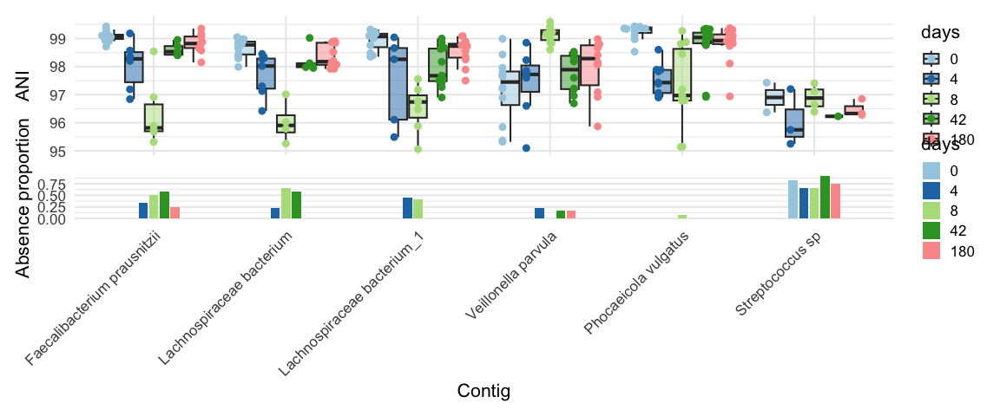<!-- -->

``` r
# Nice signal here:
# Veillonella sp. - 00100
# Faecalibacterium prausnitzii - 0-1-3-20
```

# Run abundance testing AKA why don’t see see *E. coli* in ANI testing?

*E. coli* shows a sharp shift in abundance in the paper (goes up after
exposure and then down) - but no change in ANI. Indicative of no strain
change or replacement?

``` r
se_p95_abund  = cleanup(read_sylph("data/palleja_ab_recovery/combined_p_95.tsv", variable = "Taxonomic_abundance"), meta)
```

    ## Detected Sylph profile output file.

    ## Retained 371 rows after subject-aware filtering

``` r
bug = c("Veillonella", "Klebsiella pneumoniae", "Escherichia coli"); bug_i = 3

p1 = plot_ani_dist(se_p95_abund, 'days',contigs = rownames(se_p95_abund)[grep(bug[bug_i], rownames(se_p95_abund))] , show_points = TRUE,plot_type = 'box')

p2 = plot_ani_dist(se_p, 'days',contigs = rownames(se_p)[grep(bug[bug_i], rownames(se_p))] ,show_points = TRUE,plot_type = 'box')

p1-p2
```

    ## Warning: Removed 10 rows containing non-finite outside the scale range
    ## (`stat_boxplot()`).
    ## Removed 10 rows containing non-finite outside the scale range
    ## (`stat_boxplot()`).

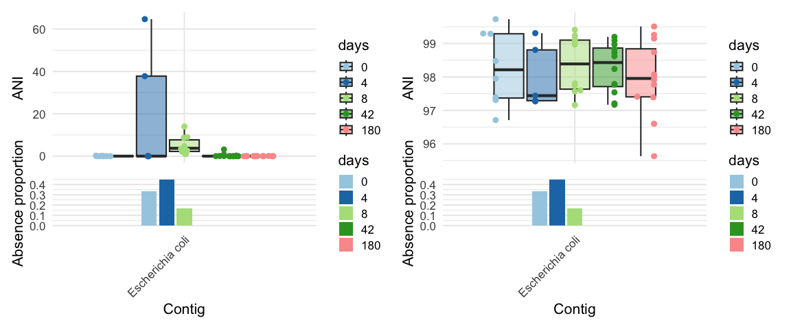<!-- -->

It seems that relative abundance does have the trend mentioned in the
paper, but ANI is unchanged.

## Check microbial load vs reported enriched low abundance commensals

``` r
summary_df <- meta %>%
  group_by(days) %>%
  summarise(
    mean_log_gload = mean(log(g_load), na.rm = TRUE),
    se_log_gload = sd(log(g_load), na.rm = TRUE) / sqrt(n())
  )

ggplot() +
  geom_line(data = meta, aes(x = as.numeric(days), y = log(g_load), group = subject, color = subject), linewidth = 0.8, alpha = 0.5) +
  geom_point(data = meta, aes(x = as.numeric(days), y = log(g_load), color = subject), size = 3, alpha = 0.8) +
  geom_line(data = summary_df, aes(x = as.numeric(days), y = mean_log_gload), linewidth = 1.2, color = "black") +
  geom_ribbon(data = summary_df, aes(x = as.numeric(days), ymin = mean_log_gload - se_log_gload, ymax = mean_log_gload + se_log_gload), alpha = 0.3, fill = "grey") +
  xlab("Days") +
  ylab("Predicted log microbial load (Galaxy model)") +
  scale_color_manual(values =  c(
    "#D55E00", # reddish-orange  
    "#0072B2", # deep blue  
    "#009E73", # teal/green  
    "#CC79A7", # magenta  
    "#F0E442", # yellow  
    "#E69F00", # orange  
    "#56B4E9", # sky blue  
    "#999999", # gray  
    "#A6761D", # brown  
    "#66CC99", # mint  
    "#CC6666", # muted red  
    "#6699CC"  # muted blue  
  )) +
  scale_x_continuous(breaks = unique(as.numeric(summary_df$days)), labels = unique(summary_df$days)) +
  theme_clean(base_size = 14)
```

<!-- -->

As expected microbial load goes down after antibiotic exposure. Could
the relative abundance change in *E. coli&* be an artifact of this
effect?

## Perform differential abundance testing

``` r
# Helper function
generate_species_plot = function(fit_){
  # Pool the stains that are different at least one day compared to baseline
  plt_dat = plot_ani_dist(se_p95_abund,phenotype = 'days',contigs = pool_contigs(fit_) ,show_points = TRUE,plot_type = 'box', plot = F)
  plt_dat = plt_dat %>% 
    group_by(Contig, days) %>%
    summarise(mean_ANI = mean(ANI, na.rm = TRUE), median_ANI = median(ANI, na.rm = T), .groups = 'drop')
  
  # Thrived
  contigs_thrived <- plt_dat %>%
    group_by(Contig, days) %>%
    tidyr::pivot_wider(names_from = days, values_from = median_ANI) %>%
    filter(`4` > `0` | `8` > `0`) %>%
    pull(Contig) %>%
    unique()
  
  plt_dat$Contig = factor(plt_dat$Contig, levels = unique(plt_dat$Contig)[order(plt_dat$mean_ANI[plt_dat$days == 8], decreasing = T)])
  
  ggplot(plt_dat, aes(x = factor(days, levels = c(0,4,8,42,180)), y = 1, fill = log10(mean_ANI))) +
    geom_tile(color = "white") +
    facet_wrap(~ Contig, ncol = 1, strip.position = "left") +
    scale_fill_gradient(low = "white", high = "steelblue") +
    labs(x = "Days", y = NULL, fill = "Mean R_ab (log10)") +
    theme_minimal() +
    theme(
      axis.text.y = element_blank(),
      axis.ticks.y = element_blank(),
      strip.text.y.left = element_text(angle = 0)
    )
  
}
```

### Model without correcting for microbial load

``` r
save_path <- "output_rds/palleja_abud_p_95_conv.rds"
if(file.exists(save_path)){
  fit_ab_conv <- readRDS(save_path)
} else {
  fit_ab_conv = abundanceFit(se = se_p95_abund, design = conv_design, nthreads = parallel::detectCores(), transform = 'CLR')
  saveRDS(fit_ab_conv, save_path)
}
generate_species_plot(fit_ab_conv)
```

    ## Found 29 tophits for days4 at alpha = 0.05 using holm 
    ## Found 42 tophits for days8 at alpha = 0.05 using holm 
    ## Found 18 tophits for days42 at alpha = 0.05 using holm 
    ## Found 8 tophits for days180 at alpha = 0.05 using holm

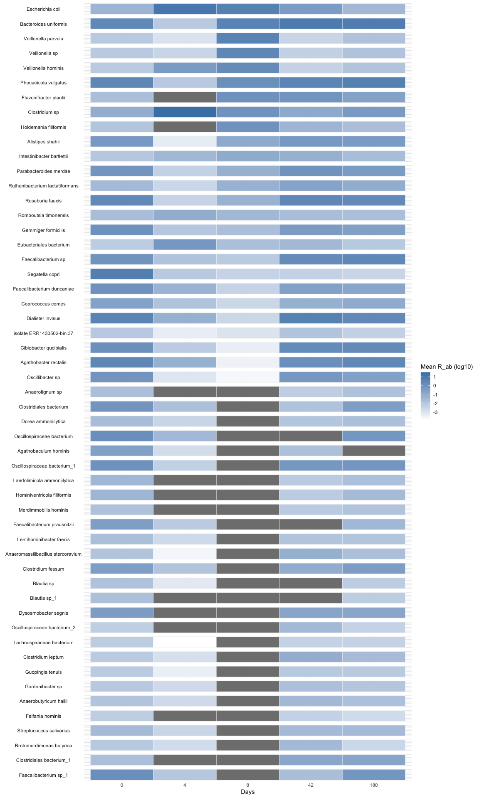<!-- -->

### Model with load adjustment

``` r
save_path <- "output_rds/palleja_abud_p_95_load_adj.rds"
if(file.exists(save_path)){
  fit_ab_load <- readRDS(save_path)
} else {
  fit_ab_load = abundanceFit(se = se_p95_abund, design = design, nthreads = parallel::detectCores(), transform = 'CLR')
  saveRDS(fit_ab_load, save_path)
}

generate_species_plot(fit_ab_load)
```

    ## Found 18 tophits for days4 at alpha = 0.05 using holm 
    ## Found 20 tophits for days8 at alpha = 0.05 using holm 
    ## Found 13 tophits for days42 at alpha = 0.05 using holm 
    ## Found 3 tophits for days180 at alpha = 0.05 using holm

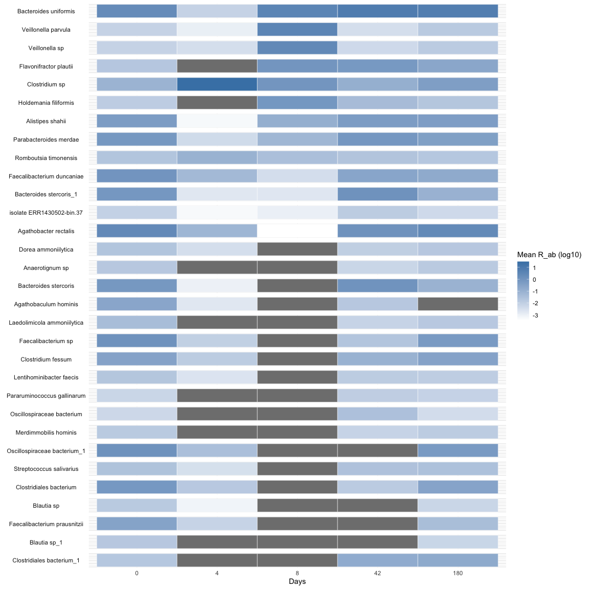<!-- -->

No *E. coli&* detected in either case, and the number of species
detected is stable with and without including load as a covariate.

### ANI model without load adjustment

``` r
save_path <- "output_rds/palleja_fit_p_95_conv.rds"
if(file.exists(save_path)){
  fit_zib_p <- readRDS(save_path)
} else {
  fit_zib_p = glmZiBFit(se = se_p, design = conv_design, nthreads = parallel::detectCores())
  saveRDS(fit_zib_p, save_path)
}

generate_species_plot(fit_zib_p)
```

    ## Found 59 tophits for days4 at alpha = 0.05 using holm 
    ## Found 16 tophits for days8 at alpha = 0.05 using holm 
    ## Found 24 tophits for days42 at alpha = 0.05 using holm 
    ## Found 19 tophits for days180 at alpha = 0.05 using holm

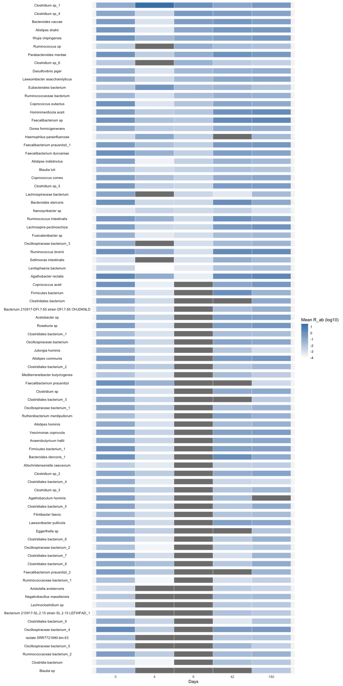<!-- -->

### ANI model with load adjustment

``` r
save_path <- "output_rds/palleja_fit_p_95_load_adj.rds"
if(file.exists(save_path)){
  fit_zib_p_load <- readRDS(save_path)
} else {
  fit_zib_p_load = glmZiBFit(se = se_p, design = design, nthreads = parallel::detectCores())
  saveRDS(fit_zib_p_load, save_path)
}

generate_species_plot(fit_zib_p_load)
```

    ## Found 63 tophits for days4 at alpha = 0.05 using holm 
    ## Found 18 tophits for days8 at alpha = 0.05 using holm 
    ## Found 37 tophits for days42 at alpha = 0.05 using holm 
    ## Found 36 tophits for days180 at alpha = 0.05 using holm

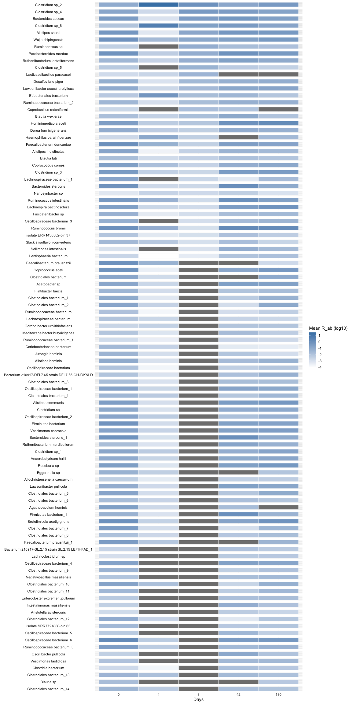<!-- -->

After adjusting for load, we lose many top hits, including *E. coli*.
These were all likely driven by the reduction of overall microbial load.

# Paper Figure

## Strain emergence or disappearance

Let’s redo top hist using very permissive settings, i.e., use `BH` and
`alpha = 0.05`. After all, these are still significant after correcting
for multiple testing.

``` r
th2 = top_hits(fit_zib_q, coef = 2, method = "BH")
```

    ## Found 4222 tophits for days4 at alpha = 0.05 using BH

``` r
th2_ph = comp_ani_diff_and_posthoc_test(se_q, fit_zib_q, th2, nthreads = parallel::detectCores())
```

    ##   |                                                                              |                                                                      |   0%  |                                                                              |                                                                      |   1%  |                                                                              |=                                                                     |   1%  |                                                                              |=                                                                     |   2%  |                                                                              |==                                                                    |   2%  |                                                                              |==                                                                    |   3%  |                                                                              |==                                                                    |   4%  |                                                                              |===                                                                   |   4%  |                                                                              |===                                                                   |   5%  |                                                                              |====                                                                  |   5%  |                                                                              |====                                                                  |   6%  |                                                                              |=====                                                                 |   6%  |                                                                              |=====                                                                 |   7%  |                                                                              |=====                                                                 |   8%  |                                                                              |======                                                                |   8%  |                                                                              |======                                                                |   9%  |                                                                              |=======                                                               |   9%  |                                                                              |=======                                                               |  10%  |                                                                              |=======                                                               |  11%  |                                                                              |========                                                              |  11%  |                                                                              |========                                                              |  12%  |                                                                              |=========                                                             |  12%  |                                                                              |=========                                                             |  13%  |                                                                              |=========                                                             |  14%  |                                                                              |==========                                                            |  14%  |                                                                              |==========                                                            |  15%  |                                                                              |===========                                                           |  15%  |                                                                              |===========                                                           |  16%  |                                                                              |============                                                          |  16%  |                                                                              |============                                                          |  17%  |                                                                              |============                                                          |  18%  |                                                                              |=============                                                         |  18%  |                                                                              |=============                                                         |  19%  |                                                                              |==============                                                        |  19%  |                                                                              |==============                                                        |  20%  |                                                                              |==============                                                        |  21%  |                                                                              |===============                                                       |  21%  |                                                                              |===============                                                       |  22%  |                                                                              |================                                                      |  22%  |                                                                              |================                                                      |  23%  |                                                                              |================                                                      |  24%  |                                                                              |=================                                                     |  24%  |                                                                              |=================                                                     |  25%  |                                                                              |==================                                                    |  25%  |                                                                              |==================                                                    |  26%  |                                                                              |===================                                                   |  26%  |                                                                              |===================                                                   |  27%  |                                                                              |===================                                                   |  28%  |                                                                              |====================                                                  |  28%  |                                                                              |====================                                                  |  29%  |                                                                              |=====================                                                 |  29%  |                                                                              |=====================                                                 |  30%  |                                                                              |=====================                                                 |  31%  |                                                                              |======================                                                |  31%  |                                                                              |======================                                                |  32%  |                                                                              |=======================                                               |  32%  |                                                                              |=======================                                               |  33%  |                                                                              |=======================                                               |  34%  |                                                                              |========================                                              |  34%  |                                                                              |========================                                              |  35%  |                                                                              |=========================                                             |  35%  |                                                                              |=========================                                             |  36%  |                                                                              |==========================                                            |  36%  |                                                                              |==========================                                            |  37%  |                                                                              |==========================                                            |  38%  |                                                                              |===========================                                           |  38%  |                                                                              |===========================                                           |  39%  |                                                                              |============================                                          |  39%  |                                                                              |============================                                          |  40%  |                                                                              |============================                                          |  41%  |                                                                              |=============================                                         |  41%  |                                                                              |=============================                                         |  42%  |                                                                              |==============================                                        |  42%  |                                                                              |==============================                                        |  43%  |                                                                              |==============================                                        |  44%  |                                                                              |===============================                                       |  44%  |                                                                              |===============================                                       |  45%  |                                                                              |================================                                      |  45%  |                                                                              |================================                                      |  46%  |                                                                              |=================================                                     |  46%  |                                                                              |=================================                                     |  47%  |                                                                              |=================================                                     |  48%  |                                                                              |==================================                                    |  48%  |                                                                              |==================================                                    |  49%  |                                                                              |===================================                                   |  49%  |                                                                              |===================================                                   |  50%  |                                                                              |===================================                                   |  51%  |                                                                              |====================================                                  |  51%  |                                                                              |====================================                                  |  52%  |                                                                              |=====================================                                 |  52%  |                                                                              |=====================================                                 |  53%  |                                                                              |=====================================                                 |  54%  |                                                                              |======================================                                |  54%  |                                                                              |======================================                                |  55%  |                                                                              |=======================================                               |  55%  |                                                                              |=======================================                               |  56%  |                                                                              |========================================                              |  56%  |                                                                              |========================================                              |  57%  |                                                                              |========================================                              |  58%  |                                                                              |=========================================                             |  58%  |                                                                              |=========================================                             |  59%  |                                                                              |==========================================                            |  59%  |                                                                              |==========================================                            |  60%  |                                                                              |==========================================                            |  61%  |                                                                              |===========================================                           |  61%  |                                                                              |===========================================                           |  62%  |                                                                              |============================================                          |  62%  |                                                                              |============================================                          |  63%  |                                                                              |============================================                          |  64%  |                                                                              |=============================================                         |  64%  |                                                                              |=============================================                         |  65%  |                                                                              |==============================================                        |  65%  |                                                                              |==============================================                        |  66%  |                                                                              |===============================================                       |  66%  |                                                                              |===============================================                       |  67%  |                                                                              |===============================================                       |  68%  |                                                                              |================================================                      |  68%  |                                                                              |================================================                      |  69%  |                                                                              |=================================================                     |  69%  |                                                                              |=================================================                     |  70%  |                                                                              |=================================================                     |  71%  |                                                                              |==================================================                    |  71%  |                                                                              |==================================================                    |  72%  |                                                                              |===================================================                   |  72%  |                                                                              |===================================================                   |  73%  |                                                                              |===================================================                   |  74%  |                                                                              |====================================================                  |  74%  |                                                                              |====================================================                  |  75%  |                                                                              |=====================================================                 |  75%  |                                                                              |=====================================================                 |  76%  |                                                                              |======================================================                |  76%  |                                                                              |======================================================                |  77%  |                                                                              |======================================================                |  78%  |                                                                              |=======================================================               |  78%  |                                                                              |=======================================================               |  79%  |                                                                              |========================================================              |  79%  |                                                                              |========================================================              |  80%  |                                                                              |========================================================              |  81%  |                                                                              |=========================================================             |  81%  |                                                                              |=========================================================             |  82%  |                                                                              |==========================================================            |  82%  |                                                                              |==========================================================            |  83%  |                                                                              |==========================================================            |  84%  |                                                                              |===========================================================           |  84%  |                                                                              |===========================================================           |  85%  |                                                                              |============================================================          |  85%  |                                                                              |============================================================          |  86%  |                                                                              |=============================================================         |  86%  |                                                                              |=============================================================         |  87%  |                                                                              |=============================================================         |  88%  |                                                                              |==============================================================        |  88%  |                                                                              |==============================================================        |  89%  |                                                                              |===============================================================       |  89%  |                                                                              |===============================================================       |  90%  |                                                                              |===============================================================       |  91%  |                                                                              |================================================================      |  91%  |                                                                              |================================================================      |  92%  |                                                                              |=================================================================     |  92%  |                                                                              |=================================================================     |  93%  |                                                                              |=================================================================     |  94%  |                                                                              |==================================================================    |  94%  |                                                                              |==================================================================    |  95%  |                                                                              |===================================================================   |  95%  |                                                                              |===================================================================   |  96%  |                                                                              |====================================================================  |  96%  |                                                                              |====================================================================  |  97%  |                                                                              |====================================================================  |  98%  |                                                                              |===================================================================== |  98%  |                                                                              |===================================================================== |  99%  |                                                                              |======================================================================|  99%  |                                                                              |======================================================================| 100%

``` r
th2 = th2_ph[is.na(th2_ph$Comment) | th2_ph$hit_component == "both",,]; rownames(th2) = NULL
th2 = strainspy:::add_tax2tophits(th2, tax99, columns = c("Phylum", "Genus", "Species"))

th3 = top_hits(fit_zib_q, coef = 3, method = "BH")
```

    ## Found 7988 tophits for days8 at alpha = 0.05 using BH

``` r
th3_ph = comp_ani_diff_and_posthoc_test(se_q, fit_zib_q, th3, nthreads = parallel::detectCores())
```

    ##   |                                                                              |                                                                      |   0%  |                                                                              |                                                                      |   1%  |                                                                              |=                                                                     |   1%  |                                                                              |=                                                                     |   2%  |                                                                              |==                                                                    |   2%  |                                                                              |==                                                                    |   3%  |                                                                              |==                                                                    |   4%  |                                                                              |===                                                                   |   4%  |                                                                              |===                                                                   |   5%  |                                                                              |====                                                                  |   5%  |                                                                              |====                                                                  |   6%  |                                                                              |=====                                                                 |   6%  |                                                                              |=====                                                                 |   7%  |                                                                              |=====                                                                 |   8%  |                                                                              |======                                                                |   8%  |                                                                              |======                                                                |   9%  |                                                                              |=======                                                               |   9%  |                                                                              |=======                                                               |  10%  |                                                                              |=======                                                               |  11%  |                                                                              |========                                                              |  11%  |                                                                              |========                                                              |  12%  |                                                                              |=========                                                             |  12%  |                                                                              |=========                                                             |  13%  |                                                                              |=========                                                             |  14%  |                                                                              |==========                                                            |  14%  |                                                                              |==========                                                            |  15%  |                                                                              |===========                                                           |  15%  |                                                                              |===========                                                           |  16%  |                                                                              |============                                                          |  16%  |                                                                              |============                                                          |  17%  |                                                                              |============                                                          |  18%  |                                                                              |=============                                                         |  18%  |                                                                              |=============                                                         |  19%  |                                                                              |==============                                                        |  19%  |                                                                              |==============                                                        |  20%  |                                                                              |==============                                                        |  21%  |                                                                              |===============                                                       |  21%  |                                                                              |===============                                                       |  22%  |                                                                              |================                                                      |  22%  |                                                                              |================                                                      |  23%  |                                                                              |================                                                      |  24%  |                                                                              |=================                                                     |  24%  |                                                                              |=================                                                     |  25%  |                                                                              |==================                                                    |  25%  |                                                                              |==================                                                    |  26%  |                                                                              |===================                                                   |  26%  |                                                                              |===================                                                   |  27%  |                                                                              |===================                                                   |  28%  |                                                                              |====================                                                  |  28%  |                                                                              |====================                                                  |  29%  |                                                                              |=====================                                                 |  29%  |                                                                              |=====================                                                 |  30%  |                                                                              |=====================                                                 |  31%  |                                                                              |======================                                                |  31%  |                                                                              |======================                                                |  32%  |                                                                              |=======================                                               |  32%  |                                                                              |=======================                                               |  33%  |                                                                              |=======================                                               |  34%  |                                                                              |========================                                              |  34%  |                                                                              |========================                                              |  35%  |                                                                              |=========================                                             |  35%  |                                                                              |=========================                                             |  36%  |                                                                              |==========================                                            |  36%  |                                                                              |==========================                                            |  37%  |                                                                              |==========================                                            |  38%  |                                                                              |===========================                                           |  38%  |                                                                              |===========================                                           |  39%  |                                                                              |============================                                          |  39%  |                                                                              |============================                                          |  40%  |                                                                              |============================                                          |  41%  |                                                                              |=============================                                         |  41%  |                                                                              |=============================                                         |  42%  |                                                                              |==============================                                        |  42%  |                                                                              |==============================                                        |  43%  |                                                                              |==============================                                        |  44%  |                                                                              |===============================                                       |  44%  |                                                                              |===============================                                       |  45%  |                                                                              |================================                                      |  45%  |                                                                              |================================                                      |  46%  |                                                                              |=================================                                     |  46%  |                                                                              |=================================                                     |  47%  |                                                                              |=================================                                     |  48%  |                                                                              |==================================                                    |  48%  |                                                                              |==================================                                    |  49%  |                                                                              |===================================                                   |  49%  |                                                                              |===================================                                   |  50%  |                                                                              |===================================                                   |  51%  |                                                                              |====================================                                  |  51%  |                                                                              |====================================                                  |  52%  |                                                                              |=====================================                                 |  52%  |                                                                              |=====================================                                 |  53%  |                                                                              |=====================================                                 |  54%  |                                                                              |======================================                                |  54%  |                                                                              |======================================                                |  55%  |                                                                              |=======================================                               |  55%  |                                                                              |=======================================                               |  56%  |                                                                              |========================================                              |  56%  |                                                                              |========================================                              |  57%  |                                                                              |========================================                              |  58%  |                                                                              |=========================================                             |  58%  |                                                                              |=========================================                             |  59%  |                                                                              |==========================================                            |  59%  |                                                                              |==========================================                            |  60%  |                                                                              |==========================================                            |  61%  |                                                                              |===========================================                           |  61%  |                                                                              |===========================================                           |  62%  |                                                                              |============================================                          |  62%  |                                                                              |============================================                          |  63%  |                                                                              |============================================                          |  64%  |                                                                              |=============================================                         |  64%  |                                                                              |=============================================                         |  65%  |                                                                              |==============================================                        |  65%  |                                                                              |==============================================                        |  66%  |                                                                              |===============================================                       |  66%  |                                                                              |===============================================                       |  67%  |                                                                              |===============================================                       |  68%  |                                                                              |================================================                      |  68%  |                                                                              |================================================                      |  69%  |                                                                              |=================================================                     |  69%  |                                                                              |=================================================                     |  70%  |                                                                              |=================================================                     |  71%  |                                                                              |==================================================                    |  71%  |                                                                              |==================================================                    |  72%  |                                                                              |===================================================                   |  72%  |                                                                              |===================================================                   |  73%  |                                                                              |===================================================                   |  74%  |                                                                              |====================================================                  |  74%  |                                                                              |====================================================                  |  75%  |                                                                              |=====================================================                 |  75%  |                                                                              |=====================================================                 |  76%  |                                                                              |======================================================                |  76%  |                                                                              |======================================================                |  77%  |                                                                              |======================================================                |  78%  |                                                                              |=======================================================               |  78%  |                                                                              |=======================================================               |  79%  |                                                                              |========================================================              |  79%  |                                                                              |========================================================              |  80%  |                                                                              |========================================================              |  81%  |                                                                              |=========================================================             |  81%  |                                                                              |=========================================================             |  82%  |                                                                              |==========================================================            |  82%  |                                                                              |==========================================================            |  83%  |                                                                              |==========================================================            |  84%  |                                                                              |===========================================================           |  84%  |                                                                              |===========================================================           |  85%  |                                                                              |============================================================          |  85%  |                                                                              |============================================================          |  86%  |                                                                              |=============================================================         |  86%  |                                                                              |=============================================================         |  87%  |                                                                              |=============================================================         |  88%  |                                                                              |==============================================================        |  88%  |                                                                              |==============================================================        |  89%  |                                                                              |===============================================================       |  89%  |                                                                              |===============================================================       |  90%  |                                                                              |===============================================================       |  91%  |                                                                              |================================================================      |  91%  |                                                                              |================================================================      |  92%  |                                                                              |=================================================================     |  92%  |                                                                              |=================================================================     |  93%  |                                                                              |=================================================================     |  94%  |                                                                              |==================================================================    |  94%  |                                                                              |==================================================================    |  95%  |                                                                              |===================================================================   |  95%  |                                                                              |===================================================================   |  96%  |                                                                              |====================================================================  |  96%  |                                                                              |====================================================================  |  97%  |                                                                              |====================================================================  |  98%  |                                                                              |===================================================================== |  98%  |                                                                              |===================================================================== |  99%  |                                                                              |======================================================================|  99%  |                                                                              |======================================================================| 100%

``` r
th3 = th3_ph[is.na(th3_ph$Comment) | th3_ph$hit_component == "both",,]
th3 = strainspy:::add_tax2tophits(th3, tax99, columns = c("Phylum", "Genus", "Species"))

th4 = top_hits(fit_zib_q, coef = 4, method = "BH")
```

    ## Found 646 tophits for days42 at alpha = 0.05 using BH

``` r
th4_ph = comp_ani_diff_and_posthoc_test(se_q, fit_zib_q, th4, nthreads = parallel::detectCores())
```

    ##   |                                                                              |                                                                      |   0%  |                                                                              |                                                                      |   1%  |                                                                              |=                                                                     |   1%  |                                                                              |=                                                                     |   2%  |                                                                              |==                                                                    |   2%  |                                                                              |==                                                                    |   3%  |                                                                              |==                                                                    |   4%  |                                                                              |===                                                                   |   4%  |                                                                              |===                                                                   |   5%  |                                                                              |====                                                                  |   5%  |                                                                              |====                                                                  |   6%  |                                                                              |=====                                                                 |   7%  |                                                                              |=====                                                                 |   8%  |                                                                              |======                                                                |   8%  |                                                                              |======                                                                |   9%  |                                                                              |=======                                                               |   9%  |                                                                              |=======                                                               |  10%  |                                                                              |=======                                                               |  11%  |                                                                              |========                                                              |  11%  |                                                                              |========                                                              |  12%  |                                                                              |=========                                                             |  12%  |                                                                              |=========                                                             |  13%  |                                                                              |==========                                                            |  14%  |                                                                              |==========                                                            |  15%  |                                                                              |===========                                                           |  15%  |                                                                              |===========                                                           |  16%  |                                                                              |============                                                          |  17%  |                                                                              |============                                                          |  18%  |                                                                              |=============                                                         |  18%  |                                                                              |=============                                                         |  19%  |                                                                              |==============                                                        |  19%  |                                                                              |==============                                                        |  20%  |                                                                              |==============                                                        |  21%  |                                                                              |===============                                                       |  21%  |                                                                              |===============                                                       |  22%  |                                                                              |================                                                      |  22%  |                                                                              |================                                                      |  23%  |                                                                              |================                                                      |  24%  |                                                                              |=================                                                     |  24%  |                                                                              |=================                                                     |  25%  |                                                                              |==================                                                    |  25%  |                                                                              |==================                                                    |  26%  |                                                                              |===================                                                   |  26%  |                                                                              |===================                                                   |  27%  |                                                                              |===================                                                   |  28%  |                                                                              |====================                                                  |  28%  |                                                                              |====================                                                  |  29%  |                                                                              |=====================                                                 |  29%  |                                                                              |=====================                                                 |  30%  |                                                                              |=====================                                                 |  31%  |                                                                              |======================                                                |  31%  |                                                                              |======================                                                |  32%  |                                                                              |=======================                                               |  32%  |                                                                              |=======================                                               |  33%  |                                                                              |========================                                              |  34%  |                                                                              |========================                                              |  35%  |                                                                              |=========================                                             |  35%  |                                                                              |=========================                                             |  36%  |                                                                              |==========================                                            |  37%  |                                                                              |==========================                                            |  38%  |                                                                              |===========================                                           |  38%  |                                                                              |===========================                                           |  39%  |                                                                              |============================                                          |  39%  |                                                                              |============================                                          |  40%  |                                                                              |============================                                          |  41%  |                                                                              |=============================                                         |  41%  |                                                                              |=============================                                         |  42%  |                                                                              |==============================                                        |  42%  |                                                                              |==============================                                        |  43%  |                                                                              |===============================                                       |  44%  |                                                                              |===============================                                       |  45%  |                                                                              |================================                                      |  45%  |                                                                              |================================                                      |  46%  |                                                                              |=================================                                     |  46%  |                                                                              |=================================                                     |  47%  |                                                                              |=================================                                     |  48%  |                                                                              |==================================                                    |  48%  |                                                                              |==================================                                    |  49%  |                                                                              |===================================                                   |  49%  |                                                                              |===================================                                   |  50%  |                                                                              |===================================                                   |  51%  |                                                                              |====================================                                  |  51%  |                                                                              |====================================                                  |  52%  |                                                                              |=====================================                                 |  52%  |                                                                              |=====================================                                 |  53%  |                                                                              |=====================================                                 |  54%  |                                                                              |======================================                                |  54%  |                                                                              |======================================                                |  55%  |                                                                              |=======================================                               |  55%  |                                                                              |=======================================                               |  56%  |                                                                              |========================================                              |  57%  |                                                                              |========================================                              |  58%  |                                                                              |=========================================                             |  58%  |                                                                              |=========================================                             |  59%  |                                                                              |==========================================                            |  59%  |                                                                              |==========================================                            |  60%  |                                                                              |==========================================                            |  61%  |                                                                              |===========================================                           |  61%  |                                                                              |===========================================                           |  62%  |                                                                              |============================================                          |  62%  |                                                                              |============================================                          |  63%  |                                                                              |=============================================                         |  64%  |                                                                              |=============================================                         |  65%  |                                                                              |==============================================                        |  65%  |                                                                              |==============================================                        |  66%  |                                                                              |===============================================                       |  67%  |                                                                              |===============================================                       |  68%  |                                                                              |================================================                      |  68%  |                                                                              |================================================                      |  69%  |                                                                              |=================================================                     |  69%  |                                                                              |=================================================                     |  70%  |                                                                              |=================================================                     |  71%  |                                                                              |==================================================                    |  71%  |                                                                              |==================================================                    |  72%  |                                                                              |===================================================                   |  72%  |                                                                              |===================================================                   |  73%  |                                                                              |===================================================                   |  74%  |                                                                              |====================================================                  |  74%  |                                                                              |====================================================                  |  75%  |                                                                              |=====================================================                 |  75%  |                                                                              |=====================================================                 |  76%  |                                                                              |======================================================                |  76%  |                                                                              |======================================================                |  77%  |                                                                              |======================================================                |  78%  |                                                                              |=======================================================               |  78%  |                                                                              |=======================================================               |  79%  |                                                                              |========================================================              |  79%  |                                                                              |========================================================              |  80%  |                                                                              |========================================================              |  81%  |                                                                              |=========================================================             |  81%  |                                                                              |=========================================================             |  82%  |                                                                              |==========================================================            |  82%  |                                                                              |==========================================================            |  83%  |                                                                              |===========================================================           |  84%  |                                                                              |===========================================================           |  85%  |                                                                              |============================================================          |  85%  |                                                                              |============================================================          |  86%  |                                                                              |=============================================================         |  87%  |                                                                              |=============================================================         |  88%  |                                                                              |==============================================================        |  88%  |                                                                              |==============================================================        |  89%  |                                                                              |===============================================================       |  89%  |                                                                              |===============================================================       |  90%  |                                                                              |===============================================================       |  91%  |                                                                              |================================================================      |  91%  |                                                                              |================================================================      |  92%  |                                                                              |=================================================================     |  92%  |                                                                              |=================================================================     |  93%  |                                                                              |==================================================================    |  94%  |                                                                              |==================================================================    |  95%  |                                                                              |===================================================================   |  95%  |                                                                              |===================================================================   |  96%  |                                                                              |====================================================================  |  96%  |                                                                              |====================================================================  |  97%  |                                                                              |====================================================================  |  98%  |                                                                              |===================================================================== |  98%  |                                                                              |===================================================================== |  99%  |                                                                              |======================================================================|  99%  |                                                                              |======================================================================| 100%

``` r
th4 = th4_ph[is.na(th4_ph$Comment) | th4_ph$hit_component == "both",]
th4 = strainspy:::add_tax2tophits(th4, tax99, columns = c("Phylum", "Genus", "Species"))

th5 = top_hits(fit_zib_q, coef = 5, method = "BH")
```

    ## Found 480 tophits for days180 at alpha = 0.05 using BH

``` r
th5_ph = comp_ani_diff_and_posthoc_test(se_q, fit_zib_q, th5, nthreads = parallel::detectCores())
```

    ##   |                                                                              |                                                                      |   0%  |                                                                              |                                                                      |   1%  |                                                                              |=                                                                     |   1%  |                                                                              |=                                                                     |   2%  |                                                                              |==                                                                    |   2%  |                                                                              |==                                                                    |   3%  |                                                                              |==                                                                    |   4%  |                                                                              |===                                                                   |   4%  |                                                                              |===                                                                   |   5%  |                                                                              |====                                                                  |   5%  |                                                                              |====                                                                  |   6%  |                                                                              |=====                                                                 |   6%  |                                                                              |=====                                                                 |   7%  |                                                                              |=====                                                                 |   8%  |                                                                              |======                                                                |   8%  |                                                                              |======                                                                |   9%  |                                                                              |=======                                                               |   9%  |                                                                              |=======                                                               |  10%  |                                                                              |=======                                                               |  11%  |                                                                              |========                                                              |  11%  |                                                                              |========                                                              |  12%  |                                                                              |=========                                                             |  12%  |                                                                              |=========                                                             |  13%  |                                                                              |=========                                                             |  14%  |                                                                              |==========                                                            |  14%  |                                                                              |==========                                                            |  15%  |                                                                              |===========                                                           |  15%  |                                                                              |===========                                                           |  16%  |                                                                              |============                                                          |  16%  |                                                                              |============                                                          |  17%  |                                                                              |============                                                          |  18%  |                                                                              |=============                                                         |  18%  |                                                                              |=============                                                         |  19%  |                                                                              |==============                                                        |  19%  |                                                                              |==============                                                        |  20%  |                                                                              |==============                                                        |  21%  |                                                                              |===============                                                       |  21%  |                                                                              |===============                                                       |  22%  |                                                                              |================                                                      |  22%  |                                                                              |================                                                      |  23%  |                                                                              |================                                                      |  24%  |                                                                              |=================                                                     |  24%  |                                                                              |=================                                                     |  25%  |                                                                              |==================                                                    |  25%  |                                                                              |==================                                                    |  26%  |                                                                              |===================                                                   |  26%  |                                                                              |===================                                                   |  27%  |                                                                              |===================                                                   |  28%  |                                                                              |====================                                                  |  28%  |                                                                              |====================                                                  |  29%  |                                                                              |=====================                                                 |  29%  |                                                                              |=====================                                                 |  30%  |                                                                              |=====================                                                 |  31%  |                                                                              |======================                                                |  31%  |                                                                              |======================                                                |  32%  |                                                                              |=======================                                               |  32%  |                                                                              |=======================                                               |  33%  |                                                                              |=======================                                               |  34%  |                                                                              |========================                                              |  34%  |                                                                              |========================                                              |  35%  |                                                                              |=========================                                             |  35%  |                                                                              |=========================                                             |  36%  |                                                                              |==========================                                            |  36%  |                                                                              |==========================                                            |  37%  |                                                                              |==========================                                            |  38%  |                                                                              |===========================                                           |  38%  |                                                                              |===========================                                           |  39%  |                                                                              |============================                                          |  39%  |                                                                              |============================                                          |  40%  |                                                                              |============================                                          |  41%  |                                                                              |=============================                                         |  41%  |                                                                              |=============================                                         |  42%  |                                                                              |==============================                                        |  42%  |                                                                              |==============================                                        |  43%  |                                                                              |==============================                                        |  44%  |                                                                              |===============================                                       |  44%  |                                                                              |===============================                                       |  45%  |                                                                              |================================                                      |  45%  |                                                                              |================================                                      |  46%  |                                                                              |=================================                                     |  46%  |                                                                              |=================================                                     |  47%  |                                                                              |=================================                                     |  48%  |                                                                              |==================================                                    |  48%  |                                                                              |==================================                                    |  49%  |                                                                              |===================================                                   |  49%  |                                                                              |===================================                                   |  50%  |                                                                              |===================================                                   |  51%  |                                                                              |====================================                                  |  51%  |                                                                              |====================================                                  |  52%  |                                                                              |=====================================                                 |  52%  |                                                                              |=====================================                                 |  53%  |                                                                              |=====================================                                 |  54%  |                                                                              |======================================                                |  54%  |                                                                              |======================================                                |  55%  |                                                                              |=======================================                               |  55%  |                                                                              |=======================================                               |  56%  |                                                                              |========================================                              |  56%  |                                                                              |========================================                              |  57%  |                                                                              |========================================                              |  58%  |                                                                              |=========================================                             |  58%  |                                                                              |=========================================                             |  59%  |                                                                              |==========================================                            |  59%  |                                                                              |==========================================                            |  60%  |                                                                              |==========================================                            |  61%  |                                                                              |===========================================                           |  61%  |                                                                              |===========================================                           |  62%  |                                                                              |============================================                          |  62%  |                                                                              |============================================                          |  63%  |                                                                              |============================================                          |  64%  |                                                                              |=============================================                         |  64%  |                                                                              |=============================================                         |  65%  |                                                                              |==============================================                        |  65%  |                                                                              |==============================================                        |  66%  |                                                                              |===============================================                       |  66%  |                                                                              |===============================================                       |  67%  |                                                                              |===============================================                       |  68%  |                                                                              |================================================                      |  68%  |                                                                              |================================================                      |  69%  |                                                                              |=================================================                     |  69%  |                                                                              |=================================================                     |  70%  |                                                                              |=================================================                     |  71%  |                                                                              |==================================================                    |  71%  |                                                                              |==================================================                    |  72%  |                                                                              |===================================================                   |  72%  |                                                                              |===================================================                   |  73%  |                                                                              |===================================================                   |  74%  |                                                                              |====================================================                  |  74%  |                                                                              |====================================================                  |  75%  |                                                                              |=====================================================                 |  75%  |                                                                              |=====================================================                 |  76%  |                                                                              |======================================================                |  76%  |                                                                              |======================================================                |  77%  |                                                                              |======================================================                |  78%  |                                                                              |=======================================================               |  78%  |                                                                              |=======================================================               |  79%  |                                                                              |========================================================              |  79%  |                                                                              |========================================================              |  80%  |                                                                              |========================================================              |  81%  |                                                                              |=========================================================             |  81%  |                                                                              |=========================================================             |  82%  |                                                                              |==========================================================            |  82%  |                                                                              |==========================================================            |  83%  |                                                                              |==========================================================            |  84%  |                                                                              |===========================================================           |  84%  |                                                                              |===========================================================           |  85%  |                                                                              |============================================================          |  85%  |                                                                              |============================================================          |  86%  |                                                                              |=============================================================         |  86%  |                                                                              |=============================================================         |  87%  |                                                                              |=============================================================         |  88%  |                                                                              |==============================================================        |  88%  |                                                                              |==============================================================        |  89%  |                                                                              |===============================================================       |  89%  |                                                                              |===============================================================       |  90%  |                                                                              |===============================================================       |  91%  |                                                                              |================================================================      |  91%  |                                                                              |================================================================      |  92%  |                                                                              |=================================================================     |  92%  |                                                                              |=================================================================     |  93%  |                                                                              |=================================================================     |  94%  |                                                                              |==================================================================    |  94%  |                                                                              |==================================================================    |  95%  |                                                                              |===================================================================   |  95%  |                                                                              |===================================================================   |  96%  |                                                                              |====================================================================  |  96%  |                                                                              |====================================================================  |  97%  |                                                                              |====================================================================  |  98%  |                                                                              |===================================================================== |  98%  |                                                                              |===================================================================== |  99%  |                                                                              |======================================================================|  99%  |                                                                              |======================================================================| 100%

``` r
th5 = th5_ph[is.na(th5_ph$Comment) | th5_ph$hit_component == "both",,]
th5 = strainspy:::add_tax2tophits(th5, tax99, columns = c("Phylum", "Genus", "Species"))

top_hits = rbind( data.frame(strainspy:::add_tax2tophits(th2, tax99, columns = c("Phylum", "Genus", "Species")), day = 4),   # day 4
                  data.frame(strainspy:::add_tax2tophits(th3, tax99, columns = c("Phylum", "Genus", "Species")), day = 8),   # day 8
                  data.frame(strainspy:::add_tax2tophits(th4, tax99, columns = c("Phylum", "Genus", "Species")), day = 42),  # day 42
                  data.frame(strainspy:::add_tax2tophits(th5, tax99, columns = c("Phylum", "Genus", "Species")), day = 180)) # day 180


#### Some stats for the paper results ###

# Depletion counts right after exposure
th_depletion = rbind(th2[th2$hit_component == "zi" | th2$hit_component ==  "both",],
                     th3[th3$hit_component == "zi" | th3$hit_component ==  "both",] )
length(unique(th_depletion$Species))
```

    ## [1] 1140

``` r
length(unique(th_depletion$Genus))
```

    ## [1] 96

``` r
th_turnover = rbind(th2[th2$hit_component == "beta" | th2$hit_component ==  "both",],
                     th3[th3$hit_component == "beta" | th3$hit_component ==  "both",] )
length(unique(th_turnover$Species))
```

    ## [1] 282

``` r
length(unique(th_turnover$Genus))
```

    ## [1] 60

``` r
# Recovery
th_recovery = rbind(th4[th4$hit_component == "zi" | th4$hit_component ==  "both",],
                     th5[th5$hit_component == "zi" | th5$hit_component ==  "both",] )
length(unique(th_recovery$Species))
```

    ## [1] 1

``` r
length(unique(th_recovery$Genus))
```

    ## [1] 1

``` r
th_rec_turnover = rbind(th4[th4$hit_component == "beta" | th4$hit_component ==  "both",],
                     th5[th5$hit_component == "beta" | th5$hit_component ==  "both",] )
length(unique(th_rec_turnover$Species))
```

    ## [1] 96

``` r
length(unique(th_rec_turnover$Genus))
```

    ## [1] 46

``` r
contigs_to_pull = unique(top_hits$Contig_name)
asy = SummarizedExperiment::assay(se_q)
asy = as.matrix(asy[unname(sapply(contigs_to_pull, function(x) which(x == rownames(asy)))),])

ani_long <- as.data.frame(asy) %>%
  tibble::rownames_to_column("Contig_name") %>%
  pivot_longer(-Contig_name, names_to = "run_accession", values_to = "ANI") %>%
  left_join(meta %>% select(run_accession, subject, days), by = "run_accession") %>%
  mutate(
    Species = top_hits$Species[match(Contig_name, top_hits$Contig_name)],
    Genus   = top_hits$Genus[match(Contig_name, top_hits$Contig_name)]
  )

ani_filtered <- ani_long %>%
  group_by(subject, Contig_name) %>%
  # Keep only those with at least one non-zero ANI for that subject
  filter(any(ANI != 0)) %>%
  ungroup()


# look at zeros
non_zero_counts <- ani_filtered %>%
  group_by(subject, Genus, days) %>%
  summarise(
    n_zeros   = sum(ANI != 0),
    n_total   = n(),
    prop_zero = n_zeros / n_total,
    n_contigs = n_distinct(Contig_name),
    .groups = "drop"
  ) %>%
  group_by(Genus, days) %>%
  summarise(
    mean_prop_zeros = mean(prop_zero),
    se_prop_zeros   = sd(prop_zero) / sqrt(n()),
    mean_zeros      = mean(n_zeros),
    se_zeros        = sd(n_zeros) / sqrt(n()),
    n_contigs_total = sum(n_contigs),
    n_subjects      = n_distinct(subject),
    .groups = "drop"
  )
```

## Use a weighted sum to detect most affected strains

``` r
# Define your kernel for depletion
# Days: 0, 4, 8, 42, 180
# Weights: 1, -1, -1, 1, 1 (High score = Depletion at days 4 & 8)
depletion_kernel <- c(1, -1, -1, 1, 1)
ani_filtered_ <- ani_filtered
ani_filtered_$days = as.numeric(ani_filtered_$days)
# Ensure data is complete and compute scores per subject
strain_stats <- ani_filtered_ %>%
  complete(nesting(Contig_name, Genus, Species, subject), 
           days = c(0, 4, 8, 42, 180), 
           fill = list(ANI = 0)) %>%
  arrange(days) %>%
  group_by(subject, Contig_name, Genus, Species) %>%
  summarise(
    depletion_score = sum(ANI * depletion_kernel),
    .groups = "drop"
  ) %>%
  # Now aggregate across subjects
  group_by(Contig_name, Genus, Species) %>%
  summarise(
    avg_score = mean(depletion_score, na.rm = TRUE),
    sd_score = sd(depletion_score, na.rm = TRUE),
    n_subjects = n(), # Useful to see if the strain was present in all subjects
    .groups = "drop"
  ) %>%
  arrange(desc(avg_score))
```

    ## Warning: There were 96034 warnings in `summarise()`.
    ## The first warning was:
    ## ℹ In argument: `depletion_score = sum(ANI * depletion_kernel)`.
    ## ℹ In group 1: `subject = 1`, `Contig_name = "AFYM01000001.1 Lacticaseibacillus
    ##   casei A2-362 ctg001_00010, whole genome shotgun sequence"`, `Genus =
    ##   "Lacticaseibacillus"`, `Species = "Lacticaseibacillus paracasei"`.
    ## Caused by warning in `ANI * depletion_kernel`:
    ## ! longer object length is not a multiple of shorter object length
    ## ℹ Run `dplyr::last_dplyr_warnings()` to see the 96033 remaining warnings.

### Visualise interesting variations of species within genera

``` r
genus_dist = function(selected_genera){ 
  selected_species = unique(ani_filtered$Species[ani_filtered$Genus == selected_genera])
  # get genera counts in the database
  species_totals <- tax99 %>%
    filter(Species %in% selected_species) %>%
    distinct(Species, Genome) %>%    # unique strain × genus pairs
    group_by(Species) %>%
    summarize(total_strains = n(), .groups = "drop") %>%
    complete(Species = selected_species, fill = list(total_strains = 0))
  
  day_levels <- c("0","4","8","42","180") 
  
  presence_df <- ani_filtered %>%
    filter(Species %in% selected_species) %>%
    mutate(days = factor(as.character(days), levels = day_levels),
           present = ANI > 95) %>%
    # count unique contig names per Genus x subject x day where present == TRUE
    group_by(Species, subject, days) %>%
    summarize(n_strains = n_distinct(Contig_name[present]), .groups = "drop")
  
  
  prop_df <- presence_df %>%
    left_join(species_totals, by = "Species") %>%
    mutate(
      # avoid division by zero: if genus has zero total strains, produce NA
      prop_of_species = if_else(total_strains > 0,
                                n_strains / total_strains,
                                NA_real_)
    )
  
  baseline <- prop_df %>%
    group_by(Species, subject) %>%
    summarize(
      prop0 = max(prop_of_species, na.rm = TRUE),   # highest proportion across all days
      .groups = "drop"
    )
  
  prop_df2 <- prop_df %>%
    left_join(baseline, by = c("Species", "subject"))
  
  prop_df2 <- prop_df2 %>%
    mutate(
      ratio = if_else(!is.na(prop0) & prop0 > 0,
                      prop_of_species / prop0,
                      NA_real_),      # baseline-0 subjects → NA
      ratio = pmin(ratio, 1)   # cap at 1 so colour means "as present as baseline"
    )
  summary_ratio <- prop_df2 %>%
    group_by(Species, days) %>%
    summarize(
      mean_ratio = mean(ratio, na.rm = TRUE),
      se_ratio   = sd(ratio, na.rm = TRUE) / sqrt(sum(!is.na(ratio))),
      n_subj     = sum(n_strains>0),
      .groups = "drop"
    ) %>%
    mutate(days = factor(as.character(days), levels = c("0","4","8","42","180")))
  
  # Order genera by effect (optional)
  order_species <- summary_ratio %>% filter(days == "8") %>% arrange(mean_ratio) %>% pull(Species) %>% unique()
  summary_ratio <- summary_ratio %>% mutate(Species = factor(Species, levels = rev(order_species)))
  
  # Plot: white -> single colour; limits [0,1]; NA and 0 appear white
  ggplot(summary_ratio, aes(x = days, y = Species, fill = n_subj)) +
    geom_tile(color = "grey90", size = 0.3) +
    geom_text(aes(label = sprintf("%d", n_subj)),
              size = 6) +
    scale_fill_gradient(
      low = "white",
      high = "#2A6EBBFF",    # pick a single strong colour
      limits = c(0, 12),
      na.value = "white",
      name = "Strains Present"
    ) +
    labs(x = "Days", y = NULL) +
    theme_minimal(base_size = 15) +
    theme(panel.grid = element_blank(),
          axis.text.x = element_text(angle = 45, hjust = 1))
}

# Few strong signals to see here:

# B. dentium goes up while others go down and slowly recover
genus_dist("Bifidobacterium")
```

    ## Warning: Using `size` aesthetic for lines was deprecated in ggplot2 3.4.0.
    ## ℹ Please use `linewidth` instead.
    ## This warning is displayed once per session.
    ## Call `lifecycle::last_lifecycle_warnings()` to see where this warning was
    ## generated.

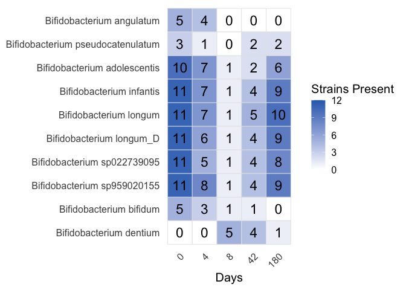<!-- -->

``` r
# R. gnavus goes up while other Ruminococci go down and recover
genus_dist("Ruminococcus_B")
```

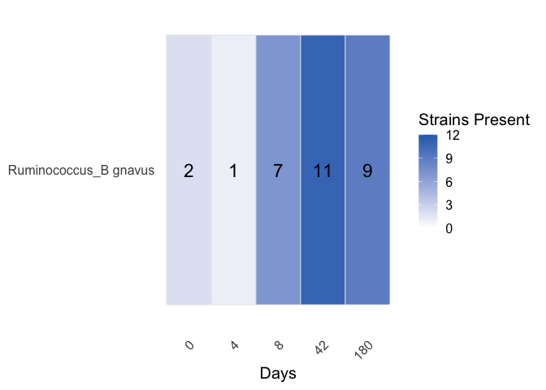<!-- -->

``` r
genus_dist("Ruminococcus_E")
```

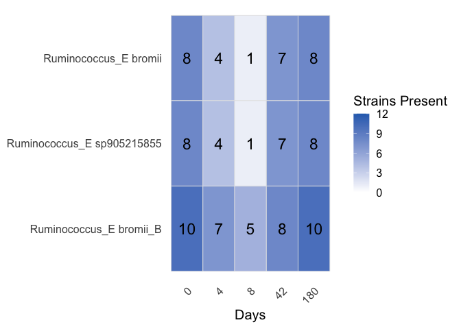<!-- -->

``` r
# C leptum (A well known good bacteria) disappears shortly, C innocuum/saudiense (pathobionts) go up. 
# We might be looking at wrong strains here, but the pattern is clear. 
genus_dist("Clostridium_A")
```

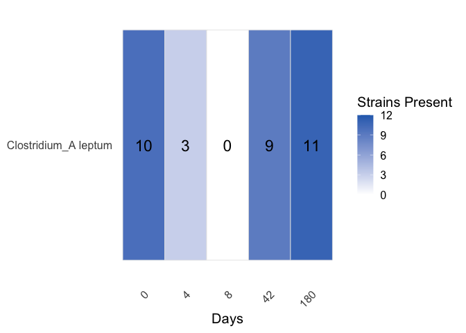<!-- -->

``` r
genus_dist("Clostridium")
```

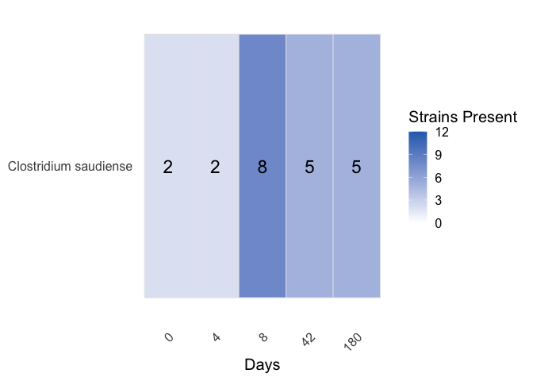<!-- -->

``` r
genus_dist("Clostridium_AQ")
```

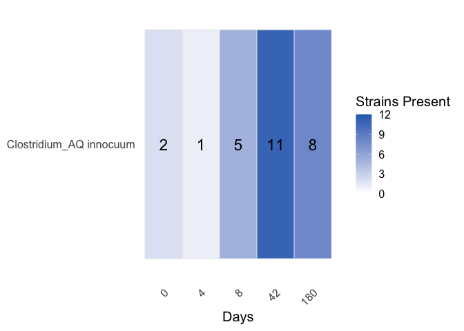<!-- -->

### Check for abundance signal

``` r
plot_avg_abundance = function(asy_mx, meta){
  # 1. Pivot and Join (as before)
  combined_data <- asy_mx %>% 
    as.data.frame() %>%
    tibble::rownames_to_column("Species") %>%
    pivot_longer(-Species, names_to = "run_accession", values_to = "Abundance") %>%
    inner_join(meta, by = "run_accession")
  
  # 2. Average across subjects for each Day
  final_summary <- combined_data %>%
    group_by(Species, days) %>%
    summarise(
      avg_abundance = mean(Abundance, na.rm = TRUE),
      sem = sd(Abundance, na.rm = TRUE) / sqrt(n()),
      n_subjects = n_distinct(subject), # Confirming data from all 10 subjects
      .groups = "drop"
    ) %>%
    arrange(Species, days)
  
  mapping <- data.frame(
    Species = unique(final_summary$Species), 
    name_fix = strainspy:::clean_contig_names(unique(final_summary$Species))
  )
  
  final_summary <- final_summary %>%
    left_join(mapping, by = "Species")
  
  ggplot(final_summary, aes(x = factor(days), y = avg_abundance, color = name_fix, fill = name_fix, group = name_fix)) +
    # The ribbon now uses the 'fill' aesthetic to match the line color
    geom_ribbon(aes(ymin = avg_abundance - sem, ymax = avg_abundance + sem), alpha = 0.2, color = NA) +
    geom_line(size = 1.2) +
    geom_point(size = 3) +
    facet_wrap(~name_fix, nrow = 1) + # 'free_y' helps see spikes in rare species
    theme_minimal() +
    scale_color_viridis_d(option = "turbo") +
    scale_fill_viridis_d(option = "turbo") + 
    # This removes the legend entirely
    theme(legend.position = "none") +
    labs(
      x = "Day",
      y = "Average Percentage Relative Abundance",
      title = "Species Abundance Dynamics (Mean ± SEM)"
    )
}

# Species level signals
se_p_abud = cleanup(read_sylph("data/palleja_ab_recovery/combined_p_95.tsv", variable = 'Taxonomic_abundance'), meta)
```

    ## Detected Sylph profile output file.

    ## Retained 371 rows after subject-aware filtering

``` r
se_p_assay_bifid = as.matrix(SummarizedExperiment::assay(se_p_abud[rownames(se_p_abud)[grep("Bifidobacterium", rownames(se_p_abud))],]))
plot_avg_abundance(se_p_assay_bifid, meta)
```

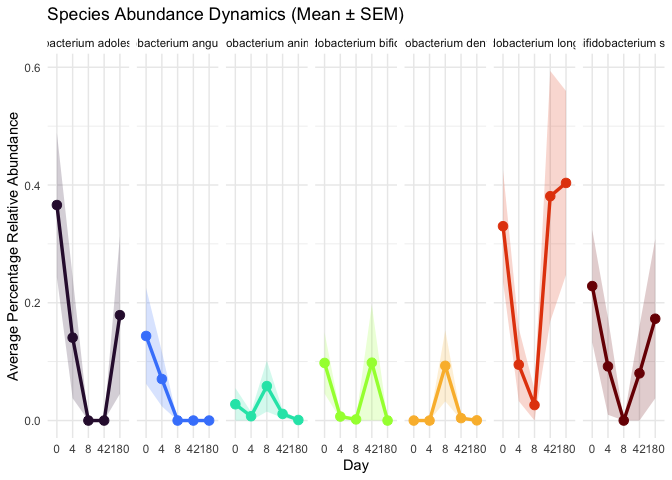<!-- -->

``` r
se_p_assay_rum = as.matrix(SummarizedExperiment::assay(se_p_abud[rownames(se_p_abud)[grep("Ruminococcus", rownames(se_p_abud))],]))
plot_avg_abundance(se_p_assay_rum, meta)
```

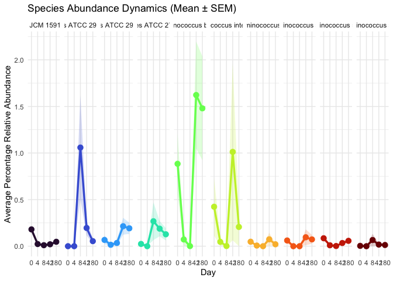<!-- -->

``` r
se_p_assay_clos = rbind(as.matrix(SummarizedExperiment::assay(se_p_abud[rownames(se_p_abud)[grep("leptum", rownames(se_p_abud))],])),
                        as.matrix(SummarizedExperiment::assay(se_p_abud[rownames(se_p_abud)[grep("innocuum", rownames(se_p_abud))],])),
                        as.matrix(SummarizedExperiment::assay(se_p_abud[rownames(se_p_abud)[grep("saudiense", rownames(se_p_abud))],])))

plot_avg_abundance(se_p_assay_clos, meta)
```

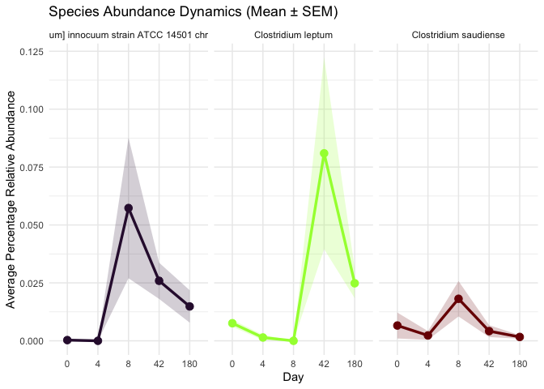<!-- -->

## Fate of Short-chain fatty acid producing genera

``` r
scfa_genera <- c(
  "Faecalibacterium",  # classic butyrate producer
  "Agathobacter",      # Eubacterium rectale group
  "Anaerobutyricum",   # E. hallii group
  "Anaerostipes",      # strong butyrate producer
  "Roseburia",         # hallmark butyrate producer
  "Blautia_A",         # butyrate/acetate producer
  "Fusicatenibacter",  # secondary butyrate producer
  "Ruminococcus_E"     # butyrate producer
)

sfca_non_zeros <- non_zero_counts %>% filter(Genus %in% scfa_genera)
set.seed(25); cols <- ggsci::pal_bmj()(length(unique(sfca_non_zeros$Genus)))

ggplot(sfca_non_zeros, aes(x = days, y = mean_prop_zeros, color = Genus, group = Genus)) +
  geom_line(size = 1) +
  geom_point(size = 2) +
  geom_errorbar(aes(ymin = mean_prop_zeros - se_prop_zeros, ymax = mean_prop_zeros + se_prop_zeros),
                width = 0.2, alpha = 0.6) +
  scale_x_discrete(breaks = sort(unique(sfca_non_zeros$days))) +
  scale_color_manual(values = cols) +
  labs(
    x = "Sample day",
    y = "Fraction of strain presence",
    color = "Genus"
  ) +
  theme(
    legend.position = "right",
    panel.grid.minor = element_blank(),
    plot.title = element_text(face = "bold")
  ) +
  theme_clean(base_size = 14)
```

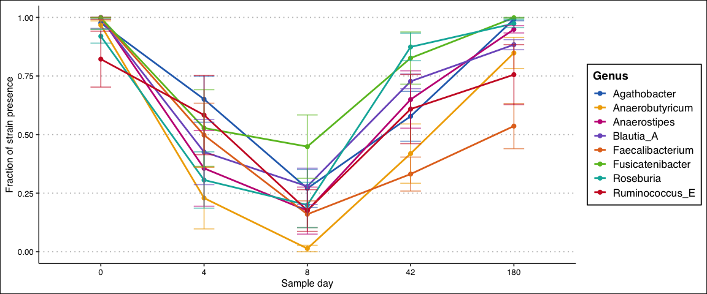<!-- -->

## Fate of some oppotunistic bacteria

``` r
opportunistic_genera <- c(
  "Clostridium",
  "Clostridium_AQ",
  "Klebsiella",
  "Escherichia"       # E. coli and related, classic opportunist
)

opp_non_zeros <- non_zero_counts %>% filter(Genus %in% opportunistic_genera)
set.seed(25); cols <- ggsci::pal_bmj()(length(opportunistic_genera))[sample(length(unique(opp_non_zeros$Genus)))]

ggplot(opp_non_zeros, aes(x = days, y = mean_prop_zeros, color = Genus, group = Genus)) +
  geom_line(size = 1) +
  geom_point(size = 2) +
  geom_errorbar(aes(ymin = mean_prop_zeros - se_prop_zeros, ymax = mean_prop_zeros + se_prop_zeros),
                width = 0.2, alpha = 0.6) +
  scale_x_discrete(breaks = sort(unique(opp_non_zeros$days))) +
  scale_color_manual(values = cols) +
  labs(
    x = "Sample day",
    y = "Fraction of strain presence",
    color = "Genus"
  ) +
  theme_clean(base_size = 14) +
  theme(
    legend.position = "right",
    panel.grid.minor = element_blank(),
    plot.title = element_text(face = "bold")
  )
```

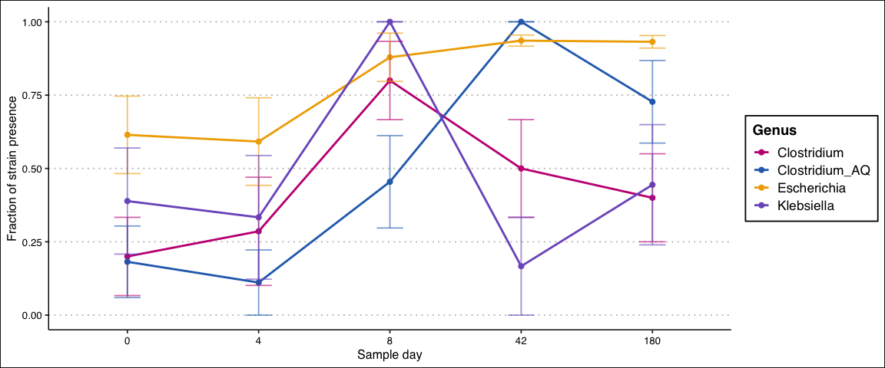<!-- -->

## Visualise as a heatmap

``` r
Butyrate_genera <- c(
  "Holdemanella",  
  "Anaerostipes",      
  "Roseburia",
  "Faecalibacterium",  # classic butyrate producer
  "Agathobacter",      # Eubacterium rectale group
  "Anaerobutyricum",   # E. hallii group
  "Anaerostipes",      # strong butyrate producer
  "Roseburia",         # hallmark butyrate producer
  "Blautia_A",         # butyrate/acetate producer
  "Fusicatenibacter",  # secondary butyrate producer
  "Ruminococcus_E"    # butyrate producer
  
)

opp_genera = opportunistic_genera <- c(
  "Clostridium",
  "Clostridium_AQ",
  "Klebsiella",
  "Escherichia",
  "Ruminococcus_B",
  "Eggerthella",
  "Bifidobacterium"
)

{
  selected_genera = c(Butyrate_genera, opp_genera)
  
  # get genera counts in the database
  genus_totals <- tax99 %>%
    filter(Genus %in% selected_genera) %>%
    distinct(Genus, Genome) %>%    # unique strain × genus pairs
    group_by(Genus) %>%
    summarize(total_strains = n(), .groups = "drop") %>%
    complete(Genus = selected_genera, fill = list(total_strains = 0))
  
  day_levels <- c("0","4","8","42","180") 
  
  presence_df <- ani_filtered %>%
    filter(Genus %in% selected_genera) %>%
    mutate(days = factor(as.character(days), levels = day_levels),
           present = ANI > 95) %>%
    # count unique contig names per Genus x subject x day where present == TRUE
    group_by(Genus, subject, days) %>%
    summarize(n_strains = n_distinct(Contig_name[present]), .groups = "drop")
  
  
  prop_df <- presence_df %>%
    left_join(genus_totals, by = "Genus") %>%
    mutate(
      # avoid division by zero: if genus has zero total strains, produce NA
      prop_of_genus = if_else(total_strains > 0,
                              n_strains / total_strains,
                              NA_real_)
    )
  
  baseline <- prop_df %>%
    group_by(Genus, subject) %>%
    summarize(
      prop0 = max(prop_of_genus, na.rm = TRUE),   # highest proportion across all days
      .groups = "drop"
    )
  
  prop_df2 <- prop_df %>%
    left_join(baseline, by = c("Genus", "subject"))
  
  prop_df2 <- prop_df2 %>%
    mutate(
      ratio = if_else(!is.na(prop0) & prop0 > 0,
                      prop_of_genus / prop0,
                      NA_real_),      # baseline-0 subjects → NA
      ratio = pmin(ratio, 1)   # cap at 1 so colour means "as present as baseline"
    )
  summary_ratio <- prop_df2 %>%
    group_by(Genus, days) %>%
    summarize(
      mean_ratio = mean(ratio, na.rm = TRUE),
      se_ratio   = sd(ratio, na.rm = TRUE) / sqrt(sum(!is.na(ratio))),
      n_subj     = sum(!is.na(ratio)),
      .groups = "drop"
    ) %>%
    mutate(days = factor(as.character(days), levels = c("0","4","8","42","180")))
  
  # Order genera by effect (optional)
  order_genus <- summary_ratio %>% filter(days == "8") %>% arrange(mean_ratio) %>% pull(Genus) %>% unique()
  summary_ratio <- summary_ratio %>% mutate(Genus = factor(Genus, levels = rev(order_genus)))
  
  # Plot: white -> single colour; limits [0,1]; NA and 0 appear white
  ggplot(summary_ratio, aes(x = days, y = Genus, fill = mean_ratio)) +
    geom_tile(color = "grey90", size = 0.3) +
    scale_fill_gradient(
      low = "white",
      high = cols[2],    # pick a single strong colour
      limits = c(0, 1),
      na.value = "white",
      name = "Strains Present"
    ) +
    labs(x = "Days", y = NULL) +
    theme_minimal(base_size = 15) +
    theme(panel.grid = element_blank(),
          axis.text.x = element_text(angle = 45, hjust = 1))
}
```

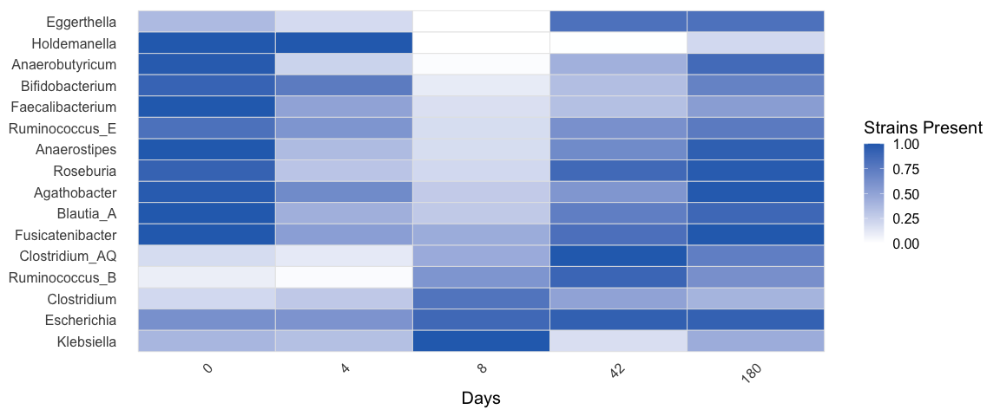<!-- -->

## Strain replacement

``` r
bact_filt_out = function(genus){
  bact <- top_hits[grep(genus, top_hits$Genus),]
  bact = bact[which(bact$p_adjust < 0.05),]
  bact = bact[order(bact$p_adjust),]
  
  bact_to_pull = unique(bact$Contig_name)
  asy = SummarizedExperiment::assay(se_q)
  asy = as.matrix(asy[unname(sapply(bact_to_pull, function(x) which(x == rownames(asy)))),])
  
  bact_long <- as.data.frame(asy) %>%
    tibble::rownames_to_column("Contig_name") %>%
    pivot_longer(-Contig_name, names_to = "run_accession", values_to = "ANI") %>%
    left_join(meta %>% select(run_accession, subject, days), by = "run_accession") %>%
    mutate(
      Species = top_hits$Species[match(Contig_name, top_hits$Contig_name)],
      Genus   = top_hits$Genus[match(Contig_name, top_hits$Contig_name)]
    )
  
  bact_filtered <- bact_long %>%
    group_by(subject, Contig_name) %>%
    # Keep only those with at least one non-zero ANI for that subject
    filter(any(ANI != 0)) %>%
    ungroup() %>%
    group_by(Contig_name, subject) %>%
    mutate(
      ANI_day0 = ANI[days == 0],        # baseline for that contig+subject
      ANI_relative = ANI - ANI_day0     # drop or gain relative to day0
    ) %>%
    ungroup() %>% 
    filter(abs(ANI_relative)< 10 & abs(ANI_relative) > 1)
  
  return(bact_filtered)
}

bact_filtered = bact_filt_out("Bacteroides")
contigs_subset <-names(sort(table(bact_filtered$Contig_name), decreasing = T))[c(9, 11, 26)]
ct_to_check = contigs_subset

bact_filtered = bact_filt_out("Alistipes")
contigs_subset <-names(sort(table(bact_filtered$Contig_name), decreasing = T))[c(3)]
ct_to_check = c(ct_to_check, contigs_subset)

bact_filtered = bact_filt_out("Veillonella")
contigs_subset <-names(sort(table(bact_filtered$Contig_name), decreasing = T))[c(8,2)]
ct_to_check = c(ct_to_check, contigs_subset)

bact_filtered = bact_filt_out("Prevotella")
contigs_subset <-names(sort(table(bact_filtered$Contig_name), decreasing = T))[c(2)]
ct_to_check = c(ct_to_check, contigs_subset)

bact <- top_hits
bact = bact[which(bact$p_adjust < 0.05),]
bact = bact[order(bact$p_adjust),]

bact_to_pull = unique(bact$Contig_name)
asy = SummarizedExperiment::assay(se_q)
asy = as.matrix(asy[unname(sapply(bact_to_pull, function(x) which(x == rownames(asy)))),])

bact_long <- as.data.frame(asy) %>%
  tibble::rownames_to_column("Contig_name") %>%
  pivot_longer(-Contig_name, names_to = "run_accession", values_to = "ANI") %>%
  left_join(meta %>% select(run_accession, subject, days), by = "run_accession") %>%
  mutate(
    Species = top_hits$Species[match(Contig_name, top_hits$Contig_name)],
    Genus   = top_hits$Genus[match(Contig_name, top_hits$Contig_name)]
  )

bact_filtered <- bact_long %>%
  group_by(subject, Contig_name) %>%
  # Keep only those with at least one non-zero ANI for that subject
  filter(any(ANI != 0)) %>%
  ungroup() %>%
  group_by(Contig_name, subject) %>%
  mutate(
    ANI_day0 = ANI[days == 0],        # baseline for that contig+subject
    ANI_relative = ANI - ANI_day0     # drop or gain relative to day0
  ) %>%
  ungroup() %>% 
  filter(abs(ANI_relative)< 10 & abs(ANI_relative) > 1)
ct_to_check_ = ct_to_check[c(1, 5, 4)]

# All hits with very small beta p-values indicate strain replacement, but we also track strain disappearances. Let's try to keep strains that persist 
df_plot <- bact_long %>%
  filter(Contig_name %in% ct_to_check_, ANI > 0)

df_plot$Contig_name = factor(df_plot$Contig_name, levels = ct_to_check_ )

for(i in 1:nrow(df_plot)){
  df_plot$Species[i] = paste(df_plot$Species[i], str_extract(df_plot$Contig_name[i], "^[^ ]+"))
}
df_plot$Species = factor(df_plot$Species, levels = unique(df_plot$Species) )

ggplot(df_plot, aes(x = factor(days), y = ANI, group = subject, color = subject)) +
  geom_point(size = 3, alpha = 0.8) +        # points per subject/day
  geom_line(size = 1) +                      # lines connecting days per subject
  scale_color_manual(values =  c(
    "#D55E00", # reddish-orange  
    "#0072B2", # deep blue  
    "#009E73", # teal/green  
    "#CC79A7", # magenta  
    "#F0E442", # yellow  
    "#E69F00", # orange  
    "#56B4E9", # sky blue  
    "#999999", # gray  
    "#A6761D", # brown  
    "#66CC99", # mint  
    "#CC6666", # muted red  
    "#6699CC"  # muted blue  
  )) +
  facet_wrap(~Species, scales = "free_x") +
  labs(x = "Day", y = "ANI", color = "Subject") +
  theme(axis.text.x = element_text(hjust = 0.5)) +
  theme_clean(base_size = 14)
```

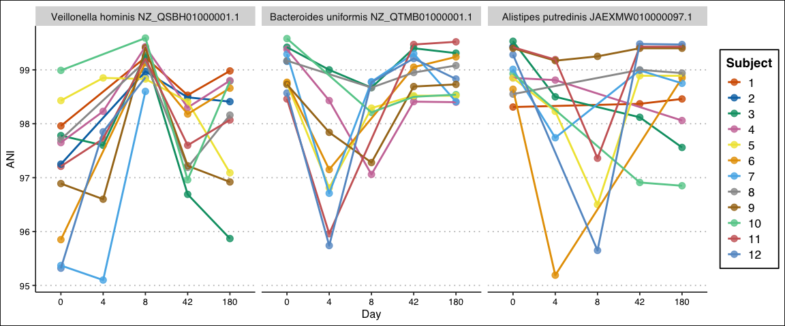<!-- -->

``` r
# Strain replacement p-values for these three strains: 4.664351e-12 4.011619e-08 3.600068e-05


df_plot_sd = df_plot %>% group_by(Species,days) %>% summarise(sd_ANI = sd(ANI))
```

    ## `summarise()` has regrouped the output.
    ## ℹ Summaries were computed grouped by Species and days.
    ## ℹ Output is grouped by Species.
    ## ℹ Use `summarise(.groups = "drop_last")` to silence this message.
    ## ℹ Use `summarise(.by = c(Species, days))` for per-operation grouping
    ##   (`?dplyr::dplyr_by`) instead.

``` r
ggplot(df_plot_sd, aes(x = days, y = sd_ANI)) +
  geom_col(width = 0.7, fill = "grey70") +
  
  facet_wrap(~Species, scales = "free_y") +
  
  labs(x = "Day", y = "SD of ANI") +
  
  theme_minimal(base_size = 14) +
  theme(
    strip.text = element_text(face = "bold"),
    axis.text.x = element_text(angle = 45, hjust = 1)
  ) + 
  geom_text(aes(label = sprintf("%.2f", sd_ANI)),
            vjust = -0.3, size = 3)
```

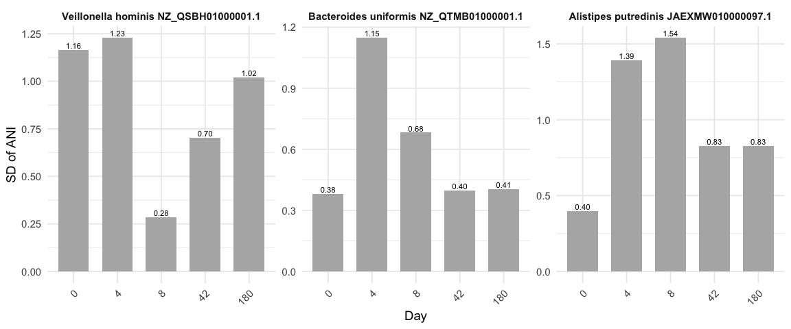<!-- -->

### Paper Figures

``` r
## Supplementary abundance
## SFCA_Producers
se_p_assay_fp = as.matrix(SummarizedExperiment::assay(se_p_abud[rownames(se_p_abud)[grep("prausnitzii", rownames(se_p_abud))],]))
plot_avg_abundance(se_p_assay_fp, meta)
```

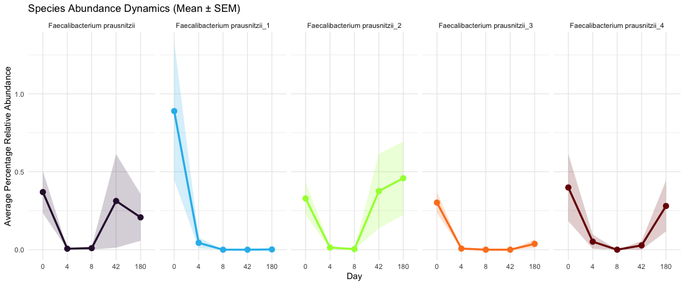<!-- -->

``` r
se_p_assay_bl = as.matrix(SummarizedExperiment::assay(se_p_abud[rownames(se_p_abud)[grep("Bifidobacterium", rownames(se_p_abud))],]))
plot_avg_abundance(se_p_assay_bl, meta)
```

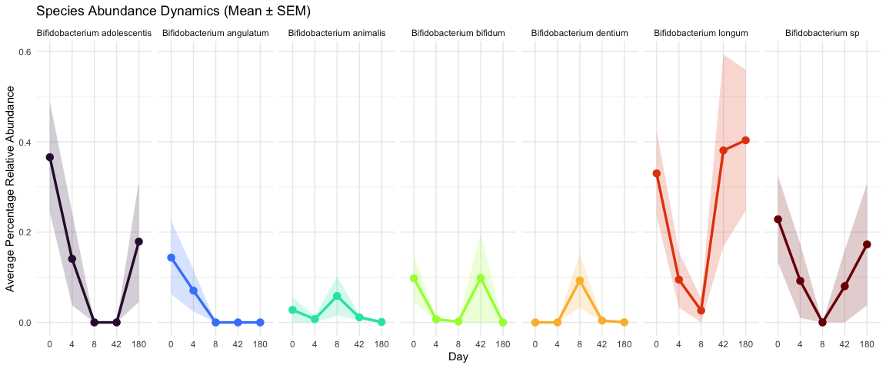<!-- -->

``` r
strain_dist = function(selected_strains){ 
  
  idx_list = sapply(selected_strains, function(x) grep(x, ani_filtered$Contig_name))
  chose_idx = unname(unlist(idx_list))
  
  ani_filtered_ss = ani_filtered[chose_idx,]
  ani_filtered_ss$strain = rep(selected_strains, times = unlist(lapply(idx_list, length)))
  
  
  day_levels <- c("0","4","8","42","180")
  # 12 subjects on all days except 4 (9)
  
  ani_filtered_ss$n_tot_subj = ifelse(ani_filtered_ss$days == 4, 9, 12)
  
  presence_df <- ani_filtered_ss %>%
    mutate(days = factor(as.character(days), levels = day_levels),
           present = ANI > 95) %>%
    # count unique contig names per Genus x subject x day where present == TRUE
    group_by(Species, subject, days) %>%
    summarize(n_strains = n_distinct(Contig_name[present]),
              n_tot_subj = unique(n_tot_subj),
              strain = unique(strain),
              .groups = "drop")
  
  
  summary_ratio <- presence_df %>%
    group_by(days, Species) %>%
    summarize(
      Species = unique(Species),
      mean_ratio = sum(n_strains)/unique(n_tot_subj),
      n_subj = sum(n_strains),
      strain = unique(strain),
      .groups = "drop"
    ) %>%
    mutate(days = factor(as.character(days), levels = c("0","4","8","42","180")))
  
  # Order genera by effect (optional)
  order_species <- summary_ratio %>% filter(days == "8") %>% arrange(mean_ratio) %>% pull(Species) %>% unique()
  summary_ratio <- summary_ratio %>% mutate(Species = factor(Species, levels = rev(order_species)))
  
  # Plot: white -> single colour; limits [0,1]; NA and 0 appear white
  summary_ratio$strain = factor(summary_ratio$strain, levels = rev(selected_strains))
  ggplot(summary_ratio, aes(x = days, y = strain, fill = mean_ratio)) +
    geom_tile(color = "grey90", size = 0.3) +
    geom_text(aes(label = sprintf("%d", n_subj)),
              size = 6) +
    scale_fill_gradient(
      low = "white",
      high = "#2A6EBBFF",    # pick a single strong colour
      limits = c(0, 1),
      na.value = "white",
      name = "Prevalence"
    ) +
    labs(x = "Days", y = NULL) +
    theme_minimal(base_size = 15) +
    theme(panel.grid = element_blank(),
          axis.text.x = element_text(angle = 45, hjust = 1))
}

### ANI presence/absence for following species 
## Competition picture
# Bif longum "NC_014656.1", Bif dentium "NZ_CP072503.1"
# Rum bromii    "SFJY01000034.1", Rum gnavus "CATXMW010000001.1"
# Clos leptum "CABIYC010000001.1", Clos innocuum "CANBFG010000001.1"

## SFCA Picture
# F prausnitzii: CABMFC010000001.1 gone
# F prausnitzii: NC_021020.1 returned

## Oppotunitists
#  Klebs "NZ_JAQDCG010000001.1"
#  E coli "NZ_CP104500.1"

strain_dist(c("NC_014656.1", "NZ_CP072503.1", 
              "SFJY01000034.1", "CATXMW010000001.1",
              "CABIYC010000001.1", "CANBFG010000001.1", 
              "CABMFC010000001.1", "NC_021020.1",
              "NZ_JAQDCG010000001.1",
              "NZ_CP104500.1"))
```

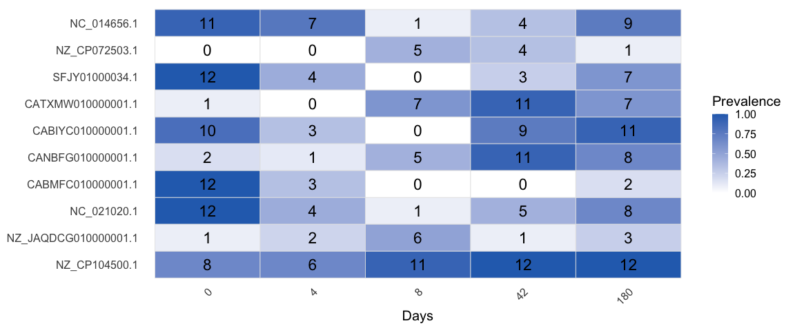<!-- -->
