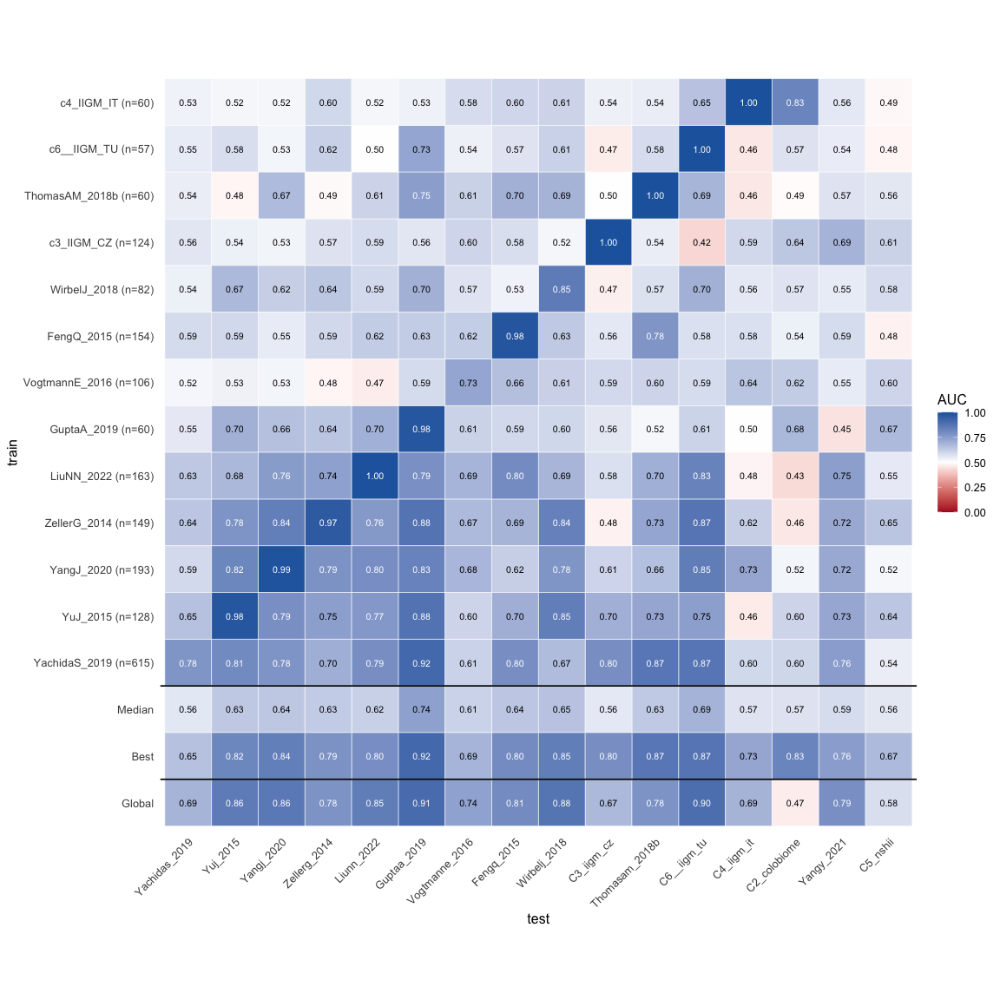
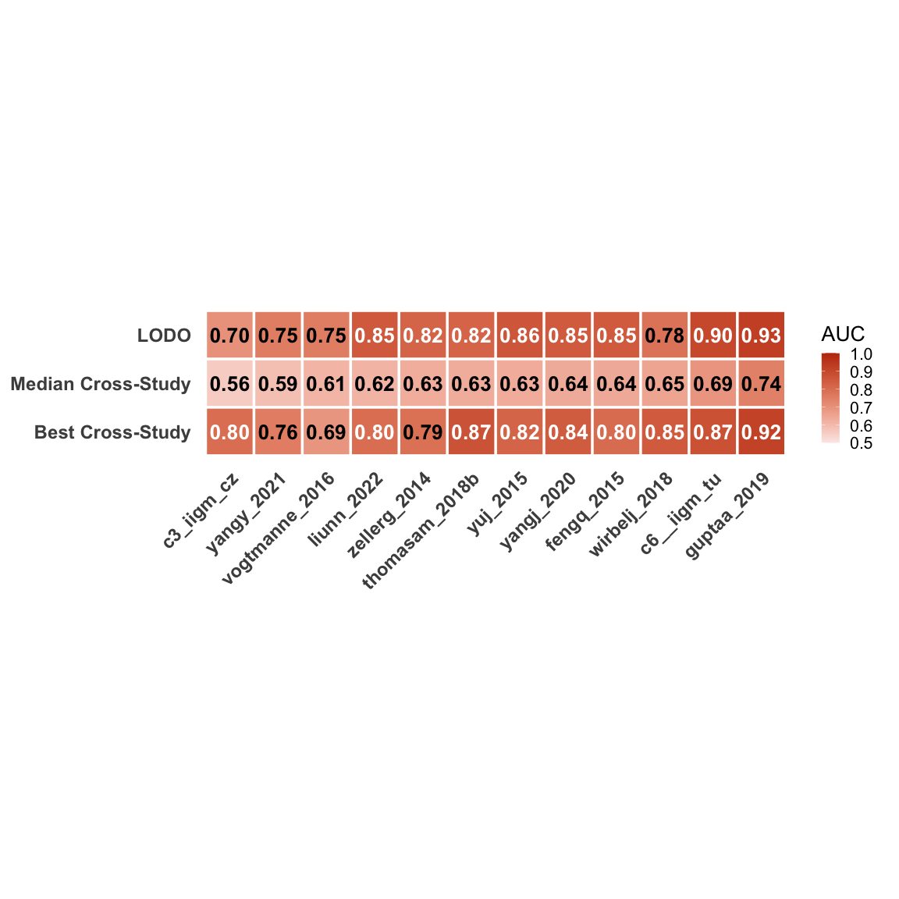

Reanalyse the colorectal cancer data with lodo and trained on each
dataset
================
2026-04-28

# Set up prediction model

## Load deps

``` r
library(strainspy)
library(SummarizedExperiment)
library(caret)
library(glmnet) # elastic net
library(ranger) # RF
library(pROC)
library(doParallel)
library(foreach)
library(parallel)
library(ggplot2)
library(tidyr)
library(dplyr)
```

## Using query99 data and fit

``` r
meta_path <- "data/segata_pooled_3741/combined_metadata.tsv"
meta <- read.csv(meta_path, sep = '\t')

# set up contrasts/reference levels
meta$disease = factor(meta$disease, levels = c("Control", "CRC", "Adenoma"))
meta$study = factor(meta$study)
meta$cascon = ifelse(meta$cascon == "Case", "Case", "Control")
meta$cascon = factor(meta$cascon, levels = c("Control", "Case"))
meta$country = factor(meta$country)
meta$sex = factor(meta$sex, levels = c("Female", "Male"))
# let's reset tumour stages
meta$tumour_stage_AJCC[meta$tumour_stage_AJCC == ""] = "NoTumour"
meta$tumour_stage_AJCC[meta$disease == "Adenoma"] = "Adenoma"
meta$tumour_stage_AJCC[meta$tumour_stage_AJCC == "CRC_stage_unlabelled"] = "Unstaged"
meta$tumour_stage_AJCC = factor(meta$tumour_stage_AJCC, levels = c("NoTumour", "Adenoma", "0", "I", "II", "III", "IV", "Unstaged"))

meta$tumour_location[meta$disease == "Control"] = "NoTumour"
meta$tumour_location[meta$disease == "Adenoma"] = "Adenoma"
meta$tumour_location = factor(meta$tumour_location, levels = c("NoTumour", "Adenoma", "transverse", "left_sided", "right_sided", "multiple_sites", "nd"))

# Merge adenoma and HC into None 
meta$disease = ifelse(meta$disease == "CRC", "CRC", "None")

# Read in sylph output
sy <- read_sylph("data/segata_pooled_3741/combined_q_99.tsv.gz") # q99)
```

    ## Detected Sylph query output file.

``` r
# annoying renames to match meta V sylph file
colnames(sy) <- gsub("_1", "", colnames(sy))
colnames(sy) <- gsub("_merged", "", colnames(sy))
colData(sy)$Sample_file <- gsub("_1", "", basename(colData(sy)$Sample_file))
colData(sy)$Sample_file <- gsub("_merged", "", colnames(sy))

### We'll skip filtering here

# Checks before merging metadata
all(colnames(sy) %in% meta$run_accession)
```

    ## [1] TRUE

``` r
all(meta$run_accession %in% colnames(sy))
```

    ## [1] TRUE

``` r
sy = modify_metadata(sy, meta, replace = T)
dim(sy)
```

    ## [1] 64415  3414

### Global predictors from all data (leakage)

``` r
### Strains we used in the global prediction model
taxonomy <- read_taxonomy("data/TAXONOMY/sylph_DB_taxonomy_99.tsv")
global_fit =  readRDS("output_rds/CRC_zib_q_99_ebp.rds")
th = top_hits(global_fit, coef = 2, method = "bonferroni", alpha = 0.01)
```

    ## Found 571 tophits for diseaseCRC at alpha = 0.01 using bonferroni

``` r
th = strainspy:::add_tax2tophits(th, taxonomy, c("Species", "Genus"))
```

## Predict the AUC for all datasets by training on each dataset indepdendently

``` r
studies = unique(meta$study)
design <- as.formula("~ disease + age + sex + BMI + (1 | study)")
output = matrix(NA, nrow = length(studies), ncol = length(studies))

doParallel::registerDoParallel(cores = parallel::detectCores()-2)

# study_x = as.character(studies[16])
for(i_train in 1:length(studies)){
  study_x = as.character(studies[i_train])
  cat("Training using:", study_x, "\n")
  
  if(study_x == "YangY_2021"){
    # manual override for this study - it does not contain age,sex,BMI data. Can't train the usual model using it
    # cat("YangY_2021 dataset does not contain age, sex, BMI data, skipping...\n")
    output[i_train, ] = 0
    next
  }
  
  if(study_x == "c5_NSHII"){
    # manual override for this study - it does not contain age,sex,BMI data. Can't train the usual model using it
    # cat("c5_NSHII is an adenoma dataset (only 14/897 CRC)...\n")
    output[i_train, ] = 0
    next
  }
  
  
  # Get the data out
  sy_x = subset(sy, select = colData(sy)$study %in% study_x)
  sy_x <- filter_by_presence(sy_x, min_nonzero = ceiling(dim(sy_x)[2]/10)) # filter at ~10%
  
  save_path = file.path("output_rds/crc_separate_dsets", paste(study_x, ".rds", sep = ""))
  
  if(file.exists(save_path)){
    ZB_fit_x = readRDS(save_path)
  } else {
    
    if("CRC" %in% sy_x@colData$disease & "None" %in% sy_x@colData$disease){
      ebp = compute_eb_priors(sy_x, strainspy:::nobars_(design), nthreads = parallel::detectCores(),low_cutoff = 0, high_cutoff = Inf)
      ZB_fit_x <- glmZiBFit(sy_x, design, MAP_prior = ebp, nthreads = parallel::detectCores())
      saveRDS(ZB_fit_x, save_path)
    } else {
      # cat("No variation in outcome in:", study_x, " - skipping... \n")
      output[i_train, ] = 0
      next
    }
  }
  
  # We obviously lack the power to pick as many strains with smaller datasets, let's use the ranking instead
  th_x = strainspy:::add_tax2tophits(top_hits(ZB_fit_x, coef = 2, alpha = 1), taxonomy, c("Species", "Genus"))
  th_x = th_x[1:nrow(th), ] # keep the same number of predictors
  
  sy_mx_bf_x = strainspy::prep_for_prediction(sy_x, 'disease', th_x$Contig_name)
  
  if(min(table(sy_mx_bf_x$disease))>=10) { # If one class had less than 10, don't think we can trust it (arbitrary value)
    # Fit elastic net only using the training data
    enet_fit_bf_x <- caret::train(disease ~ .,
                                  data = sy_mx_bf_x,
                                  method = 'glmnet',
                                  preProcess = c("center", "scale"),
                                  metric = "ROC",
                                  trControl = trainControl(
                                    method = "cv",
                                    classProbs = TRUE,              # allow probabilities
                                    summaryFunction = twoClassSummary,  # compute ROC, Sens, Spec
                                    savePredictions = "final"
                                  ),
                                  weights = ifelse(sy_mx_bf_x$disease=="CRC", 2, 1))
    
    # Predict each study
    i_test = 1
    for (study_test in studies){
      # cat("Predicting", study_test, "\n")
      hold_out_sy = subset(sy, select = colData(sy)$study %in% as.character(study_test))
      
      if("CRC" %in% hold_out_sy@colData$disease & "None" %in% hold_out_sy@colData$disease){
        hold_out_mx = strainspy::prep_for_prediction(hold_out_sy, 'disease', th_x$Contig_name)
        
        pred_lodo <- predict(enet_fit_bf_x, hold_out_mx , type = "prob")$CRC
        roc_lodo <- roc(factor(colData(hold_out_sy)$disease, levels = c("None", "CRC")), pred_lodo, levels = c("None","CRC"))
        
        output[i_train, i_test] = auc(roc_lodo)
      } else {
        output[i_train, i_test] = 0
      }
      i_test = i_test + 1
    }
  } else {
    # cat("Train dataset has <10 observation of one class in:", study_x, " - skipping... \n")
    output[i_train, ] = 0
    next
  }
  
}
```

    ## Training using: c1_AtezoTRIBE 
    ## Retained 21480 rows after filtering
    ## Training using: c6__IIGM_TU 
    ## Retained 24381 rows after filtering
    ## Found 10465 tophits for diseaseNone at alpha = 1 using holm

    ## Prepared data: 57 samples and 571 predictors.
    ## Prepared data: 57 samples and 571 predictors.

    ## Setting direction: controls < cases

    ## Prepared data: 124 samples and 571 predictors.

    ## Setting direction: controls > cases

    ## Prepared data: 149 samples and 571 predictors.

    ## Setting direction: controls < cases

    ## Prepared data: 82 samples and 571 predictors.

    ## Setting direction: controls < cases

    ## Prepared data: 60 samples and 571 predictors.

    ## Setting direction: controls > cases

    ## Prepared data: 60 samples and 571 predictors.

    ## Setting direction: controls > cases

    ## Prepared data: 60 samples and 571 predictors.

    ## Setting direction: controls > cases

    ## Prepared data: 106 samples and 571 predictors.

    ## Setting direction: controls < cases

    ## Prepared data: 203 samples and 571 predictors.

    ## Setting direction: controls > cases

    ## Prepared data: 615 samples and 571 predictors.

    ## Setting direction: controls < cases

    ## Prepared data: 193 samples and 571 predictors.

    ## Setting direction: controls < cases

    ## Prepared data: 163 samples and 571 predictors.

    ## Setting direction: controls > cases

    ## Prepared data: 200 samples and 571 predictors.

    ## Setting direction: controls > cases

    ## Prepared data: 154 samples and 571 predictors.

    ## Setting direction: controls > cases

    ## Prepared data: 128 samples and 571 predictors.

    ## Setting direction: controls < cases

    ## Prepared data: 897 samples and 571 predictors.

    ## Setting direction: controls < cases

    ## Training using: c3_IIGM_CZ 
    ## Retained 19912 rows after filtering
    ## Found 9231 tophits for diseaseNone at alpha = 1 using holm

    ## Prepared data: 124 samples and 571 predictors.

    ## Prepared data: 57 samples and 571 predictors.

    ## Setting direction: controls > cases

    ## Prepared data: 124 samples and 571 predictors.

    ## Setting direction: controls < cases

    ## Prepared data: 149 samples and 571 predictors.

    ## Setting direction: controls > cases

    ## Prepared data: 82 samples and 571 predictors.

    ## Setting direction: controls < cases

    ## Prepared data: 60 samples and 571 predictors.

    ## Setting direction: controls < cases

    ## Prepared data: 60 samples and 571 predictors.

    ## Setting direction: controls < cases

    ## Prepared data: 60 samples and 571 predictors.

    ## Setting direction: controls < cases

    ## Prepared data: 106 samples and 571 predictors.

    ## Setting direction: controls < cases

    ## Prepared data: 203 samples and 571 predictors.

    ## Setting direction: controls < cases

    ## Prepared data: 615 samples and 571 predictors.

    ## Setting direction: controls < cases

    ## Prepared data: 193 samples and 571 predictors.

    ## Setting direction: controls < cases

    ## Prepared data: 163 samples and 571 predictors.

    ## Setting direction: controls < cases

    ## Prepared data: 200 samples and 571 predictors.

    ## Setting direction: controls < cases

    ## Prepared data: 154 samples and 571 predictors.

    ## Setting direction: controls < cases

    ## Prepared data: 128 samples and 571 predictors.

    ## Setting direction: controls < cases

    ## Prepared data: 897 samples and 571 predictors.

    ## Setting direction: controls > cases

    ## Training using: ZellerG_2014 
    ## Retained 20859 rows after filtering
    ## Found 8100 tophits for diseaseNone at alpha = 1 using holm

    ## Prepared data: 149 samples and 571 predictors.

    ## Prepared data: 57 samples and 571 predictors.

    ## Setting direction: controls < cases

    ## Prepared data: 124 samples and 571 predictors.

    ## Setting direction: controls > cases

    ## Prepared data: 149 samples and 571 predictors.

    ## Setting direction: controls < cases

    ## Prepared data: 82 samples and 571 predictors.

    ## Setting direction: controls < cases

    ## Prepared data: 60 samples and 571 predictors.

    ## Setting direction: controls < cases

    ## Prepared data: 60 samples and 571 predictors.

    ## Setting direction: controls < cases

    ## Prepared data: 60 samples and 571 predictors.

    ## Setting direction: controls < cases

    ## Prepared data: 106 samples and 571 predictors.

    ## Setting direction: controls < cases

    ## Prepared data: 203 samples and 571 predictors.

    ## Setting direction: controls < cases

    ## Prepared data: 615 samples and 571 predictors.

    ## Setting direction: controls < cases

    ## Prepared data: 193 samples and 571 predictors.

    ## Setting direction: controls < cases

    ## Prepared data: 163 samples and 571 predictors.

    ## Setting direction: controls < cases

    ## Prepared data: 200 samples and 571 predictors.

    ## Setting direction: controls < cases

    ## Prepared data: 154 samples and 571 predictors.

    ## Setting direction: controls < cases

    ## Prepared data: 128 samples and 571 predictors.

    ## Setting direction: controls < cases

    ## Prepared data: 897 samples and 571 predictors.

    ## Setting direction: controls < cases

    ## Training using: WirbelJ_2018 
    ## Retained 20025 rows after filtering
    ## Found 9692 tophits for diseaseNone at alpha = 1 using holm

    ## Prepared data: 82 samples and 571 predictors.

    ## Prepared data: 57 samples and 571 predictors.

    ## Setting direction: controls < cases

    ## Prepared data: 124 samples and 571 predictors.

    ## Setting direction: controls < cases

    ## Prepared data: 149 samples and 571 predictors.

    ## Setting direction: controls < cases

    ## Prepared data: 82 samples and 571 predictors.

    ## Setting direction: controls < cases

    ## Prepared data: 60 samples and 571 predictors.

    ## Setting direction: controls > cases

    ## Prepared data: 60 samples and 571 predictors.

    ## Setting direction: controls < cases

    ## Prepared data: 60 samples and 571 predictors.

    ## Setting direction: controls < cases

    ## Prepared data: 106 samples and 571 predictors.

    ## Setting direction: controls < cases

    ## Prepared data: 203 samples and 571 predictors.

    ## Setting direction: controls < cases

    ## Prepared data: 615 samples and 571 predictors.

    ## Setting direction: controls < cases

    ## Prepared data: 193 samples and 571 predictors.

    ## Setting direction: controls < cases

    ## Prepared data: 163 samples and 571 predictors.

    ## Setting direction: controls < cases

    ## Prepared data: 200 samples and 571 predictors.

    ## Setting direction: controls < cases

    ## Prepared data: 154 samples and 571 predictors.

    ## Setting direction: controls > cases

    ## Prepared data: 128 samples and 571 predictors.

    ## Setting direction: controls < cases

    ## Prepared data: 897 samples and 571 predictors.

    ## Setting direction: controls < cases

    ## Training using: ThomasAM_2018b 
    ## Retained 21540 rows after filtering
    ## Found 12042 tophits for diseaseNone at alpha = 1 using holm

    ## Prepared data: 60 samples and 571 predictors.

    ## Prepared data: 57 samples and 571 predictors.

    ## Setting direction: controls > cases

    ## Prepared data: 124 samples and 571 predictors.

    ## Setting direction: controls > cases

    ## Prepared data: 149 samples and 571 predictors.

    ## Setting direction: controls > cases

    ## Prepared data: 82 samples and 571 predictors.

    ## Setting direction: controls > cases

    ## Prepared data: 60 samples and 571 predictors.

    ## Setting direction: controls < cases

    ## Prepared data: 60 samples and 571 predictors.

    ## Setting direction: controls < cases

    ## Prepared data: 60 samples and 571 predictors.

    ## Setting direction: controls < cases

    ## Prepared data: 106 samples and 571 predictors.

    ## Setting direction: controls < cases

    ## Prepared data: 203 samples and 571 predictors.

    ## Setting direction: controls > cases

    ## Prepared data: 615 samples and 571 predictors.

    ## Setting direction: controls < cases

    ## Prepared data: 193 samples and 571 predictors.

    ## Setting direction: controls > cases

    ## Prepared data: 163 samples and 571 predictors.

    ## Setting direction: controls < cases

    ## Prepared data: 200 samples and 571 predictors.

    ## Setting direction: controls < cases

    ## Prepared data: 154 samples and 571 predictors.

    ## Setting direction: controls < cases

    ## Prepared data: 128 samples and 571 predictors.

    ## Setting direction: controls < cases

    ## Prepared data: 897 samples and 571 predictors.

    ## Setting direction: controls < cases

    ## Training using: GuptaA_2019 
    ## Retained 19329 rows after filtering
    ## Found 11521 tophits for diseaseNone at alpha = 1 using holm

    ## Prepared data: 60 samples and 571 predictors.

    ## Prepared data: 57 samples and 571 predictors.

    ## Setting direction: controls < cases

    ## Prepared data: 124 samples and 571 predictors.

    ## Setting direction: controls < cases

    ## Prepared data: 149 samples and 571 predictors.

    ## Setting direction: controls < cases

    ## Prepared data: 82 samples and 571 predictors.

    ## Setting direction: controls < cases

    ## Prepared data: 60 samples and 571 predictors.

    ## Setting direction: controls < cases

    ## Prepared data: 60 samples and 571 predictors.

    ## Setting direction: controls < cases

    ## Prepared data: 60 samples and 571 predictors.

    ## Setting direction: controls < cases

    ## Prepared data: 106 samples and 571 predictors.

    ## Setting direction: controls < cases

    ## Prepared data: 203 samples and 571 predictors.

    ## Setting direction: controls < cases

    ## Prepared data: 615 samples and 571 predictors.

    ## Setting direction: controls < cases

    ## Prepared data: 193 samples and 571 predictors.

    ## Setting direction: controls < cases

    ## Prepared data: 163 samples and 571 predictors.

    ## Setting direction: controls < cases

    ## Prepared data: 200 samples and 571 predictors.

    ## Setting direction: controls > cases

    ## Prepared data: 154 samples and 571 predictors.

    ## Setting direction: controls < cases

    ## Prepared data: 128 samples and 571 predictors.

    ## Setting direction: controls < cases

    ## Prepared data: 897 samples and 571 predictors.

    ## Setting direction: controls < cases

    ## Training using: c4_IIGM_IT 
    ## Retained 17958 rows after filtering
    ## Found 9952 tophits for diseaseNone at alpha = 1 using holm

    ## Prepared data: 60 samples and 571 predictors.

    ## Prepared data: 57 samples and 571 predictors.

    ## Setting direction: controls < cases

    ## Prepared data: 124 samples and 571 predictors.

    ## Setting direction: controls < cases

    ## Prepared data: 149 samples and 571 predictors.

    ## Setting direction: controls < cases

    ## Prepared data: 82 samples and 571 predictors.

    ## Setting direction: controls < cases

    ## Prepared data: 60 samples and 571 predictors.

    ## Setting direction: controls < cases

    ## Prepared data: 60 samples and 571 predictors.

    ## Setting direction: controls < cases

    ## Prepared data: 60 samples and 571 predictors.

    ## Setting direction: controls < cases

    ## Prepared data: 106 samples and 571 predictors.

    ## Setting direction: controls < cases

    ## Prepared data: 203 samples and 571 predictors.

    ## Setting direction: controls > cases

    ## Prepared data: 615 samples and 571 predictors.

    ## Setting direction: controls < cases

    ## Prepared data: 193 samples and 571 predictors.

    ## Setting direction: controls < cases

    ## Prepared data: 163 samples and 571 predictors.

    ## Setting direction: controls > cases

    ## Prepared data: 200 samples and 571 predictors.

    ## Setting direction: controls < cases

    ## Prepared data: 154 samples and 571 predictors.

    ## Setting direction: controls > cases

    ## Prepared data: 128 samples and 571 predictors.

    ## Setting direction: controls < cases

    ## Prepared data: 897 samples and 571 predictors.

    ## Setting direction: controls < cases

    ## Training using: VogtmannE_2016 
    ## Retained 18960 rows after filtering
    ## Found 9762 tophits for diseaseNone at alpha = 1 using holm

    ## Prepared data: 106 samples and 571 predictors.

    ## Prepared data: 57 samples and 571 predictors.

    ## Setting direction: controls < cases

    ## Prepared data: 124 samples and 571 predictors.

    ## Setting direction: controls > cases

    ## Prepared data: 149 samples and 571 predictors.

    ## Setting direction: controls > cases

    ## Prepared data: 82 samples and 571 predictors.

    ## Setting direction: controls > cases

    ## Prepared data: 60 samples and 571 predictors.

    ## Setting direction: controls < cases

    ## Prepared data: 60 samples and 571 predictors.

    ## Setting direction: controls > cases

    ## Prepared data: 60 samples and 571 predictors.

    ## Setting direction: controls < cases

    ## Prepared data: 106 samples and 571 predictors.

    ## Setting direction: controls < cases

    ## Prepared data: 203 samples and 571 predictors.

    ## Setting direction: controls < cases

    ## Prepared data: 615 samples and 571 predictors.

    ## Setting direction: controls < cases

    ## Prepared data: 193 samples and 571 predictors.

    ## Setting direction: controls > cases

    ## Prepared data: 163 samples and 571 predictors.

    ## Setting direction: controls < cases

    ## Prepared data: 200 samples and 571 predictors.

    ## Setting direction: controls < cases

    ## Prepared data: 154 samples and 571 predictors.

    ## Setting direction: controls < cases

    ## Prepared data: 128 samples and 571 predictors.

    ## Setting direction: controls > cases

    ## Prepared data: 897 samples and 571 predictors.

    ## Setting direction: controls < cases

    ## Training using: c2_COLOBIOME 
    ## Retained 21979 rows after filtering
    ## Found 9537 tophits for diseaseNone at alpha = 1 using holm

    ## Prepared data: 203 samples and 571 predictors.

    ## Training using: YachidaS_2019 
    ## Retained 19685 rows after filtering
    ## Found 9552 tophits for diseaseNone at alpha = 1 using holm

    ## Prepared data: 615 samples and 571 predictors.

    ## Prepared data: 57 samples and 571 predictors.

    ## Setting direction: controls < cases

    ## Prepared data: 124 samples and 571 predictors.

    ## Setting direction: controls < cases

    ## Prepared data: 149 samples and 571 predictors.

    ## Setting direction: controls < cases

    ## Prepared data: 82 samples and 571 predictors.

    ## Setting direction: controls < cases

    ## Prepared data: 60 samples and 571 predictors.

    ## Setting direction: controls < cases

    ## Prepared data: 60 samples and 571 predictors.

    ## Setting direction: controls < cases

    ## Prepared data: 60 samples and 571 predictors.

    ## Setting direction: controls < cases

    ## Prepared data: 106 samples and 571 predictors.

    ## Setting direction: controls < cases

    ## Prepared data: 203 samples and 571 predictors.

    ## Setting direction: controls > cases

    ## Prepared data: 615 samples and 571 predictors.

    ## Setting direction: controls < cases

    ## Prepared data: 193 samples and 571 predictors.

    ## Setting direction: controls < cases

    ## Prepared data: 163 samples and 571 predictors.

    ## Setting direction: controls < cases

    ## Prepared data: 200 samples and 571 predictors.

    ## Setting direction: controls < cases

    ## Prepared data: 154 samples and 571 predictors.

    ## Setting direction: controls < cases

    ## Prepared data: 128 samples and 571 predictors.

    ## Setting direction: controls < cases

    ## Prepared data: 897 samples and 571 predictors.

    ## Setting direction: controls > cases

    ## Training using: YangJ_2020 
    ## Retained 20900 rows after filtering
    ## Found 8463 tophits for diseaseNone at alpha = 1 using holm

    ## Prepared data: 193 samples and 571 predictors.

    ## Prepared data: 57 samples and 571 predictors.

    ## Setting direction: controls < cases

    ## Prepared data: 124 samples and 571 predictors.

    ## Setting direction: controls < cases

    ## Prepared data: 149 samples and 571 predictors.

    ## Setting direction: controls < cases

    ## Prepared data: 82 samples and 571 predictors.

    ## Setting direction: controls < cases

    ## Prepared data: 60 samples and 571 predictors.

    ## Setting direction: controls < cases

    ## Prepared data: 60 samples and 571 predictors.

    ## Setting direction: controls < cases

    ## Prepared data: 60 samples and 571 predictors.

    ## Setting direction: controls < cases

    ## Prepared data: 106 samples and 571 predictors.

    ## Setting direction: controls < cases

    ## Prepared data: 203 samples and 571 predictors.

    ## Setting direction: controls < cases

    ## Prepared data: 615 samples and 571 predictors.

    ## Setting direction: controls < cases

    ## Prepared data: 193 samples and 571 predictors.

    ## Setting direction: controls < cases

    ## Prepared data: 163 samples and 571 predictors.

    ## Setting direction: controls < cases

    ## Prepared data: 200 samples and 571 predictors.

    ## Setting direction: controls < cases

    ## Prepared data: 154 samples and 571 predictors.

    ## Setting direction: controls < cases

    ## Prepared data: 128 samples and 571 predictors.

    ## Setting direction: controls < cases

    ## Prepared data: 897 samples and 571 predictors.

    ## Setting direction: controls < cases

    ## Training using: LiuNN_2022 
    ## Retained 22134 rows after filtering
    ## Found 9324 tophits for diseaseNone at alpha = 1 using holm

    ## Prepared data: 163 samples and 571 predictors.

    ## Prepared data: 57 samples and 571 predictors.

    ## Setting direction: controls < cases

    ## Prepared data: 124 samples and 571 predictors.

    ## Setting direction: controls < cases

    ## Prepared data: 149 samples and 571 predictors.

    ## Setting direction: controls < cases

    ## Prepared data: 82 samples and 571 predictors.

    ## Setting direction: controls < cases

    ## Prepared data: 60 samples and 571 predictors.

    ## Setting direction: controls < cases

    ## Prepared data: 60 samples and 571 predictors.

    ## Setting direction: controls < cases

    ## Prepared data: 60 samples and 571 predictors.

    ## Setting direction: controls < cases

    ## Prepared data: 106 samples and 571 predictors.

    ## Setting direction: controls < cases

    ## Prepared data: 203 samples and 571 predictors.

    ## Setting direction: controls < cases

    ## Prepared data: 615 samples and 571 predictors.

    ## Setting direction: controls < cases

    ## Prepared data: 193 samples and 571 predictors.

    ## Setting direction: controls < cases

    ## Prepared data: 163 samples and 571 predictors.

    ## Setting direction: controls < cases

    ## Prepared data: 200 samples and 571 predictors.

    ## Setting direction: controls < cases

    ## Prepared data: 154 samples and 571 predictors.

    ## Setting direction: controls < cases

    ## Prepared data: 128 samples and 571 predictors.

    ## Setting direction: controls < cases

    ## Prepared data: 897 samples and 571 predictors.

    ## Setting direction: controls > cases

    ## Training using: YangY_2021 
    ## Training using: FengQ_2015 
    ## Retained 22049 rows after filtering
    ## Found 10873 tophits for diseaseNone at alpha = 1 using holm

    ## Prepared data: 154 samples and 571 predictors.

    ## Prepared data: 57 samples and 571 predictors.

    ## Setting direction: controls < cases

    ## Prepared data: 124 samples and 571 predictors.

    ## Setting direction: controls < cases

    ## Prepared data: 149 samples and 571 predictors.

    ## Setting direction: controls < cases

    ## Prepared data: 82 samples and 571 predictors.

    ## Setting direction: controls > cases

    ## Prepared data: 60 samples and 571 predictors.

    ## Setting direction: controls < cases

    ## Prepared data: 60 samples and 571 predictors.

    ## Setting direction: controls < cases

    ## Prepared data: 60 samples and 571 predictors.

    ## Setting direction: controls > cases

    ## Prepared data: 106 samples and 571 predictors.

    ## Setting direction: controls < cases

    ## Prepared data: 203 samples and 571 predictors.

    ## Setting direction: controls > cases

    ## Prepared data: 615 samples and 571 predictors.

    ## Setting direction: controls < cases

    ## Prepared data: 193 samples and 571 predictors.

    ## Setting direction: controls < cases

    ## Prepared data: 163 samples and 571 predictors.

    ## Setting direction: controls < cases

    ## Prepared data: 200 samples and 571 predictors.

    ## Setting direction: controls < cases

    ## Prepared data: 154 samples and 571 predictors.

    ## Setting direction: controls < cases

    ## Prepared data: 128 samples and 571 predictors.

    ## Setting direction: controls < cases

    ## Prepared data: 897 samples and 571 predictors.

    ## Setting direction: controls > cases

    ## Training using: YuJ_2015 
    ## Retained 20472 rows after filtering
    ## Found 8882 tophits for diseaseNone at alpha = 1 using holm

    ## Prepared data: 128 samples and 571 predictors.

    ## Prepared data: 57 samples and 571 predictors.

    ## Setting direction: controls < cases

    ## Prepared data: 124 samples and 571 predictors.

    ## Setting direction: controls < cases

    ## Prepared data: 149 samples and 571 predictors.

    ## Setting direction: controls < cases

    ## Prepared data: 82 samples and 571 predictors.

    ## Setting direction: controls < cases

    ## Prepared data: 60 samples and 571 predictors.

    ## Setting direction: controls < cases

    ## Prepared data: 60 samples and 571 predictors.

    ## Setting direction: controls < cases

    ## Prepared data: 60 samples and 571 predictors.

    ## Setting direction: controls < cases

    ## Prepared data: 106 samples and 571 predictors.

    ## Setting direction: controls < cases

    ## Prepared data: 203 samples and 571 predictors.

    ## Setting direction: controls > cases

    ## Prepared data: 615 samples and 571 predictors.

    ## Setting direction: controls < cases

    ## Prepared data: 193 samples and 571 predictors.

    ## Setting direction: controls < cases

    ## Prepared data: 163 samples and 571 predictors.

    ## Setting direction: controls < cases

    ## Prepared data: 200 samples and 571 predictors.

    ## Setting direction: controls < cases

    ## Prepared data: 154 samples and 571 predictors.

    ## Setting direction: controls < cases

    ## Prepared data: 128 samples and 571 predictors.

    ## Setting direction: controls < cases

    ## Prepared data: 897 samples and 571 predictors.

    ## Setting direction: controls < cases

    ## Training using: c5_NSHII

## Predict the AUC for all datasets using global predictors

``` r
AUCs_enet =  list()
for(d in studies){
  
  # hold_out_idx = which(meta$study == d)
  # hold_out_meta = meta[hold_out_idx, ]
  hold_out_mx = strainspy::prep_for_prediction(subset(sy, select = colData(sy)$study %in% d),  'disease', th$Contig_name)
  
  
  # train_idx = which(meta$study != d)
  # train_meta = meta[train_idx, ]
  train_sy = strainspy::prep_for_prediction(subset(sy, select = !(colData(sy)$study %in% d)), 'disease', th$Contig_name) 
  # train_sy = train_sy, # From global data
  # train_sy = sy_mx_bf[train_idx,]
  # This is the stricted model, possibly less AUC
  save_path = paste("output_rds/pred_enet_crc_q99_BF_lodo_alpha0.01_", d ,".rds", collapse = "", sep = "")
  
  if(file.exists(save_path)) {
    enet_fit_lodo = readRDS(save_path)
  } else {
    
    # train_mx = strainspy::prep_for_prediction(train_sy, 'disease', th$Contig_name)
    
    y <- factor(train_sy$disease, levels = c("None", "CRC"))
    x = sparsevctrs::coerce_to_sparse_matrix(train_sy[,-1])
    
    enet_fit_lodo <- caret::train(
      x = x,
      y = y,
      # data = train_mx,
      method = 'glmnet',
      # preProcess = c("center", "scale"),
      metric = "ROC",
      trControl = caret::trainControl(
        method = "cv",
        classProbs = TRUE,
        summaryFunction = twoClassSummary,
        # index = groupKFold(train_meta$study, k = length(unique(train_meta$study))),
        savePredictions = "final",
        allowParallel = TRUE   # <- important
      )#,
      #weights = ifelse(y=="CRC", 2, 1)
    )
    
    
    saveRDS(enet_fit_lodo, save_path)
  }
  
  # hold_out_mx = strainspy::prep_for_prediction(hold_out_sy, 'disease', th$Contig_name)
  
  if(length(unique(hold_out_mx$disease))  == 2){
    
    pred_lodo <- predict(enet_fit_lodo, hold_out_mx , type = "prob")$CRC
    roc_lodo <- roc(factor(hold_out_mx$disease, levels = c("None", "CRC")), pred_lodo, levels = c("None","CRC"))
    AUCs_enet[[d]] = auc(roc_lodo)
    # cat('Done with', d, 'AUC = ', AUCs_enet[[d]], '\n')
  } else {
    # cat('Done with', d, 'cannot compute AUC, dataset is all:', as.character(unique(hold_out_mx$disease)), '\n')
  }
  
  
}
```

    ## Prepared data: 163 samples and 571 predictors.

    ## Prepared data: 3251 samples and 571 predictors.

    ## Prepared data: 57 samples and 571 predictors.

    ## Prepared data: 3357 samples and 571 predictors.

    ## Setting direction: controls < cases

    ## Prepared data: 124 samples and 571 predictors.

    ## Prepared data: 3290 samples and 571 predictors.

    ## Setting direction: controls < cases

    ## Prepared data: 149 samples and 571 predictors.

    ## Prepared data: 3265 samples and 571 predictors.

    ## Setting direction: controls < cases

    ## Prepared data: 82 samples and 571 predictors.

    ## Prepared data: 3332 samples and 571 predictors.

    ## Setting direction: controls < cases

    ## Prepared data: 60 samples and 571 predictors.

    ## Prepared data: 3354 samples and 571 predictors.

    ## Setting direction: controls < cases

    ## Prepared data: 60 samples and 571 predictors.

    ## Prepared data: 3354 samples and 571 predictors.

    ## Setting direction: controls < cases

    ## Prepared data: 60 samples and 571 predictors.

    ## Prepared data: 3354 samples and 571 predictors.

    ## Setting direction: controls < cases

    ## Prepared data: 106 samples and 571 predictors.

    ## Prepared data: 3308 samples and 571 predictors.

    ## Setting direction: controls < cases

    ## Prepared data: 203 samples and 571 predictors.

    ## Prepared data: 3211 samples and 571 predictors.

    ## Setting direction: controls < cases

    ## Prepared data: 615 samples and 571 predictors.

    ## Prepared data: 2799 samples and 571 predictors.

    ## Setting direction: controls < cases

    ## Prepared data: 193 samples and 571 predictors.

    ## Prepared data: 3221 samples and 571 predictors.

    ## Setting direction: controls < cases

    ## Prepared data: 163 samples and 571 predictors.

    ## Prepared data: 3251 samples and 571 predictors.

    ## Setting direction: controls < cases

    ## Prepared data: 200 samples and 571 predictors.

    ## Prepared data: 3214 samples and 571 predictors.

    ## Setting direction: controls < cases

    ## Prepared data: 154 samples and 571 predictors.

    ## Prepared data: 3260 samples and 571 predictors.

    ## Setting direction: controls < cases

    ## Prepared data: 128 samples and 571 predictors.

    ## Prepared data: 3286 samples and 571 predictors.

    ## Setting direction: controls < cases

    ## Prepared data: 897 samples and 571 predictors.

    ## Prepared data: 2517 samples and 571 predictors.

    ## Setting direction: controls < cases

``` r
summary(unlist(AUCs_enet))
```

    ##    Min. 1st Qu.  Median    Mean 3rd Qu.    Max. 
    ##  0.4677  0.6905  0.7877  0.7659  0.8577  0.9067

## Plot to see how it looks

``` r
library(tidyverse)
```

    ## ── Attaching core tidyverse packages ──────────────────────── tidyverse 2.0.0 ──
    ## ✔ forcats   1.0.1     ✔ readr     2.2.0
    ## ✔ lubridate 1.9.5     ✔ stringr   1.6.0
    ## ✔ purrr     1.2.2     ✔ tibble    3.3.1
    ## ── Conflicts ────────────────────────────────────────── tidyverse_conflicts() ──
    ## ✖ lubridate::%within%() masks IRanges::%within%()
    ## ✖ purrr::accumulate()   masks foreach::accumulate()
    ## ✖ dplyr::collapse()     masks IRanges::collapse()
    ## ✖ dplyr::combine()      masks Biobase::combine(), BiocGenerics::combine()
    ## ✖ dplyr::count()        masks matrixStats::count()
    ## ✖ dplyr::desc()         masks IRanges::desc()
    ## ✖ tidyr::expand()       masks Matrix::expand(), S4Vectors::expand()
    ## ✖ dplyr::filter()       masks stats::filter()
    ## ✖ dplyr::first()        masks S4Vectors::first()
    ## ✖ dplyr::lag()          masks stats::lag()
    ## ✖ purrr::lift()         masks caret::lift()
    ## ✖ tidyr::pack()         masks Matrix::pack()
    ## ✖ ggplot2::Position()   masks BiocGenerics::Position(), base::Position()
    ## ✖ purrr::reduce()       masks GenomicRanges::reduce(), IRanges::reduce()
    ## ✖ dplyr::rename()       masks S4Vectors::rename()
    ## ✖ lubridate::second()   masks S4Vectors::second()
    ## ✖ lubridate::second<-() masks S4Vectors::second<-()
    ## ✖ dplyr::slice()        masks IRanges::slice()
    ## ✖ tidyr::unpack()       masks Matrix::unpack()
    ## ✖ purrr::when()         masks foreach::when()
    ## ℹ Use the conflicted package (<http://conflicted.r-lib.org/>) to force all conflicts to become errors

``` r
library(ggplot2)

output_mod = output

rownames(output_mod) = studies
colnames(output_mod) = studies

# Remove invalid rows (cannot train)
rmrows = which(rowSums(output_mod) == 0)
if(length(rmrows) > 0) output_mod = output_mod[-rmrows, ]

# Remove invalid cols (cannot test)
rmcols = which(colSums(output_mod) == 0)
if(length(rmcols) > 0) output_mod = output_mod[, -rmcols]

# Add Global row
auc_mat = rbind(output_mod, unlist(AUCs_enet))
rownames(auc_mat) = c(rownames(output_mod), "Global")

# ---- long format ----
df <- as.data.frame(auc_mat) %>%
  rownames_to_column("train") %>%
  pivot_longer(-train, names_to = "test", values_to = "AUC")

# =========================================================
# Label counts for training datasets
# =========================================================
NN <- table(meta$study)

format_train <- function(x) {
  if (x %in% c("Global", "Median", "Best")) return(x)
  paste0(x, " (n=", NN[[x]], ")")
}

cap <- function(x) tools::toTitleCase(tolower(x))

# =========================================================
# Median row (exclude self-pairs)
# =========================================================
df_clean <- df %>%
  filter(train != test)

median_row <- df_clean %>%
  filter(train != "Global") %>%
  group_by(test) %>%
  summarise(AUC = median(AUC, na.rm = TRUE), .groups = "drop") %>%
  mutate(train = "Median")

# =========================================================
# Best row (exclude self-pairs)
# =========================================================
best_row <- df_clean %>%
  filter(train != "Global") %>%
  group_by(test) %>%
  summarise(AUC = max(AUC, na.rm = TRUE), .groups = "drop") %>%
  mutate(train = "Best")

# Combine
df_plot <- bind_rows(df, median_row, best_row)

# =========================================================
# Row ordering (block structure)
# =========================================================
base_order <- df_clean %>%
  filter(!train %in% c("Global")) %>%
  group_by(train) %>%
  summarise(med = median(AUC, na.rm = TRUE), .groups = "drop") %>%
  arrange(desc(med)) %>%
  pull(train)

row_order <- c(
  "Global",
  "Best",
  "Median",
  base_order
)

# =========================================================
# Column ordering (robust, asymmetric-safe)
# =========================================================
test_sets <- unique(df_plot$test)
shared <- intersect(base_order, test_sets)
test_only <- setdiff(test_sets, base_order)

col_order <- c(shared, test_only)

# =========================================================
# Apply factors + labels
# =========================================================
df_plot$train <- factor(
  df_plot$train,
  levels = row_order,
  labels = sapply(row_order, format_train)
)

df_plot$test <- factor(
  df_plot$test,
  levels = col_order,
  labels = cap(col_order)
)

# =========================================================
# Plot
# =========================================================
ggplot(df_plot, aes(x = test, y = train, fill = AUC)) +
  geom_tile(color = "white", linewidth = 0.2) +
  
  geom_text(aes(label = sprintf("%.2f", AUC),
                color = AUC > 0.75),
            size = 2.8) +
  
  scale_color_manual(values = c("black", "white"), guide = "none") +
  
  scale_fill_gradientn(
    colours = c("#b2182b", "white", "#2166ac"),
    values = scales::rescale(c(0, 0.5, 1)),
    limits = c(0, 1),
    name = "AUC"
  ) +
  
  coord_fixed() +
  
  theme_minimal(base_size = 12) +
  theme(
    axis.text.x = element_text(angle = 45, hjust = 1),
    panel.grid = element_blank()
  ) +
  
  # block separators
  geom_hline(yintercept = 1.5, linewidth = 0.6) +
  geom_hline(yintercept = 3.5, linewidth = 0.6)
```

<!-- -->

### LODO

``` r
sylph_path <- "data/segata_pooled_3741/combined_q_99.tsv.gz"
### --- ------ --- ###

meta <- read.csv(meta_path, sep = '\t')

# set up contrasts/reference levels
meta$disease = factor(meta$disease, levels = c("Control", "CRC", "Adenoma"))
meta$study = factor(meta$study)
meta$cascon = ifelse(meta$cascon == "Case", "Case", "Control")
meta$cascon = factor(meta$cascon, levels = c("Control", "Case"))
meta$country = factor(meta$country)
meta$sex = factor(meta$sex, levels = c("Female", "Male"))
# let's reset tumour stages
meta$tumour_stage_AJCC[meta$tumour_stage_AJCC == ""] = "NoTumour"
meta$tumour_stage_AJCC[meta$disease == "Adenoma"] = "Adenoma"
meta$tumour_stage_AJCC[meta$tumour_stage_AJCC == "CRC_stage_unlabelled"] = "Unstaged"
meta$tumour_stage_AJCC = factor(meta$tumour_stage_AJCC, levels = c("NoTumour", "Adenoma", "0", "I", "II", "III", "IV", "Unstaged"))

meta$tumour_location[meta$disease == "Control"] = "NoTumour"
meta$tumour_location[meta$disease == "Adenoma"] = "Adenoma"
meta$tumour_location = factor(meta$tumour_location, levels = c("NoTumour", "Adenoma", "transverse", "left_sided", "right_sided", "multiple_sites", "nd"))

# Merge adenoma and HC into None 
meta$disease = ifelse(meta$disease == "CRC", "CRC", "None")


sy <- read_sylph(sylph_path) 
```

    ## Detected Sylph query output file.

``` r
# annoying renames to match meta V sylph file
colnames(sy) <- gsub("_1", "", colnames(sy))
colnames(sy) <- gsub("_merged", "", colnames(sy))
colData(sy)$Sample_file <- gsub("_1", "", basename(colData(sy)$Sample_file))
colData(sy)$Sample_file <- gsub("_merged", "", colnames(sy))

### We'll skip filtering here

# Checks before merging metadata
all(colnames(sy) %in% meta$run_accession)
```

    ## [1] TRUE

``` r
all(meta$run_accession %in% colnames(sy))
```

    ## [1] TRUE

``` r
sy = modify_metadata(sy, meta, replace = T)
dim(sy)
```

    ## [1] 64415  3414

``` r
studies = unique(colData(sy)$study)

registerDoParallel(cores = parallel::detectCores() - 1)

AUCs_enet_lodo =  list()
for(d in studies){
  # Training set
  sy_sub = subset(sy, select = !(colData(sy)$study %in% as.character(d)))
  sy_sub = filter_by_presence(sy_sub, ceiling(dim(sy_sub)[2]/10))
  ## Feature selection
  design <- as.formula("~ disease + age + sex + BMI + (1 | study)")
  
  save_path <- paste("output_rds/CRC_lodo/zib_q_99_ebp_testset_", d,".rds", sep = "")
  # Run with ebp - this looks a bit less noisy
  if(file.exists(save_path)){
    ZB_fit <- readRDS(save_path)
  } else {
    ebp = compute_eb_priors(sy_sub, strainspy:::nobars_(design), nthreads = parallel::detectCores(),low_cutoff = 0, high_cutoff = Inf)
    ZB_fit <- glmZiBFit(sy, design, MAP_prior = ebp, nthreads = parallel::detectCores())
    saveRDS(ZB_fit, save_path)
  }
  
  th = top_hits(ZB_fit, coef = 2, method = "BH", alpha = 0.05)
  
  # Train Matrix
  train_mx = strainspy::prep_for_prediction(sy_sub, 'disease', th$Contig_name)
  
  # Test Matrix
  hold_out_mx = strainspy::prep_for_prediction(subset(sy, select = colData(sy)$study %in% d),  'disease', th$Contig_name)
  
  
  save_path = paste("output_rds/CRC_lodo/enet_BH_a0.05_testset_", d ,".rds", collapse = "", sep = "")
  
  if(file.exists(save_path)) {
    enet_fit_lodo = readRDS(save_path)
  } else {
    
    # train_mx = strainspy::prep_for_prediction(train_sy, 'disease', th$Contig_name)
    
    y <- factor(sy_sub$disease, levels = c("None", "CRC"))
    x = sparsevctrs::coerce_to_sparse_matrix(train_mx[,-1])
    
    enet_fit_lodo <- caret::train(
      x = x,
      y = y,
      # data = train_mx,
      method = 'glmnet',
      # preProcess = c("center", "scale"),
      metric = "ROC",
      trControl = caret::trainControl(
        method = "cv",
        classProbs = TRUE,
        summaryFunction = twoClassSummary,
        # index = groupKFold(train_meta$study, k = length(unique(train_meta$study))),
        savePredictions = "final",
        allowParallel = TRUE   # <- important
      )#,
      #weights = ifelse(y=="CRC", 2, 1)
    )
    
    
    saveRDS(enet_fit_lodo, save_path)
  }
  
  # hold_out_mx = strainspy::prep_for_prediction(hold_out_sy, 'disease', th$Contig_name)
  
  if(length(unique(hold_out_mx$disease))  == 2){
    
    pred_lodo <- predict(enet_fit_lodo, hold_out_mx , type = "prob")$CRC
    roc_lodo <- roc(factor(hold_out_mx$disease, levels = c("None", "CRC")), pred_lodo, levels = c("None","CRC"))
    AUCs_enet_lodo[[d]] = auc(roc_lodo)
    # cat('Done with', d, 'AUC = ', AUCs_enet_lodo[[d]], '\n')
  } else {
    # cat('Done with', d, 'cannot compute AUC, dataset is all:', as.character(unique(hold_out_mx$disease)), '\n')
  }
  
  
}
```

    ## Retained 20513 rows after filtering
    ## Found 5940 tophits for diseaseNone at alpha = 0.05 using BH

    ## Prepared data: 3286 samples and 5940 predictors.

    ## Prepared data: 128 samples and 5940 predictors.

    ## Setting direction: controls < cases

    ## Retained 20545 rows after filtering
    ## Found 5725 tophits for diseaseNone at alpha = 0.05 using BH

    ## Prepared data: 3308 samples and 5725 predictors.

    ## Prepared data: 106 samples and 5725 predictors.

    ## Setting direction: controls < cases

    ## Retained 20317 rows after filtering
    ## Found 6531 tophits for diseaseNone at alpha = 0.05 using BH

    ## Prepared data: 3251 samples and 6531 predictors.

    ## Prepared data: 163 samples and 6531 predictors.

    ## Retained 20317 rows after filtering
    ## Found 6698 tophits for diseaseNone at alpha = 0.05 using BH

    ## Prepared data: 3211 samples and 6698 predictors.

    ## Prepared data: 203 samples and 6698 predictors.

    ## Setting direction: controls < cases

    ## Retained 20498 rows after filtering
    ## Found 7228 tophits for diseaseNone at alpha = 0.05 using BH

    ## Prepared data: 3290 samples and 7228 predictors.

    ## Prepared data: 124 samples and 7228 predictors.

    ## Setting direction: controls < cases

    ## Retained 20541 rows after filtering
    ## Found 6311 tophits for diseaseNone at alpha = 0.05 using BH

    ## Prepared data: 3354 samples and 6311 predictors.

    ## Prepared data: 60 samples and 6311 predictors.

    ## Setting direction: controls < cases

    ## Retained 20466 rows after filtering
    ## Found 6068 tophits for diseaseNone at alpha = 0.05 using BH

    ## Prepared data: 3332 samples and 6068 predictors.

    ## Prepared data: 82 samples and 6068 predictors.

    ## Setting direction: controls < cases

    ## Retained 20375 rows after filtering
    ## Found 5686 tophits for diseaseNone at alpha = 0.05 using BH

    ## Prepared data: 3265 samples and 5686 predictors.

    ## Prepared data: 149 samples and 5686 predictors.

    ## Setting direction: controls < cases

    ## Retained 20340 rows after filtering
    ## Found 6324 tophits for diseaseNone at alpha = 0.05 using BH

    ## Prepared data: 3260 samples and 6324 predictors.

    ## Prepared data: 154 samples and 6324 predictors.

    ## Setting direction: controls < cases

    ## Retained 20417 rows after filtering
    ## Found 8283 tophits for diseaseNone at alpha = 0.05 using BH

    ## Prepared data: 2799 samples and 8283 predictors.

    ## Prepared data: 615 samples and 8283 predictors.

    ## Setting direction: controls < cases

    ## Retained 20256 rows after filtering
    ## Found 5341 tophits for diseaseNone at alpha = 0.05 using BH

    ## Prepared data: 3221 samples and 5341 predictors.

    ## Prepared data: 193 samples and 5341 predictors.

    ## Setting direction: controls < cases

    ## Retained 20242 rows after filtering
    ## Found 4911 tophits for diseaseNone at alpha = 0.05 using BH

    ## Prepared data: 3251 samples and 4911 predictors.

    ## Prepared data: 163 samples and 4911 predictors.

    ## Setting direction: controls < cases

    ## Retained 20519 rows after filtering
    ## Found 6627 tophits for diseaseNone at alpha = 0.05 using BH

    ## Prepared data: 3214 samples and 6627 predictors.

    ## Prepared data: 200 samples and 6627 predictors.

    ## Setting direction: controls < cases

    ## Retained 20377 rows after filtering
    ## Found 6149 tophits for diseaseNone at alpha = 0.05 using BH

    ## Prepared data: 3357 samples and 6149 predictors.

    ## Prepared data: 57 samples and 6149 predictors.

    ## Setting direction: controls < cases

    ## Retained 21637 rows after filtering
    ## Found 6020 tophits for diseaseNone at alpha = 0.05 using BH

    ## Prepared data: 2517 samples and 6020 predictors.

    ## Prepared data: 897 samples and 6020 predictors.

    ## Setting direction: controls < cases

    ## Retained 20516 rows after filtering
    ## Found 6052 tophits for diseaseNone at alpha = 0.05 using BH

    ## Prepared data: 3354 samples and 6052 predictors.

    ## Prepared data: 60 samples and 6052 predictors.

    ## Setting direction: controls < cases

    ## Retained 20415 rows after filtering
    ## Found 6655 tophits for diseaseNone at alpha = 0.05 using BH

    ## Prepared data: 3354 samples and 6655 predictors.

    ## Prepared data: 60 samples and 6655 predictors.

    ## Setting direction: controls < cases

``` r
summary(unlist(AUCs_enet_lodo))
```

    ##    Min. 1st Qu.  Median    Mean 3rd Qu.    Max. 
    ##  0.4179  0.6977  0.8006  0.7665  0.8496  0.9278

``` r
plt_long = data.frame(train = "lodo_enet", test = names(AUCs_enet_lodo), AUC = unlist(AUCs_enet_lodo))
plt_long = rbind(df_plot, plt_long)

plt_long$test = tolower(plt_long$test)

# THese are the good ones to plot
plt_studies = plt_long %>%
  filter(train == "lodo_enet", AUC > 0.7) %>%
  pull(test)

# Only keep the rows/cols we need
plt_long = plt_long %>% 
  filter(train %in% c("lodo_enet", "Median", "Best")) %>%
  filter(test %in% plt_studies) %>%
  arrange(AUC)

plt_long$test = factor(plt_long$test, levels = unique(plt_long$test))

plt_long <- plt_long %>%
  mutate(
    label_col = ifelse(AUC > 0.84, "white", "black")
  )

plt_long <- plt_long %>%
  mutate(
    train = recode(
      train,
      "lodo_enet" = "LODO",
      "Median" = "Median Cross-Study",
      "Best" = "Best Cross-Study"
    ),
    
    train = factor(
      train,
      levels = rev(c(
        "LODO",
        "Median Cross-Study",
        "Best Cross-Study"
      ))
    ),
    
    label_col = ifelse(AUC > 0.79, "white", "black")
  )

ggplot(plt_long, aes(x = test, y = train, fill = AUC)) +
  
  geom_tile(
    color = "white",
    linewidth = 0.8,
    width = 0.98,
    height = 0.98
  ) +
  
  geom_text(
    aes(
      label = sprintf("%.2f", AUC),
      colour = label_col
    ),
    size = 7,
    fontface = "bold"
  ) +
  
  scale_colour_identity() +
  
  scale_fill_gradient(
    low = "#FBE9E7",
    high = "#BF360C",
    limits = c(0.5, 1),
    name = "AUC"
  ) +
  
  labs(
    x = NULL,
    y = NULL
  ) +
  
  coord_fixed() +
  
  theme_minimal(base_size = 20) +
  
  theme(
    panel.grid = element_blank(),
    
    axis.text.x = element_text(
      angle = 45,
      hjust = 1,
      vjust = 1,
      size = 18,
      face = "bold"
    ),
    
    axis.text.y = element_text(
      size = 18,
      face = "bold"
    ),
    
    # legend.position = "right",
    
    plot.margin = margin(10, 15, 10, 10)
  )
```

<!-- -->
