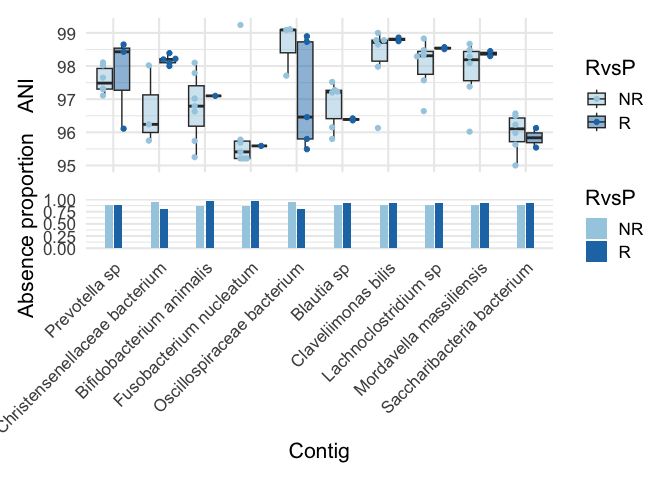
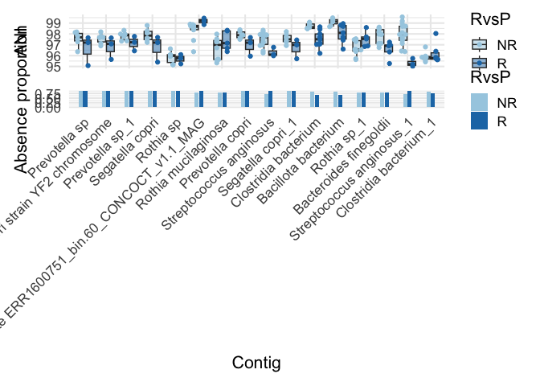
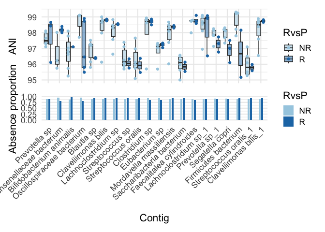
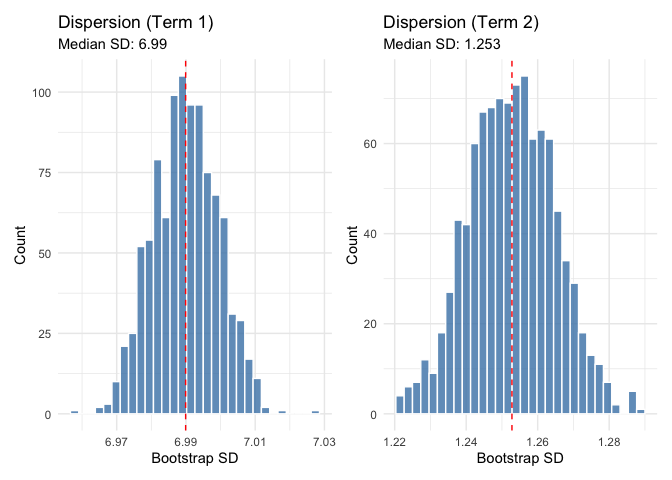
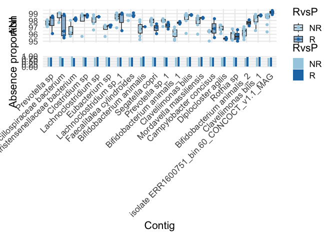
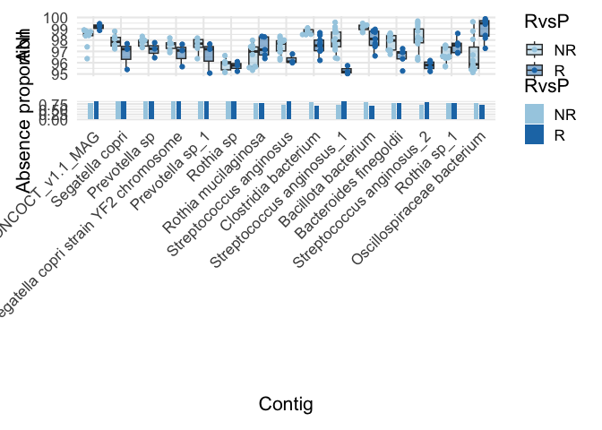
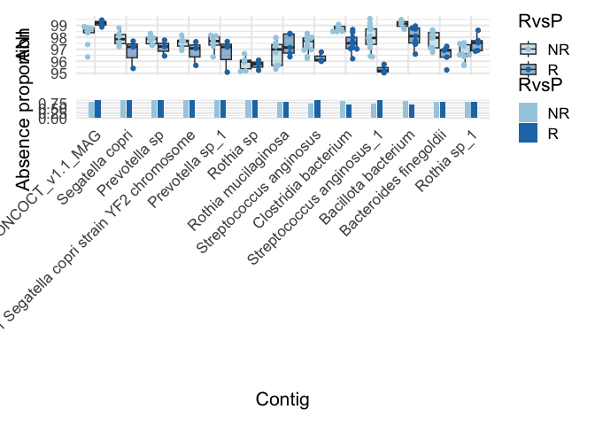
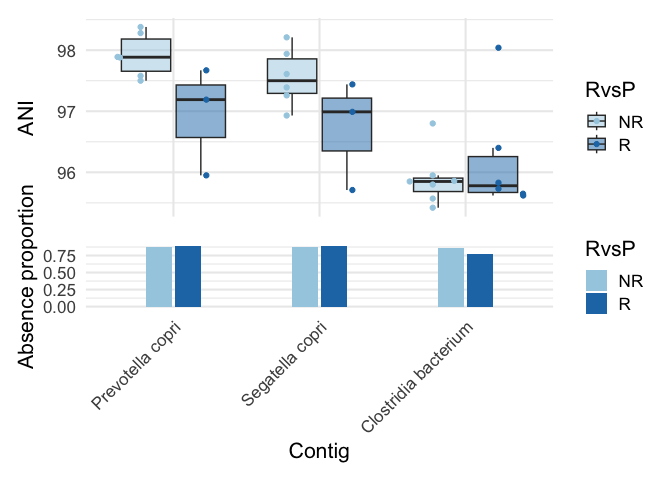
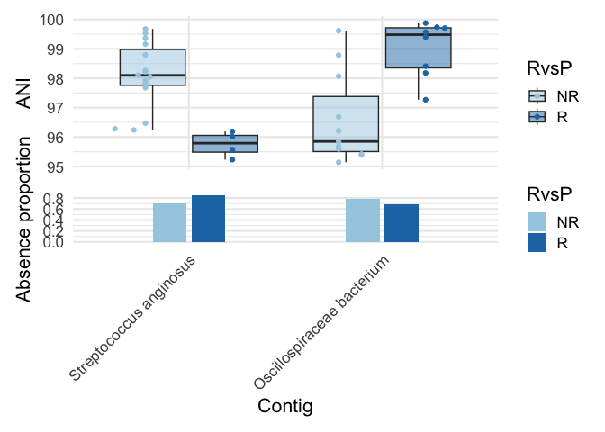

Re-analysing pancancer dataset with dispersion priors
================
2026-02-17

## Load dependencies

``` r
library(strainspy)
library(SummarizedExperiment)
library(caret)
library(glmnet) # elastic net
library(ranger) # RF
library(pROC)
library(doParallel)
library(foreach)
library(parallel)
library(ggplot2)
library(tidyr)
library(dplyr)
```

## Load metadata

``` r
# WARNING! THIS INCLUDES UNPIBLISHED DATA
meta_path <- "./data/ash_pancancer/metadata_full.tsv"
meta <- read.csv(meta_path, sep = '\t') 
meta = cbind(run_acc = meta$run_accession, meta)
# From paper:
# RvsP = CR or PR VS. PD or cPD - excluded patients with a BOR of stable disease (SD) (n=29)

# Outcome
meta$RvsP = "R"
meta$RvsP[which(meta$BOR == "PD" | meta$BOR == "cPD")] = "NR" 
meta$RvsP = factor(meta$RvsP, levels = c("NR", "R"))
```

## Load sylph outputs

``` r
sy <- read_sylph("./data/ash_pancancer/combined_q_99.tsv.gz") # q99)
```

    ## Detected Sylph query output file.

``` r
# annoying renames to match meta V sylph file
colnames(sy) <- gsub("_1", "", colnames(sy))
colData(sy)$Sample_file <- gsub("_1", "", basename(colData(sy)$Sample_file))

# Reorder meta 
meta = meta[match(colnames(sy), meta$run_accession), ]
# get rid of SD
rmidx = which(meta$BOR == "SD")
if(length(rmidx) > 0){
  meta = meta[-rmidx, ]
  sy = sy[, -rmidx]
}

sy <- filter_by_presence(sy, min_nonzero = 8) # filter at 10%
```

    ## Retained 19139 rows after filtering

``` r
dim(sy)
```

    ## [1] 19139    77

``` r
# Checks before merging metadata
all(colnames(sy) %in% meta$run_accession)
```

    ## [1] TRUE

``` r
all(meta$run_accession %in% colnames(sy))
```

    ## [1] TRUE

``` r
sy = modify_metadata(sy, meta)
```

## Empirical Bayes priors without dispersion term

``` r
design <- as.formula("~ RvsP + histology_cohort.x + age + sex + BMI") 

save_path <- "output_rds/ASH_prior_analysis_zib_q_99_ebp.rds"

if(file.exists(save_path)){
  ZB_fit <- readRDS(save_path)
} else {
  ebp = compute_eb_priors(sy, design, nthreads = parallel::detectCores(), low_cutoff = 0,
                          high_cutoff = Inf)
  # Run with weak prior for prediction
  ZB_fit <- glmZiBFit(sy, design, nthreads = parallel::detectCores(), MAP_prior = ebp)
  saveRDS(ZB_fit, save_path)
}
```

There are 167 top hits, some of them dodgy

``` r
th = top_hits(ZB_fit) 
```

    ## Found 167 tophits for RvsPR at alpha = 0.05 using holm

``` r
# Looking at the first 10
plot_ani_dist(sy, 'RvsP', th$Contig_name[1:10]) 
```

    ## Warning: Removed 689 rows containing non-finite outside the scale range
    ## (`stat_boxplot()`).

<!-- -->

Clearly, at least *B. animalis* and *F. nucleatum* should not be picked…

### Post-hoc testing

``` r
th_ph = estimate_effect_sizes(sy, ZB_fit, th)
```

    ##   |                                                                              |                                                                      |   0%

    ## Warning in finalizeTMB(TMBStruc, obj, fit, h, data.tmb.old): Model convergence
    ## problem; false convergence (8). See vignette('troubleshooting'),
    ## help('diagnose')

    ##   |                                                                              |                                                                      |   1%  |                                                                              |=                                                                     |   1%  |                                                                              |=                                                                     |   2%  |                                                                              |==                                                                    |   2%  |                                                                              |==                                                                    |   3%

    ## Warning in finalizeTMB(TMBStruc, obj, fit, h, data.tmb.old): Model convergence
    ## problem; false convergence (8). See vignette('troubleshooting'),
    ## help('diagnose')

    ##   |                                                                              |===                                                                   |   4%

    ## Warning in finalizeTMB(TMBStruc, obj, fit, h, data.tmb.old): Model convergence
    ## problem; false convergence (8). See vignette('troubleshooting'),
    ## help('diagnose')

    ##   |                                                                              |===                                                                   |   5%  |                                                                              |====                                                                  |   5%  |                                                                              |====                                                                  |   6%  |                                                                              |=====                                                                 |   7%

    ## Warning in finalizeTMB(TMBStruc, obj, fit, h, data.tmb.old): Model convergence
    ## problem; false convergence (8). See vignette('troubleshooting'),
    ## help('diagnose')

    ##   |                                                                              |=====                                                                 |   8%  |                                                                              |======                                                                |   8%  |                                                                              |======                                                                |   9%  |                                                                              |=======                                                               |  10%  |                                                                              |========                                                              |  11%  |                                                                              |========                                                              |  12%  |                                                                              |=========                                                             |  13%  |                                                                              |==========                                                            |  14%  |                                                                              |==========                                                            |  15%  |                                                                              |===========                                                           |  16%

    ## Warning in finalizeTMB(TMBStruc, obj, fit, h, data.tmb.old): Model convergence
    ## problem; false convergence (8). See vignette('troubleshooting'),
    ## help('diagnose')

    ##   |                                                                              |============                                                          |  17%  |                                                                              |=============                                                         |  18%  |                                                                              |=============                                                         |  19%  |                                                                              |==============                                                        |  20%  |                                                                              |===============                                                       |  21%  |                                                                              |===============                                                       |  22%  |                                                                              |================                                                      |  22%  |                                                                              |================                                                      |  23%

    ## Warning in finalizeTMB(TMBStruc, obj, fit, h, data.tmb.old): Model convergence
    ## problem; false convergence (8). See vignette('troubleshooting'),
    ## help('diagnose')

    ##   |                                                                              |=================                                                     |  24%  |                                                                              |=================                                                     |  25%  |                                                                              |==================                                                    |  25%  |                                                                              |==================                                                    |  26%  |                                                                              |===================                                                   |  27%  |                                                                              |===================                                                   |  28%  |                                                                              |====================                                                  |  28%  |                                                                              |====================                                                  |  29%  |                                                                              |=====================                                                 |  29%  |                                                                              |=====================                                                 |  30%  |                                                                              |=====================                                                 |  31%  |                                                                              |======================                                                |  31%  |                                                                              |======================                                                |  32%  |                                                                              |=======================                                               |  32%  |                                                                              |=======================                                               |  33%  |                                                                              |=======================                                               |  34%  |                                                                              |========================                                              |  34%  |                                                                              |========================                                              |  35%  |                                                                              |=========================                                             |  35%  |                                                                              |=========================                                             |  36%  |                                                                              |==========================                                            |  37%  |                                                                              |==========================                                            |  38%  |                                                                              |===========================                                           |  38%  |                                                                              |===========================                                           |  39%  |                                                                              |============================                                          |  40%  |                                                                              |=============================                                         |  41%  |                                                                              |=============================                                         |  42%

    ## Warning in finalizeTMB(TMBStruc, obj, fit, h, data.tmb.old): Model convergence
    ## problem; false convergence (8). See vignette('troubleshooting'),
    ## help('diagnose')

    ##   |                                                                              |==============================                                        |  43%  |                                                                              |===============================                                       |  44%  |                                                                              |===============================                                       |  45%  |                                                                              |================================                                      |  46%  |                                                                              |=================================                                     |  47%  |                                                                              |==================================                                    |  48%  |                                                                              |==================================                                    |  49%  |                                                                              |===================================                                   |  50%  |                                                                              |====================================                                  |  51%  |                                                                              |====================================                                  |  52%  |                                                                              |=====================================                                 |  53%  |                                                                              |======================================                                |  54%

    ## Warning in finalizeTMB(TMBStruc, obj, fit, h, data.tmb.old): Model convergence
    ## problem; false convergence (8). See vignette('troubleshooting'),
    ## help('diagnose')

    ##   |                                                                              |=======================================                               |  55%  |                                                                              |=======================================                               |  56%  |                                                                              |========================================                              |  57%  |                                                                              |=========================================                             |  58%  |                                                                              |=========================================                             |  59%  |                                                                              |==========================================                            |  60%  |                                                                              |===========================================                           |  61%  |                                                                              |===========================================                           |  62%  |                                                                              |============================================                          |  62%  |                                                                              |============================================                          |  63%  |                                                                              |=============================================                         |  64%  |                                                                              |=============================================                         |  65%  |                                                                              |==============================================                        |  65%  |                                                                              |==============================================                        |  66%  |                                                                              |===============================================                       |  66%  |                                                                              |===============================================                       |  67%  |                                                                              |===============================================                       |  68%  |                                                                              |================================================                      |  68%  |                                                                              |================================================                      |  69%  |                                                                              |=================================================                     |  69%  |                                                                              |=================================================                     |  70%  |                                                                              |=================================================                     |  71%  |                                                                              |==================================================                    |  71%  |                                                                              |==================================================                    |  72%  |                                                                              |===================================================                   |  72%  |                                                                              |===================================================                   |  73%  |                                                                              |====================================================                  |  74%  |                                                                              |====================================================                  |  75%  |                                                                              |=====================================================                 |  75%  |                                                                              |=====================================================                 |  76%  |                                                                              |======================================================                |  77%  |                                                                              |======================================================                |  78%  |                                                                              |=======================================================               |  78%  |                                                                              |=======================================================               |  79%  |                                                                              |========================================================              |  80%  |                                                                              |=========================================================             |  81%  |                                                                              |=========================================================             |  82%  |                                                                              |==========================================================            |  83%  |                                                                              |===========================================================           |  84%  |                                                                              |============================================================          |  85%  |                                                                              |============================================================          |  86%  |                                                                              |=============================================================         |  87%  |                                                                              |==============================================================        |  88%  |                                                                              |==============================================================        |  89%  |                                                                              |===============================================================       |  90%  |                                                                              |================================================================      |  91%  |                                                                              |================================================================      |  92%  |                                                                              |=================================================================     |  92%  |                                                                              |=================================================================     |  93%  |                                                                              |==================================================================    |  94%  |                                                                              |==================================================================    |  95%  |                                                                              |===================================================================   |  95%  |                                                                              |===================================================================   |  96%  |                                                                              |====================================================================  |  97%  |                                                                              |====================================================================  |  98%  |                                                                              |===================================================================== |  98%  |                                                                              |===================================================================== |  99%  |                                                                              |======================================================================|  99%  |                                                                              |======================================================================| 100%

``` r
table(th_ph$Comment, useNA = 'always') # now there are only 16 hits
```

    ## 
    ##                                failed convergence 
    ##                                                 1 
    ##               failed convergence; too few nonzero 
    ##                                                 2 
    ## failed convergence; too few nonzero; small effect 
    ##                                                 5 
    ##                                      small effect 
    ##                                                41 
    ##                                   too few nonzero 
    ##                                                54 
    ##                     too few nonzero; small effect 
    ##                                                48 
    ##                                              <NA> 
    ##                                                16

``` r
plot_ani_dist(sy, 'RvsP', th_ph$Contig_name[is.na(th_ph$Comment)]) 
```

    ## Warning: Removed 1031 rows containing non-finite outside the scale range
    ## (`stat_boxplot()`).

<!-- -->

## Empirical Bayes prior with dispersion terms

### Weak

``` r
save_path <- "output_rds/ASH_prior_analysis_zib_q_99_ebp_disp5.rds"
ebp = ZB_fit@priors # priors are the same

# manually add the dispersion parameter
ebp@priors_df = rbind(ebp@priors_df, data.frame(prior = 'normal(0,5)', class = 'fixef_disp', coef = 1))

ebp@priors_df
```

    ##             prior      class                  coef
    ## 1  normal(0,0.27)      fixef                 RvsPR
    ## 2  normal(0,0.35)      fixef histology_cohort.xNEN
    ## 3  normal(0,0.32)      fixef histology_cohort.xUGB
    ## 4  normal(0,0.18)      fixef                   age
    ## 5  normal(0,0.34)      fixef                  sexM
    ## 6  normal(0,0.12)      fixef                   BMI
    ## 7  normal(0,1.55)   fixef_zi                 RvsPR
    ## 8  normal(0,3.22)   fixef_zi histology_cohort.xNEN
    ## 9  normal(0,2.65)   fixef_zi histology_cohort.xUGB
    ## 10  normal(0,0.6)   fixef_zi                   age
    ## 11 normal(0,2.11)   fixef_zi                  sexM
    ## 12 normal(0,3.26)   fixef_zi                   BMI
    ## 13    normal(0,5) fixef_disp                     1

``` r
if(file.exists(save_path)){
  ZB_fit_d5 <- readRDS(save_path)
} else {
  ZB_fit_d5 <- glmZiBFit(sy, design, nthreads = parallel::detectCores(), MAP_prior = ebp)
  saveRDS(ZB_fit_d5, save_path)
}
```

    ##   |                                                                              |                                                                      |   0%  |                                                                              |=                                                                     |   1%  |                                                                              |=                                                                     |   2%  |                                                                              |==                                                                    |   3%  |                                                                              |===                                                                   |   4%  |                                                                              |====                                                                  |   5%  |                                                                              |====                                                                  |   6%  |                                                                              |=====                                                                 |   7%  |                                                                              |======                                                                |   8%  |                                                                              |=======                                                               |   9%  |                                                                              |=======                                                               |  10%  |                                                                              |========                                                              |  11%  |                                                                              |=========                                                             |  12%  |                                                                              |=========                                                             |  14%  |                                                                              |==========                                                            |  15%  |                                                                              |===========                                                           |  16%  |                                                                              |============                                                          |  17%  |                                                                              |============                                                          |  18%  |                                                                              |=============                                                         |  19%  |                                                                              |==============                                                        |  20%  |                                                                              |===============                                                       |  21%  |                                                                              |===============                                                       |  22%  |                                                                              |================                                                      |  23%  |                                                                              |=================                                                     |  24%  |                                                                              |==================                                                    |  25%  |                                                                              |==================                                                    |  26%  |                                                                              |===================                                                   |  27%  |                                                                              |====================                                                  |  28%  |                                                                              |====================                                                  |  29%  |                                                                              |=====================                                                 |  30%  |                                                                              |======================                                                |  31%  |                                                                              |=======================                                               |  32%  |                                                                              |=======================                                               |  33%  |                                                                              |========================                                              |  34%  |                                                                              |=========================                                             |  35%  |                                                                              |==========================                                            |  36%  |                                                                              |==========================                                            |  38%  |                                                                              |===========================                                           |  39%  |                                                                              |============================                                          |  40%  |                                                                              |============================                                          |  41%  |                                                                              |=============================                                         |  42%  |                                                                              |==============================                                        |  43%  |                                                                              |===============================                                       |  44%  |                                                                              |===============================                                       |  45%  |                                                                              |================================                                      |  46%  |                                                                              |=================================                                     |  47%  |                                                                              |==================================                                    |  48%  |                                                                              |==================================                                    |  49%  |                                                                              |===================================                                   |  50%  |                                                                              |====================================                                  |  51%  |                                                                              |====================================                                  |  52%  |                                                                              |=====================================                                 |  53%  |                                                                              |======================================                                |  54%  |                                                                              |=======================================                               |  55%  |                                                                              |=======================================                               |  56%  |                                                                              |========================================                              |  57%  |                                                                              |=========================================                             |  58%  |                                                                              |==========================================                            |  59%  |                                                                              |==========================================                            |  60%  |                                                                              |===========================================                           |  61%  |                                                                              |============================================                          |  62%  |                                                                              |============================================                          |  64%  |                                                                              |=============================================                         |  65%  |                                                                              |==============================================                        |  66%  |                                                                              |===============================================                       |  67%  |                                                                              |===============================================                       |  68%  |                                                                              |================================================                      |  69%  |                                                                              |=================================================                     |  70%  |                                                                              |==================================================                    |  71%  |                                                                              |==================================================                    |  72%  |                                                                              |===================================================                   |  73%  |                                                                              |====================================================                  |  74%  |                                                                              |====================================================                  |  75%  |                                                                              |=====================================================                 |  76%  |                                                                              |======================================================                |  77%  |                                                                              |=======================================================               |  78%  |                                                                              |=======================================================               |  79%  |                                                                              |========================================================              |  80%  |                                                                              |=========================================================             |  81%  |                                                                              |==========================================================            |  82%  |                                                                              |==========================================================            |  83%  |                                                                              |===========================================================           |  84%  |                                                                              |============================================================          |  85%  |                                                                              |=============================================================         |  86%  |                                                                              |=============================================================         |  88%  |                                                                              |==============================================================        |  89%  |                                                                              |===============================================================       |  90%  |                                                                              |===============================================================       |  91%  |                                                                              |================================================================      |  92%  |                                                                              |=================================================================     |  93%  |                                                                              |==================================================================    |  94%  |                                                                              |==================================================================    |  95%  |                                                                              |===================================================================   |  96%  |                                                                              |====================================================================  |  97%  |                                                                              |===================================================================== |  98%  |                                                                              |===================================================================== |  99%  |                                                                              |======================================================================| 100%
    ## 
    ## Fitting model...

``` r
th_d5 = top_hits(ZB_fit_d5)
```

    ## Found 150 tophits for RvsPR at alpha = 0.05 using holm

We still have 150 top hits, prior is likely too weak. Sensitivity
analysis:

``` r
plot_ani_dist(sy, 'RvsP', th_d5$Contig_name[1:20]) 
```

    ## Warning: Removed 1376 rows containing non-finite outside the scale range
    ## (`stat_boxplot()`).

<!-- -->

*B. animalis* is also still there…

### Strong

``` r
save_path <- "output_rds/ASH_prior_analysis_zib_q_99_ebp_disp1.rds"
ebp = ZB_fit@priors # priors are the same

# manually add the dispersion parameter
ebp@priors_df = rbind(ebp@priors_df, data.frame(prior = 'normal(0,1)', class = 'fixef_disp', coef = 1))

ebp@priors_df
```

    ##             prior      class                  coef
    ## 1  normal(0,0.27)      fixef                 RvsPR
    ## 2  normal(0,0.35)      fixef histology_cohort.xNEN
    ## 3  normal(0,0.32)      fixef histology_cohort.xUGB
    ## 4  normal(0,0.18)      fixef                   age
    ## 5  normal(0,0.34)      fixef                  sexM
    ## 6  normal(0,0.12)      fixef                   BMI
    ## 7  normal(0,1.55)   fixef_zi                 RvsPR
    ## 8  normal(0,3.22)   fixef_zi histology_cohort.xNEN
    ## 9  normal(0,2.65)   fixef_zi histology_cohort.xUGB
    ## 10  normal(0,0.6)   fixef_zi                   age
    ## 11 normal(0,2.11)   fixef_zi                  sexM
    ## 12 normal(0,3.26)   fixef_zi                   BMI
    ## 13    normal(0,1) fixef_disp                     1

``` r
if(file.exists(save_path)){
  ZB_fit_d1 <- readRDS(save_path)
} else {
  ZB_fit_d1 <- glmZiBFit(sy, design, nthreads = parallel::detectCores(), MAP_prior = ebp)
  saveRDS(ZB_fit_d1, save_path)
}

th_d1 = top_hits(ZB_fit_d1)
```

    ## Warning in top_hits(ZB_fit_d1): Multiple testing correction using `holm`: No
    ## significant associations detected for coef = 2 at alpha = 0.050000

Now there are no hits. This has killed all signal. Let’s try with an
empirical approach.

### Ebp prior

``` r
save_path <- "output_rds/ASH_prior_analysis_zib_q_99_ebp_disp_ebp.rds"
ebp =  compute_eb_priors(sy, design, nthreads = parallel::detectCores(), low_cutoff = 0,
                          high_cutoff = Inf, est_disperion_prior = T)
```

    ## Computing fixef_zi priors...
    ##   |                                                                              |                                                                      |   0%  |                                                                              |==                                                                    |   3%  |                                                                              |====                                                                  |   5%  |                                                                              |=====                                                                 |   8%  |                                                                              |=======                                                               |  10%  |                                                                              |=========                                                             |  13%  |                                                                              |===========                                                           |  15%  |                                                                              |=============                                                         |  18%  |                                                                              |==============                                                        |  21%  |                                                                              |================                                                      |  23%  |                                                                              |==================                                                    |  26%  |                                                                              |====================                                                  |  28%  |                                                                              |======================                                                |  31%  |                                                                              |=======================                                               |  33%  |                                                                              |=========================                                             |  36%  |                                                                              |===========================                                           |  38%  |                                                                              |=============================                                         |  41%  |                                                                              |===============================                                       |  44%  |                                                                              |================================                                      |  46%  |                                                                              |==================================                                    |  49%  |                                                                              |====================================                                  |  51%  |                                                                              |======================================                                |  54%  |                                                                              |=======================================                               |  56%  |                                                                              |=========================================                             |  59%  |                                                                              |===========================================                           |  62%  |                                                                              |=============================================                         |  64%  |                                                                              |===============================================                       |  67%  |                                                                              |================================================                      |  69%  |                                                                              |==================================================                    |  72%  |                                                                              |====================================================                  |  74%  |                                                                              |======================================================                |  77%  |                                                                              |========================================================              |  79%  |                                                                              |=========================================================             |  82%  |                                                                              |===========================================================           |  85%  |                                                                              |=============================================================         |  87%  |                                                                              |===============================================================       |  90%  |                                                                              |=================================================================     |  92%  |                                                                              |==================================================================    |  95%  |                                                                              |====================================================================  |  97%  |                                                                              |======================================================================| 100%
    ## 
    ##   |                                                                              |                                                                      |   0%  |                                                                              |==========                                                            |  14%  |                                                                              |====================                                                  |  29%  |                                                                              |==============================                                        |  43%  |                                                                              |========================================                              |  57%  |                                                                              |==================================================                    |  71%  |                                                                              |============================================================          |  86%  |                                                                              |======================================================================| 100%
    ## 
    ## Computing fixef priors...
    ##   |                                                                              |                                                                      |   0%  |                                                                              |==                                                                    |   3%  |                                                                              |====                                                                  |   5%  |                                                                              |=====                                                                 |   8%  |                                                                              |=======                                                               |  10%  |                                                                              |=========                                                             |  13%  |                                                                              |===========                                                           |  15%  |                                                                              |=============                                                         |  18%  |                                                                              |==============                                                        |  21%  |                                                                              |================                                                      |  23%  |                                                                              |==================                                                    |  26%  |                                                                              |====================                                                  |  28%  |                                                                              |======================                                                |  31%  |                                                                              |=======================                                               |  33%  |                                                                              |=========================                                             |  36%  |                                                                              |===========================                                           |  38%  |                                                                              |=============================                                         |  41%  |                                                                              |===============================                                       |  44%  |                                                                              |================================                                      |  46%  |                                                                              |==================================                                    |  49%  |                                                                              |====================================                                  |  51%  |                                                                              |======================================                                |  54%  |                                                                              |=======================================                               |  56%  |                                                                              |=========================================                             |  59%  |                                                                              |===========================================                           |  62%  |                                                                              |=============================================                         |  64%  |                                                                              |===============================================                       |  67%  |                                                                              |================================================                      |  69%  |                                                                              |==================================================                    |  72%  |                                                                              |====================================================                  |  74%  |                                                                              |======================================================                |  77%  |                                                                              |========================================================              |  79%  |                                                                              |=========================================================             |  82%  |                                                                              |===========================================================           |  85%  |                                                                              |=============================================================         |  87%  |                                                                              |===============================================================       |  90%  |                                                                              |=================================================================     |  92%  |                                                                              |==================================================================    |  95%  |                                                                              |====================================================================  |  97%  |                                                                              |======================================================================| 100%
    ## 
    ##   |                                                                              |                                                                      |   0%  |                                                                              |==========                                                            |  14%  |                                                                              |====================                                                  |  29%  |                                                                              |==============================                                        |  43%  |                                                                              |========================================                              |  57%  |                                                                              |==================================================                    |  71%  |                                                                              |============================================================          |  86%  |                                                                              |======================================================================| 100%

``` r
plot_prior_bootstrap(ebp, 'dispersion')
```

<!-- -->

``` r
ebp@priors_df
```

    ##                prior      class                  coef
    ## 1     normal(0,0.27)      fixef                 RvsPR
    ## 2     normal(0,0.35)      fixef histology_cohort.xNEN
    ## 3     normal(0,0.32)      fixef histology_cohort.xUGB
    ## 4     normal(0,0.18)      fixef                   age
    ## 5     normal(0,0.34)      fixef                  sexM
    ## 6     normal(0,0.12)      fixef                   BMI
    ## 7     normal(0,1.55)   fixef_zi                 RvsPR
    ## 8     normal(0,3.21)   fixef_zi histology_cohort.xNEN
    ## 9     normal(0,2.65)   fixef_zi histology_cohort.xUGB
    ## 10     normal(0,0.6)   fixef_zi                   age
    ## 11    normal(0,2.11)   fixef_zi                  sexM
    ## 12    normal(0,3.26)   fixef_zi                   BMI
    ## 13 normal(6.99,1.25) fixef_disp                     1

``` r
if(file.exists(save_path)){
  ZB_fit_d_ebp <- readRDS(save_path)
} else {
  ZB_fit_d_ebp <- glmZiBFit(sy, design, nthreads = parallel::detectCores(), MAP_prior = ebp)
  saveRDS(ZB_fit_d_ebp, save_path)
}
```

    ##   |                                                                              |                                                                      |   0%  |                                                                              |=                                                                     |   1%  |                                                                              |=                                                                     |   2%  |                                                                              |==                                                                    |   3%  |                                                                              |===                                                                   |   4%  |                                                                              |====                                                                  |   5%  |                                                                              |====                                                                  |   6%  |                                                                              |=====                                                                 |   7%  |                                                                              |======                                                                |   8%  |                                                                              |=======                                                               |   9%  |                                                                              |=======                                                               |  10%  |                                                                              |========                                                              |  11%  |                                                                              |=========                                                             |  12%  |                                                                              |=========                                                             |  14%  |                                                                              |==========                                                            |  15%  |                                                                              |===========                                                           |  16%  |                                                                              |============                                                          |  17%  |                                                                              |============                                                          |  18%  |                                                                              |=============                                                         |  19%  |                                                                              |==============                                                        |  20%  |                                                                              |===============                                                       |  21%  |                                                                              |===============                                                       |  22%  |                                                                              |================                                                      |  23%  |                                                                              |=================                                                     |  24%  |                                                                              |==================                                                    |  25%  |                                                                              |==================                                                    |  26%  |                                                                              |===================                                                   |  27%  |                                                                              |====================                                                  |  28%  |                                                                              |====================                                                  |  29%  |                                                                              |=====================                                                 |  30%  |                                                                              |======================                                                |  31%  |                                                                              |=======================                                               |  32%  |                                                                              |=======================                                               |  33%  |                                                                              |========================                                              |  34%  |                                                                              |=========================                                             |  35%  |                                                                              |==========================                                            |  36%  |                                                                              |==========================                                            |  38%  |                                                                              |===========================                                           |  39%  |                                                                              |============================                                          |  40%  |                                                                              |============================                                          |  41%  |                                                                              |=============================                                         |  42%  |                                                                              |==============================                                        |  43%  |                                                                              |===============================                                       |  44%  |                                                                              |===============================                                       |  45%  |                                                                              |================================                                      |  46%  |                                                                              |=================================                                     |  47%  |                                                                              |==================================                                    |  48%  |                                                                              |==================================                                    |  49%  |                                                                              |===================================                                   |  50%  |                                                                              |====================================                                  |  51%  |                                                                              |====================================                                  |  52%  |                                                                              |=====================================                                 |  53%  |                                                                              |======================================                                |  54%  |                                                                              |=======================================                               |  55%  |                                                                              |=======================================                               |  56%  |                                                                              |========================================                              |  57%  |                                                                              |=========================================                             |  58%  |                                                                              |==========================================                            |  59%  |                                                                              |==========================================                            |  60%  |                                                                              |===========================================                           |  61%  |                                                                              |============================================                          |  62%  |                                                                              |============================================                          |  64%  |                                                                              |=============================================                         |  65%  |                                                                              |==============================================                        |  66%  |                                                                              |===============================================                       |  67%  |                                                                              |===============================================                       |  68%  |                                                                              |================================================                      |  69%  |                                                                              |=================================================                     |  70%  |                                                                              |==================================================                    |  71%  |                                                                              |==================================================                    |  72%  |                                                                              |===================================================                   |  73%  |                                                                              |====================================================                  |  74%  |                                                                              |====================================================                  |  75%  |                                                                              |=====================================================                 |  76%  |                                                                              |======================================================                |  77%  |                                                                              |=======================================================               |  78%  |                                                                              |=======================================================               |  79%  |                                                                              |========================================================              |  80%  |                                                                              |=========================================================             |  81%  |                                                                              |==========================================================            |  82%  |                                                                              |==========================================================            |  83%  |                                                                              |===========================================================           |  84%  |                                                                              |============================================================          |  85%  |                                                                              |=============================================================         |  86%  |                                                                              |=============================================================         |  88%  |                                                                              |==============================================================        |  89%  |                                                                              |===============================================================       |  90%  |                                                                              |===============================================================       |  91%  |                                                                              |================================================================      |  92%  |                                                                              |=================================================================     |  93%  |                                                                              |==================================================================    |  94%  |                                                                              |==================================================================    |  95%  |                                                                              |===================================================================   |  96%  |                                                                              |====================================================================  |  97%  |                                                                              |===================================================================== |  98%  |                                                                              |===================================================================== |  99%  |                                                                              |======================================================================| 100%
    ## 
    ## Fitting model...

``` r
th_debp = top_hits(ZB_fit_d_ebp)
```

    ## Found 97 tophits for RvsPR at alpha = 0.05 using holm

Down to 97 hits…

``` r
plot_ani_dist(sy, 'RvsP', th_debp$Contig_name[1:20]) 
```

    ## Warning: Removed 1367 rows containing non-finite outside the scale range
    ## (`stat_boxplot()`).

<!-- -->

Not enough to kill *B. animalis* though…

### Post-hoc testing

``` r
th_debp_ph = estimate_effect_sizes(sy, ZB_fit, th_debp)
```

    ##   |                                                                              |                                                                      |   0%

    ## Warning in finalizeTMB(TMBStruc, obj, fit, h, data.tmb.old): Model convergence
    ## problem; false convergence (8). See vignette('troubleshooting'),
    ## help('diagnose')

    ##   |                                                                              |=                                                                     |   1%  |                                                                              |=                                                                     |   2%  |                                                                              |==                                                                    |   3%  |                                                                              |===                                                                   |   4%

    ## Warning in finalizeTMB(TMBStruc, obj, fit, h, data.tmb.old): Model convergence
    ## problem; false convergence (8). See vignette('troubleshooting'),
    ## help('diagnose')

    ##   |                                                                              |====                                                                  |   5%  |                                                                              |====                                                                  |   6%  |                                                                              |=====                                                                 |   7%  |                                                                              |======                                                                |   8%  |                                                                              |======                                                                |   9%  |                                                                              |=======                                                               |  10%  |                                                                              |========                                                              |  11%  |                                                                              |=========                                                             |  12%  |                                                                              |=========                                                             |  13%  |                                                                              |==========                                                            |  14%  |                                                                              |===========                                                           |  15%  |                                                                              |============                                                          |  16%  |                                                                              |============                                                          |  18%  |                                                                              |=============                                                         |  19%  |                                                                              |==============                                                        |  20%  |                                                                              |==============                                                        |  21%

    ## Warning in finalizeTMB(TMBStruc, obj, fit, h, data.tmb.old): Model convergence
    ## problem; false convergence (8). See vignette('troubleshooting'),
    ## help('diagnose')

    ##   |                                                                              |===============                                                       |  22%  |                                                                              |================                                                      |  23%  |                                                                              |=================                                                     |  24%  |                                                                              |=================                                                     |  25%  |                                                                              |==================                                                    |  26%  |                                                                              |===================                                                   |  27%  |                                                                              |===================                                                   |  28%  |                                                                              |====================                                                  |  29%  |                                                                              |=====================                                                 |  30%  |                                                                              |======================                                                |  31%  |                                                                              |======================                                                |  32%  |                                                                              |=======================                                               |  33%  |                                                                              |========================                                              |  34%  |                                                                              |=========================                                             |  35%  |                                                                              |=========================                                             |  36%  |                                                                              |==========================                                            |  37%  |                                                                              |===========================                                           |  38%  |                                                                              |===========================                                           |  39%  |                                                                              |============================                                          |  40%  |                                                                              |=============================                                         |  41%

    ## Warning in finalizeTMB(TMBStruc, obj, fit, h, data.tmb.old): Model convergence
    ## problem; false convergence (8). See vignette('troubleshooting'),
    ## help('diagnose')

    ##   |                                                                              |==============================                                        |  42%  |                                                                              |==============================                                        |  43%  |                                                                              |===============================                                       |  44%  |                                                                              |================================                                      |  45%  |                                                                              |================================                                      |  46%  |                                                                              |=================================                                     |  47%  |                                                                              |==================================                                    |  48%  |                                                                              |===================================                                   |  49%  |                                                                              |===================================                                   |  51%  |                                                                              |====================================                                  |  52%  |                                                                              |=====================================                                 |  53%  |                                                                              |======================================                                |  54%  |                                                                              |======================================                                |  55%  |                                                                              |=======================================                               |  56%  |                                                                              |========================================                              |  57%  |                                                                              |========================================                              |  58%  |                                                                              |=========================================                             |  59%  |                                                                              |==========================================                            |  60%  |                                                                              |===========================================                           |  61%  |                                                                              |===========================================                           |  62%  |                                                                              |============================================                          |  63%  |                                                                              |=============================================                         |  64%  |                                                                              |=============================================                         |  65%  |                                                                              |==============================================                        |  66%  |                                                                              |===============================================                       |  67%  |                                                                              |================================================                      |  68%  |                                                                              |================================================                      |  69%  |                                                                              |=================================================                     |  70%  |                                                                              |==================================================                    |  71%  |                                                                              |===================================================                   |  72%  |                                                                              |===================================================                   |  73%  |                                                                              |====================================================                  |  74%  |                                                                              |=====================================================                 |  75%  |                                                                              |=====================================================                 |  76%  |                                                                              |======================================================                |  77%  |                                                                              |=======================================================               |  78%  |                                                                              |========================================================              |  79%  |                                                                              |========================================================              |  80%  |                                                                              |=========================================================             |  81%  |                                                                              |==========================================================            |  82%  |                                                                              |==========================================================            |  84%  |                                                                              |===========================================================           |  85%  |                                                                              |============================================================          |  86%  |                                                                              |=============================================================         |  87%  |                                                                              |=============================================================         |  88%  |                                                                              |==============================================================        |  89%  |                                                                              |===============================================================       |  90%  |                                                                              |================================================================      |  91%  |                                                                              |================================================================      |  92%  |                                                                              |=================================================================     |  93%  |                                                                              |==================================================================    |  94%  |                                                                              |==================================================================    |  95%  |                                                                              |===================================================================   |  96%  |                                                                              |====================================================================  |  97%  |                                                                              |===================================================================== |  98%  |                                                                              |===================================================================== |  99%  |                                                                              |======================================================================| 100%

``` r
table(th_debp_ph$Comment, useNA = 'always') # now there are only 15 hits, one less from before
```

    ## 
    ##                                failed convergence 
    ##                                                 1 
    ##               failed convergence; too few nonzero 
    ##                                                 1 
    ## failed convergence; too few nonzero; small effect 
    ##                                                 2 
    ##                                      small effect 
    ##                                                21 
    ##                                   too few nonzero 
    ##                                                35 
    ##                     too few nonzero; small effect 
    ##                                                22 
    ##                                              <NA> 
    ##                                                15

``` r
plot_ani_dist(sy, 'RvsP', th_debp_ph$Contig_name[is.na(th_debp_ph$Comment)]) 
```

    ## Warning: Removed 947 rows containing non-finite outside the scale range
    ## (`stat_boxplot()`).

<!-- -->

### Common/different hits

``` r
disp_hits = th_debp_ph$Contig_name[is.na(th_debp_ph$Comment)]
ndisp_hits = th_ph$Contig_name[is.na(th_ph$Comment)]

# Common ones
plot_ani_dist(sy, 'RvsP', intersect(disp_hits,ndisp_hits))
```

    ## Warning: Removed 831 rows containing non-finite outside the scale range
    ## (`stat_boxplot()`).

<!-- -->

``` r
# Only in model without dispersion prior:
plot_ani_dist(sy, 'RvsP', setdiff(ndisp_hits, disp_hits))
```

    ## Warning: Removed 200 rows containing non-finite outside the scale range
    ## (`stat_boxplot()`).

<!-- -->

``` r
# Only in model WITH dispersion prior:
plot_ani_dist(sy, 'RvsP', setdiff(disp_hits, ndisp_hits))
```

    ## Warning: Removed 116 rows containing non-finite outside the scale range
    ## (`stat_boxplot()`).

<!-- -->
