Simulations with spiked P. dis strain analysed using Sylph Query
================
2026-04-15

### Load data and prepare for testing

``` r
library(strainspy)
# Queries
d_q99 <- read_sylph("p_distasonis_sims/pdis_q99.tsv")
```

    ## Detected Sylph query output file.

``` r
# spiked samples
ss = readLines("p_distasonis_sims/spike_genome_ids.txt") # These are the baseline samples, not spiked
ss_spikes = c(paste(ss, "_sx1", sep = ""), paste(ss, "_sx3", sep = ""), paste(ss, "_sx5", sep = "")) # These are the spikes

# Remove _1 annoyance
colnames(d_q99) = sub("_1", "", colnames(d_q99))
d_q99@colData$Sample_file = sub("_1", "", colnames(d_q99))

# add the metadata
d_q99 = strainspy:::modify_metadata(se = d_q99, meta_data = data.frame(run_accession = colnames(d_q99),
                                                                       spiked = as.factor(sapply(colnames(d_q99), function(x) x%in% c(ss, ss_spikes)))))

# I am marking the baseline unspiked ones as spiked to show the null doesn't detect anything

d_q99 <- filter_by_presence(d_q99, min_nonzero = 25)
```

    ## Retained 16081 rows after filtering

``` r
# taxonomies
tax_99 = read_taxonomy("data/TAXONOMY/sylph_DB_taxonomy_99.tsv")

design <- as.formula(" ~ spiked")
```

## Fit ZIB model

### query 99, baseline (no signal)

``` r
# This simulation does not have any signal, we shouldn't detect anything!

# Subset
dim(d_q99)
```

    ## [1] 16081   160

``` r
rm_idx = grep("_sx", colnames(d_q99))
d_q99_test = d_q99[,-rm_idx]
dim(d_q99_test)
```

    ## [1] 16081   100

``` r
# These TRUE = 20 are NOT spiked in, this is just to show there is no detectable signal
table(d_q99_test@colData$spiked) 
```

    ## 
    ## FALSE  TRUE 
    ##    80    20

``` r
save_path = "output_rds/spike_pdis_zib_q_99_bl.rds"
if(file.exists(save_path)){
  fit_zib_99_bl <- readRDS(save_path)
} else {
  system.time({
    ebp = compute_eb_priors(d_q99_test, design, nthreads = parallel::detectCores())
    fit_zib_99_bl <- glmZiBFit(d_q99_test, design, nthreads = parallel::detectCores(), MAP_prior = ebp)
  })
  saveRDS(fit_zib_99_bl, save_path)
}

top_hits(fit_zib_99_bl) # no hits as expected
```

    ## Warning in top_hits(fit_zib_99_bl): Multiple testing correction using `holm`:
    ## No significant associations detected for coef = 2 at alpha = 0.050000

    ## # A tibble: 0 × 10
    ## # ℹ 10 variables: Contig_name <chr>, Genome_file <chr>, coefficient <dbl>,
    ## #   std_error <dbl>, p_value <dbl>, p_adjust <dbl>, zi_coefficient <dbl>,
    ## #   zi_std_error <dbl>, zi_p_value <dbl>, zi_p_adjust <dbl>

### query 99, cov1x

``` r
# baseline false samples and higher coverage ones
rm_idx = c(sapply(ss, function(x) which(colnames(d_q99) %in% x)), grep("_sx3", colnames(d_q99)), grep("_sx5", colnames(d_q99)))
d_q99_test = d_q99[,-rm_idx]
dim(d_q99_test)
```

    ## [1] 16081   100

``` r
# These 20 are spiked ata coverage of 1x
table(d_q99_test@colData$spiked) 
```

    ## 
    ## FALSE  TRUE 
    ##    80    20

``` r
save_path = "output_rds/spike_pdis_zib_q_99_cov1x.rds"
if(file.exists(save_path)){
  fit_zib_99_c1 <- readRDS(save_path)
} else {
  system.time({
    ebp = compute_eb_priors(d_q99_test, design, nthreads = parallel::detectCores())
    fit_zib_99_c1 <- glmZiBFit(d_q99_test, design, nthreads = parallel::detectCores(), MAP_prior = ebp)
  })
  saveRDS(fit_zib_99_c1, save_path)
}

th_c1 = strainspy:::add_tax2tophits(top_hits(fit_zib_99_c1), tax_99)
```

    ## Found 76 tophits for spikedTRUE at alpha = 0.05 using holm

``` r
# All 76 hits from the same species
table(th_c1$Species)
```

    ## 
    ##   Parabacteroides distasonis Parabacteroides distasonis_A 
    ##                           55                           21

``` r
plot_manhattan(fit_zib_99_c1, taxonomy = tax_99, method = "BH", tax_levels = c("Order", "Phylum", "Genus", "Species"))
```

    ## ! # Invaild edge matrix for <phylo>. A <tbl_df> is returned.
    ## ! # Invaild edge matrix for <phylo>. A <tbl_df> is returned.
    ## ! # Invaild edge matrix for <phylo>. A <tbl_df> is returned.
    ## ! # Invaild edge matrix for <phylo>. A <tbl_df> is returned.

    ## Warning: Using `size` aesthetic for lines was deprecated in ggplot2 3.4.0.
    ## ℹ Please use `linewidth` instead.
    ## ℹ The deprecated feature was likely used in the strainspy package.
    ##   Please report the issue to the authors.
    ## This warning is displayed once per session.
    ## Call `lifecycle::last_lifecycle_warnings()` to see where this warning was
    ## generated.


``` r
plot_manhattan(fit_zib_99_c1, taxonomy = tax_99, aggregate_by_taxa = F)
```

    ## ! # Invaild edge matrix for <phylo>. A <tbl_df> is returned.
    ## ! # Invaild edge matrix for <phylo>. A <tbl_df> is returned.
    ## ! # Invaild edge matrix for <phylo>. A <tbl_df> is returned.
    ## ! # Invaild edge matrix for <phylo>. A <tbl_df> is returned.
    ## ! # Invaild edge matrix for <phylo>. A <tbl_df> is returned.
    ## ! # Invaild edge matrix for <phylo>. A <tbl_df> is returned.

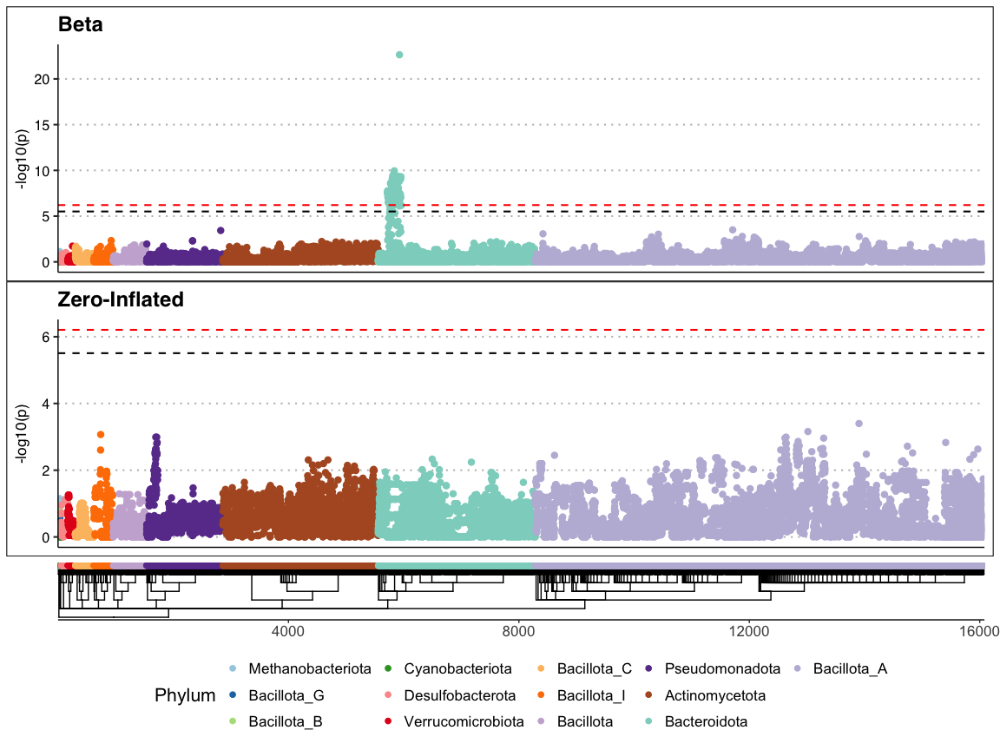

``` r
plot_volcano(fit_zib_99_c1, label = T)
```

    ## Found 16081 tophits for spikedTRUE at alpha = 1 using holm

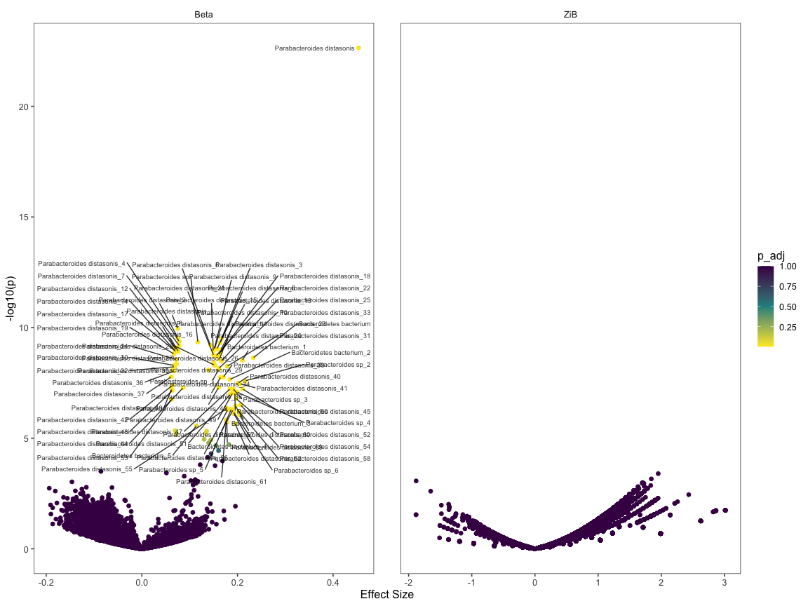

``` r
plot_ani_dist(d_q99, phenotype = 'spiked', contigs = th_c1$Contig_name[1:5], contig_names = th_c1$Genome_file[1:5])
```

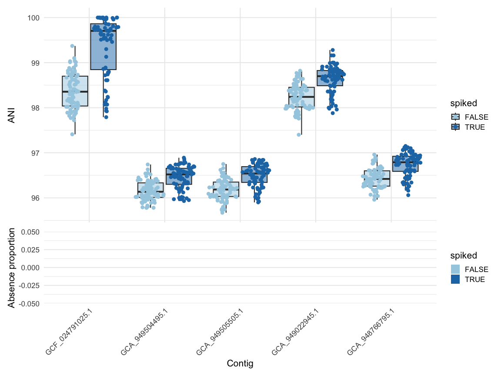

``` r
# Parabacteroides distasonis is in all samples, so, this can only be a beta hit!
# GCF_024791025.1 is the top hit - it is the spiked strain. And for the spiked samples, the ANI is 100%
```

### query 99, cov3x

``` r
# baseline false samples and higher coverage ones
rm_idx = c(sapply(ss, function(x) which(colnames(d_q99) %in% x)), grep("_sx1", colnames(d_q99)), grep("_sx5", colnames(d_q99)))
d_q99_test = d_q99[,-rm_idx]
dim(d_q99_test)
```

    ## [1] 16081   100

``` r
# These 20 are spiked ata coverage of 3x
table(d_q99_test@colData$spiked) 
```

    ## 
    ## FALSE  TRUE 
    ##    80    20

``` r
save_path = "output_rds/spike_pdis_zib_q_99_cov3x.rds"
if(file.exists(save_path)){
  fit_zib_99_c3 <- readRDS(save_path)
} else {
  system.time({
    ebp = compute_eb_priors(d_q99_test, design, nthreads = parallel::detectCores())
    fit_zib_99_c3 <- glmZiBFit(d_q99_test, design, nthreads = parallel::detectCores(), MAP_prior = ebp)
  })
  saveRDS(fit_zib_99_c3, save_path)
}

th_c3 = strainspy:::add_tax2tophits(top_hits(fit_zib_99_c3), tax_99)
```

    ## Found 91 tophits for spikedTRUE at alpha = 0.05 using holm

``` r
# All 91 hits from the same species
table(th_c3$Species)
```

    ## 
    ##   Parabacteroides distasonis Parabacteroides distasonis_A 
    ##                           70                           21

``` r
plot_manhattan(fit_zib_99_c3, taxonomy = tax_99, method = "BH", tax_levels = c("Order", "Phylum", "Genus", "Species"))
```

    ## ! # Invaild edge matrix for <phylo>. A <tbl_df> is returned.
    ## ! # Invaild edge matrix for <phylo>. A <tbl_df> is returned.
    ## ! # Invaild edge matrix for <phylo>. A <tbl_df> is returned.
    ## ! # Invaild edge matrix for <phylo>. A <tbl_df> is returned.

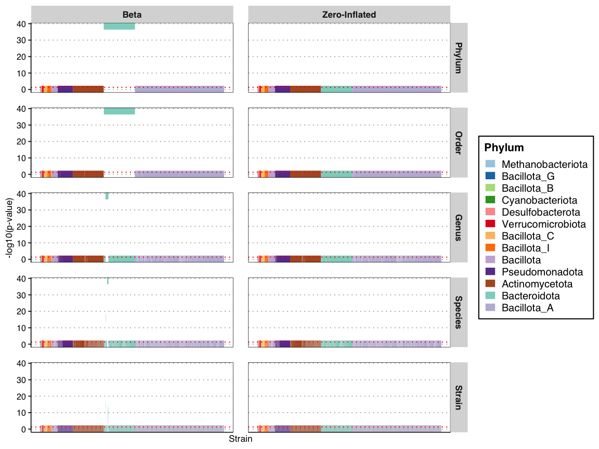

``` r
plot_manhattan(fit_zib_99_c3, taxonomy = tax_99, aggregate_by_taxa = F)
```

    ## ! # Invaild edge matrix for <phylo>. A <tbl_df> is returned.
    ## ! # Invaild edge matrix for <phylo>. A <tbl_df> is returned.
    ## ! # Invaild edge matrix for <phylo>. A <tbl_df> is returned.
    ## ! # Invaild edge matrix for <phylo>. A <tbl_df> is returned.
    ## ! # Invaild edge matrix for <phylo>. A <tbl_df> is returned.
    ## ! # Invaild edge matrix for <phylo>. A <tbl_df> is returned.

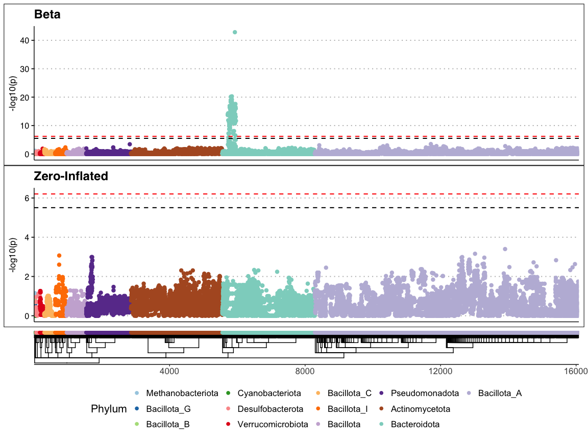

``` r
plot_volcano(fit_zib_99_c3, label = T)
```

    ## Found 16081 tophits for spikedTRUE at alpha = 1 using holm

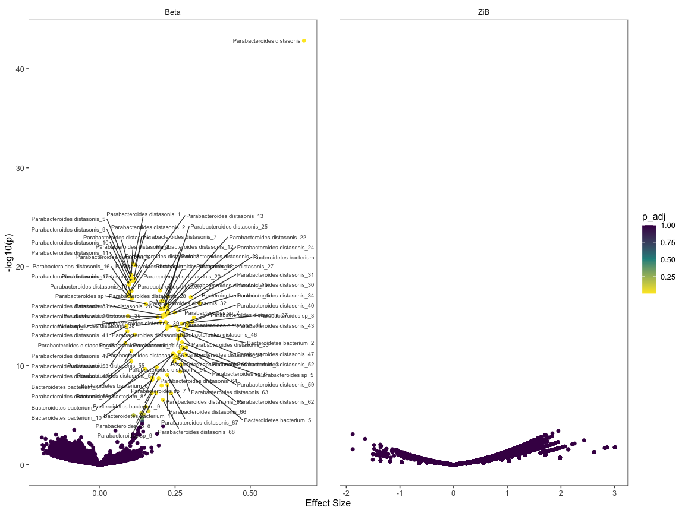

``` r
plot_ani_dist(d_q99, phenotype = 'spiked', contigs = th_c3$Contig_name[1:5], contig_names = th_c3$Genome_file[1:5])
```


``` r
# Parabacteroides distasonis is in all samples, so, this can only be a beta hit!
# GCF_024791025.1 is the top hit - it is the spiked strain. And for the spiked samples, the ANI is 100%
```

### query 99, cov5x

``` r
# baseline false samples and higher coverage ones
rm_idx = c(sapply(ss, function(x) which(colnames(d_q99) %in% x)), grep("_sx1", colnames(d_q99)), grep("_sx3", colnames(d_q99)))
d_q99_test = d_q99[,-rm_idx]
dim(d_q99_test)
```

    ## [1] 16081   100

``` r
# These 20 are spiked ata coverage of 3x
table(d_q99_test@colData$spiked) 
```

    ## 
    ## FALSE  TRUE 
    ##    80    20

``` r
save_path = "output_rds/spike_pdis_zib_q_99_cov5x.rds"
if(file.exists(save_path)){
  fit_zib_99_c5 <- readRDS(save_path)
} else {
  system.time({
    ebp = compute_eb_priors(d_q99_test, design, nthreads = parallel::detectCores())
    fit_zib_99_c5 <- glmZiBFit(d_q99_test, design, nthreads = parallel::detectCores(), MAP_prior = ebp)
  })
  saveRDS(fit_zib_99_c5, save_path)
}

th_c5 = strainspy:::add_tax2tophits(top_hits(fit_zib_99_c5), tax_99)
```

    ## Found 78 tophits for spikedTRUE at alpha = 0.05 using holm

``` r
# All 91 hits from the same species
table(th_c5$Species)
```

    ## 
    ##   Parabacteroides distasonis Parabacteroides distasonis_A 
    ##                           57                           21

``` r
plot_manhattan(fit_zib_99_c5, taxonomy = tax_99, method = "BH", tax_levels = c("Order", "Phylum", "Genus", "Species"))
```

    ## ! # Invaild edge matrix for <phylo>. A <tbl_df> is returned.
    ## ! # Invaild edge matrix for <phylo>. A <tbl_df> is returned.
    ## ! # Invaild edge matrix for <phylo>. A <tbl_df> is returned.
    ## ! # Invaild edge matrix for <phylo>. A <tbl_df> is returned.

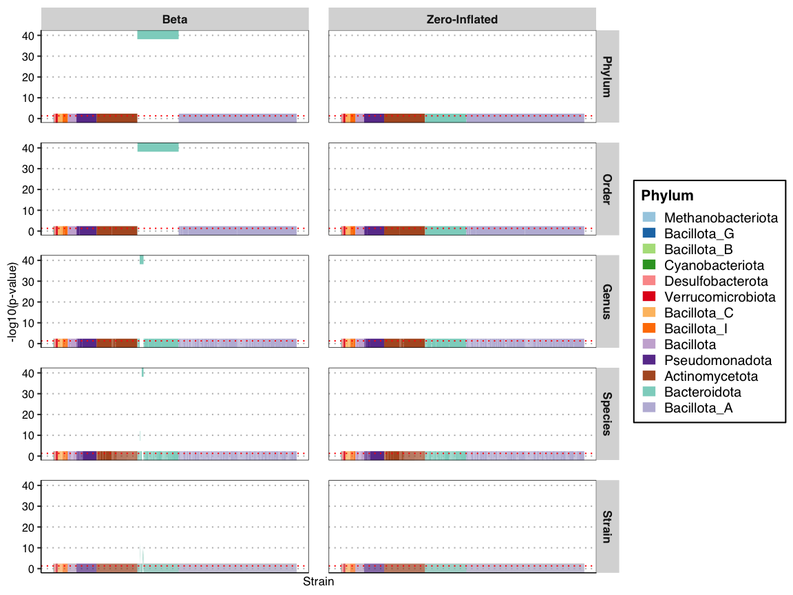

``` r
plot_manhattan(fit_zib_99_c5, taxonomy = tax_99, aggregate_by_taxa = F)
```

    ## ! # Invaild edge matrix for <phylo>. A <tbl_df> is returned.
    ## ! # Invaild edge matrix for <phylo>. A <tbl_df> is returned.
    ## ! # Invaild edge matrix for <phylo>. A <tbl_df> is returned.
    ## ! # Invaild edge matrix for <phylo>. A <tbl_df> is returned.
    ## ! # Invaild edge matrix for <phylo>. A <tbl_df> is returned.
    ## ! # Invaild edge matrix for <phylo>. A <tbl_df> is returned.

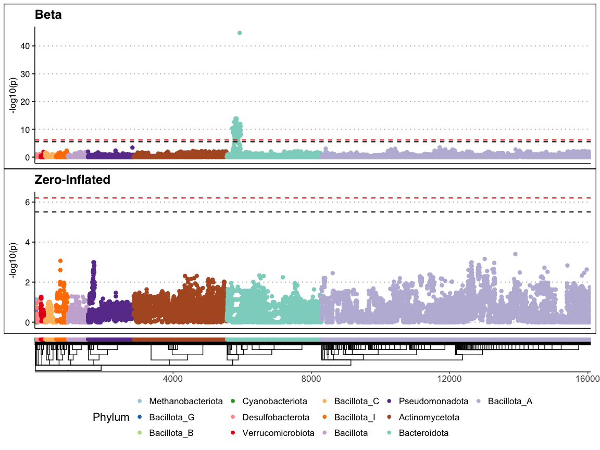

``` r
plot_volcano(fit_zib_99_c5, label = T)
```

    ## Found 16081 tophits for spikedTRUE at alpha = 1 using holm

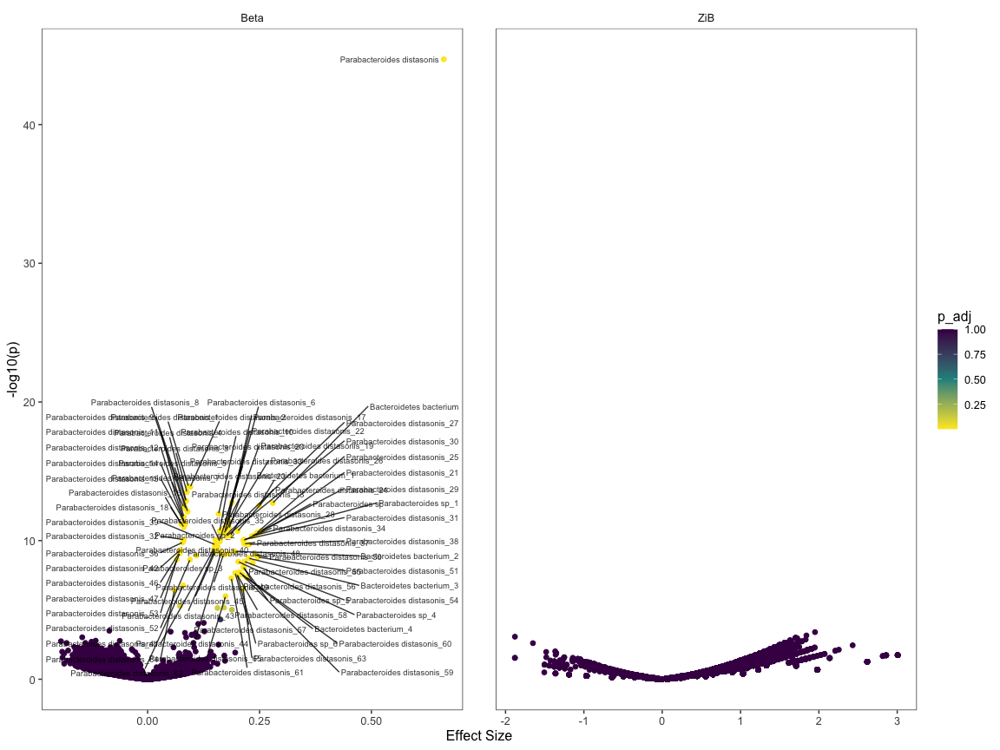

``` r
plot_ani_dist(d_q99, phenotype = 'spiked', contigs = th_c5$Contig_name[1:5], contig_names = th_c5$Genome_file[1:5])
```

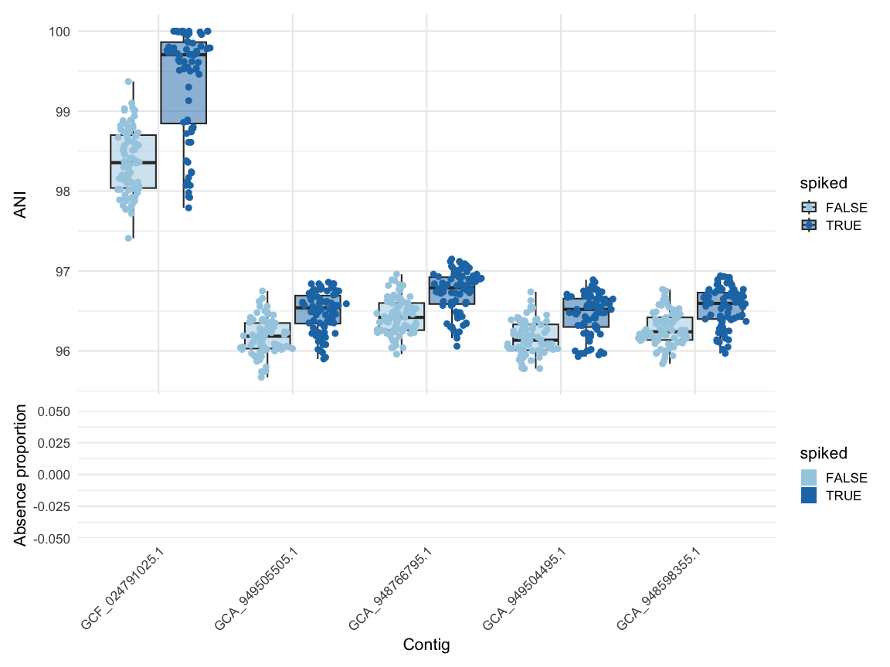

``` r
# Parabacteroides distasonis is in all samples, so, this can only be a beta hit!
# GCF_024791025.1 is the top hit - it is the spiked strain. And for the spiked samples, the ANI is 100%
```

StrainSpy works regardless of coverage, now to test AnPan

### Load data and prepare for testing

``` r
library(anpan)
```

    ## • This is anpan version 0.3.0
    ## • Read the guide: run anpan::anpan_vignette()
    ## • Get help: Visit the biobakery help forum at <https://forum.biobakery.org/>
    ## • Parallelize: Run `future::plan()` as appropriate for your system.
    ## • Activate progress bars: `library(progressr); handlers(global=TRUE)`

``` r
library(ape)
library(tibble)
tree = read.tree("p_distasonis_sims/spiked_tree.tre")

metadata = tibble(sample_id = tree$tip.label,
                  spiked   = as.factor(sapply(tree$tip.label, function(x) x%in% c(ss, sub("_", "_1_", paste(ss_spikes, ".fastq", sep = "")) ))) )

table(metadata$spiked)
```

    ## 
    ## FALSE  TRUE 
    ##    64    72

``` r
plot_outcome_tree(tree,
                  metadata, 
                  covariates = c(),
                  outcome    = "spiked")
```

    ## Warning: `aes_string()` was deprecated in ggplot2 3.0.0.
    ## ℹ Please use tidy evaluation idioms with `aes()`.
    ## ℹ See also `vignette("ggplot2-in-packages")` for more information.
    ## ℹ The deprecated feature was likely used in the anpan package.
    ##   Please report the issue to the authors.
    ## This warning is displayed once per session.
    ## Call `lifecycle::last_lifecycle_warnings()` to see where this warning was
    ## generated.

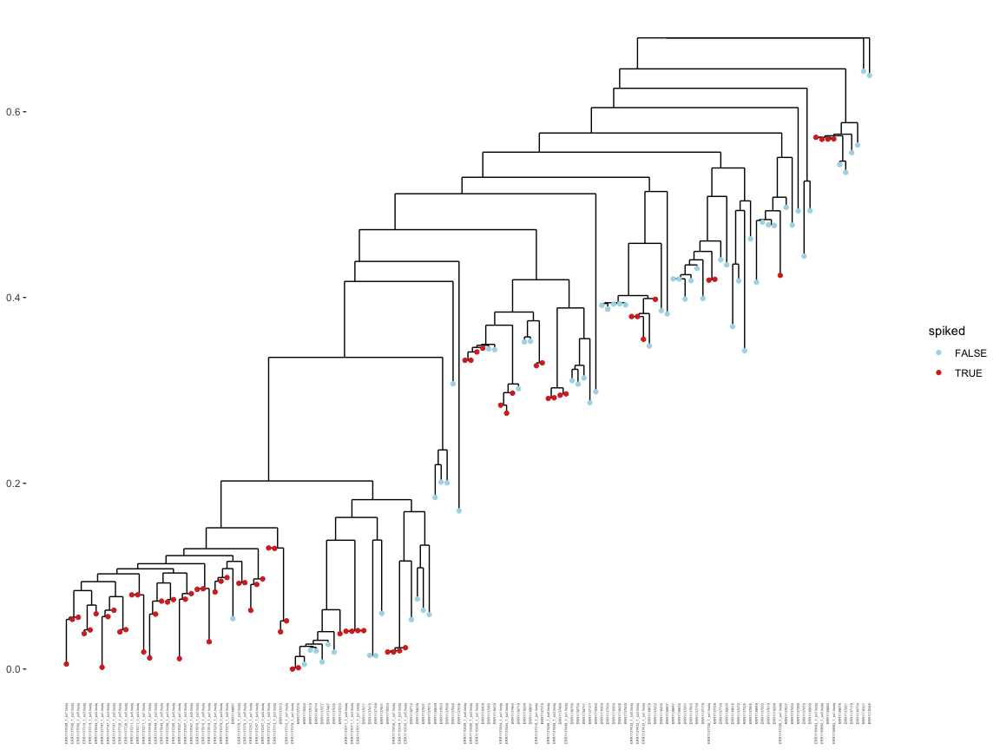

Looks like the left-most branch has a bunch of spiked ones, it’ll be
interesting to see variation with coverage

## anPan PGLMM

### baseline (no signal)

``` r
# This simulation does not have any signal, we shouldn't detect anything!

# Subset
rm_idx = grep("_sx", metadata$sample_id)

metadata_test = metadata[-rm_idx, ]
table(metadata_test$spiked)
```

    ## 
    ## FALSE  TRUE 
    ##    64    12

``` r
# Only 76/100 samples had P. dist at a detectable level for strainphlan
# These TRUE = 12 are NOT spiked in, this is just to show there is no detectable signal

# Drop the same leaves from the tree
tree_test = drop.tip(tree, metadata$sample_id[rm_idx])
plot_outcome_tree(tree_test,
                  metadata_test, 
                  covariates = c(),
                  outcome    = "spiked")
```

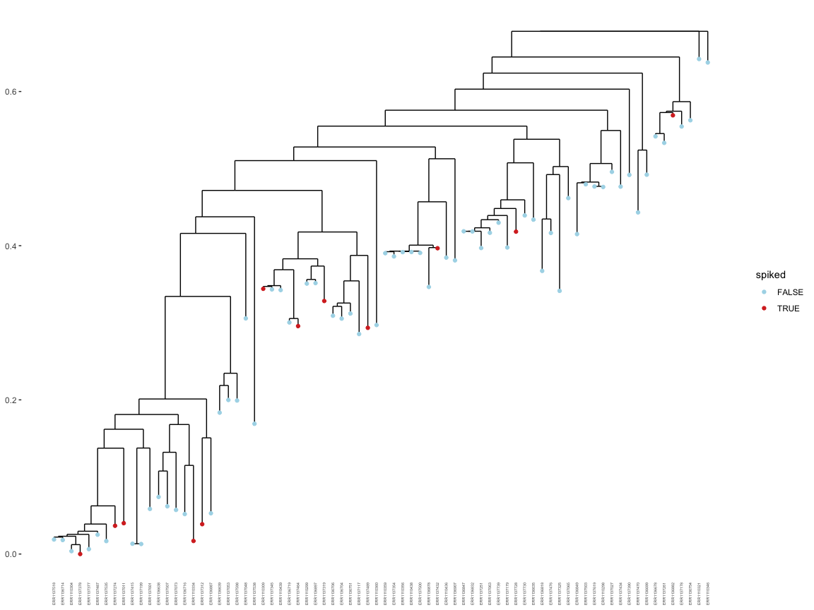

``` r
# Clearly no signal

save_path = "output_rds/spike_pdis_anpan_bl.rds"
if(file.exists(save_path)){
  anpan_res_bl <- readRDS(save_path)
} else {
  system.time({
    anpan_res_bl = anpan_pglmm(meta_file       = metadata_test,
                               tree_file       = tree_test,
                               outcome         = "spiked",
                               family          = "binomial",
                               bug_name        = "Pdis",
                               reg_noise       = TRUE,
                               loo_comparison  = TRUE,
                               run_diagnostics = FALSE,
                               refresh         = 500,
                               show_plot_tree  = FALSE,
                               show_post       = FALSE)
  })
  saveRDS(anpan_res_bl, save_path)
}

anpan_res_bl$loo$comparison
```

    ##             elpd_diff   se_diff  elpd_loo se_elpd_loo    p_loo  se_p_loo
    ## base_fit   0.00000000 0.0000000 -34.10157    5.094281 0.855544 0.1756572
    ## pglmm_fit -0.09731679 0.1441665 -34.19889    5.065588 1.205773 0.2441358
    ##              looic se_looic
    ## base_fit  68.20314 10.18856
    ## pglmm_fit 68.39777 10.13118
    ## attr(,"class")
    ## [1] "compare.loo" "matrix"      "array"

Clearly no signal - confirmed by PGLMM

### cov1x

``` r
# Subset
rm_idx = unlist(c(sapply(ss, function(x) which(metadata$sample_id %in% x)), grep("_sx3", metadata$sample_id), grep("_sx5", metadata$sample_id)))

metadata_test = metadata[-rm_idx, ]
table(metadata_test$spiked)
```

    ## 
    ## FALSE  TRUE 
    ##    64    20

``` r
# Only 20/20 spiked samples are now detected, but only non spiked are present - should be plenty 

# Drop the same leaves from the tree
tree_test = drop.tip(tree, metadata$sample_id[rm_idx])
plot_outcome_tree(tree_test,
                  metadata_test, 
                  covariates = c(),
                  outcome    = "spiked")
```

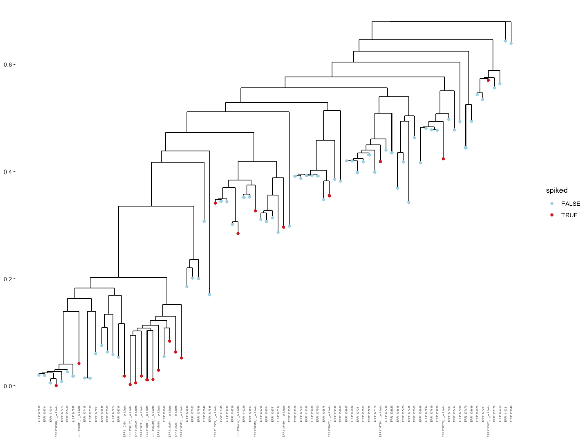

``` r
# Signal is a bit weak

save_path = "output_rds/spike_pdis_anpan_cov1x.rds"
if(file.exists(save_path)){
  anpan_res_c1 <- readRDS(save_path)
} else {
  system.time({
    anpan_res_c1 = anpan_pglmm(meta_file       = metadata_test,
                               tree_file       = tree_test,
                               outcome         = "spiked",
                               family          = "binomial",
                               bug_name        = "Pdis",
                               reg_noise       = TRUE,
                               loo_comparison  = TRUE,
                               run_diagnostics = FALSE,
                               refresh         = 500,
                               show_plot_tree  = FALSE,
                               show_post       = FALSE)
  })
  saveRDS(anpan_res_c1, save_path)
}

anpan_res_c1$loo$comparison
```

    ##           elpd_diff   se_diff  elpd_loo se_elpd_loo     p_loo  se_p_loo
    ## pglmm_fit  0.000000 0.0000000 -45.52922    4.278753 2.1446260 0.2959159
    ## base_fit  -1.612409 0.8160137 -47.14163    4.425549 0.9993287 0.1292906
    ##              looic se_looic
    ## pglmm_fit 91.05844 8.557506
    ## base_fit  94.28326 8.851099
    ## attr(,"class")
    ## [1] "compare.loo" "matrix"      "array"

The phylogenetic model seems to fit better, but the difference doesn’t
seem clear (less than 2 standard errors difference in ELPD).

### cov3x

``` r
# Subset
rm_idx = unlist(c(sapply(ss, function(x) which(metadata$sample_id %in% x)), grep("_sx1", metadata$sample_id), grep("_sx5", metadata$sample_id)))

metadata_test = metadata[-rm_idx, ]
table(metadata_test$spiked)
```

    ## 
    ## FALSE  TRUE 
    ##    64    20

``` r
# Only 20/20 spiked samples are now detected, but only non spiked are present - should be plenty 

# Drop the same leaves from the tree
tree_test = drop.tip(tree, metadata$sample_id[rm_idx])
plot_outcome_tree(tree_test,
                  metadata_test, 
                  covariates = c(),
                  outcome    = "spiked")
```

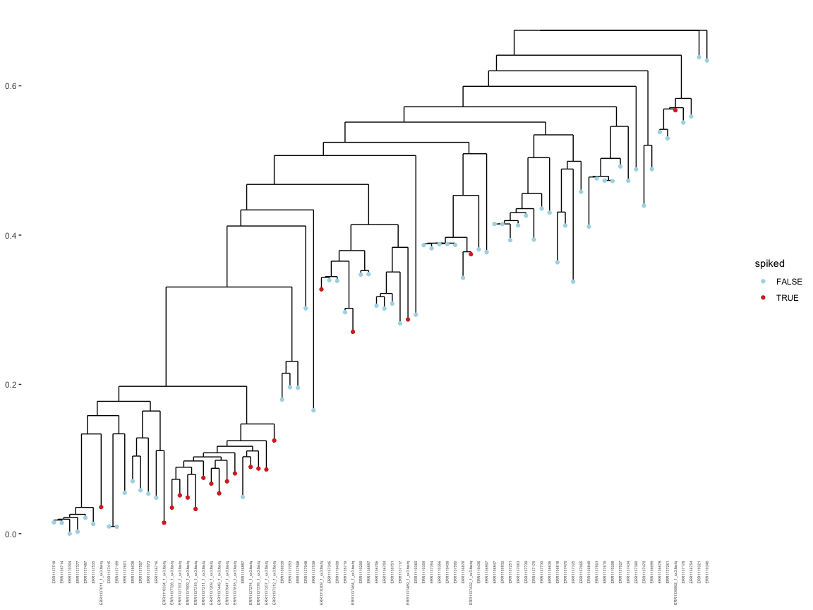

``` r
# Clearly signal is present

save_path = "output_rds/spike_pdis_anpan_cov3x.rds"
if(file.exists(save_path)){
  anpan_res_c3 <- readRDS(save_path)
} else {
  system.time({
    anpan_res_c3 = anpan_pglmm(meta_file       = metadata_test,
                               tree_file       = tree_test,
                               outcome         = "spiked",
                               family          = "binomial",
                               bug_name        = "Pdis",
                               reg_noise       = TRUE,
                               loo_comparison  = TRUE,
                               run_diagnostics = FALSE,
                               refresh         = 500,
                               show_plot_tree  = FALSE,
                               show_post       = FALSE)
  })
  saveRDS(anpan_res_c3, save_path)
}

anpan_res_c3$loo$comparison
```

    ##           elpd_diff  se_diff  elpd_loo se_elpd_loo    p_loo  se_p_loo    looic
    ## pglmm_fit  0.000000 0.000000 -38.39092    3.918328 2.993786 0.4993756 76.78183
    ## base_fit  -8.657758 2.351852 -47.04867    4.399150 0.902703 0.1160073 94.09735
    ##           se_looic
    ## pglmm_fit 7.836656
    ## base_fit  8.798300
    ## attr(,"class")
    ## [1] "compare.loo" "matrix"      "array"

The phylogenetic model seems to fit better, and the difference seems
clear (more than 2 standard errors difference in ELPD).

### cov5x

``` r
# Subset
rm_idx = unlist(c(sapply(ss, function(x) which(metadata$sample_id %in% x)), grep("_sx1", metadata$sample_id), grep("_sx3", metadata$sample_id)))

metadata_test = metadata[-rm_idx, ]
table(metadata_test$spiked)
```

    ## 
    ## FALSE  TRUE 
    ##    64    20

``` r
# Only 20/20 spiked samples are now detected, but only non spiked are present - should be plenty 

# Drop the same leaves from the tree
tree_test = drop.tip(tree, metadata$sample_id[rm_idx])
plot_outcome_tree(tree_test,
                  metadata_test, 
                  covariates = c(),
                  outcome    = "spiked")
```

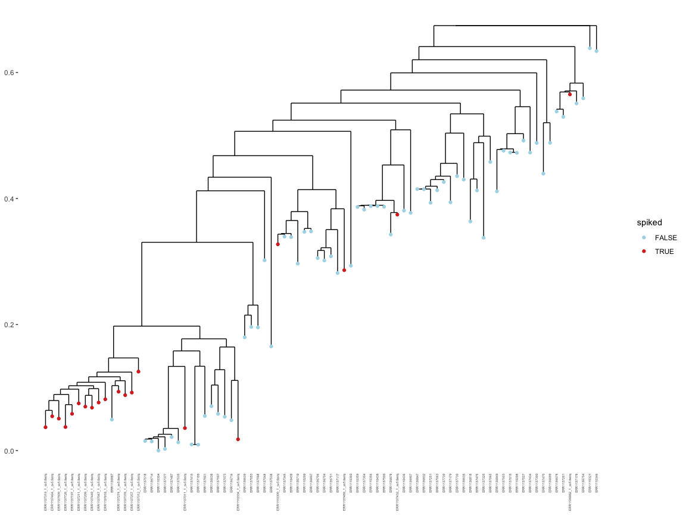

``` r
# Clearly dominant signal

save_path = "output_rds/spike_pdis_anpan_cov5x.rds"
if(file.exists(save_path)){
  anpan_res_c5 <- readRDS(save_path)
} else {
  system.time({
    anpan_res_c5 = anpan_pglmm(meta_file       = metadata_test,
                               tree_file       = tree_test,
                               outcome         = "spiked",
                               family          = "binomial",
                               bug_name        = "Pdis",
                               reg_noise       = TRUE,
                               loo_comparison  = TRUE,
                               run_diagnostics = FALSE,
                               refresh         = 500,
                               show_plot_tree  = FALSE,
                               show_post       = FALSE)
  })
  saveRDS(anpan_res_c5, save_path)
}

anpan_res_c5$loo$comparison
```

    ##           elpd_diff  se_diff  elpd_loo se_elpd_loo    p_loo  se_p_loo    looic
    ## pglmm_fit   0.00000 0.000000 -36.09019    3.860277 2.839414 0.5063496 72.18038
    ## base_fit  -11.05142 2.735972 -47.14161    4.429170 1.000522 0.1284311 94.28322
    ##           se_looic
    ## pglmm_fit 7.720554
    ## base_fit  8.858339
    ## attr(,"class")
    ## [1] "compare.loo" "matrix"      "array"

The phylogenetic model seems to fit better, and the difference seems
clear (more than 2 standard errors difference in ELPD).

AnPan works as well - when there is signal in the phylogeny, it can
detect it accurately. However, building the tree can be tricky if the
strain coverage is low. StrainSpy can work equally well in the lower
coverage simulations as well, without requiring a phylogeny.

## Figure for paper

``` r
library(ggplot2)
library(dplyr)
```

    ## 
    ## Attaching package: 'dplyr'

    ## The following object is masked from 'package:ape':
    ## 
    ##     where

    ## The following objects are masked from 'package:stats':
    ## 
    ##     filter, lag

    ## The following objects are masked from 'package:base':
    ## 
    ##     intersect, setdiff, setequal, union

``` r
library(ggrepel)

# strainspy result

spike = "GCF_024791025.1"

th_plt = rbind(cbind(th_c1, coverage = "x1"),
               cbind(th_c3, coverage = "x3"),
               cbind(th_c5, coverage =  "x5"))

th_plt[nrow(th_plt)+1, ] = th_plt[nrow(th_plt),]
# manually add the baseline hits (there are none!)
th_plt$coefficient[nrow(th_plt)] = 0 
th_plt$p_adjust[nrow(th_plt)] = 1
th_plt$coverage[nrow(th_plt)] = "Null"
th_plt$Contig_name[nrow(th_plt)] = ""


th_plt$neglog_p = -log10(th_plt$p_adjust)

label_df <- th_plt %>%
  group_by(coverage) %>%
  arrange(p_adjust, .by_group = TRUE) %>%
  slice_head(n = 5) %>%
  ungroup()

# No label needed for the fake point
rmidx = which(label_df$coverage == "Null")
if(length(rmidx) > 0) label_df = label_df[-rmidx, ]

top1 <- th_plt %>%
  group_by(coverage) %>%
  arrange(p_adjust) %>%
  slice(1)

ggplot(th_plt, aes(x = coefficient, y = neglog_p)) +
  geom_point(
    data = subset(th_plt, Genome_file != spike),
    aes(color = "other"),
    size = 1,
    alpha = 0.5
  ) +
  geom_point(
    data = subset(th_plt, Genome_file == spike),
    color = "red",
    size = 2.5,
    stroke = 1.2
  ) +
  geom_text_repel(
    data = label_df,
    aes(label = Genome_file),
    size = 4.5,
    fontface = "bold",
    box.padding = 0.4,
    point.padding = 0.3,
    segment.color = "grey50",
    max.overlaps = Inf
  ) + 
  
  scale_color_manual(values = c("grey70", "red")) +
  facet_wrap(~coverage, nrow = 1) +
  theme_classic() +
  labs(
    x = "Effect size (coefficient)",
    y = expression(-log[10](adjusted~p))
  ) +
  guides(color = "none") + 
  geom_vline(xintercept = 0, linetype = "dashed", alpha = 0.3) +
  geom_hline(yintercept = -log10(0.05), linetype = "dashed", alpha = 0.3) +
  theme_classic(base_size = 16) +
  theme(
    strip.background = element_rect(fill = "grey95"),
    strip.text = element_text(face = "bold"),
    panel.spacing = unit(1, "lines")
  )
```

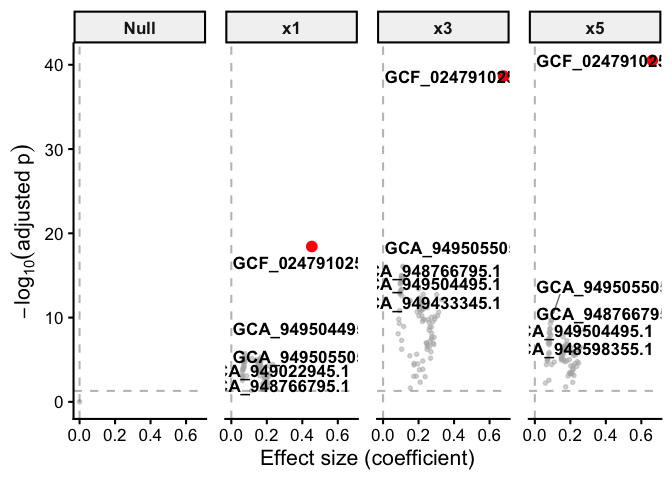<!-- -->

``` r
# anpan result

## Null model
rm_idx = rm_idx = grep("_sx", metadata$sample_id)
metadata_test = metadata[-rm_idx, ]

# Drop the same leaves from the tree
tree_test = drop.tip(tree, metadata$sample_id[rm_idx])
tp_null = plot_outcome_tree(tree_test,
                        metadata_test, 
                        covariates = c(),
                        outcome    = "spiked", return_tree_df = T)

tp_null$tree_plot + theme_classic(base_size = 16) +
  theme(
    axis.text.x = element_blank(),
    axis.ticks.x = element_blank()
  )
```

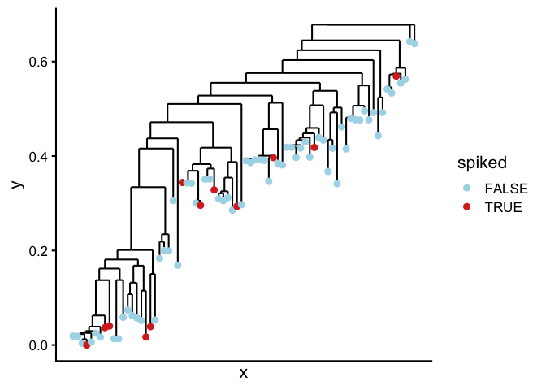<!-- -->

``` r
## Coverage 1 
rm_idx = unlist(c(sapply(ss, function(x) which(metadata$sample_id %in% x)), grep("_sx3", metadata$sample_id), grep("_sx5", metadata$sample_id)))
metadata_test = metadata[-rm_idx, ]

# Drop the same leaves from the tree
tree_test = drop.tip(tree, metadata$sample_id[rm_idx])
tp1 = plot_outcome_tree(tree_test,
                        metadata_test, 
                        covariates = c(),
                        outcome    = "spiked", return_tree_df = T)

tp1$tree_plot + theme_classic(base_size = 16) +
  theme(
    axis.text.x = element_blank(),
    axis.ticks.x = element_blank()
  )
```

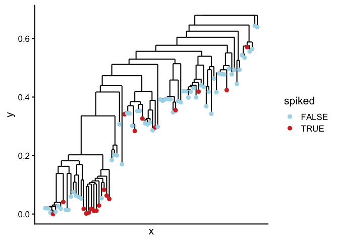<!-- -->

``` r
## Coverage 3 
rm_idx = unlist(c(sapply(ss, function(x) which(metadata$sample_id %in% x)), grep("_sx1", metadata$sample_id), grep("_sx5", metadata$sample_id)))
metadata_test = metadata[-rm_idx, ]

# Drop the same leaves from the tree
tree_test = drop.tip(tree, metadata$sample_id[rm_idx])
tp3 = plot_outcome_tree(tree_test,
                        metadata_test, 
                        covariates = c(),
                        outcome    = "spiked", return_tree_df = T)

tp3$tree_plot + theme_classic(base_size = 16) +
  theme(
    axis.text.x = element_blank(),
    axis.ticks.x = element_blank()
  )
```

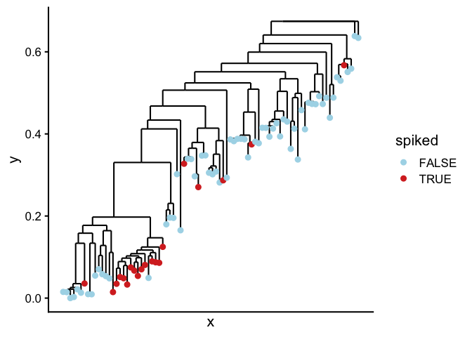<!-- -->

``` r
## Coverage 5
rm_idx = unlist(c(sapply(ss, function(x) which(metadata$sample_id %in% x)), grep("_sx1", metadata$sample_id), grep("_sx3", metadata$sample_id)))
metadata_test = metadata[-rm_idx, ]

# Drop the same leaves from the tree
tree_test = drop.tip(tree, metadata$sample_id[rm_idx])
tp5 = plot_outcome_tree(tree_test,
                        metadata_test, 
                        covariates = c(),
                        outcome    = "spiked", return_tree_df = T)

tp5$tree_plot + theme_classic(base_size = 16) +
  theme(
    axis.text.x = element_blank(),
    axis.ticks.x = element_blank()
  )
```

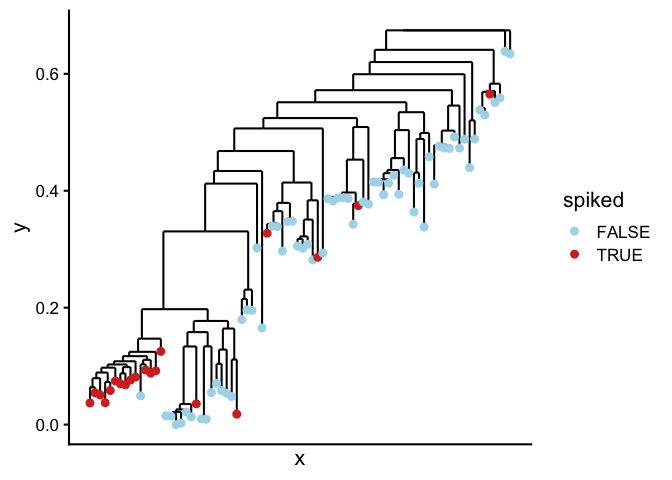<!-- -->

``` r
# Results summary plot
anpan_summary <- tibble(
  coverage = c("Null", "x1", "x3", "x5"),
  
  elpd_diff = -c(
    anpan_res_bl$loo$comparison["pglmm_fit", "elpd_diff"],
    anpan_res_c1$loo$comparison["base_fit", "elpd_diff"],
    anpan_res_c3$loo$comparison["base_fit", "elpd_diff"],
    anpan_res_c5$loo$comparison["base_fit", "elpd_diff"]
  ),
  
  se_diff = c(
    anpan_res_bl$loo$comparison["pglmm_fit", "se_diff"],
    anpan_res_c1$loo$comparison["base_fit", "se_diff"],
    anpan_res_c3$loo$comparison["base_fit", "se_diff"],
    anpan_res_c5$loo$comparison["base_fit", "se_diff"]
  )
) %>%
  mutate(
    abs_elpd = abs(elpd_diff),
    z_score = abs_elpd / se_diff
  )

anpan_summary$coverage <- factor(anpan_summary$coverage,
                                 levels = c("Null", "x1","x3","x5"))

anpan_summary <- anpan_summary %>%
  mutate(
    x = as.numeric(coverage),
    signal = abs(elpd_diff) / se_diff
  )

ggplot(anpan_summary, aes(x = x, y = elpd_diff, group = 1)) +
  
  # uncertainty
  geom_errorbar(
    aes(
      ymin = elpd_diff - se_diff,
      ymax = elpd_diff + se_diff
    ),
    width = 0.1
  ) +
  
  # trajectory
  geom_line(linewidth = 1) +
  
  # points
  geom_point(size = 4) +
  
  # reference line
  geom_hline(yintercept = 0, linetype = "dashed") +
  
  # threshold (your rule)
  geom_hline(yintercept = 2, linetype = "dotted", color = "red") +
  
  scale_x_continuous(
    breaks = 1:4,
    labels = c("Null", "1x","3x","5x")
  ) +
  
  theme_classic(base_size = 16) +
  
  labs(
    x = "Coverage",
    y = expression(Delta~ELPD~abs(phylogeny - base))
  )
```

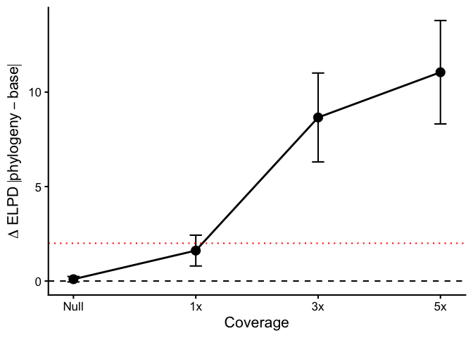<!-- -->
