varyingPrior
================

# Effects of varying the MAP prior

# Analysing a large-ish dataset (157 non-spiked vs. 20 spiked)

## Load data and prepare for simulations

``` r
library(strainspy)
library(dplyr)
```

    ## 
    ## Attaching package: 'dplyr'

    ## The following objects are masked from 'package:stats':
    ## 
    ##     filter, lag

    ## The following objects are masked from 'package:base':
    ## 
    ##     intersect, setdiff, setequal, union

``` r
# Profile 95 - fastest to run
d_p95 <- read_sylph("ecoli_sims/test/sylph_p_95.tsv")
```

    ## Detected Sylph profile output file.

``` r
# taxonomy
tax_95 = read_taxonomy(system.file("extdata", "example_taxonomy.tsv.gz", package = "strainspy"))
design <- as.formula(" ~ spiked")
```

### Full model with default weak prior normal(0,5)

``` r
# spiked samples
ss = readLines("ecoli_sims/test/sampled.txt")

# metadata 
meta_data = data.frame(run_accession = colnames(d_p95),spiked = as.factor(sapply(colnames(d_p95), function(x) x%in% ss)))

d_p95_full = modify_metadata(se = d_p95, meta_data = meta_data)

d_p95_full <- filter_by_presence(d_p95_full, min_nonzero = 20)
```

    ## Retained 487 rows after filtering

``` r
save_path = "output_rds/prior_zib95_weak.rds"
if(file.exists(save_path)){
  full_zib_95_w <- readRDS(save_path)
} else {
  system.time({
    full_zib_95_w <- glmZiBFit(d_p95_full, design, nthreads = 10)
  })
  saveRDS(full_zib_95_w, save_path)
}

top_hits(full_zib_95_w)
```

    ## # A tibble: 2 × 10
    ##   Contig_name Genome_file coefficient std_error  p_value p_adjust zi_coefficient
    ##   <chr>       <chr>             <dbl>     <dbl>    <dbl>    <dbl>          <dbl>
    ## 1 NZ_AEZI020… GCF_000194…       0.441    0.0522 3.21e-17 1.56e-14         -7.69 
    ## 2 JAHZEE0100… GCA_019421…      -0.547    0.138  7.85e- 5 3.81e- 2         -0.362
    ## # ℹ 3 more variables: zi_std_error <dbl>, zi_p_value <dbl>, zi_p_adjust <dbl>

``` r
# true/false positive
plot_ani_dist(d_p95_full, phenotype = 'spiked', contigs = top_hits(full_zib_95_w, alpha = 0.05)$Contig_name, drop_zeros = F, show_points = T, plot_type = 'box')
```

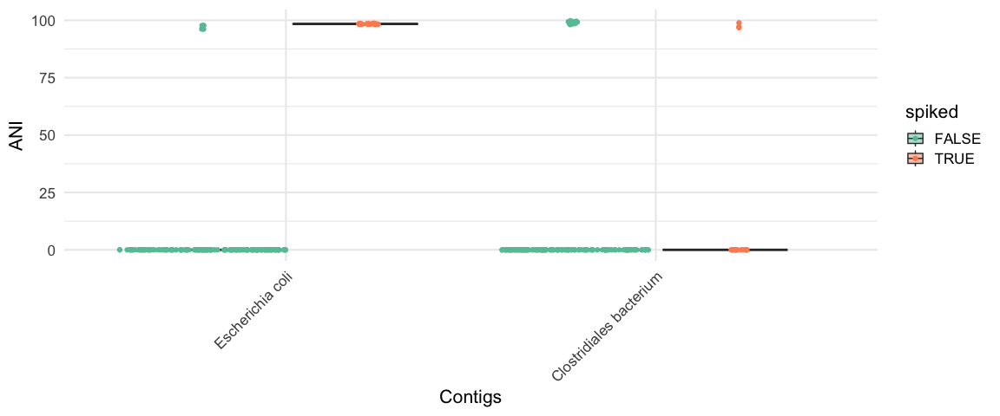<!-- -->

``` r
plot_ani_dist(d_p95_full, phenotype = 'spiked', contigs = top_hits(full_zib_95_w, alpha = 0.05)$Contig_name, drop_zeros = T, show_points = T, plot_type = 'box')
```

    ## Warning: Removed 310 rows containing non-finite outside the scale range
    ## (`stat_boxplot()`).

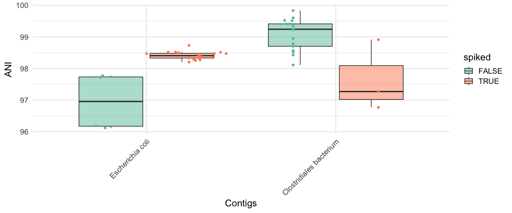<!-- -->

Here, *Clostridiales bacterium* is a false positive. Based on the box
plot, it looks like an edge case with just 3 samples driving the signal.

### Full model with strong prior normal(0,1)

``` r
save_path = "output_rds/prior_zib95_strong.rds"
if(file.exists(save_path)){
  full_zib_95_s <- readRDS(save_path)
} else {
  system.time({
    full_zib_95_s <- glmZiBFit(d_p95_full, design, nthreads = 10, MAP_prior = "preset_strong")
  })
  saveRDS(full_zib_95_s, save_path)
}


top_hits(full_zib_95_s)
```

    ## # A tibble: 1 × 10
    ##   Contig_name Genome_file coefficient std_error  p_value p_adjust zi_coefficient
    ##   <chr>       <chr>             <dbl>     <dbl>    <dbl>    <dbl>          <dbl>
    ## 1 NZ_AEZI020… GCF_000194…       0.446    0.0520 9.39e-18 4.57e-15          -4.01
    ## # ℹ 3 more variables: zi_std_error <dbl>, zi_p_value <dbl>, zi_p_adjust <dbl>

``` r
# true/false positive
plot_ani_dist(d_p95_full, phenotype = 'spiked', contigs = top_hits(full_zib_95_s, alpha = 0.05)$Contig_name, drop_zeros = T, show_points = T, plot_type = 'box')
```

    ## Warning: Removed 153 rows containing non-finite outside the scale range
    ## (`stat_boxplot()`).

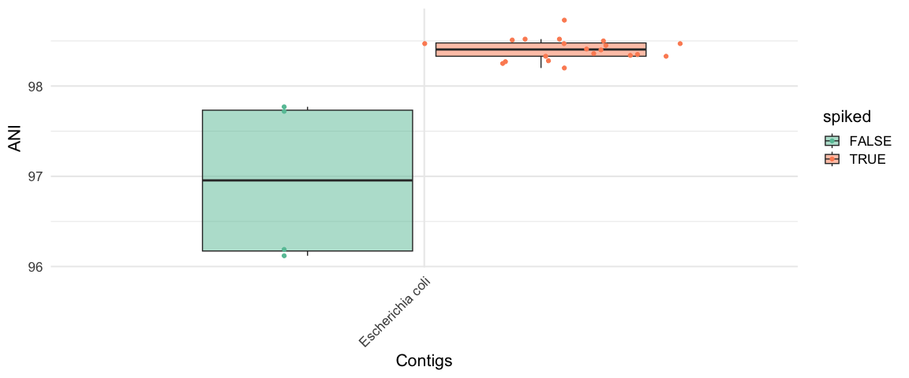<!-- -->

This fixes the FP issue.

### Full model with ebayes prior

``` r
save_path = "output_rds/prior_zib95_ebp.rds"

ebp_full = compute_eb_priors(d_p95_full, design = design, nthreads = parallel::detectCores(), low_cutoff = 0, high_cutoff = Inf)
```

    ## Computing fixef_zi priors...
    ##   |                                                                              |                                                                      |   0%  |                                                                              |======================================================================| 100%
    ## 
    ##   |                                                                              |                                                                      |   0%  |                                                                              |===================================                                   |  50%  |                                                                              |======================================================================| 100%
    ## 
    ## Computing fixef priors...
    ##   |                                                                              |                                                                      |   0%  |                                                                              |======================================================================| 100%
    ## 
    ##   |                                                                              |                                                                      |   0%  |                                                                              |===================================                                   |  50%  |                                                                              |======================================================================| 100%

``` r
ebp_full
```

    ## strainspy_priors object
    ## Method:  empirical 
    ## 
    ## Priors:
    ##  - fixef : 2 coefficients
    ##  - fixef_zi : 2 coefficients
    ## 
    ## Example priors:
    ##            prior    class        coef
    ## 1 normal(0,0.23)    fixef (Intercept)
    ## 2 normal(0,0.14)    fixef  spikedTRUE
    ## 3 normal(0,1.12) fixef_zi (Intercept)
    ## 4 normal(0,2.17) fixef_zi  spikedTRUE
    ## 
    ## Bootstrap summary for fixef priors:
    ##    Min. 1st Qu.  Median    Mean 3rd Qu.    Max. 
    ##  0.1168  0.1381  0.1829  0.1835  0.2286  0.2503 
    ## 
    ## Bootstrap summary for fixef_zi priors:
    ##    Min. 1st Qu.  Median    Mean 3rd Qu.    Max. 
    ##  0.9696  1.1166  1.2415  1.6419  2.1669  3.1438 
    ## 
    ## Warning: 2 fixef prior(s) may be too strong (SD < 1), and 0 may be too weak (SD > 5).

``` r
plot_prior_bootstrap(object = ebp_full, "spikedTRUE")
```

    ## Warning: Estimated prior SD for spikedTRUE (fixef) is 0.14: this may be too
    ## strong and reduce sensitivity.

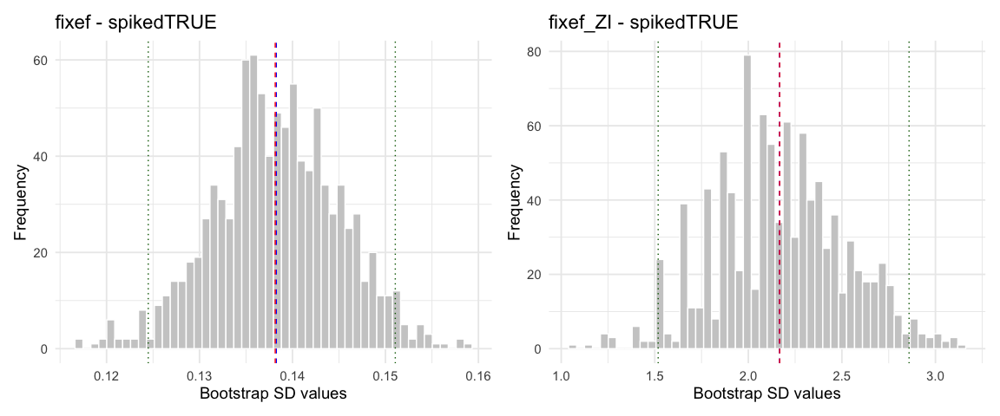<!-- -->

``` r
if(file.exists(save_path)){
  full_zib_95_eb <- readRDS(save_path)
} else {
  system.time({
    full_zib_95_eb <- glmZiBFit(d_p95_full, design, nthreads = 10, MAP_prior = ebp_full)
  })
  saveRDS(full_zib_95_eb, save_path)
}

top_hits(full_zib_95_eb)
```

    ## # A tibble: 1 × 10
    ##   Contig_name  Genome_file coefficient std_error p_value p_adjust zi_coefficient
    ##   <chr>        <chr>             <dbl>     <dbl>   <dbl>    <dbl>          <dbl>
    ## 1 NZ_AEZI0200… GCF_000194…       0.197     0.135   0.145        1          -5.72
    ## # ℹ 3 more variables: zi_std_error <dbl>, zi_p_value <dbl>, zi_p_adjust <dbl>

``` r
# This plot is redundant - same as (0,1) prior
plot_ani_dist(d_p95_full, phenotype = 'spiked', contigs = top_hits(full_zib_95_s, alpha = 0.05)$Contig_name, drop_zeros = T, show_points = T, plot_type = 'box')
```

    ## Warning: Removed 153 rows containing non-finite outside the scale range
    ## (`stat_boxplot()`).

<!-- -->

Still no FP as expected. However, eBayes priors were unnecessary for
this case. Larger datasets tend to work okay with either weak or strong
prior options. Faster to use and maybe more stable.

# Small sample test

This is where ebp priors shine! Here we sample and take 16 spiked vs. 17
non spiked.

## Subset data and prepare for simulations

``` r
sample_sz = 33

# hack to convert to function
n1 <- floor(sample_sz * 0.5) # Let's do a half split
n2 <- sample_sz - n1

set.seed(1988)
meta_subset <- bind_rows(
  meta_data %>% filter(spiked == TRUE) %>% slice_sample(n = n1),
  meta_data %>% filter(spiked == FALSE) %>% slice_sample(n = n2)
)

d_subset = d_p95[, meta_subset$run_accession]
d_subset <- filter_by_presence(d_subset, min_nonzero = ceiling(max(sample_sz*0.1, 2)))
```

    ## Retained 550 rows after filtering

``` r
d_subset = modify_metadata(d_subset, meta_subset)
dim(d_subset)
```

    ## [1] 550  33

## fit ZIB weak prior

``` r
save_path = "output_rds/prior_zib_small_weak.rds"

if(file.exists(save_path)){
  fit_zib_w <- readRDS(save_path)
} else {
  system.time({
    fit_zib_w <- glmZiBFit(d_subset,  design, nthreads=parallel::detectCores())
  })
  saveRDS(fit_zib_w, save_path)
}

head(top_hits(fit_zib_w))
```

    ## # A tibble: 6 × 10
    ##   Contig_name Genome_file coefficient std_error  p_value p_adjust zi_coefficient
    ##   <chr>       <chr>             <dbl>     <dbl>    <dbl>    <dbl>          <dbl>
    ## 1 UQDC010000… GCA_900539…     -0.213    0.0130  4.20e-60 2.31e-57         1.13  
    ## 2 HF995976.1… GCA_000432…     -0.0396   0.00343 8.07e-31 4.43e-28        -0.0240
    ## 3 NZ_JAHLPX0… GCF_018918…      0.421    0.0500  3.80e-17 2.08e-14        -0.366 
    ## 4 CAAFEQ0100… GCA_900761…     -0.505    0.0817  6.61e-10 3.61e- 7         1.13  
    ## 5 URBY010000… GCA_900546…     -0.0606   0.00987 8.16e-10 4.46e- 7        -1.14  
    ## 6 CAKSTI0100… GCA_934500…      0.118    0.0196  1.73e- 9 9.43e- 7        -0.0240
    ## # ℹ 3 more variables: zi_std_error <dbl>, zi_p_value <dbl>, zi_p_adjust <dbl>

``` r
plot_manhattan(fit_zib_w, taxonomy = tax_95, aggregate_by_taxa = F)
```

    ## ! # Invaild edge matrix for <phylo>. A <tbl_df> is returned.
    ## ! # Invaild edge matrix for <phylo>. A <tbl_df> is returned.
    ## ! # Invaild edge matrix for <phylo>. A <tbl_df> is returned.
    ## ! # Invaild edge matrix for <phylo>. A <tbl_df> is returned.
    ## ! # Invaild edge matrix for <phylo>. A <tbl_df> is returned.
    ## ! # Invaild edge matrix for <phylo>. A <tbl_df> is returned.

<!-- -->

``` r
# Plenty of edge cases
plot_ani_dist(d_subset, phenotype = 'spiked', contigs = top_hits(fit_zib_w, alpha = 0.05)$Contig_name[1:15], drop_zeros = T, show_points = T, plot_type = 'box')
```

    ## Warning: Removed 398 rows containing non-finite outside the scale range
    ## (`stat_boxplot()`).

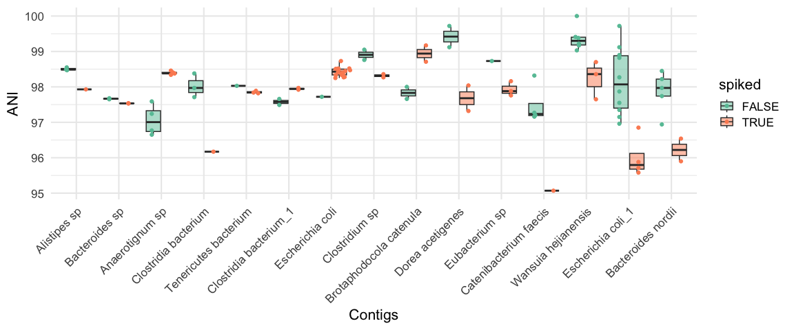<!-- -->

## fit ZIB strong prior

``` r
save_path = "output_rds/prior_zib_small_strong.rds"

if(file.exists(save_path)){
  fit_zib_s <- readRDS(save_path)
} else {
  system.time({
    fit_zib_s <- glmZiBFit(d_subset,  design, nthreads=parallel::detectCores(), MAP_prior = "preset_strong")
  })
  saveRDS(fit_zib_s, save_path)
}

head(top_hits(fit_zib_s))
```

    ## # A tibble: 6 × 10
    ##   Contig_name Genome_file coefficient std_error  p_value p_adjust zi_coefficient
    ##   <chr>       <chr>             <dbl>     <dbl>    <dbl>    <dbl>          <dbl>
    ## 1 UQDC010000… GCA_900539…     -0.212    0.0130  5.61e-60 3.08e-57         0.762 
    ## 2 HF995976.1… GCA_000432…     -0.0396   0.00343 8.64e-31 4.74e-28         0.307 
    ## 3 NZ_JAHLPX0… GCF_018918…      0.423    0.0499  2.19e-17 1.20e-14        -0.0757
    ## 4 URBY010000… GCA_900546…     -0.0604   0.00987 9.62e-10 5.26e- 7        -0.122 
    ## 5 CAKSTI0100… GCA_934500…      0.118    0.0196  1.46e- 9 7.99e- 7         0.307 
    ## 6 CAAFEQ0100… GCA_900761…     -0.494    0.0824  2.09e- 9 1.14e- 6         0.762 
    ## # ℹ 3 more variables: zi_std_error <dbl>, zi_p_value <dbl>, zi_p_adjust <dbl>

``` r
plot_manhattan(fit_zib_s, taxonomy = tax_95, aggregate_by_taxa = F)
```

    ## ! # Invaild edge matrix for <phylo>. A <tbl_df> is returned.
    ## ! # Invaild edge matrix for <phylo>. A <tbl_df> is returned.
    ## ! # Invaild edge matrix for <phylo>. A <tbl_df> is returned.
    ## ! # Invaild edge matrix for <phylo>. A <tbl_df> is returned.
    ## ! # Invaild edge matrix for <phylo>. A <tbl_df> is returned.
    ## ! # Invaild edge matrix for <phylo>. A <tbl_df> is returned.

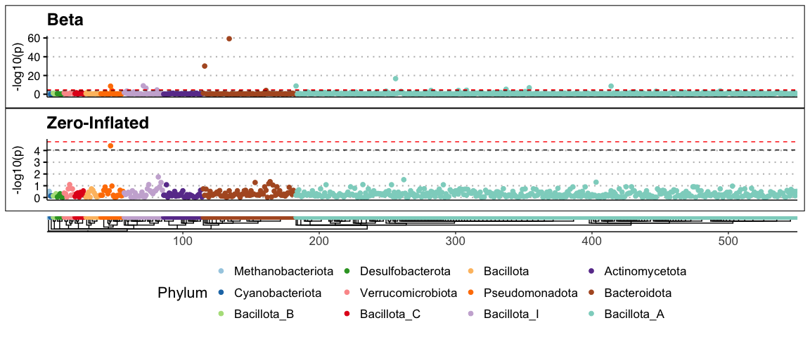<!-- -->

``` r
# Still edge cases
plot_ani_dist(d_subset, phenotype = 'spiked', contigs = top_hits(fit_zib_s, alpha = 0.05)$Contig_name, drop_zeros = T, show_points = T, plot_type = 'box')
```

    ## Warning: Removed 398 rows containing non-finite outside the scale range
    ## (`stat_boxplot()`).

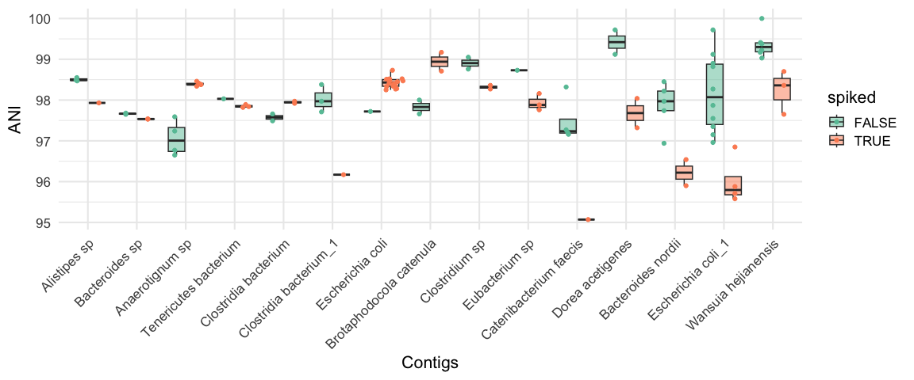<!-- -->

### compare the two priors

``` r
# At a strong multiple testing correction, both priors pick the same edge cases, but in a different order
all(top_hits(fit_zib_s, alpha = 0.05)$Contig_name %in% top_hits(fit_zib_w, alpha = 0.05)$Contig_name)
```

    ## [1] TRUE

``` r
plot(1:15, match(top_hits(fit_zib_s, alpha = 0.05)$Contig_name, top_hits(fit_zib_w, alpha = 0.05)$Contig_name))
```

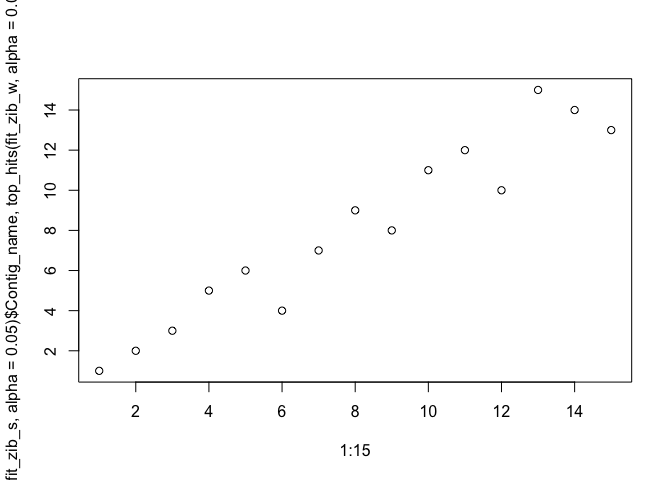<!-- -->

``` r
# But if we relax the multple correction method to BH, the weak prior has more false positives than the strong prior
length(top_hits(fit_zib_w, alpha = 0.05, method = 'BH')$Contig_name)
```

    ## [1] 28

``` r
length(top_hits(fit_zib_s, alpha = 0.05, method = 'BH')$Contig_name) 
```

    ## [1] 22

``` r
# this is as expected
```

Both methods are not great for the small sample size.

## fit empirical bayes prior

``` r
ebp = compute_eb_priors(d_subset, design = design, nthreads = parallel::detectCores(), low_cutoff = 0, high_cutoff = Inf)
```

    ## Computing fixef_zi priors...
    ##   |                                                                              |                                                                      |   0%  |                                                                              |===================================                                   |  50%  |                                                                              |======================================================================| 100%
    ## 
    ##   |                                                                              |                                                                      |   0%  |                                                                              |===================================                                   |  50%  |                                                                              |======================================================================| 100%
    ## 
    ## Computing fixef priors...
    ##   |                                                                              |                                                                      |   0%  |                                                                              |===================================                                   |  50%  |                                                                              |======================================================================| 100%
    ## 
    ##   |                                                                              |                                                                      |   0%  |                                                                              |===================================                                   |  50%  |                                                                              |======================================================================| 100%

``` r
ebp
```

    ## strainspy_priors object
    ## Method:  empirical 
    ## 
    ## Priors:
    ##  - fixef : 2 coefficients
    ##  - fixef_zi : 2 coefficients
    ## 
    ## Example priors:
    ##            prior    class        coef
    ## 1 normal(0,0.28)    fixef (Intercept)
    ## 2 normal(0,0.23)    fixef  spikedTRUE
    ## 3  normal(0,2.2) fixef_zi (Intercept)
    ## 4 normal(0,2.96) fixef_zi  spikedTRUE
    ## 
    ## Bootstrap summary for fixef priors:
    ##    Min. 1st Qu.  Median    Mean 3rd Qu.    Max. 
    ##  0.1990  0.2297  0.2560  0.2536  0.2776  0.3061 
    ## 
    ## Bootstrap summary for fixef_zi priors:
    ##    Min. 1st Qu.  Median    Mean 3rd Qu.    Max. 
    ##   1.192   2.186   2.594   2.576   2.972   3.962 
    ## 
    ## Warning: 2 fixef prior(s) may be too strong (SD < 1), and 0 may be too weak (SD > 5).

``` r
plot_prior_bootstrap(ebp, "spikedTRUE")
```

    ## Warning: Estimated prior SD for spikedTRUE (fixef) is 0.23: this may be too
    ## strong and reduce sensitivity.

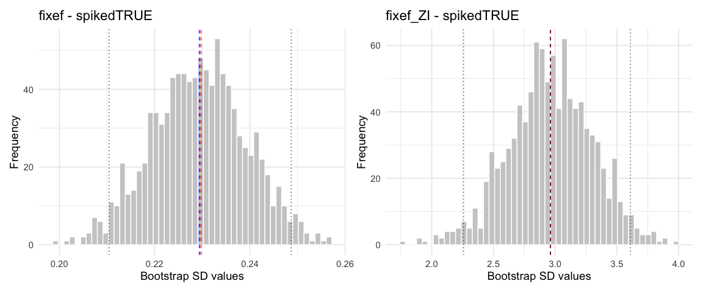<!-- -->

``` r
save_path = "output_rds/prior_zib_small_ebp.rds"

if(file.exists(save_path)){
  fit_zib_eb <- readRDS(save_path)
} else {
  system.time({
    fit_zib_eb <- glmZiBFit(d_subset,  design, nthreads=parallel::detectCores(), MAP_prior = ebp)
  })
  saveRDS(fit_zib_eb, save_path)
}


head(top_hits(fit_zib_eb))
```

    ## # A tibble: 1 × 10
    ##   Contig_name  Genome_file coefficient std_error p_value p_adjust zi_coefficient
    ##   <chr>        <chr>             <dbl>     <dbl>   <dbl>    <dbl>          <dbl>
    ## 1 NZ_AEZI0200… GCF_000194…       0.406     0.223  0.0691        1          -5.25
    ## # ℹ 3 more variables: zi_std_error <dbl>, zi_p_value <dbl>, zi_p_adjust <dbl>

``` r
plot_manhattan(fit_zib_eb, taxonomy = tax_95, aggregate_by_taxa = F)
```

    ## ! # Invaild edge matrix for <phylo>. A <tbl_df> is returned.
    ## ! # Invaild edge matrix for <phylo>. A <tbl_df> is returned.
    ## ! # Invaild edge matrix for <phylo>. A <tbl_df> is returned.
    ## ! # Invaild edge matrix for <phylo>. A <tbl_df> is returned.
    ## ! # Invaild edge matrix for <phylo>. A <tbl_df> is returned.
    ## ! # Invaild edge matrix for <phylo>. A <tbl_df> is returned.

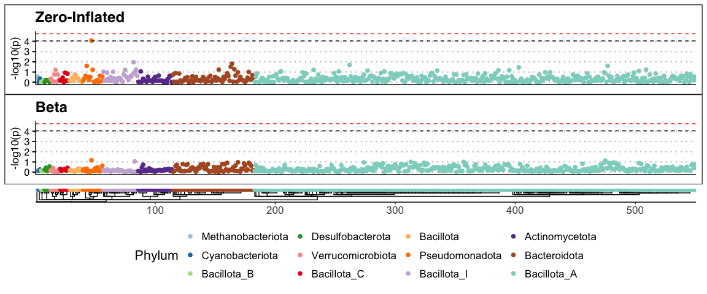<!-- -->

``` r
# We only have the ZI signal for E. coli now! 

# valid case
plot_ani_dist(d_subset, phenotype = 'spiked', contigs = top_hits(fit_zib_eb, alpha = 0.05)$Contig_name, drop_zeros = F, show_points = T, plot_type = 'box')
```

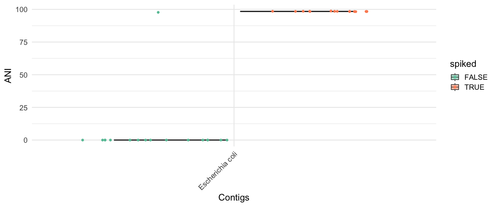<!-- -->

``` r
plot_ani_dist(d_subset, phenotype = 'spiked', contigs = top_hits(fit_zib_eb, alpha = 0.05)$Contig_name, drop_zeros = T, show_points = T, plot_type = 'box')
```

    ## Warning: Removed 16 rows containing non-finite outside the scale range
    ## (`stat_boxplot()`).

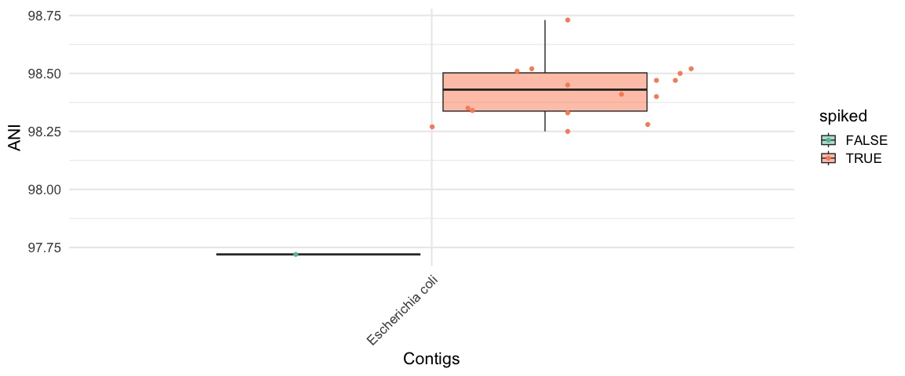<!-- -->

Using the eBayes prior fixed the false positives
