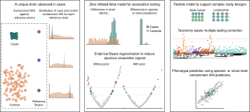

<div align="center">

# StrainSpy — Manuscript Analyses

**Code, figures and results behind the StrainSpy manuscript.**

[**📖 Browse the analysis website**](https://sudaraka88.github.io/strainspy-manuscript/) &nbsp;•&nbsp;
[**📦 StrainSpy R package**](https://github.com/gtonkinhill/strainspy) &nbsp;•&nbsp;
[**📄 Rendered reports**](GitHub_docs/) &nbsp;•&nbsp;
[**💾 Data**](#-data-availability)

</div>

---

## What is StrainSpy?

StrainSpy is a computational framework for **strain-level association testing and prediction in
metagenomic data**. It identifies associations between microbial strain variation and host phenotypes
using high-resolution genomic similarity signals — containment ANI (cANI) — derived from metagenomic
profilers such as [Sylph](https://github.com/bluenote-1577/sylph), Sourmash and MetaPhlAn.

Because it operates at strain resolution rather than species-level abundance, StrainSpy complements
traditional differential-abundance testing: it recovers finer-scale microbial variation that is
obscured at the species level, while reducing spurious associations driven by factors such
as variation in microbial load.

<p align="center">
  
</p>

<p align="center"><b>Overview of the StrainSpy workflow.</b></p>

- **Left** — Strain-level associations are identified from differences in cANI distributions between
  sample groups, even when the causal strain is absent from the reference collection.
- **Centre** — Association testing uses a zero-inflated beta (ZiB) model by default, with optional
  empirical Bayes regularisation to stabilise inference and reduce false positives in small or
  sparse datasets.
- **Right** — cANI can be modelled against arbitrary predictors to support flexible study designs,
  with taxonomy-aware multiple-testing correction and downstream phenotype prediction from
  strain-level profiles.

---

## 🔗 Where to find things

| | |
|---|---|
| 🌐 **Analysis website** | <https://sudaraka88.github.io/strainspy-manuscript/> — the recommended entry point. Fully rendered, searchable, cross-linked reports with foldable code. |
| 📦 **StrainSpy package** | <https://github.com/gtonkinhill/strainspy> — the R package itself (installation, documentation, issues). |
| 📄 **[`GitHub_docs/`](GitHub_docs/)** | The same reports rendered as GitHub-flavoured Markdown, readable directly on GitHub without visiting the website. |
| 💻 **`*.Rmd` (repository root)** | The source analyses. These are the files that were actually run; see [Running the analyses](#-running-the-analyses-locally). |
| 🖼️ **[`docs/`](docs/)** | Build output of the Quarto website (served by GitHub Pages). Generated — do not edit by hand. |

---

## 💾 Data availability

The analyses depend on Sylph outputs, metadata and simulated read sets that are far too large for
version control (several tens of GB uncompressed), so they are archived separately.

> [!IMPORTANT]
> ### 📥 Download the data here
>
> [**figshare: 10.26188/33408658**](https://doi.org/10.26188/33408658)

Once downloaded, unpack the archives **into the root of this repository** so that the relative paths
used inside the `.Rmd` files resolve. The expected layout is:

```
strainspy-manuscript/
├── data/
│   ├── TAXONOMY/              # Sylph GTDB database taxonomies (98% and 99% identity). Available from [Zenodo](https://zenodo.org/records/21796878)
│   ├── ani_adjust/            # small worked example for the cANI adjustment comparison
│   ├── ash_pancancer/         # rare-cancer immunotherapy cohort + phylogeny
│   ├── melanoma_pooled/       # pooled melanoma immunotherapy cohorts + metadata
│   ├── palleja_ab_recovery/   # antibiotic perturbation / recovery cohort
│   └── segata_pooled_3741/    # pooled colorectal cancer metagenomes (n = 3,414 analysed)
├── TEST_DATA/
│   └── zeevi/                 # Zeevi et al. (PRJEB11532) — used for case/control simulations
│       └── TEMP_FITS/         # pre-computed null model fits (see note below)
├── ecoli_sims/                # E. coli spike-in simulations (Sylph query + profile modes)
└── p_distasonis_sims/         # P. distasonis spike-in simulations + spiked phylogeny
```

---

## 📄 Rendered reports (`GitHub_docs/`)

[`GitHub_docs/`](GitHub_docs/) holds every analysis re-rendered as a GitHub-flavoured Markdown
document, with all figures committed alongside it. 

### Methods and simulations

| Report | What it covers |
|---|---|
| [`simulations.md`](GitHub_docs/simulations.md) | Case/control simulations built from the Zeevi cohort. Null calibration and power for the case-control, ordinary beta (OB) and zero-inflated beta (ZiB) models. |
| [`Sims_spike_query.md`](GitHub_docs/Sims_spike_query.md) | *E. coli* strain spiked into real metagenomes, analysed with **Sylph query** at 95/98/99% identity. |
| [`Sims_spike_profile.md`](GitHub_docs/Sims_spike_profile.md) | The same spike-ins analysed with **Sylph profile**, to compare the two Sylph modes. |
| [`sims_spike_query_pdis.md`](GitHub_docs/sims_spike_query_pdis.md) | *P. distasonis* spike-ins at 1×/3×/5× coverage, benchmarked against [AnPan](https://github.com/biobakery/anpan). |
| [`logistic_ID.md`](GitHub_docs/logistic_ID.md) | Sensitivity of the logistic-regression model (`caseControlFit()`) to the `min_identity` threshold. |
| [`varyingPrior.md`](GitHub_docs/varyingPrior.md) | Effect of varying MAP prior strength (weak / strong / empirical Bayes). |
| [`prior_on_dispersion.md`](GitHub_docs/prior_on_dispersion.md) | Placing a MAP prior on the dispersion parameter, applied to the pan-cancer dataset. |

### Association testing

| Report | What it covers |
|---|---|
| [`palleja_Ab_analysis.md`](GitHub_docs/palleja_Ab_analysis.md) | Gut microbiome response to antibiotic perturbation and subsequent recovery, including microbial-load-adjusted comparisons against abundance-based testing. |
| [`CRC_pooled.md`](GitHub_docs/CRC_pooled.md) | 3,414 pooled colorectal cancer metagenomes: case/control associations plus tumour-stage and tumour-location contrasts, with Manhattan and volcano summaries. |
| [`immunotherapy_assoc.md`](GitHub_docs/immunotherapy_assoc.md) | Strain-level associations with immune checkpoint blockade outcome across a rare-cancer cohort and pooled melanoma cohorts. |

### Prediction

| Report | What it covers |
|---|---|
| [`pred_CRC_lodo+single.md`](GitHub_docs/pred_CRC_lodo+single.md) | Predicting colorectal cancer status from strain-level features, using leave-one-dataset-out (LODO) and per-dataset training. |
| [`immunotherapy_preds.md`](GitHub_docs/immunotherapy_preds.md) | Predicting immunotherapy response from StrainSpy-selected strain features. |

---

## 💻 Running the analyses locally

Every `.Rmd` at the repository root is a self-contained analysis that can be knitted or stepped
through interactively in R / RStudio.

### 1. Install StrainSpy
Visit the [Strainspy Repo](https://github.com/gtonkinhill/strainspy) for details.

### 2. Dependencies used in these analyses

```r
install.packages(c(
  "tidyverse", "data.table", "ggplot2", "ggrepel", "ggsci", "ggthemes",
  "ggbeeswarm", "ggvenn", "ggnewscale", "patchwork", "viridis", "colorspace",
  "scales", "caret", "glmnet", "ranger", "pROC", "glmmTMB",
  "doParallel", "foreach", "ape"
))

# Bioconductor
# install.packages("BiocManager")
BiocManager::install(c("SummarizedExperiment", "ggtree", "ggtreeExtra"))
```

The *P. distasonis* benchmark additionally needs [AnPan](https://github.com/biobakery/anpan), and
`select_melanoma_samples.R` needs `readxl` and `lubridate`.

### 3. Knit or run

```r
rmarkdown::render("simulations.Rmd")   # or open and run chunk-by-chunk
```

When the code is run, model fits will be cached: chunks will write to `output_rds/` and reuse 
the fits on subsequent runs. The first pass through the larger association models is therefore 
slow. `output_rds/` is currently not distributed due to storage constraints.

## 📚 Citation

If you use StrainSpy, please cite the manuscript and the software repository:
<https://github.com/gtonkinhill/strainspy>

<!-- TODO: add the manuscript citation / DOI once available -->

## ⚖️ License

Released under the [GNU General Public License v3.0](LICENSE).
