Simulations with spiked E. coli strain analysed using Sylph Profile
================
2025-06-17

### Load data and prepare for simulations

``` r
library(strainspy)
# Profiles
d_p95 <- read_sylph("ecoli_sims/test/sylph_p_95.tsv")
```

    ## Detected Sylph profile output file.

``` r
d_p98 <- read_sylph("ecoli_sims/test/sylph_p_98.tsv")
```

    ## Detected Sylph profile output file.

``` r
d_p99 <- read_sylph("ecoli_sims/test/sylph_p_99.tsv")
```

    ## Detected Sylph profile output file.

``` r
# spiked samples
ss = readLines("ecoli_sims/test/sampled.txt")

# add the metadata
d_p95 = strainspy:::modify_metadata(se = d_p95, meta_data = data.frame(run_accession = colnames(d_p95),
                       spiked = as.factor(sapply(colnames(d_p95), function(x) x%in% ss))))

d_p98 = strainspy:::modify_metadata(se = d_p98, meta_data = data.frame(run_accession = colnames(d_p98),
                       spiked = as.factor(sapply(colnames(d_p98), function(x) x%in% ss))))

d_p99 = strainspy:::modify_metadata(se = d_p99, meta_data = data.frame(run_accession = colnames(d_p99),
                       spiked = as.factor(sapply(colnames(d_p99), function(x) x%in% ss))))


d_p95 <- filter_by_presence(d_p95, min_nonzero = 20)
```

    ## Retained 487 rows after filtering

``` r
d_p98 <- filter_by_presence(d_p98, min_nonzero = 20)
```

    ## Retained 662 rows after filtering

``` r
d_p99 <- filter_by_presence(d_p99, min_nonzero = 20)
```

    ## Retained 403 rows after filtering

``` r
# taxonomies
tax_95 = read_taxonomy(system.file("extdata", "example_taxonomy.tsv.gz", package = "strainspy"))
tax_98 = read_taxonomy("ecoli_sims/test/sylph_DB_taxonomy_98.tsv")
tax_99 = read_taxonomy("ecoli_sims/test/sylph_DB_taxonomy_99.tsv")

design <- as.formula(" ~ spiked")
```

## Fit ZIB models

### profile 95

``` r
save_path = "output_rds/spike_ecoli_zib_p_95.rds"
if(file.exists(save_path)){
  fit_zib_95 <- readRDS(save_path)
} else {
  system.time({
    fit_zib_95 <- glmZiBFit(d_p95, design, nthreads = 10)
  })
  saveRDS(fit_zib_95, save_path)
}

plot_manhattan(fit_zib_95, taxonomy = tax_95, method = "HMP", tax_levels = c("Phylum", "Order", "Class", "Genus"))
```

    ## ! # Invaild edge matrix for <phylo>. A <tbl_df> is returned.
    ## ! # Invaild edge matrix for <phylo>. A <tbl_df> is returned.
    ## ! # Invaild edge matrix for <phylo>. A <tbl_df> is returned.
    ## ! # Invaild edge matrix for <phylo>. A <tbl_df> is returned.

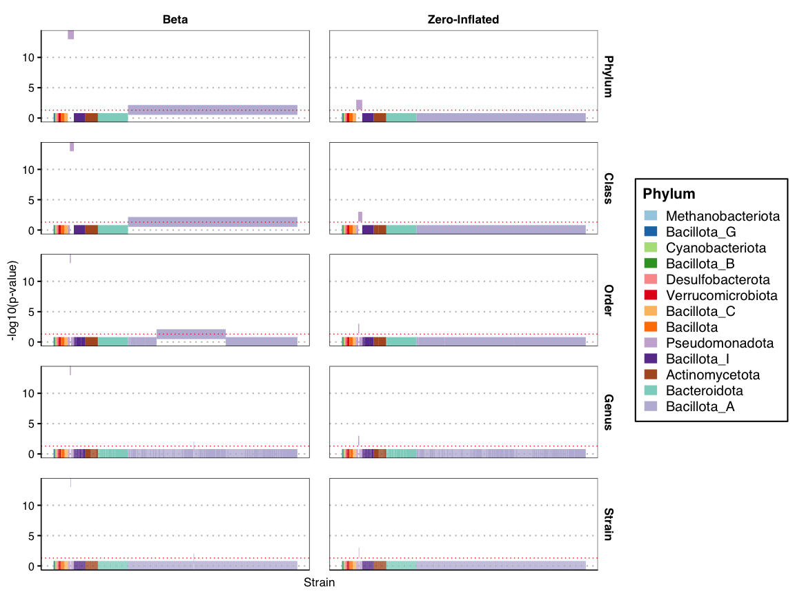

``` r
plot_volcano(fit_zib_95, label = T)
```

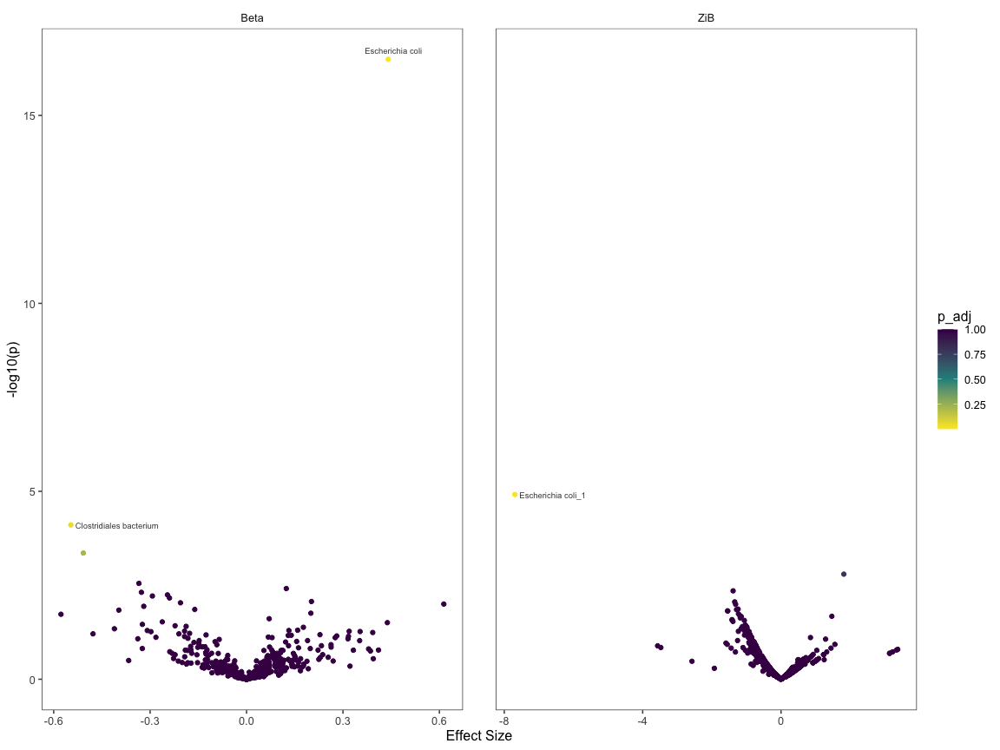

``` r
plot_ani_dist(d_p95, phenotype = 'spiked', contigs = top_hits(fit_zib_95, alpha = 0.05)$Contig_name, drop_zeros = F, show_points = T, plot_type = 'violin')
```

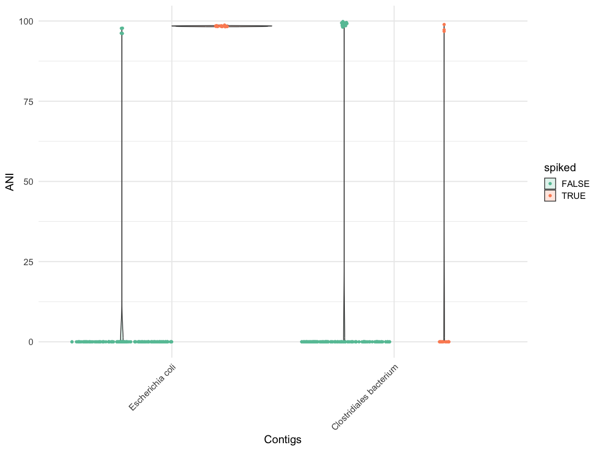

### profile 98

``` r
save_path = "output_rds/spike_ecoli_zib_p_98.rds"
if(file.exists(save_path)){
  fit_zib_98 <- readRDS(save_path)
} else {
  system.time({
    fit_zib_98 <- glmZiBFit(d_p98, design, nthreads = 10)
  })
  saveRDS(fit_zib_98, save_path)
}

plot_manhattan(fit_zib_98, taxonomy = tax_98, method = "holm", tax_levels = c("Phylum", "Order", "Class", "Genus", "Species"))
```

    ## ! # Invaild edge matrix for <phylo>. A <tbl_df> is returned.
    ## ! # Invaild edge matrix for <phylo>. A <tbl_df> is returned.
    ## ! # Invaild edge matrix for <phylo>. A <tbl_df> is returned.
    ## ! # Invaild edge matrix for <phylo>. A <tbl_df> is returned.

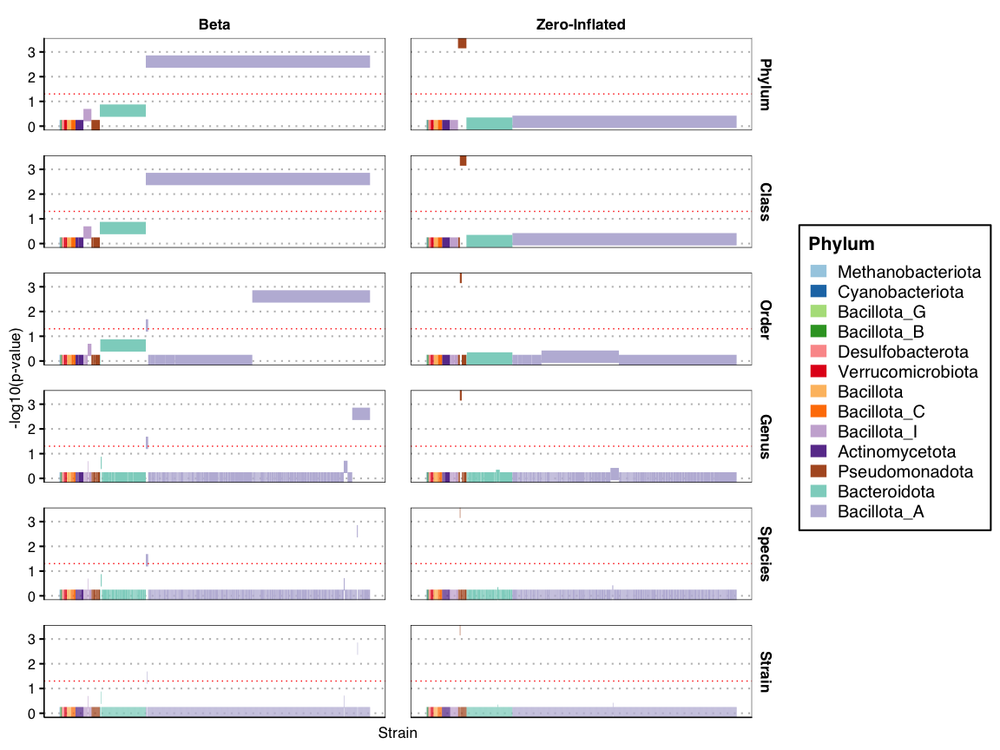

``` r
plot_volcano(fit_zib_98, label = T)
```

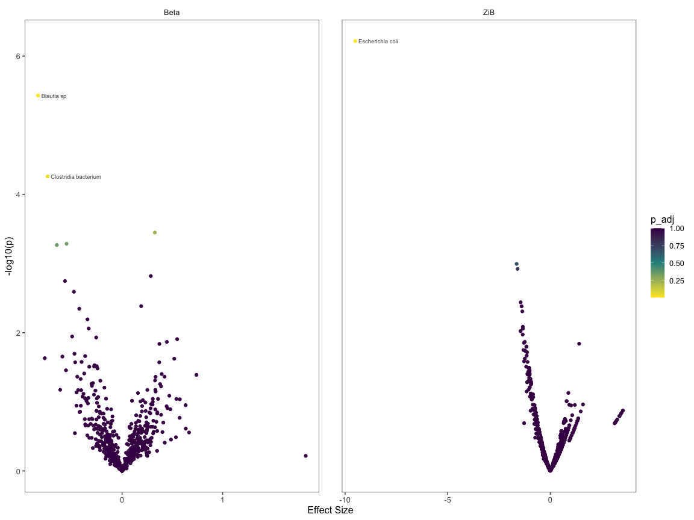

``` r
plot_ani_dist(d_p98, phenotype = 'spiked', contigs = top_hits(fit_zib_98, alpha = 0.05)$Contig_name)
```

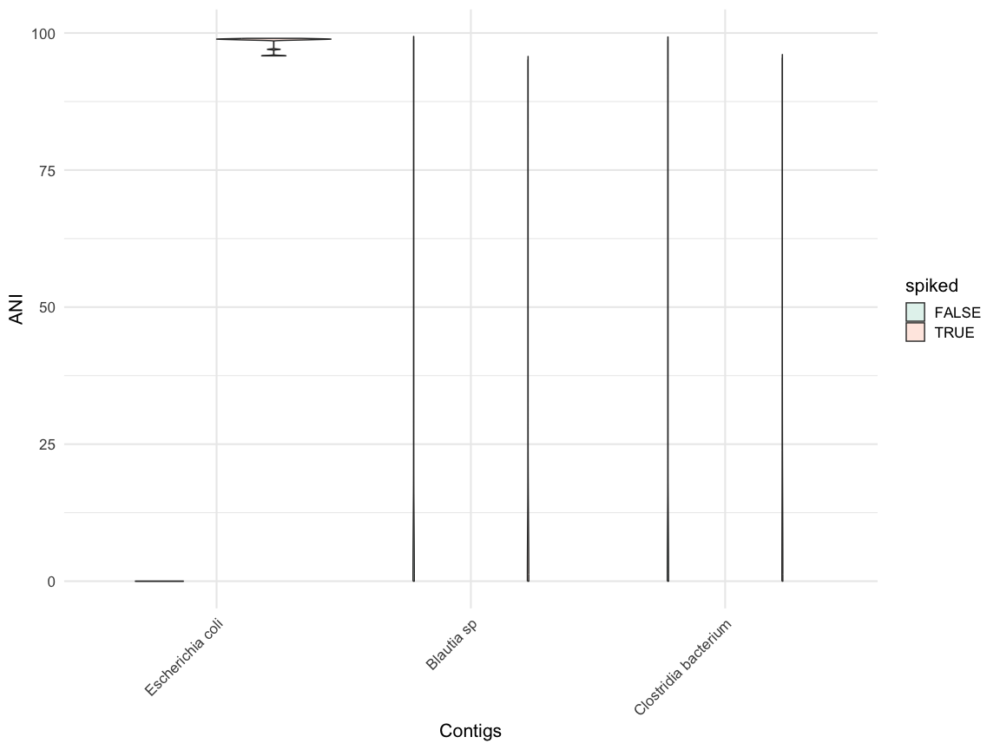

``` r
plot_ani_dist(d_p98, phenotype = 'spiked', contigs = top_hits(fit_zib_98, alpha = 0.05)$Contig_name, drop_zeros = T)
```

    ## Warning: Removed 470 rows containing non-finite outside the scale range
    ## (`stat_ydensity()`).

    ## Warning: Cannot compute density for groups with fewer than two datapoints.

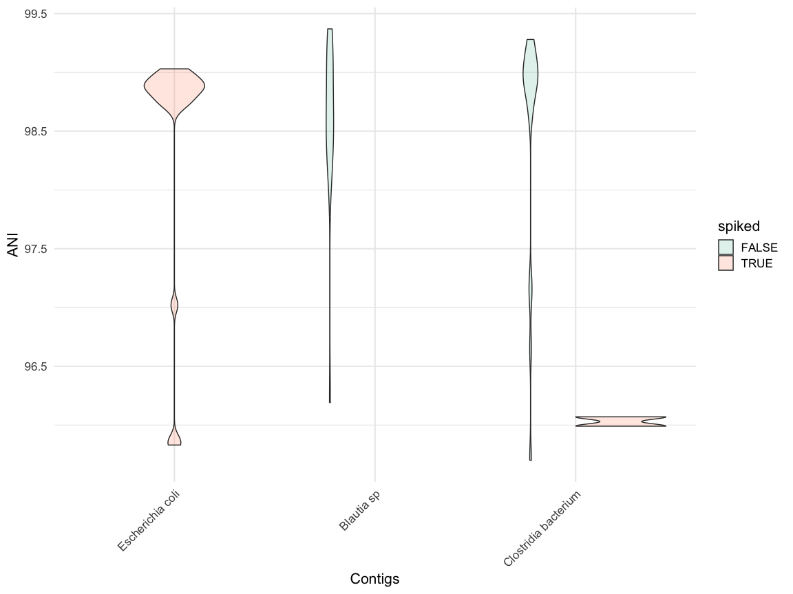

### profile 99

``` r
save_path = "output_rds/spike_ecoli_zib_p_99.rds"
if(file.exists(save_path)){
  fit_zib_99 <- readRDS(save_path)
} else {
  system.time({
    fit_zib_99 <- glmZiBFit(d_p99, design, nthreads = 10)
  })
  saveRDS(fit_zib_99, save_path)
}

plot_manhattan(fit_zib_99, taxonomy = tax_99, method = "HMP", tax_levels = c("Phylum", "Order", "Class", "Genus"))
```

    ## ! # Invaild edge matrix for <phylo>. A <tbl_df> is returned.
    ## ! # Invaild edge matrix for <phylo>. A <tbl_df> is returned.
    ## ! # Invaild edge matrix for <phylo>. A <tbl_df> is returned.
    ## ! # Invaild edge matrix for <phylo>. A <tbl_df> is returned.

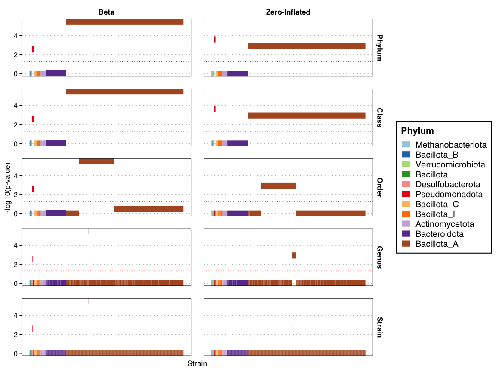

``` r
plot_volcano(fit_zib_99, label = T)
```

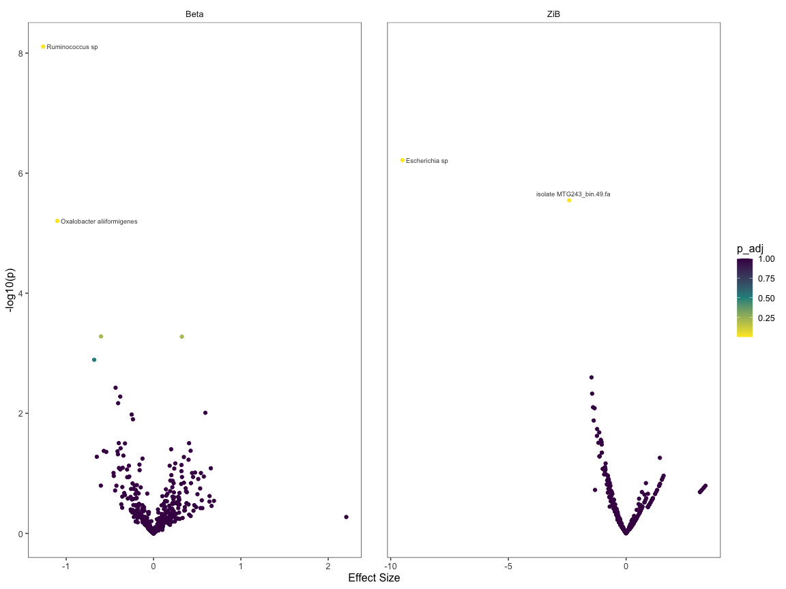

``` r
plot_ani_dist(d_p99, phenotype = 'spiked', contigs = top_hits(fit_zib_99, alpha = 0.05)$Contig_name)
```

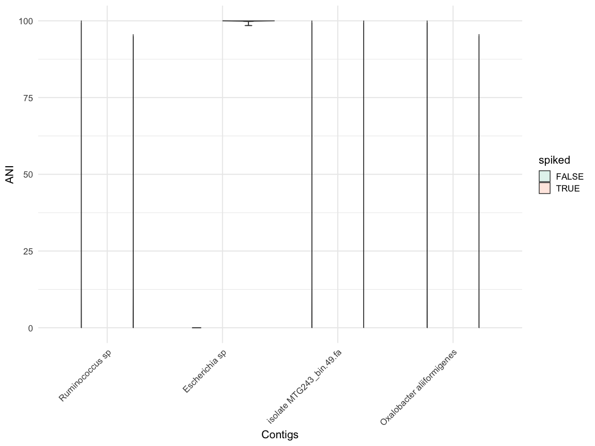

``` r
plot_ani_dist(d_p99, phenotype = 'spiked', contigs = top_hits(fit_zib_99, alpha = 0.05)$Contig_name, drop_zeros = T)
```

    ## Warning: Removed 617 rows containing non-finite outside the scale range
    ## (`stat_ydensity()`).

    ## Warning: Cannot compute density for groups with fewer than two datapoints.

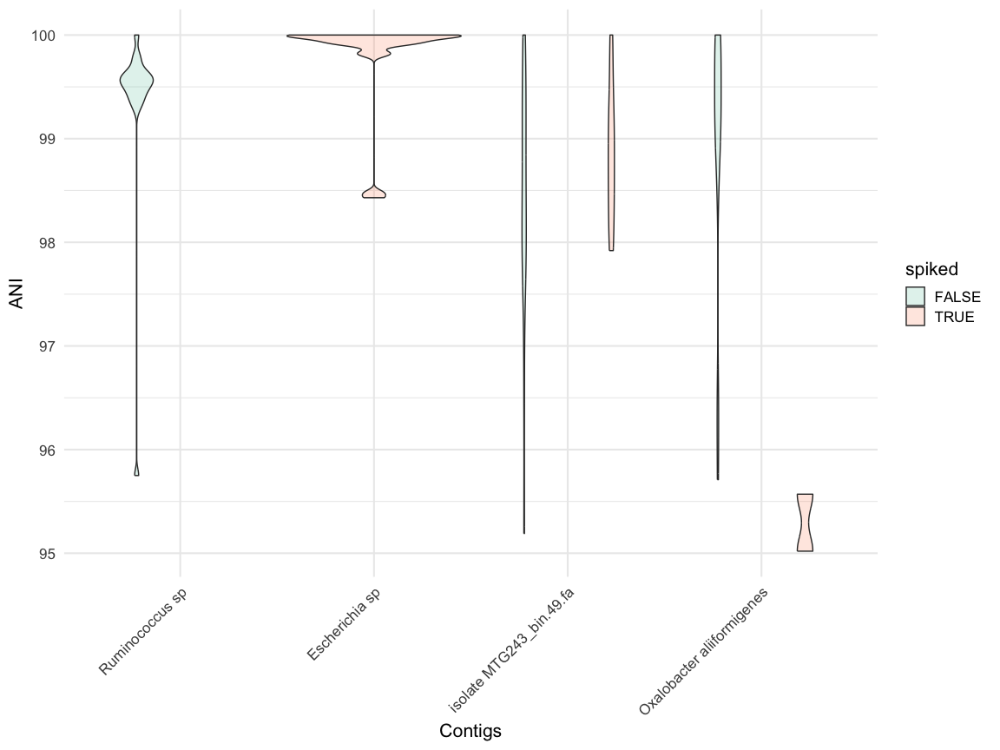

## Fit OB models

### profile 95

``` r
save_path = "output_rds/spike_ecoli_ob_p_95.rds"
if(file.exists(save_path)){
  fit_ob_95 <- readRDS(save_path)
} else {
  system.time({
    fit_ob_95 <- glmObFit(d_p95, design, nthreads = 10)
  })
  saveRDS(fit_ob_95, save_path)
}
```

    ##   |                                                                              |                                                                      |   0%  |                                                                              |==============                                                        |  20%  |                                                                              |============================                                          |  40%  |                                                                              |==========================================                            |  60%  |                                                                              |========================================================              |  80%  |                                                                              |======================================================================| 100%

``` r
plot_manhattan(fit_ob_95, taxonomy = tax_95, method = "HMP", tax_levels = c("Phylum", "Order", "Class", "Genus"))
```

    ## ! # Invaild edge matrix for <phylo>. A <tbl_df> is returned.
    ## ! # Invaild edge matrix for <phylo>. A <tbl_df> is returned.
    ## ! # Invaild edge matrix for <phylo>. A <tbl_df> is returned.
    ## ! # Invaild edge matrix for <phylo>. A <tbl_df> is returned.

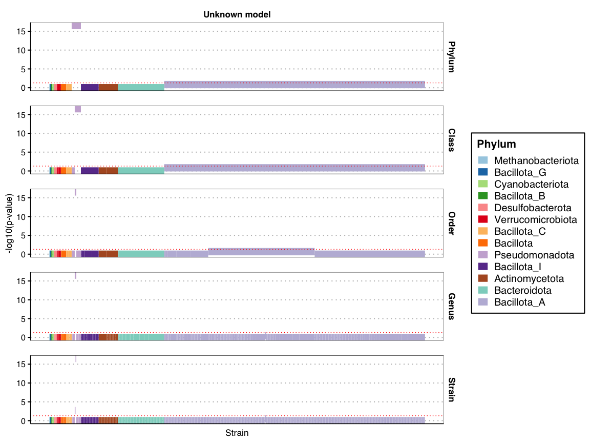

``` r
plot_volcano(fit_ob_95, label = T)
```

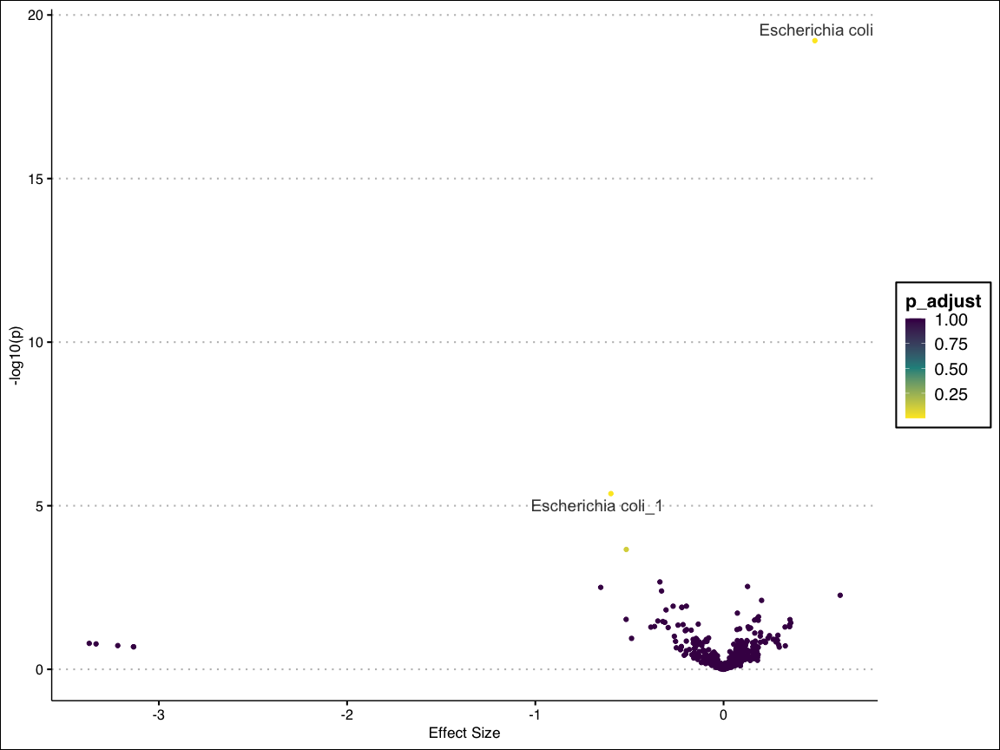

``` r
plot_ani_dist(d_p95, phenotype = 'spiked', contigs = top_hits(fit_ob_95, alpha = 0.5)$Contig_name, drop_zeros = F, show_points = T, plot_type = 'violin')
```

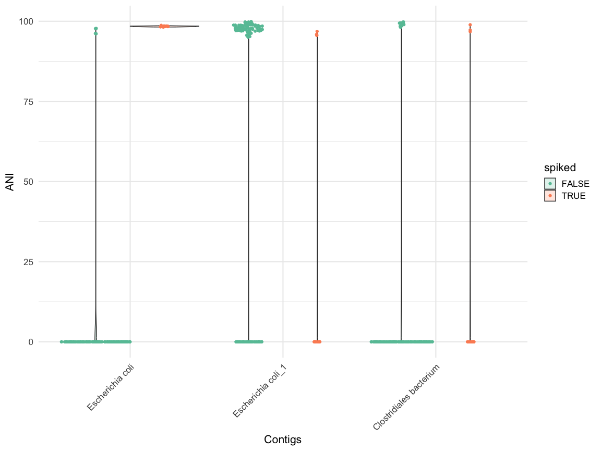

### profile 98

``` r
save_path = "output_rds/spike_ecoli_ob_p_98.rds"
if(file.exists(save_path)){
  fit_ob_98 <- readRDS(save_path)
} else {
  system.time({
    fit_ob_98 <- glmObFit(d_p98, design, nthreads = 10)
  })
  saveRDS(fit_ob_98, save_path)
}
```

    ##   |                                                                              |                                                                      |   0%  |                                                                              |==========                                                            |  14%  |                                                                              |====================                                                  |  29%  |                                                                              |==============================                                        |  43%  |                                                                              |========================================                              |  57%  |                                                                              |==================================================                    |  71%  |                                                                              |============================================================          |  86%  |                                                                              |======================================================================| 100%

``` r
plot_manhattan(fit_ob_98, taxonomy = tax_98, method = "HMP", tax_levels = c("Phylum", "Order", "Class", "Genus", "Species"))
```

    ## ! # Invaild edge matrix for <phylo>. A <tbl_df> is returned.
    ## ! # Invaild edge matrix for <phylo>. A <tbl_df> is returned.
    ## ! # Invaild edge matrix for <phylo>. A <tbl_df> is returned.
    ## ! # Invaild edge matrix for <phylo>. A <tbl_df> is returned.

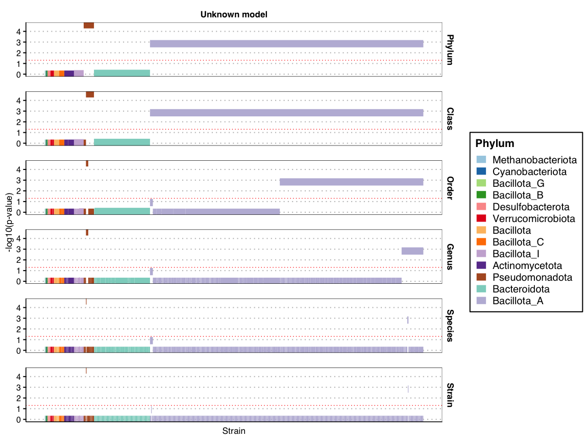

``` r
plot_volcano(fit_ob_98, label = T)
```

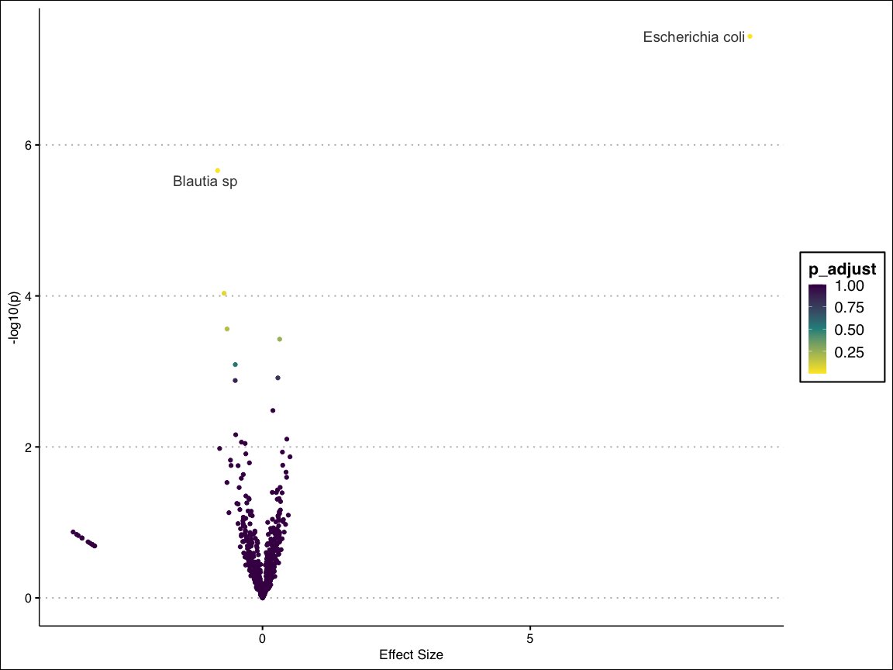

``` r
plot_ani_dist(d_p98, phenotype = 'spiked', contigs = top_hits(fit_ob_98, alpha = 0.05)$Contig_name, show_points = T, plot_type = 'violin')
```

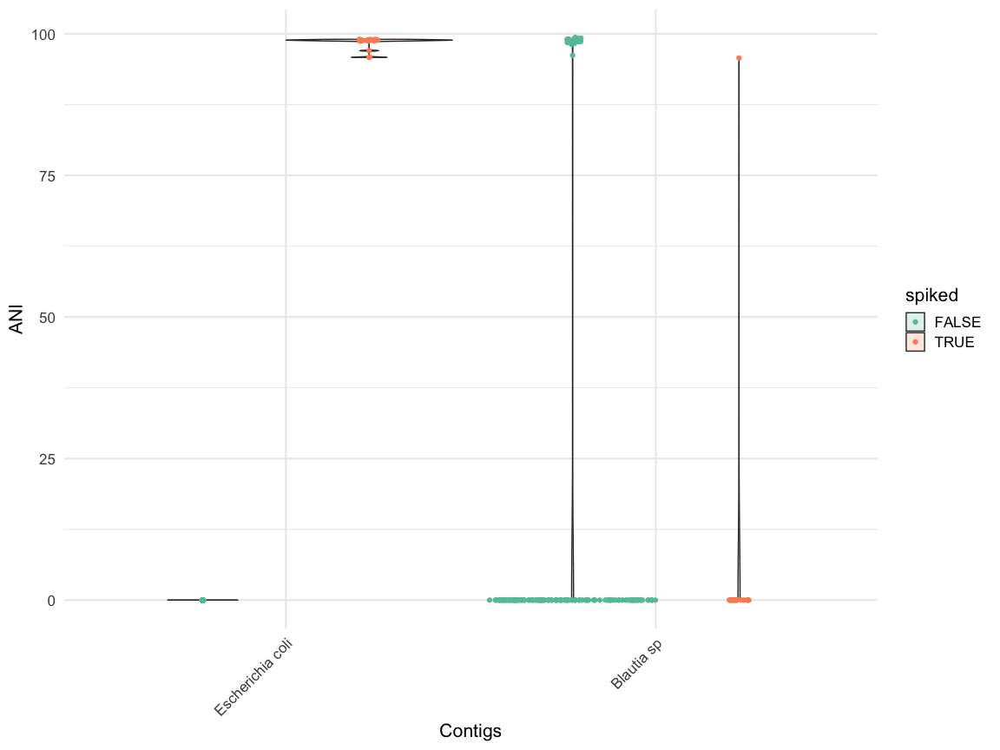

``` r
plot_ani_dist(d_p98, phenotype = 'spiked', contigs = top_hits(fit_ob_98, alpha = 0.05)$Contig_name, drop_zeros = T, show_points = T, plot_type = 'violin')
```

    ## Warning: Removed 314 rows containing non-finite outside the scale range
    ## (`stat_ydensity()`).

    ## Warning: Cannot compute density for groups with fewer than two datapoints.

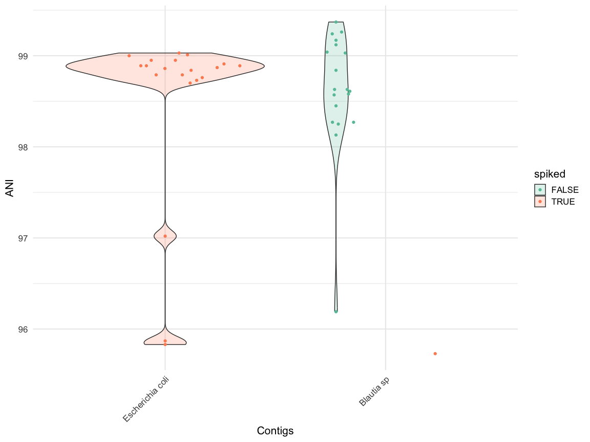

### profile 99

``` r
save_path = "output_rds/spike_ecoli_ob_p_99.rds"
if(file.exists(save_path)){
  fit_ob_99 <- readRDS(save_path)
} else {
  system.time({
    fit_ob_99 <- glmObFit(d_p99, design, nthreads = 10)
  })
  saveRDS(fit_ob_99, save_path)
}
```

    ##   |                                                                              |                                                                      |   0%  |                                                                              |==============                                                        |  20%  |                                                                              |============================                                          |  40%  |                                                                              |==========================================                            |  60%  |                                                                              |========================================================              |  80%  |                                                                              |======================================================================| 100%

``` r
plot_manhattan(fit_ob_99, taxonomy = tax_99, method = "HMP", tax_levels = c("Phylum", "Order", "Class", "Genus", "Species"))
```

    ## ! # Invaild edge matrix for <phylo>. A <tbl_df> is returned.
    ## ! # Invaild edge matrix for <phylo>. A <tbl_df> is returned.
    ## ! # Invaild edge matrix for <phylo>. A <tbl_df> is returned.
    ## ! # Invaild edge matrix for <phylo>. A <tbl_df> is returned.

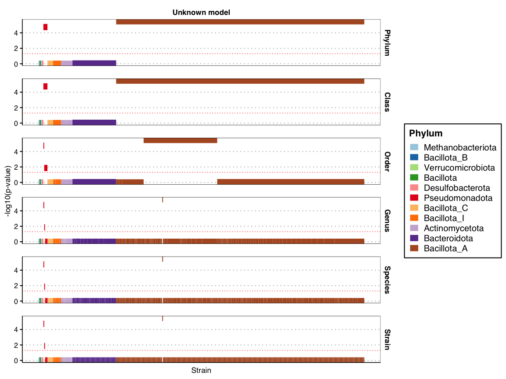

``` r
plot_volcano(fit_ob_99, label = T)
```

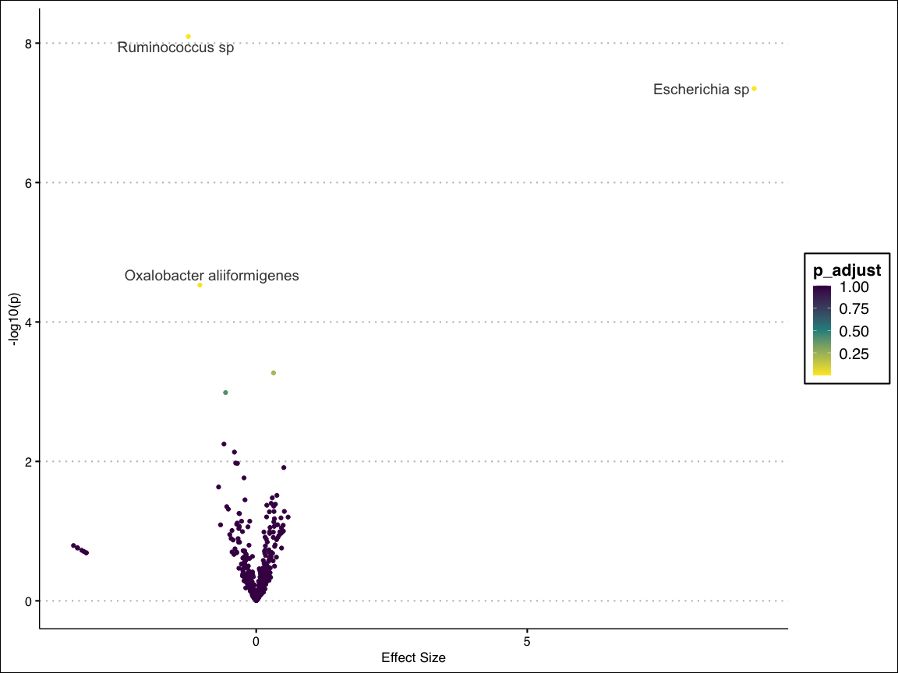

``` r
plot_ani_dist(d_p99, phenotype = 'spiked', contigs = top_hits(fit_ob_99, alpha = 0.05)$Contig_name, drop_zeros = F, show_points = T, plot_type = 'violin')
```

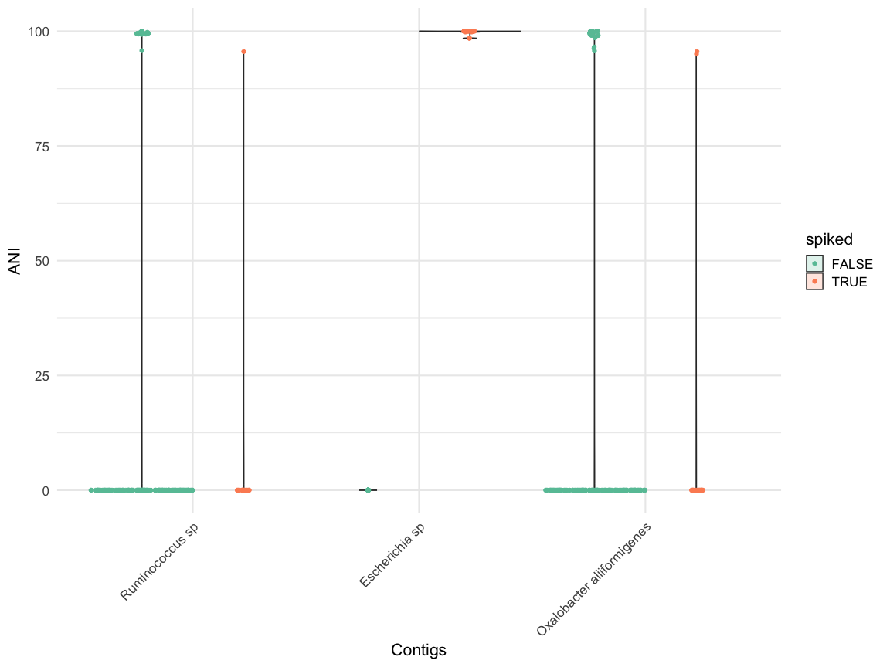

``` r
plot_ani_dist(d_p99, phenotype = 'spiked', contigs = top_hits(fit_ob_99, alpha = 0.05)$Contig_name, drop_zeros = T, show_points = T, plot_type = 'violin')
```

    ## Warning: Removed 470 rows containing non-finite outside the scale range
    ## (`stat_ydensity()`).

    ## Warning: Cannot compute density for groups with fewer than two datapoints.

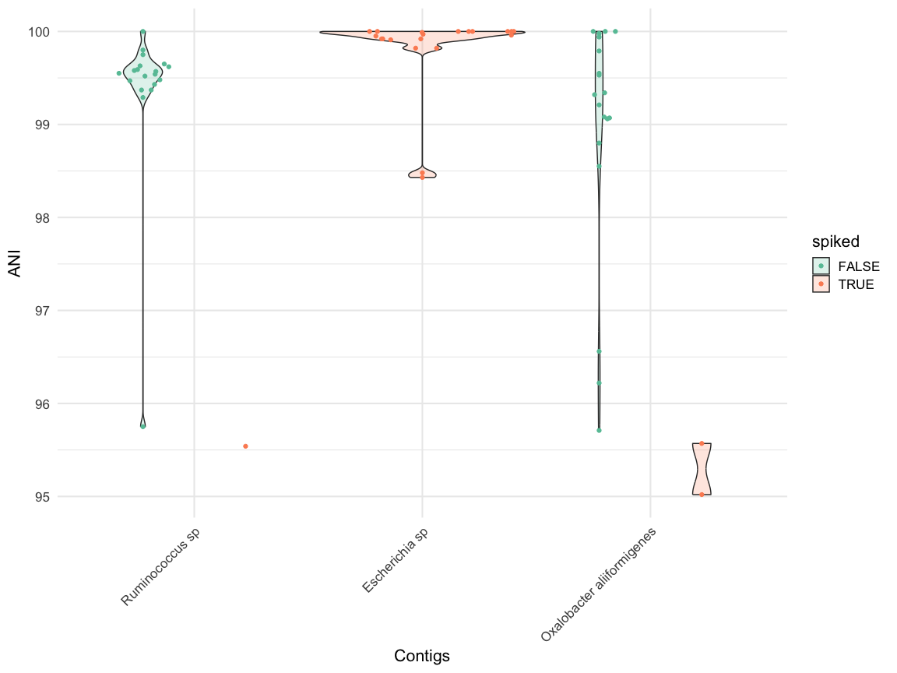
