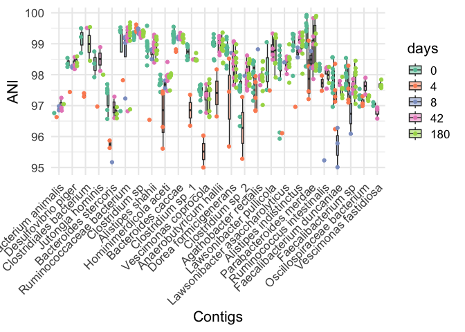
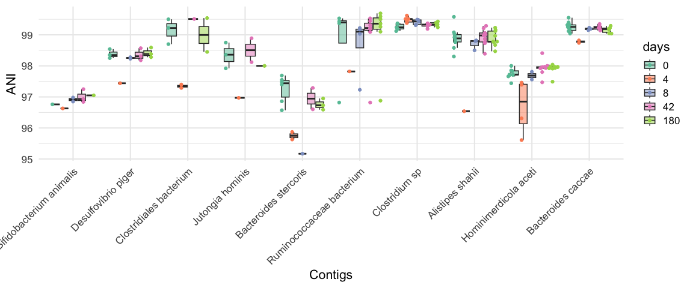
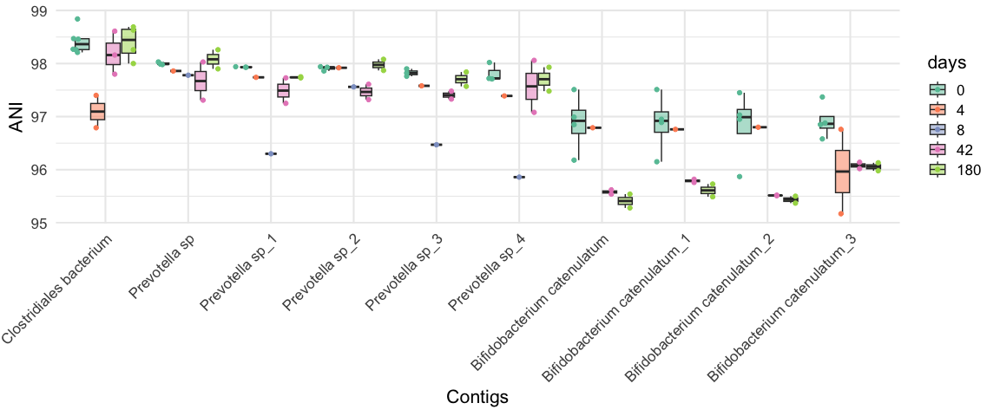
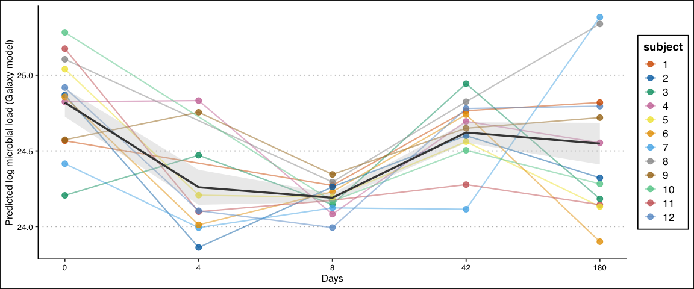
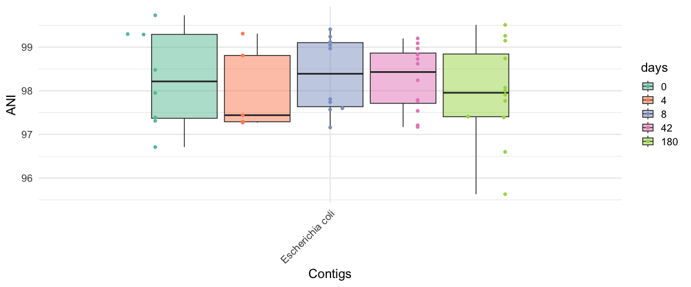
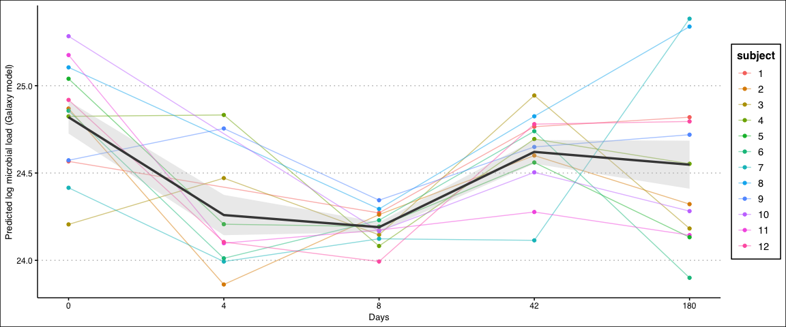
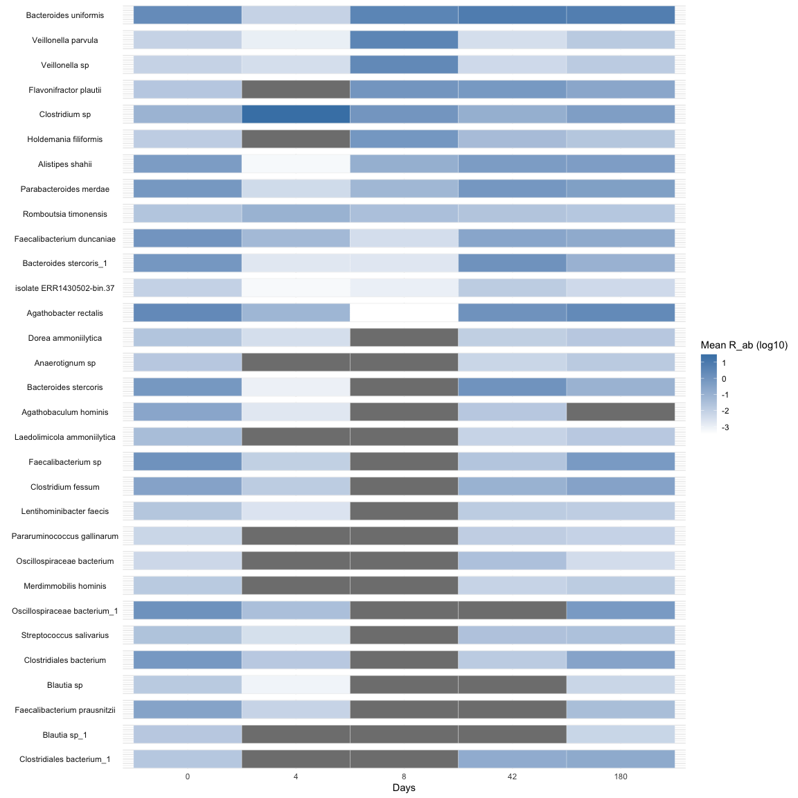

Analysis of Palleja Antibiotic Exposure data
================
2025-07-28

# Run Sylph v0.8.0

Examples:

    sylph profile ../db/gtdb_95_ordered_DB/gtdb_ordered_95.syldb -u --read-seq-id 99.9 -t 8 -1 ./*_1.fastq.gz -2 /*_2.fastq.gz -o palleja_p_95.tsv

    sylph query ../db/gtdb_99_ordered_DB/gtdb_ordered_99.syldb -u --read-seq-id 99.9 -t 8 -1 ./*_1.fastq.gz -2 /*_2.fastq.gz -o palleja_q_99.tsv

## Load deps

``` r
library(tidyverse)
library(data.table)
library(ggbeeswarm)
library(ggthemes)
library(strainspy)
library(SummarizedExperiment)
library(ggplot2)
```

## Load metadata and tax

``` r
meta = read.table("data/palleja_ab_recovery/metadata.tsv", header = T)
meta$days = factor(meta$days, levels = c(0, 4, 8, 42, 180))
meta$subject = factor(meta$subject)
meta$load = log(meta$g_load) # This is probably better representative given gut microbiome data

conv_design = as.formula('~days + (1 | subject)') # conventional without load adjustment
design = as.formula('~ days + (1|subject) + load')

tax95 = read_taxonomy(system.file("extdata", "example_taxonomy.tsv.gz", package = "strainspy"))
tax99 = read_taxonomy("data/TAXONOMY/sylph_DB_taxonomy_99.tsv")
```

## Helper functions

``` r
cleanup = function(se, meta, min_subj = 3, min_days = 2){
  colnames(se) = gsub("_1", "", colnames(se)) # Reset colnames
  
  
  
  se = modify_metadata(se, meta)
  strainspy:::filter_by_presence_longitudinal(se, subject_col = "subject", 
                                              time_col = "days", 
                                              min_subjects = min_subj, 
                                              min_timepoints = min_days)
}

viz = function(se, fit, tax){
  p1 <- plot_manhattan(fit, taxonomy = tax, aggregate_by_taxa = TRUE)
  p2 <- plot_manhattan(fit, taxonomy = tax, aggregate_by_taxa = FALSE)
  p3 <- plot_volcano(fit, label = TRUE)
  p4 <- plot_ani_dist(
    se,
    phenotype = 'days',
    contigs = top_hits(fit)$Contig_name[1:10],
    drop_zeros = TRUE,
    show_points = TRUE,
    plot_type = 'box'
  )
  
  # Combine using patchwork
  p1
  p2
  p3
  p4
}

pool_contigs = function(fit, coef = c(2,3,4,5), alpha = 0.05){ # For baseline vs. changes
  return(unique(unlist(sapply(coef, function(cf) top_hits(fit, coef = cf, alpha = alpha)$Contig_name))))
}
```

# Immediate changes following exposure

``` r
meta_pre2post = meta[meta$days == 0 | meta$days == 8, ]

se_p = cleanup(read_sylph("data/palleja_ab_recovery/combined_p_95.tsv"), meta)
```

    ## Detected Sylph profile output file.

    ## Retained 371 rows after subject-aware filtering

``` r
se_q = cleanup(read_sylph("data/palleja_ab_recovery/combined_q_99.tsv"), meta)
```

    ## Detected Sylph query output file.

    ## Retained 15802 rows after subject-aware filtering

## Fit to profile

``` r
save_path <- "output_rds/palleja_zib_p_95.rds"
if(file.exists(save_path)){
  fit_zib_p <- readRDS(save_path)
} else {
  ebp_p = compute_eb_priors(se = se_p, design = as.formula('~ days'), 
                            nthreads = parallel::detectCores(), low_cutoff = 0, high_cutoff = Inf)
  
  fit_zib_p = glmZiBFit(se_p, conv_design, nthreads = parallel::detectCores(), MAP_prior = ebp_p)
  saveRDS(fit_zib_p, save_path)
}


plot_ani_dist(se_p, 'days', pool_contigs(fit_zib_p), drop_zeros = T, show_points = T, plot_type = "box")
```

    ## Warning: Removed 866 rows containing non-finite outside the scale range
    ## (`stat_boxplot()`).

<!-- -->

``` r
viz(se_p, fit_zib_p, tax95)
```

    ## ! # Invaild edge matrix for <phylo>. A <tbl_df> is returned.
    ## ! # Invaild edge matrix for <phylo>. A <tbl_df> is returned.
    ## ! # Invaild edge matrix for <phylo>. A <tbl_df> is returned.
    ## ! # Invaild edge matrix for <phylo>. A <tbl_df> is returned.
    ## ! # Invaild edge matrix for <phylo>. A <tbl_df> is returned.
    ## ! # Invaild edge matrix for <phylo>. A <tbl_df> is returned.
    ## ! # Invaild edge matrix for <phylo>. A <tbl_df> is returned.
    ## ! # Invaild edge matrix for <phylo>. A <tbl_df> is returned.
    ## ! # Invaild edge matrix for <phylo>. A <tbl_df> is returned.
    ## ! # Invaild edge matrix for <phylo>. A <tbl_df> is returned.

    ## Warning: Removed 381 rows containing non-finite outside the scale range
    ## (`stat_boxplot()`).

<!-- -->

    ## Warning: Removed 381 rows containing non-finite outside the scale range
    ## (`stat_boxplot()`).

<!-- -->

## Fit to query - takes long, skip for now

``` r
save_path <- "output_rds/palleja_zib_q_99.rds"
if(file.exists(save_path)){
  fit_zib_q <- readRDS(save_path)
} else {
  ebp_q = compute_eb_priors(se = se_q, design = as.formula('~ days'),
                            nthreads = parallel::detectCores(), low_cutoff = 0, high_cutoff = Inf)
  
  fit_zib_q = glmZiBFit(se_q, design, nthreads = parallel::detectCores(), MAP_prior = ebp_q)
  saveRDS(fit_zib_q, save_path)
}


viz(se_q, fit_zib_q, tax99)
```

    ## ! # Invaild edge matrix for <phylo>. A <tbl_df> is returned.
    ## ! # Invaild edge matrix for <phylo>. A <tbl_df> is returned.
    ## ! # Invaild edge matrix for <phylo>. A <tbl_df> is returned.
    ## ! # Invaild edge matrix for <phylo>. A <tbl_df> is returned.
    ## ! # Invaild edge matrix for <phylo>. A <tbl_df> is returned.
    ## ! # Invaild edge matrix for <phylo>. A <tbl_df> is returned.
    ## ! # Invaild edge matrix for <phylo>. A <tbl_df> is returned.
    ## ! # Invaild edge matrix for <phylo>. A <tbl_df> is returned.
    ## ! # Invaild edge matrix for <phylo>. A <tbl_df> is returned.
    ## ! # Invaild edge matrix for <phylo>. A <tbl_df> is returned.

    ## Warning: Removed 473 rows containing non-finite outside the scale range
    ## (`stat_boxplot()`).

<!-- -->

    ## Warning: Removed 473 rows containing non-finite outside the scale range
    ## (`stat_boxplot()`).

<!-- -->

``` r
# Nice signal here:
# Veillonella parvula - 00100
# Faecalibacterium prausnitzii - 0-1-3-20
```

# Run abundance testing AKA why don’t see see *E. coli* in ANI testing?

*E. coli* shows a sharp shift in abundance in the paper (goes up after
exposure and then down) - but no change in ANI. Indicative of no strain
change or replacement?

``` r
se_p95_abund  = cleanup(read_sylph("data/palleja_ab_recovery/combined_p_95.tsv", variable = "Taxonomic_abundance"), meta)
```

    ## Detected Sylph profile output file.

    ## Retained 371 rows after subject-aware filtering

``` r
bug = c("Veillonella", "Klebsiella pneumoniae", "Escherichia coli"); bug_i = 3

p1 = plot_ani_dist(se_p95_abund, 'days',contigs = rownames(se_p95_abund)[grep(bug[bug_i], rownames(se_p95_abund))] ,drop_zeros = T,show_points = TRUE,plot_type = 'box')
```

    ## Warning: Removed 10 rows containing non-finite outside the scale range
    ## (`stat_boxplot()`).

<!-- -->

``` r
p2 = plot_ani_dist(se_p, 'days',contigs = rownames(se_p)[grep(bug[bug_i], rownames(se_p))] ,drop_zeros = T,show_points = TRUE,plot_type = 'box')
```

    ## Warning: Removed 10 rows containing non-finite outside the scale range
    ## (`stat_boxplot()`).

<!-- -->

It seems that relative abundance does have the trend mentioned in the
paper, but ANI is stable.

## Check microbial load vs reported enriched low abundance commensals

``` r
summary_df <- meta %>%
  group_by(days) %>%
  summarise(
    mean_log_gload = mean(log(g_load), na.rm = TRUE),
    se_log_gload = sd(log(g_load), na.rm = TRUE) / sqrt(n())
  )

ggplot() +
  geom_line(data = meta, aes(x = as.numeric(days), y = log(g_load), group = subject, color = subject), alpha = 0.5) +
  geom_point(data = meta, aes(x = as.numeric(days), y = log(g_load), color = subject), alpha = 1) +
  geom_line(data = summary_df, aes(x = as.numeric(days), y = mean_log_gload), size = 1.2, color = "black") +
  geom_ribbon(data = summary_df, aes(x = as.numeric(days), ymin = mean_log_gload - se_log_gload, ymax = mean_log_gload + se_log_gload), alpha = 0.3, fill = "grey") +
  xlab("Days") +
  ylab("Predicted log microbial load (Galaxy model)") +
  scale_x_continuous(breaks = unique(as.numeric(summary_df$days)), labels = unique(summary_df$days)) +
  theme(legend.position = "right") +
  theme_clean()
```

    ## Warning: Using `size` aesthetic for lines was deprecated in ggplot2 3.4.0.
    ## ℹ Please use `linewidth` instead.
    ## This warning is displayed once every 8 hours.
    ## Call `lifecycle::last_lifecycle_warnings()` to see where this warning was
    ## generated.

<!-- -->

As expected microbial load goes down after antibiotic exposure. Could
the relative abundance change in *E. coli&* be an artifact of this
effect?

## Perform differential abundance testing

``` r
# Helper function
generate_species_plot = function(fit_ab){
  # Pool the stains that are different at least one day compared to baseline
  plt_dat = plot_ani_dist(se_p95_abund,phenotype = 'days',contigs = pool_contigs(fit_ab) ,drop_zeros = TRUE,show_points = TRUE,plot_type = 'box', plot = F)
  plt_dat = plt_dat %>% 
    group_by(Contig, days) %>%
    summarise(mean_ANI = mean(ANI, na.rm = TRUE), median_ANI = median(ANI, na.rm = T), .groups = 'drop')
  
  # Thrived
  contigs_thrived <- plt_dat %>%
    group_by(Contig, days) %>%
    tidyr::pivot_wider(names_from = days, values_from = median_ANI) %>%
    filter(`4` > `0` | `8` > `0`) %>%
    pull(Contig) %>%
    unique()
  
  plt_dat$Contig = factor(plt_dat$Contig, levels = unique(plt_dat$Contig)[order(plt_dat$mean_ANI[plt_dat$days == 8], decreasing = T)])
  
  ggplot(plt_dat, aes(x = factor(days, levels = c(0,4,8,42,180)), y = 1, fill = log10(mean_ANI))) +
    geom_tile(color = "white") +
    facet_wrap(~ Contig, ncol = 1, strip.position = "left") +
    scale_fill_gradient(low = "white", high = "steelblue") +
    labs(x = "Days", y = NULL, fill = "Mean R_ab (log10)") +
    theme_minimal() +
    theme(
      axis.text.y = element_blank(),
      axis.ticks.y = element_blank(),
      strip.text.y.left = element_text(angle = 0)
    )
  
}
```

### Model without correcting for microbial load

``` r
save_path <- "output_rds/palleja_abud_p_95_conv.rds"
if(file.exists(save_path)){
  fit_ab_conv <- readRDS(save_path)
} else {
  fit_ab_conv = abundanceFit(se = se_p95_abund, design = conv_design, nthreads = parallel::detectCores(), transform = 'CLR')
  saveRDS(fit_ab_conv, save_path)
}
generate_species_plot(fit_ab_conv)
```

<!-- -->

### Model with load adjustment

``` r
save_path <- "output_rds/palleja_abud_p_95_load_adj.rds"
if(file.exists(save_path)){
  fit_ab_load <- readRDS(save_path)
} else {
  fit_ab_load = abundanceFit(se = se_p95_abund, design = design, nthreads = parallel::detectCores(), transform = 'CLR')
  saveRDS(fit_ab_load, save_path)
}

generate_species_plot(fit_ab_load)
```

<!-- -->

After adjusting for load, we lose many top hits, including *E. coli*.
These were all likely driven by the reduction of overall microbial load.
