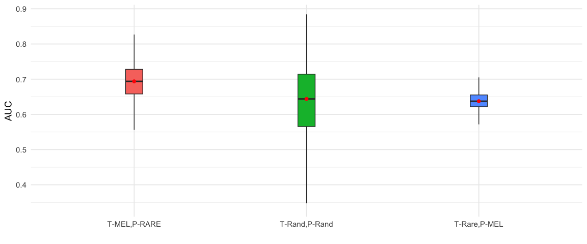
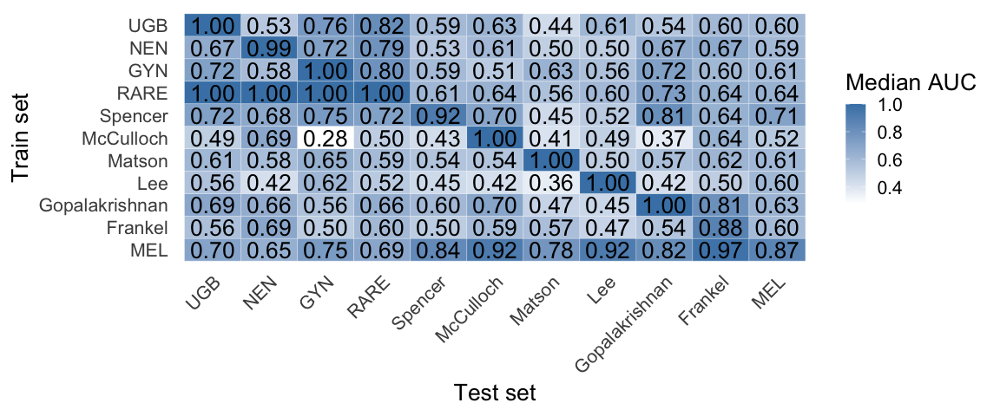
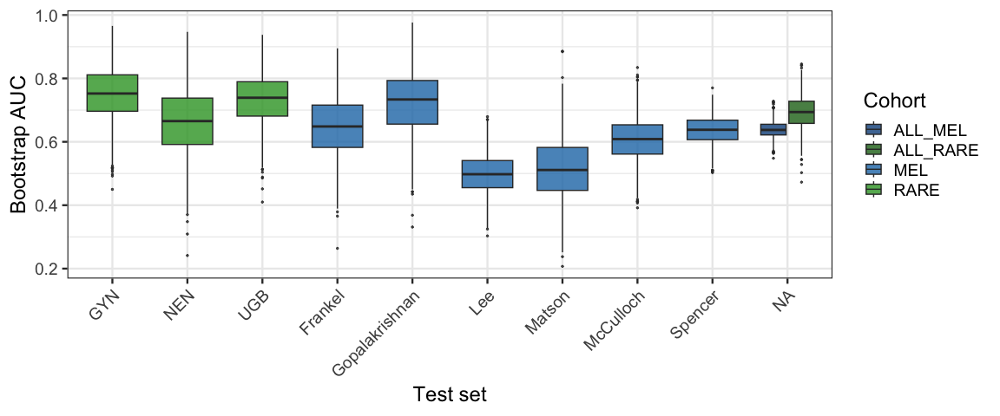
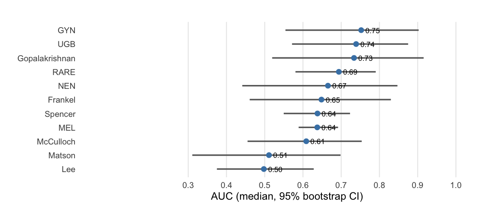
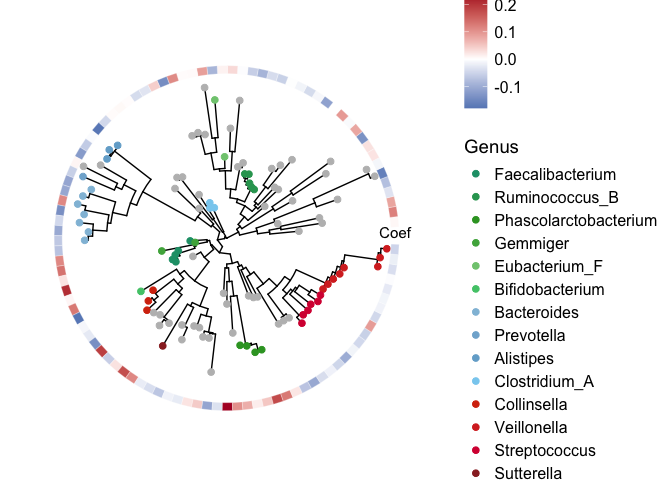
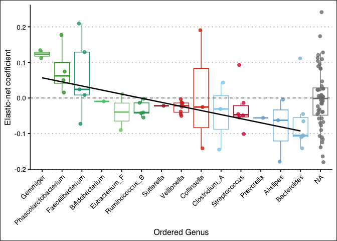

Prediction of immune therapy outcomes in pan cancer: pooling Ash’s rare
cancer and Kshitij’s melanoma data
================
2025-12-18

## Load dependencies

``` r
library(strainspy)
library(SummarizedExperiment)
library(caret)
library(glmnet) # elastic net
library(ranger) # RF
library(pROC)
library(doParallel)
library(foreach)
library(parallel)
library(ggplot2)
library(tidyr)
library(dplyr)
library(ggtree)
```

## Load metadata

``` r
# WARNING! THIS INCLUDES UNPIBLISHED DATA
meta_path <- "./data/ash_pancancer/metadata_full.tsv"
meta_pan <- read.csv(meta_path, sep = '\t') 
meta_pan = cbind(run_acc = meta_pan$run_accession, meta_pan)
# From paper:
# RvsP = CR or PR VS. PD or cPD - excluded patients with a BOR of stable disease (SD) (n=29)

# Outcome
meta_pan$RvsP = "R"
meta_pan$RvsP[which(meta_pan$BOR == "PD" | meta_pan$BOR == "cPD")] = "NR" 
meta_pan$RvsP = factor(meta_pan$RvsP, levels = c("NR", "R"))

# Melanoma meta
meta_m = read.csv("data/melanoma_pooled/Clean_metadata_Aug5_Allyson_match_2025.txt", sep = '\t')


meta = rbind(data.frame(X = meta_pan$run_acc, c_type = "RARE", type = meta_pan$histology_cohort.x, RvsP = meta_pan$RvsP), 
             data.frame(X = meta_m$X, c_type = "MEL", type = meta_m$Study_simplified, RvsP = meta_m$ORR))
```

## Load sylph outputs

``` r
sy <- read_sylph("./data/ash_pancancer/merged_pan_melanoma.tsv.gz") # q99)
```

    ## Detected Sylph query output file.

``` r
# annoying renames to match meta V sylph file
colnames(sy) <- gsub("_1", "", colnames(sy))
colData(sy)$Sample_file <- gsub("_1", "", basename(colData(sy)$Sample_file))

# Reorder meta 
meta = meta[match(colnames(sy), meta$X), ]

sy <- filter_by_presence(sy, min_nonzero = 53) # filter at 10%
```

    ## Retained 19691 rows after filtering

``` r
dim(sy)
```

    ## [1] 19691   526

``` r
# Checks before merging metadata
all(colnames(sy) %in% meta$X)
```

    ## [1] TRUE

``` r
all(meta$X %in% colnames(sy))
```

    ## [1] TRUE

``` r
sy = modify_metadata(sy, meta, replace = T)
```

## Fit the univariate model

``` r
design <- as.formula("~ RvsP")

save_path <- "output_rds/ASH+mela_zib_q_99_ebp.rds"

if(file.exists(save_path)){
  ZB_fit <- readRDS(save_path)
} else {
  # Run with weak prior for prediction
  ebp = compute_eb_priors(sy, design, nthreads = 10L, low_cutoff = 0, high_cutoff = Inf)
  ZB_fit <- glmZiBFit(sy, design, nthreads = parallel::detectCores(), MAP_prior = ebp)
  saveRDS(ZB_fit, save_path)
}
```

# Prediction

## Using Elastic net

### Set up pipeline

``` r
run_enet <- function(train_idx, test_idx, meta, sy, feature_names, return_fit = F) {
  
  train_mx <- strainspy::prep_for_prediction(
    sy[, train_idx],
    'RvsP',
    feature_names
  )
  
  test_mx <- strainspy::prep_for_prediction(
    sy[, test_idx],
    'RvsP',
    feature_names
  )
  
  # Skip if test labels are all one class
  if (length(unique(test_mx$RvsP)) < 2) {
    warning("Test class only has one type of label")
    return(NA)
  }
  
  set.seed(1988)
  fit <- caret::train(
    RvsP ~ .,
    data = train_mx,
    method = "glmnet",
    preProcess = c("center", "scale"),
    metric = "ROC",
    trControl = caret::trainControl(
      method = "cv",
      classProbs = TRUE,
      summaryFunction = twoClassSummary,
      savePredictions = "final"
    )
  )
  
  if(return_fit) {
    # If return_fit, we only use the test_idx to see if it has both classes
    return(fit)
  }
  
  preds <- predict(fit, test_mx, type = "prob")$R
  roc_obj <- roc(test_mx$RvsP, preds, levels = c("NR","R"))
  as.numeric(auc(roc_obj))
}

print_auc <- function(boot_auc, ret = F){
  point_est <- median(boot_auc)
  ci_lower  <- quantile(boot_auc, 0.025)
  ci_upper  <- quantile(boot_auc, 0.975)
  
  cat("AUC =", round(point_est, 3), "[95% CI:", round(ci_lower, 3), "-", round(ci_upper, 3), "]\n")
  
  if(ret){
    return(c(point_est, ci_lower, ci_upper))
  }
}

# Ordered top hits

th = top_hits(ZB_fit, alpha = 1)
```

    ## Getting tophits for RvsPR

``` r
th$min_p <- pmin(th$p_value, th$zi_p_value)
th <- th[order(th$min_p), ]
```

## Train and test on random subsets

``` r
f = 500 # subset of features to use
s = 1988

boot_auc_tRandpRand = c()

for (i in 1:5){
  set.seed(s+i)
  train_idx = sample(nrow(meta), round(nrow(meta)*0.9))
  test_idx = 1:nrow(meta)
  mel_idx = test_idx[-train_idx]
  
  fit = run_enet(train_idx, mel_idx, meta, sy, th$Contig_name[1:f], return_fit = T)
  
  test_mx  <- strainspy::prep_for_prediction(sy[, mel_idx], 'RvsP', th$Contig_name[1:500])
  pred_probs <- predict(fit, test_mx, type = "prob")$R
  
  B <- 200
  set.seed(1988)
  boot_auc <- replicate(B, {
    boot_idx <- sample(seq_along(pred_probs), length(pred_probs), replace = TRUE)
    
    if(length(unique(test_mx$RvsP[boot_idx])) < 2) return(NA_real_)
    
    roc_obj <- roc(test_mx$RvsP[boot_idx], pred_probs[boot_idx], levels = c("NR","R"), 
                   direction = "<")
    as.numeric(auc(roc_obj))
  })
  
  boot_auc_tRandpRand <- c(boot_auc_tRandpRand, boot_auc[!is.na(boot_auc)])
}
```

    ## Prepared data: 473 samples and 500 predictors.

    ## Prepared data: 53 samples and 500 predictors.
    ## Prepared data: 53 samples and 500 predictors.

    ## Prepared data: 473 samples and 500 predictors.

    ## Prepared data: 53 samples and 500 predictors.
    ## Prepared data: 53 samples and 500 predictors.

    ## Prepared data: 473 samples and 500 predictors.

    ## Prepared data: 53 samples and 500 predictors.
    ## Prepared data: 53 samples and 500 predictors.

    ## Prepared data: 473 samples and 500 predictors.

    ## Prepared data: 53 samples and 500 predictors.
    ## Prepared data: 53 samples and 500 predictors.

    ## Prepared data: 473 samples and 500 predictors.

    ## Prepared data: 53 samples and 500 predictors.
    ## Prepared data: 53 samples and 500 predictors.

``` r
print_auc(boot_auc_tRandpRand)
```

    ## AUC = 0.644 [95% CI: 0.441 - 0.82 ]

## Train on rare cancers

### Predict all melanoma

``` r
f = 500 # subset of features to use
mel_idx <- which(meta$c_type == "MEL")
train_idx <- which(meta$c_type == "RARE")

fit = run_enet(train_idx, mel_idx, meta, sy, th$Contig_name[1:f], return_fit = T)
```

    ## Prepared data: 106 samples and 500 predictors.

    ## Prepared data: 420 samples and 500 predictors.

    ## Warning in preProcess.default(thresh = 0.95, k = 5, freqCut = 19, uniqueCut =
    ## 10, : These variables have zero variances: GCA_905373845.1
    ## Warning in preProcess.default(thresh = 0.95, k = 5, freqCut = 19, uniqueCut =
    ## 10, : These variables have zero variances: GCA_905373845.1
    ## Warning in preProcess.default(thresh = 0.95, k = 5, freqCut = 19, uniqueCut =
    ## 10, : These variables have zero variances: GCA_905373845.1

``` r
test_mx  <- strainspy::prep_for_prediction(sy[, mel_idx], 'RvsP', th$Contig_name[1:500])
```

    ## Prepared data: 420 samples and 500 predictors.

``` r
pred_probs <- predict(fit, test_mx, type = "prob")$R

B <- 1000
set.seed(1988)
boot_auc <- replicate(B, {
  boot_idx <- sample(seq_along(pred_probs), length(pred_probs), replace = TRUE)
  
  if(length(unique(test_mx$RvsP[boot_idx])) < 2) return(NA_real_)
  
  roc_obj <- roc(test_mx$RvsP[boot_idx], pred_probs[boot_idx], levels = c("NR","R"), 
                 direction = "<")
  as.numeric(auc(roc_obj))
})

boot_auc_tRCpMel <- boot_auc[!is.na(boot_auc)]
print_auc(boot_auc_tRCpMel)
```

    ## AUC = 0.637 [95% CI: 0.589 - 0.692 ]

### Predict each melanoma dataset

``` r
f = 500 # subset of features to use

mel_dset = c("Frankel", "Gopalakrishnan", "Lee", "Matson", "McCulloch", "Spencer")
for(dset in mel_dset){
  
  cat(dset, ':')
  mel_idx <- which(meta$type == dset)
  train_idx <- which(meta$c_type == "RARE")
  
  fit = run_enet(train_idx, mel_idx, meta, sy, th$Contig_name[1:f], return_fit = T)
  
  test_mx  <- strainspy::prep_for_prediction(sy[, mel_idx], 'RvsP', th$Contig_name[1:500])
  pred_probs <- predict(fit, test_mx, type = "prob")$R
  
  B <- 1000
  set.seed(1988)
  boot_auc <- replicate(B, {
    boot_idx <- sample(seq_along(pred_probs), length(pred_probs), replace = TRUE)
    
    if(length(unique(test_mx$RvsP[boot_idx])) < 2) return(NA_real_)
    
    roc_obj <- roc(test_mx$RvsP[boot_idx], pred_probs[boot_idx], levels = c("NR","R"),
                   direction = "<")
    as.numeric(auc(roc_obj))
  })
  
  boot_auc <- boot_auc[!is.na(boot_auc)]
  print_auc(boot_auc) 
}
```

    ## Frankel :

    ## Prepared data: 106 samples and 500 predictors.

    ## Prepared data: 34 samples and 500 predictors.
    ## Prepared data: 34 samples and 500 predictors.

    ## AUC = 0.644 [95% CI: 0.425 - 0.84 ]
    ## Gopalakrishnan :

    ## Prepared data: 106 samples and 500 predictors.

    ## Prepared data: 25 samples and 500 predictors.
    ## Prepared data: 25 samples and 500 predictors.

    ## AUC = 0.731 [95% CI: 0.5 - 0.927 ]
    ## Lee :

    ## Prepared data: 106 samples and 500 predictors.

    ## Prepared data: 92 samples and 500 predictors.
    ## Prepared data: 92 samples and 500 predictors.

    ## AUC = 0.599 [95% CI: 0.47 - 0.72 ]
    ## Matson :

    ## Prepared data: 106 samples and 500 predictors.

    ## Prepared data: 39 samples and 500 predictors.
    ## Prepared data: 39 samples and 500 predictors.

    ## AUC = 0.559 [95% CI: 0.359 - 0.74 ]
    ## McCulloch :

    ## Prepared data: 106 samples and 500 predictors.

    ## Prepared data: 63 samples and 500 predictors.
    ## Prepared data: 63 samples and 500 predictors.

    ## AUC = 0.637 [95% CI: 0.493 - 0.772 ]
    ## Spencer :

    ## Prepared data: 106 samples and 500 predictors.

    ## Prepared data: 167 samples and 500 predictors.
    ## Prepared data: 167 samples and 500 predictors.

    ## AUC = 0.611 [95% CI: 0.521 - 0.698 ]

## Train on melanoma

### Predict all rare cancers

``` r
f = 500 # subset of features to use
mel_idx <- which(meta$c_type != "MEL")
train_idx <- which(meta$c_type == "MEL")

fit = run_enet(train_idx, mel_idx, meta, sy, th$Contig_name[1:f], return_fit = T)
```

    ## Prepared data: 420 samples and 500 predictors.

    ## Prepared data: 106 samples and 500 predictors.

``` r
test_mx  <- strainspy::prep_for_prediction(sy[, mel_idx], 'RvsP', th$Contig_name[1:500])
```

    ## Prepared data: 106 samples and 500 predictors.

``` r
pred_probs <- predict(fit, test_mx, type = "prob")$R

B <- 1000
set.seed(1988)
boot_auc <- replicate(B, {
  boot_idx <- sample(seq_along(pred_probs), length(pred_probs), replace = TRUE)
  
  if(length(unique(test_mx$RvsP[boot_idx])) < 2) return(NA_real_)
  
  roc_obj <- roc(test_mx$RvsP[boot_idx], pred_probs[boot_idx], levels = c("NR","R"), 
                 direction = "<")
  as.numeric(auc(roc_obj))
})

boot_auc_tMelpRC <- boot_auc[!is.na(boot_auc)]
print_auc(boot_auc_tMelpRC)
```

    ## AUC = 0.694 [95% CI: 0.58 - 0.79 ]

### Predict each rare cancer

``` r
f = 500 # subset of features to use

mel_dset = c("GYN", "NEN", "UGB")
for(dset in mel_dset){
  
  cat(dset, ':')
  mel_idx <- which(meta$type == dset)
  train_idx <- which(meta$c_type == "MEL")
  
  fit = run_enet(train_idx, mel_idx, meta, sy, th$Contig_name[1:f], return_fit = T)
  
  test_mx  <- strainspy::prep_for_prediction(sy[, mel_idx], 'RvsP', th$Contig_name[1:500])
  pred_probs <- predict(fit, test_mx, type = "prob")$R
  
  B <- 1000
  set.seed(1988)
  boot_auc <- replicate(B, {
    boot_idx <- sample(seq_along(pred_probs), length(pred_probs), replace = TRUE)
    
    if(length(unique(test_mx$RvsP[boot_idx])) < 2) return(NA_real_)
    
    roc_obj <- roc(test_mx$RvsP[boot_idx], pred_probs[boot_idx], levels = c("NR","R"),
                   direction = "<")
    as.numeric(auc(roc_obj))
  })
  
  boot_auc <- boot_auc[!is.na(boot_auc)]
  print_auc(boot_auc) 
}
```

    ## GYN :

    ## Prepared data: 420 samples and 500 predictors.

    ## Prepared data: 36 samples and 500 predictors.
    ## Prepared data: 36 samples and 500 predictors.

    ## AUC = 0.747 [95% CI: 0.548 - 0.908 ]
    ## NEN :

    ## Prepared data: 420 samples and 500 predictors.

    ## Prepared data: 32 samples and 500 predictors.
    ## Prepared data: 32 samples and 500 predictors.

    ## AUC = 0.648 [95% CI: 0.429 - 0.854 ]
    ## UGB :

    ## Prepared data: 420 samples and 500 predictors.

    ## Prepared data: 38 samples and 500 predictors.
    ## Prepared data: 38 samples and 500 predictors.

    ## AUC = 0.705 [95% CI: 0.531 - 0.852 ]

## Viasualise

``` r
df_all <- bind_rows(
  data.frame(AUC = boot_auc_tRandpRand, scenario = "T-Rand,P-Rand"),
  data.frame(AUC = boot_auc_tRCpMel, scenario = "T-Rare,P-MEL"),
  data.frame(AUC = boot_auc_tMelpRC, scenario = "T-MEL,P-RARE")
)

ggplot(df_all, aes(x = scenario, y = AUC, fill = scenario)) +
  # geom_violin(alpha = 0.5) +
  geom_boxplot(width = 0.1, outlier.shape = NA) +
  stat_summary(fun = median, geom = "point", color = "red", size = 2) +
  ylab("AUC") +
  xlab("") +
  theme_minimal(base_size = 14) +
  theme(legend.position = "none")
```

<!-- -->

# Train and Test on each

## Logic

``` r
f = 500 # subset of features to use

test_dset = c("GYN", "NEN", "UGB", "Frankel", "Gopalakrishnan", "Lee", "Matson", "McCulloch", "Spencer", "", "")
test_c_dset = c("RARE", "RARE", "RARE", rep("MEL", 6), "RARE", "MEL")

dummy_test_idx <- which(meta$type == dset) # This is just to get the model fitted

Op = data.frame()

for(dx in 1:length(test_dset)){ # Loop through everything
  
  if(test_dset[dx] == ""){
    tmp_idx = which(meta$c_type == test_c_dset[dx])
    # train_idx <- sample(tmp_idx, size = round(0.8*length(tmp_idx)))
    train_idx = tmp_idx
    cat("Training set:", test_c_dset[dx], "\n")
    train_dset_nm = "ALL"
    train_c_dset_nm = test_c_dset[dx]
  } else {
    train_idx <- which(meta$type == test_dset[dx])
    cat("Training set:", test_c_dset[dx], "-", test_dset[dx], "\n")
    train_dset_nm = test_dset[dx]
    train_c_dset_nm = test_c_dset[dx]
  }
  
  fit = run_enet(train_idx, dummy_test_idx, meta, sy, th$Contig_name[1:f], return_fit = T)
  
  # Predict through al of these
  for(px in 1:length(test_dset)){
    if(test_dset[px] == ""){
      test_idx <- which(meta$c_type == test_c_dset[px])
      cat("Testing set:", test_c_dset[px])
      test_dset_nm = "ALL"
      test_c_dset_nm = test_c_dset[px]
    } else {
      test_idx <- which(meta$type == test_dset[px])
      cat("Testing set:", test_c_dset[px], "-", test_dset[px], "\n")
      test_dset_nm = test_dset[px]
      test_c_dset_nm = test_c_dset[px]
    }
    
    test_mx  <- strainspy::prep_for_prediction(sy[, test_idx], 'RvsP', th$Contig_name[1:500])
    
    # Skip if test labels are all one class
    if (length(unique(test_mx$RvsP)) < 2) {
      warning("Test class only has one type of label")
      next
    }
    
    
    pred_probs <- predict(fit, test_mx, type = "prob")$R
    
    B <- 1000
    set.seed(1988)
    boot_auc <- replicate(B, {
      boot_idx <- sample(seq_along(pred_probs), length(pred_probs), replace = TRUE)
      
      if(length(unique(test_mx$RvsP[boot_idx])) < 2) return(NA_real_)
      
      roc_obj <- roc(test_mx$RvsP[boot_idx], pred_probs[boot_idx], levels = c("NR","R"),
                     direction = "<")
      as.numeric(auc(roc_obj))
    })
    
    boot_auc <- boot_auc[!is.na(boot_auc)]
    tmp = print_auc(boot_auc, ret = T)
    
    
    Op = rbind(Op,
               data.frame(Train = train_dset_nm, Ca_train = train_c_dset_nm,
                          Test = test_dset_nm, Ca_test = test_c_dset_nm,
                          bmed = tmp[1], lci = tmp[2], uci = tmp[3]))
    
  }
}
```

    ## Training set: RARE - GYN

    ## Prepared data: 36 samples and 500 predictors.

    ## Prepared data: 38 samples and 500 predictors.

    ## Testing set: RARE - GYN

    ## Prepared data: 36 samples and 500 predictors.

    ## AUC = 1 [95% CI: 1 - 1 ]
    ## Testing set: RARE - NEN

    ## Prepared data: 32 samples and 500 predictors.

    ## AUC = 0.584 [95% CI: 0.343 - 0.783 ]
    ## Testing set: RARE - UGB

    ## Prepared data: 38 samples and 500 predictors.

    ## AUC = 0.72 [95% CI: 0.53 - 0.884 ]
    ## Testing set: MEL - Frankel

    ## Prepared data: 34 samples and 500 predictors.

    ## AUC = 0.604 [95% CI: 0.38 - 0.813 ]
    ## Testing set: MEL - Gopalakrishnan

    ## Prepared data: 25 samples and 500 predictors.

    ## AUC = 0.721 [95% CI: 0.486 - 0.93 ]
    ## Testing set: MEL - Lee

    ## Prepared data: 92 samples and 500 predictors.

    ## AUC = 0.561 [95% CI: 0.438 - 0.691 ]
    ## Testing set: MEL - Matson

    ## Prepared data: 39 samples and 500 predictors.

    ## AUC = 0.628 [95% CI: 0.441 - 0.804 ]
    ## Testing set: MEL - McCulloch

    ## Prepared data: 63 samples and 500 predictors.

    ## AUC = 0.513 [95% CI: 0.363 - 0.653 ]
    ## Testing set: MEL - Spencer

    ## Prepared data: 167 samples and 500 predictors.

    ## AUC = 0.591 [95% CI: 0.497 - 0.682 ]
    ## Testing set: RARE

    ## Prepared data: 106 samples and 500 predictors.

    ## AUC = 0.795 [95% CI: 0.703 - 0.873 ]
    ## Testing set: MEL

    ## Prepared data: 420 samples and 500 predictors.

    ## AUC = 0.61 [95% CI: 0.555 - 0.665 ]
    ## Training set: RARE - NEN

    ## Prepared data: 32 samples and 500 predictors.
    ## Prepared data: 38 samples and 500 predictors.

    ## Testing set: RARE - GYN

    ## Prepared data: 36 samples and 500 predictors.

    ## AUC = 0.715 [95% CI: 0.521 - 0.881 ]
    ## Testing set: RARE - NEN

    ## Prepared data: 32 samples and 500 predictors.

    ## AUC = 0.992 [95% CI: 0.94 - 1 ]
    ## Testing set: RARE - UGB

    ## Prepared data: 38 samples and 500 predictors.

    ## AUC = 0.667 [95% CI: 0.474 - 0.82 ]
    ## Testing set: MEL - Frankel

    ## Prepared data: 34 samples and 500 predictors.

    ## AUC = 0.672 [95% CI: 0.456 - 0.834 ]
    ## Testing set: MEL - Gopalakrishnan

    ## Prepared data: 25 samples and 500 predictors.

    ## AUC = 0.67 [95% CI: 0.42 - 0.889 ]
    ## Testing set: MEL - Lee

    ## Prepared data: 92 samples and 500 predictors.

    ## AUC = 0.501 [95% CI: 0.37 - 0.623 ]
    ## Testing set: MEL - Matson

    ## Prepared data: 39 samples and 500 predictors.

    ## AUC = 0.495 [95% CI: 0.299 - 0.703 ]
    ## Testing set: MEL - McCulloch

    ## Prepared data: 63 samples and 500 predictors.

    ## AUC = 0.605 [95% CI: 0.458 - 0.743 ]
    ## Testing set: MEL - Spencer

    ## Prepared data: 167 samples and 500 predictors.

    ## AUC = 0.526 [95% CI: 0.423 - 0.617 ]
    ## Testing set: RARE

    ## Prepared data: 106 samples and 500 predictors.

    ## AUC = 0.787 [95% CI: 0.699 - 0.872 ]
    ## Testing set: MEL

    ## Prepared data: 420 samples and 500 predictors.

    ## AUC = 0.593 [95% CI: 0.54 - 0.647 ]
    ## Training set: RARE - UGB

    ## Prepared data: 38 samples and 500 predictors.
    ## Prepared data: 38 samples and 500 predictors.

    ## Testing set: RARE - GYN

    ## Prepared data: 36 samples and 500 predictors.

    ## AUC = 0.762 [95% CI: 0.587 - 0.912 ]
    ## Testing set: RARE - NEN

    ## Prepared data: 32 samples and 500 predictors.

    ## AUC = 0.528 [95% CI: 0.295 - 0.748 ]
    ## Testing set: RARE - UGB

    ## Prepared data: 38 samples and 500 predictors.

    ## AUC = 1 [95% CI: 1 - 1 ]
    ## Testing set: MEL - Frankel

    ## Prepared data: 34 samples and 500 predictors.

    ## AUC = 0.601 [95% CI: 0.393 - 0.793 ]
    ## Testing set: MEL - Gopalakrishnan

    ## Prepared data: 25 samples and 500 predictors.

    ## AUC = 0.54 [95% CI: 0.312 - 0.772 ]
    ## Testing set: MEL - Lee

    ## Prepared data: 92 samples and 500 predictors.

    ## AUC = 0.61 [95% CI: 0.484 - 0.727 ]
    ## Testing set: MEL - Matson

    ## Prepared data: 39 samples and 500 predictors.

    ## AUC = 0.438 [95% CI: 0.242 - 0.646 ]
    ## Testing set: MEL - McCulloch

    ## Prepared data: 63 samples and 500 predictors.

    ## AUC = 0.634 [95% CI: 0.495 - 0.763 ]
    ## Testing set: MEL - Spencer

    ## Prepared data: 167 samples and 500 predictors.

    ## AUC = 0.594 [95% CI: 0.505 - 0.676 ]
    ## Testing set: RARE

    ## Prepared data: 106 samples and 500 predictors.

    ## AUC = 0.824 [95% CI: 0.737 - 0.901 ]
    ## Testing set: MEL

    ## Prepared data: 420 samples and 500 predictors.

    ## AUC = 0.6 [95% CI: 0.543 - 0.655 ]
    ## Training set: MEL - Frankel

    ## Prepared data: 34 samples and 500 predictors.
    ## Prepared data: 38 samples and 500 predictors.

    ## Testing set: RARE - GYN

    ## Prepared data: 36 samples and 500 predictors.

    ## AUC = 0.505 [95% CI: 0.385 - 0.628 ]
    ## Testing set: RARE - NEN

    ## Prepared data: 32 samples and 500 predictors.

    ## AUC = 0.688 [95% CI: 0.524 - 0.851 ]
    ## Testing set: RARE - UGB

    ## Prepared data: 38 samples and 500 predictors.

    ## AUC = 0.563 [95% CI: 0.391 - 0.732 ]
    ## Testing set: MEL - Frankel

    ## Prepared data: 34 samples and 500 predictors.

    ## AUC = 0.881 [95% CI: 0.729 - 0.975 ]
    ## Testing set: MEL - Gopalakrishnan

    ## Prepared data: 25 samples and 500 predictors.

    ## AUC = 0.542 [95% CI: 0.5 - 0.65 ]
    ## Testing set: MEL - Lee

    ## Prepared data: 92 samples and 500 predictors.

    ## AUC = 0.469 [95% CI: 0.35 - 0.59 ]
    ## Testing set: MEL - Matson

    ## Prepared data: 39 samples and 500 predictors.

    ## AUC = 0.571 [95% CI: 0.417 - 0.717 ]
    ## Testing set: MEL - McCulloch

    ## Prepared data: 63 samples and 500 predictors.

    ## AUC = 0.591 [95% CI: 0.449 - 0.727 ]
    ## Testing set: MEL - Spencer

    ## Prepared data: 167 samples and 500 predictors.

    ## AUC = 0.505 [95% CI: 0.45 - 0.56 ]
    ## Testing set: RARE

    ## Prepared data: 106 samples and 500 predictors.

    ## AUC = 0.6 [95% CI: 0.514 - 0.681 ]
    ## Testing set: MEL

    ## Prepared data: 420 samples and 500 predictors.

    ## AUC = 0.597 [95% CI: 0.549 - 0.648 ]
    ## Training set: MEL - Gopalakrishnan

    ## Prepared data: 25 samples and 500 predictors.
    ## Prepared data: 38 samples and 500 predictors.

    ## Testing set: RARE - GYN

    ## Prepared data: 36 samples and 500 predictors.

    ## AUC = 0.558 [95% CI: 0.353 - 0.746 ]
    ## Testing set: RARE - NEN

    ## Prepared data: 32 samples and 500 predictors.

    ## AUC = 0.658 [95% CI: 0.425 - 0.844 ]
    ## Testing set: RARE - UGB

    ## Prepared data: 38 samples and 500 predictors.

    ## AUC = 0.69 [95% CI: 0.498 - 0.878 ]
    ## Testing set: MEL - Frankel

    ## Prepared data: 34 samples and 500 predictors.

    ## AUC = 0.806 [95% CI: 0.621 - 0.932 ]
    ## Testing set: MEL - Gopalakrishnan

    ## Prepared data: 25 samples and 500 predictors.

    ## AUC = 1 [95% CI: 1 - 1 ]
    ## Testing set: MEL - Lee

    ## Prepared data: 92 samples and 500 predictors.

    ## AUC = 0.454 [95% CI: 0.335 - 0.578 ]
    ## Testing set: MEL - Matson

    ## Prepared data: 39 samples and 500 predictors.

    ## AUC = 0.474 [95% CI: 0.275 - 0.674 ]
    ## Testing set: MEL - McCulloch

    ## Prepared data: 63 samples and 500 predictors.

    ## AUC = 0.703 [95% CI: 0.559 - 0.831 ]
    ## Testing set: MEL - Spencer

    ## Prepared data: 167 samples and 500 predictors.

    ## AUC = 0.6 [95% CI: 0.507 - 0.684 ]
    ## Testing set: RARE

    ## Prepared data: 106 samples and 500 predictors.

    ## AUC = 0.655 [95% CI: 0.547 - 0.753 ]
    ## Testing set: MEL

    ## Prepared data: 420 samples and 500 predictors.

    ## AUC = 0.63 [95% CI: 0.581 - 0.685 ]
    ## Training set: MEL - Lee

    ## Prepared data: 92 samples and 500 predictors.
    ## Prepared data: 38 samples and 500 predictors.

    ## Testing set: RARE - GYN

    ## Prepared data: 36 samples and 500 predictors.

    ## AUC = 0.616 [95% CI: 0.421 - 0.797 ]
    ## Testing set: RARE - NEN

    ## Prepared data: 32 samples and 500 predictors.

    ## AUC = 0.422 [95% CI: 0.196 - 0.657 ]
    ## Testing set: RARE - UGB

    ## Prepared data: 38 samples and 500 predictors.

    ## AUC = 0.557 [95% CI: 0.372 - 0.745 ]
    ## Testing set: MEL - Frankel

    ## Prepared data: 34 samples and 500 predictors.

    ## AUC = 0.498 [95% CI: 0.311 - 0.692 ]
    ## Testing set: MEL - Gopalakrishnan

    ## Prepared data: 25 samples and 500 predictors.

    ## AUC = 0.422 [95% CI: 0.182 - 0.667 ]
    ## Testing set: MEL - Lee

    ## Prepared data: 92 samples and 500 predictors.

    ## AUC = 1 [95% CI: 1 - 1 ]
    ## Testing set: MEL - Matson

    ## Prepared data: 39 samples and 500 predictors.

    ## AUC = 0.358 [95% CI: 0.184 - 0.546 ]
    ## Testing set: MEL - McCulloch

    ## Prepared data: 63 samples and 500 predictors.

    ## AUC = 0.424 [95% CI: 0.29 - 0.574 ]
    ## Testing set: MEL - Spencer

    ## Prepared data: 167 samples and 500 predictors.

    ## AUC = 0.446 [95% CI: 0.354 - 0.535 ]
    ## Testing set: RARE

    ## Prepared data: 106 samples and 500 predictors.

    ## AUC = 0.516 [95% CI: 0.4 - 0.615 ]
    ## Testing set: MEL

    ## Prepared data: 420 samples and 500 predictors.

    ## AUC = 0.604 [95% CI: 0.546 - 0.659 ]
    ## Training set: MEL - Matson

    ## Prepared data: 39 samples and 500 predictors.
    ## Prepared data: 38 samples and 500 predictors.

    ## Testing set: RARE - GYN

    ## Prepared data: 36 samples and 500 predictors.

    ## AUC = 0.65 [95% CI: 0.452 - 0.831 ]
    ## Testing set: RARE - NEN

    ## Prepared data: 32 samples and 500 predictors.

    ## AUC = 0.58 [95% CI: 0.312 - 0.8 ]
    ## Testing set: RARE - UGB

    ## Prepared data: 38 samples and 500 predictors.

    ## AUC = 0.607 [95% CI: 0.4 - 0.806 ]
    ## Testing set: MEL - Frankel

    ## Prepared data: 34 samples and 500 predictors.

    ## AUC = 0.619 [95% CI: 0.409 - 0.81 ]
    ## Testing set: MEL - Gopalakrishnan

    ## Prepared data: 25 samples and 500 predictors.

    ## AUC = 0.575 [95% CI: 0.338 - 0.794 ]
    ## Testing set: MEL - Lee

    ## Prepared data: 92 samples and 500 predictors.

    ## AUC = 0.499 [95% CI: 0.374 - 0.626 ]
    ## Testing set: MEL - Matson

    ## Prepared data: 39 samples and 500 predictors.

    ## AUC = 1 [95% CI: 1 - 1 ]
    ## Testing set: MEL - McCulloch

    ## Prepared data: 63 samples and 500 predictors.

    ## AUC = 0.54 [95% CI: 0.398 - 0.7 ]
    ## Testing set: MEL - Spencer

    ## Prepared data: 167 samples and 500 predictors.

    ## AUC = 0.543 [95% CI: 0.446 - 0.627 ]
    ## Testing set: RARE

    ## Prepared data: 106 samples and 500 predictors.

    ## AUC = 0.592 [95% CI: 0.479 - 0.697 ]
    ## Testing set: MEL

    ## Prepared data: 420 samples and 500 predictors.

    ## AUC = 0.609 [95% CI: 0.553 - 0.664 ]
    ## Training set: MEL - McCulloch

    ## Prepared data: 63 samples and 500 predictors.
    ## Prepared data: 38 samples and 500 predictors.

    ## Testing set: RARE - GYN

    ## Prepared data: 36 samples and 500 predictors.

    ## AUC = 0.279 [95% CI: 0.117 - 0.472 ]
    ## Testing set: RARE - NEN

    ## Prepared data: 32 samples and 500 predictors.

    ## AUC = 0.688 [95% CI: 0.481 - 0.87 ]
    ## Testing set: RARE - UGB

    ## Prepared data: 38 samples and 500 predictors.

    ## AUC = 0.491 [95% CI: 0.295 - 0.681 ]
    ## Testing set: MEL - Frankel

    ## Prepared data: 34 samples and 500 predictors.

    ## AUC = 0.639 [95% CI: 0.443 - 0.806 ]
    ## Testing set: MEL - Gopalakrishnan

    ## Prepared data: 25 samples and 500 predictors.

    ## AUC = 0.365 [95% CI: 0.14 - 0.639 ]
    ## Testing set: MEL - Lee

    ## Prepared data: 92 samples and 500 predictors.

    ## AUC = 0.488 [95% CI: 0.371 - 0.612 ]
    ## Testing set: MEL - Matson

    ## Prepared data: 39 samples and 500 predictors.

    ## AUC = 0.407 [95% CI: 0.219 - 0.598 ]
    ## Testing set: MEL - McCulloch

    ## Prepared data: 63 samples and 500 predictors.

    ## AUC = 1 [95% CI: 1 - 1 ]
    ## Testing set: MEL - Spencer

    ## Prepared data: 167 samples and 500 predictors.

    ## AUC = 0.429 [95% CI: 0.336 - 0.53 ]
    ## Testing set: RARE

    ## Prepared data: 106 samples and 500 predictors.

    ## AUC = 0.501 [95% CI: 0.388 - 0.609 ]
    ## Testing set: MEL

    ## Prepared data: 420 samples and 500 predictors.

    ## AUC = 0.524 [95% CI: 0.467 - 0.576 ]
    ## Training set: MEL - Spencer

    ## Prepared data: 167 samples and 500 predictors.
    ## Prepared data: 38 samples and 500 predictors.

    ## Testing set: RARE - GYN

    ## Prepared data: 36 samples and 500 predictors.

    ## AUC = 0.751 [95% CI: 0.558 - 0.893 ]
    ## Testing set: RARE - NEN

    ## Prepared data: 32 samples and 500 predictors.

    ## AUC = 0.68 [95% CI: 0.476 - 0.853 ]
    ## Testing set: RARE - UGB

    ## Prepared data: 38 samples and 500 predictors.

    ## AUC = 0.72 [95% CI: 0.535 - 0.872 ]
    ## Testing set: MEL - Frankel

    ## Prepared data: 34 samples and 500 predictors.

    ## AUC = 0.639 [95% CI: 0.414 - 0.807 ]
    ## Testing set: MEL - Gopalakrishnan

    ## Prepared data: 25 samples and 500 predictors.

    ## AUC = 0.813 [95% CI: 0.603 - 0.96 ]
    ## Testing set: MEL - Lee

    ## Prepared data: 92 samples and 500 predictors.

    ## AUC = 0.518 [95% CI: 0.395 - 0.636 ]
    ## Testing set: MEL - Matson

    ## Prepared data: 39 samples and 500 predictors.

    ## AUC = 0.446 [95% CI: 0.245 - 0.651 ]
    ## Testing set: MEL - McCulloch

    ## Prepared data: 63 samples and 500 predictors.

    ## AUC = 0.702 [95% CI: 0.554 - 0.837 ]
    ## Testing set: MEL - Spencer

    ## Prepared data: 167 samples and 500 predictors.

    ## AUC = 0.916 [95% CI: 0.87 - 0.953 ]
    ## Testing set: RARE

    ## Prepared data: 106 samples and 500 predictors.

    ## AUC = 0.718 [95% CI: 0.616 - 0.815 ]
    ## Testing set: MEL

    ## Prepared data: 420 samples and 500 predictors.

    ## AUC = 0.712 [95% CI: 0.661 - 0.761 ]
    ## Training set: RARE

    ## Prepared data: 106 samples and 500 predictors.
    ## Prepared data: 38 samples and 500 predictors.

    ## Testing set: RARE - GYN

    ## Prepared data: 36 samples and 500 predictors.

    ## AUC = 0.997 [95% CI: 0.974 - 1 ]
    ## Testing set: RARE - NEN

    ## Prepared data: 32 samples and 500 predictors.

    ## AUC = 1 [95% CI: 1 - 1 ]
    ## Testing set: RARE - UGB

    ## Prepared data: 38 samples and 500 predictors.

    ## AUC = 1 [95% CI: 1 - 1 ]
    ## Testing set: MEL - Frankel

    ## Prepared data: 34 samples and 500 predictors.

    ## AUC = 0.644 [95% CI: 0.425 - 0.84 ]
    ## Testing set: MEL - Gopalakrishnan

    ## Prepared data: 25 samples and 500 predictors.

    ## AUC = 0.731 [95% CI: 0.5 - 0.927 ]
    ## Testing set: MEL - Lee

    ## Prepared data: 92 samples and 500 predictors.

    ## AUC = 0.599 [95% CI: 0.47 - 0.72 ]
    ## Testing set: MEL - Matson

    ## Prepared data: 39 samples and 500 predictors.

    ## AUC = 0.559 [95% CI: 0.359 - 0.74 ]
    ## Testing set: MEL - McCulloch

    ## Prepared data: 63 samples and 500 predictors.

    ## AUC = 0.637 [95% CI: 0.493 - 0.772 ]
    ## Testing set: MEL - Spencer

    ## Prepared data: 167 samples and 500 predictors.

    ## AUC = 0.611 [95% CI: 0.521 - 0.698 ]
    ## Testing set: RARE

    ## Prepared data: 106 samples and 500 predictors.

    ## AUC = 0.997 [95% CI: 0.99 - 1 ]
    ## Testing set: MEL

    ## Prepared data: 420 samples and 500 predictors.

    ## AUC = 0.637 [95% CI: 0.589 - 0.692 ]
    ## Training set: MEL

    ## Prepared data: 420 samples and 500 predictors.
    ## Prepared data: 38 samples and 500 predictors.

    ## Testing set: RARE - GYN

    ## Prepared data: 36 samples and 500 predictors.

    ## AUC = 0.747 [95% CI: 0.548 - 0.908 ]
    ## Testing set: RARE - NEN

    ## Prepared data: 32 samples and 500 predictors.

    ## AUC = 0.648 [95% CI: 0.429 - 0.854 ]
    ## Testing set: RARE - UGB

    ## Prepared data: 38 samples and 500 predictors.

    ## AUC = 0.705 [95% CI: 0.531 - 0.852 ]
    ## Testing set: MEL - Frankel

    ## Prepared data: 34 samples and 500 predictors.

    ## AUC = 0.972 [95% CI: 0.902 - 1 ]
    ## Testing set: MEL - Gopalakrishnan

    ## Prepared data: 25 samples and 500 predictors.

    ## AUC = 0.824 [95% CI: 0.64 - 0.972 ]
    ## Testing set: MEL - Lee

    ## Prepared data: 92 samples and 500 predictors.

    ## AUC = 0.916 [95% CI: 0.846 - 0.968 ]
    ## Testing set: MEL - Matson

    ## Prepared data: 39 samples and 500 predictors.

    ## AUC = 0.775 [95% CI: 0.6 - 0.932 ]
    ## Testing set: MEL - McCulloch

    ## Prepared data: 63 samples and 500 predictors.

    ## AUC = 0.922 [95% CI: 0.834 - 0.976 ]
    ## Testing set: MEL - Spencer

    ## Prepared data: 167 samples and 500 predictors.

    ## AUC = 0.84 [95% CI: 0.774 - 0.892 ]
    ## Testing set: RARE

    ## Prepared data: 106 samples and 500 predictors.

    ## AUC = 0.694 [95% CI: 0.58 - 0.79 ]
    ## Testing set: MEL

    ## Prepared data: 420 samples and 500 predictors.

    ## AUC = 0.872 [95% CI: 0.836 - 0.907 ]

## Visualise

``` r
plot_df <- Op %>%
  mutate(
    Train_lab = ifelse(Train == "ALL", Ca_train, Train),
    Test_lab  = ifelse(Test  == "ALL", Ca_test,  Test)
  )

train_levels <- c("MEL", "Frankel", "Gopalakrishnan", "Lee", "Matson", "McCulloch", "Spencer", "RARE", "GYN", "NEN", "UGB")
test_levels  <- rev(c("MEL", "Frankel", "Gopalakrishnan", "Lee", "Matson", "McCulloch", "Spencer", "RARE", "GYN", "NEN", "UGB"))

plot_df <- plot_df %>%
  mutate(
    Train_lab = factor(Train_lab, levels = train_levels),
    Test_lab  = factor(Test_lab,  levels = test_levels)
  )

ggplot(plot_df, aes(x = Test_lab, y = Train_lab, fill = bmed)) +
  geom_tile(color = "white") +
  geom_text(aes(label = sprintf("%.2f", bmed)), size = 7) +
  scale_fill_gradient(low = "white", high = "steelblue") +
  labs(x = "Test set", y = "Train set", fill = "Median AUC") +
  theme_minimal(base_size = 20) +
  theme(
    axis.text.x = element_text(angle = 45, hjust = 1),
    panel.grid = element_blank()
  )
```

<!-- -->

# Train on all except Test (leave out)

## Logic

``` r
f = 500 # subset of features to use

test_dset = c("GYN", "NEN", "UGB", "Frankel", "Gopalakrishnan", "Lee", "Matson", "McCulloch", "Spencer", "", "")
test_c_dset = c("RARE", "RARE", "RARE", rep("MEL", 6), "RARE", "MEL")

dummy_test_idx <- which(meta$type == dset) # This is just to get the model fitted

Op2 = c()
boot_df <- data.frame()

for(dx in 1:length(test_dset)){ # Loop through everything
  
  if(test_dset[dx] == ""){
    tmp_idx = which(meta$c_type == test_c_dset[dx])
    test_idx = tmp_idx
    cat("Testing set:", test_c_dset[dx], "\n")
    test_dset_nm = "ALL"
    test_c_dset_nm = test_c_dset[dx]
  } else {
    test_idx <- which(meta$type == test_dset[dx])
    cat("Testing set:", test_c_dset[dx], "-", test_dset[dx], "\n")
    test_dset_nm = test_dset[dx]
    test_c_dset_nm = test_c_dset[dx]
  }
  
  train_idx = 1:nrow(meta)
  train_idx = train_idx[-test_idx]
  
  fit = run_enet(train_idx, dummy_test_idx, meta, sy, th$Contig_name[1:f], return_fit = T)
  
  test_mx  <- strainspy::prep_for_prediction(sy[, test_idx], 'RvsP', th$Contig_name[1:500])
  
  # Skip if test labels are all one class
  if (length(unique(test_mx$RvsP)) < 2) {
    warning("Test class only has one type of label")
    next
  }
  
  
  pred_probs <- predict(fit, test_mx, type = "prob")$R
  
  B <- 1000
  set.seed(1988)
  boot_auc <- replicate(B, {
    boot_idx <- sample(seq_along(pred_probs), length(pred_probs), replace = TRUE)
    
    if(length(unique(test_mx$RvsP[boot_idx])) < 2) return(NA_real_)
    
    roc_obj <- roc(test_mx$RvsP[boot_idx], pred_probs[boot_idx], levels = c("NR","R"),
                   direction = "<")
    as.numeric(auc(roc_obj))
  })
  
  boot_auc <- boot_auc[!is.na(boot_auc)]
  tmp = print_auc(boot_auc, ret = T)
  
  boot_df <- rbind(
    boot_df,
    data.frame(
      Test = test_dset_nm,
      Ca_test = test_c_dset_nm,
      boot = boot_auc
    )
  )
  
  
  
  Op2 = rbind(Op2,
              data.frame(Test = test_dset_nm, Ca_test = test_c_dset_nm,
                         bmed = tmp[1], lci = tmp[2], uci = tmp[3]))
  
}
```

    ## Testing set: RARE - GYN

    ## Prepared data: 490 samples and 500 predictors.

    ## Prepared data: 38 samples and 500 predictors.

    ## Prepared data: 36 samples and 500 predictors.

    ## AUC = 0.752 [95% CI: 0.554 - 0.903 ]
    ## Testing set: RARE - NEN

    ## Prepared data: 494 samples and 500 predictors.

    ## Prepared data: 38 samples and 500 predictors.

    ## Prepared data: 32 samples and 500 predictors.

    ## AUC = 0.665 [95% CI: 0.441 - 0.847 ]
    ## Testing set: RARE - UGB

    ## Prepared data: 488 samples and 500 predictors.

    ## Prepared data: 38 samples and 500 predictors.
    ## Prepared data: 38 samples and 500 predictors.

    ## AUC = 0.739 [95% CI: 0.571 - 0.875 ]
    ## Testing set: MEL - Frankel

    ## Prepared data: 492 samples and 500 predictors.
    ## Prepared data: 38 samples and 500 predictors.

    ## Prepared data: 34 samples and 500 predictors.

    ## AUC = 0.648 [95% CI: 0.461 - 0.83 ]
    ## Testing set: MEL - Gopalakrishnan

    ## Prepared data: 501 samples and 500 predictors.

    ## Prepared data: 38 samples and 500 predictors.

    ## Prepared data: 25 samples and 500 predictors.

    ## AUC = 0.734 [95% CI: 0.519 - 0.916 ]
    ## Testing set: MEL - Lee

    ## Prepared data: 434 samples and 500 predictors.

    ## Prepared data: 38 samples and 500 predictors.

    ## Prepared data: 92 samples and 500 predictors.

    ## AUC = 0.498 [95% CI: 0.375 - 0.628 ]
    ## Testing set: MEL - Matson

    ## Prepared data: 487 samples and 500 predictors.

    ## Prepared data: 38 samples and 500 predictors.

    ## Prepared data: 39 samples and 500 predictors.

    ## AUC = 0.511 [95% CI: 0.311 - 0.698 ]
    ## Testing set: MEL - McCulloch

    ## Prepared data: 463 samples and 500 predictors.

    ## Prepared data: 38 samples and 500 predictors.

    ## Prepared data: 63 samples and 500 predictors.

    ## AUC = 0.609 [95% CI: 0.455 - 0.754 ]
    ## Testing set: MEL - Spencer

    ## Prepared data: 359 samples and 500 predictors.

    ## Prepared data: 38 samples and 500 predictors.

    ## Prepared data: 167 samples and 500 predictors.

    ## AUC = 0.638 [95% CI: 0.55 - 0.723 ]
    ## Testing set: RARE

    ## Prepared data: 420 samples and 500 predictors.

    ## Prepared data: 38 samples and 500 predictors.

    ## Prepared data: 106 samples and 500 predictors.

    ## AUC = 0.694 [95% CI: 0.58 - 0.79 ]
    ## Testing set: MEL

    ## Prepared data: 106 samples and 500 predictors.

    ## Prepared data: 38 samples and 500 predictors.

    ## Prepared data: 420 samples and 500 predictors.

    ## AUC = 0.637 [95% CI: 0.589 - 0.692 ]

## Visualise

### Boxplot

``` r
boot_df = boot_df %>%
  mutate(
    Test_lab = ifelse(Test == "ALL", Ca_test, Test),
    Test_lab = factor(Test_lab,
                      levels = unique(Test_lab))  # preserve ordering
  )

boot_df$Ca_test[which(boot_df$Ca_test == "RARE" & boot_df$Test == "ALL")] = "ALL_RARE"
boot_df$Ca_test[which(boot_df$Ca_test == "MEL" & boot_df$Test == "ALL")] = "ALL_MEL"

boot_df$Test_lab = factor(boot_df$Test_lab, levels = c("ALL_RARE", "ALL_MEL", "GYN", "NEN", "UGB",  "Frankel", "Gopalakrishnan", "Lee", "Matson", "McCulloch", "Spencer"))

ggplot(boot_df, aes(x = Test_lab, y = boot, fill = Ca_test)) +
  geom_boxplot(outlier.size = 0.5, alpha = 0.8) +
  scale_fill_manual(
    values = c(
      "MEL"  = "#1f78b4",   # blue
      "ALL_MEL" = "#0b4f8a",
      "RARE" = "#33a02c",    # green
      "ALL_RARE" = "#1f6f1a"
    )
  ) +
  labs(x = "Test set", y = "Bootstrap AUC", fill = "Cohort") +
  theme_bw(base_size = 18) +
  theme(axis.text.x = element_text(angle = 45, hjust = 1))
```

<!-- -->

### Forest plot - like

``` r
Op2$Label <- ifelse(Op2$Test == "ALL", Op2$Ca_test, Op2$Test)
ggplot(Op2, aes(x = bmed, y = reorder(Label, bmed))) +
  geom_segment(aes(x = lci, xend = uci,
                   y = Label, yend = Label),
               linewidth = 1.2, color = "grey40") +
  geom_point(size = 4, color = "steelblue") +
  
  # Optional: put the numeric value next to the point
  geom_text(aes(label = sprintf("%.2f", bmed)),
            hjust = -0.3, size = 4.5) +
  
  scale_x_continuous(limits = c(min(plot_df$lci) - 0.05,
                                max(plot_df$uci) + 0.05),
                     breaks = seq(0.3, 1, by = 0.1)) +
  
  labs(x = "AUC (median, 95% bootstrap CI)",
       y = "",
       title = "") +
  theme_minimal(base_size = 18) +
  theme(
    panel.grid.major.y = element_blank(),
    panel.grid.minor = element_blank()
  )
```

<!-- -->

## Build a Predictive Species list

### Plot this on a tree

``` r
tax = read_taxonomy("data/TAXONOMY/sylph_DB_taxonomy_99.tsv")
th2 = strainspy:::add_tax2tophits(th, tax, columns = c("Phylum","Genus","Species"))

# Fit a model using all data and take coefficients
f = 500
fit = run_enet(train_idx = 1:dim(sy)[2], test_idx = dummy_test_idx, return_fit = T, meta = meta, sy = sy, feature_names = th$Contig_name[1:f])
```

    ## Prepared data: 526 samples and 500 predictors.

    ## Prepared data: 38 samples and 500 predictors.

``` r
coefs <- coef(fit$finalModel, s = fit$bestTune$lambda); coefs = coefs[coefs[,1] != 0,]; coefs = coefs[-1]

# write.table(names(coefs), quote = F, row.names = F, col.names = F, "pancancer_tree_accessions.txt") 

# tree

tree = read.tree("data/ash_pancancer/tree.nwk")

tree = phytools::midpoint.root(tree)

df <- th2 %>%
  filter(Genome_file %in% names(coefs)) %>%
  transmute(
    tip     = Genome_file,
    Phylum  = Phylum,
    Genus   = Genus,
    Species = Species,
    Coef    = coefs[Genome_file]   # attach coefficients directly
  ) %>%
  arrange(match(tip, tree$tip.label))  # order to match tree

rownames(df) = df$tip
```

    ## Warning: Setting row names on a tibble is deprecated.

``` r
com_gen <- c(
  # beneficial / SCFA
  "Faecalibacterium",
  "Ruminococcus_B",
  "Phascolarctobacterium",
  "Gemmiger",
  "Eubacterium_F",
  "Bifidobacterium",
  
  # mixed / context-dependent
  "Bacteroides",
  "Prevotella",
  "Alistipes",
  "Clostridium_A",
  
  # inflammatory / disease-leaning
  "Collinsella",
  "Veillonella",
  "Streptococcus",
  # "Bilophila",
  "Sutterella"#,
  
  # special ecology
  # "Methanobrevibacter_A"
)

df$Genus[!df$Genus %in% com_gen] = "Other"

df$Genus = factor(df$Genus, levels = c(com_gen, "Other"))

genus_cols <- c(
  # ---- Beneficial / SCFA producers ----
  Faecalibacterium        = "#1b9e77",  # strong butyrate
  Ruminococcus_B          = "#2ca25f",  # fibre degradation
  Phascolarctobacterium   = "#33a02c",  # propionate
  Gemmiger                = "#4daf4a",  # butyrate-associated
  Eubacterium_F           = "#7fc97f",  # SCFA producers
  Bifidobacterium         = "#50C878",  # probiotic-associated
  
  # ---- Mixed / context-dependent ----
  Bacteroides             = "#91bfdb",  # diet-driven
  Prevotella              = "#80b1d3",  # population-structured
  Alistipes               = "#74add1",  # heterogeneous effects
  Clostridium_A           = "#89CFF0",  # mixed commensals
  
  # ---- Inflammatory / disease-leaning ----
  Collinsella             = "#d6350d",  # inflammatory signals
  Veillonella             = "#d73027",  # disease-associated
  Streptococcus           = "#D70040",  # opportunistic pathogen
  # Bilophila               = "#DC143C",  # bile / inflammation
  Sutterella              = "#9A2A2A",  # gut inflammation
  Granulicatella          = "#800020",  # opportunistic
  Hungatella              = "#C21E56",  # metabolic/inflammatory
  
  # ---- Special ecology ----
  # Methanobrevibacter_A    = "#756bb1",  # archaeal methanogen
  
  # ---- Catch-all ----
  Other                   = "#bdbdbd"   # de-emphasised
)


p <- ggtree(tree, layout = "circular") %<+% df

p <- p +
  geom_tippoint(
    aes(color = Genus),
    size = 2
  ) +
  scale_color_manual(
    values = genus_cols,
    breaks = names(genus_cols),
    name = "Genus"
  )


coef_cols <- scales::col_numeric(
  palette = c("#2166ac", "white", "#b2182b"),
  domain  = range(df$Coef),
  na.color = "grey90"
)

df_tmp = data.frame(Coef = df$Coef); rownames(df_tmp) = df$tip
p = gheatmap(p, df_tmp, offset = 0, width = 0.05) +
  scale_fill_gradient2(
    low = "#2166ac",
    mid = "white",
    high = "#b2182b",
    midpoint = 0,
    name = "ENet coef"
  ) +
  theme(
    text = element_text(size = 14),                # base text size
    legend.title = element_text(size = 14),
    legend.text = element_text(size = 12),
    axis.text = element_text(size = 12)
  )
```

    ## Scale for fill is already present.
    ## Adding another scale for fill, which will replace the existing scale.

``` r
p
```

<!-- -->

### Scatter plot with line to see the variation

``` r
df2 = df
med_df <- df2 %>%
  filter(Genus != "Other") %>%
  group_by(Genus) %>%
  summarise(
    med_coef = median(Coef, na.rm = TRUE),
    .groups = "drop"
  )


scfa_gen <- c(
  # beneficial / SCFA
  "Faecalibacterium",
  "Ruminococcus_B",
  "Phascolarctobacterium",
  "Gemmiger",
  "Eubacterium_F",
  "Bifidobacterium")

genus_order <- df2 %>%
  filter(Genus != "Other") %>%
  group_by(Genus) %>%
  summarise(
    med_coef = median(Coef, na.rm = TRUE),
    .groups = "drop"
  ) %>%
  mutate(
    is_scfa = Genus %in% scfa_gen
  ) %>%
  arrange(
    desc(is_scfa),   # SCFA first
    desc(med_coef)  # then strictly decreasing coef
  ) %>%
  pull(Genus)


df2$Genus <- factor(df2$Genus, levels = genus_order)
med_df$Genus <- factor(med_df$Genus, levels = genus_order)

fit <- lm(med_coef ~ as.numeric(factor(Genus, levels = med_df$Genus)), data = med_df)

# Coefficients
coef(fit)
```

    ##                                      (Intercept) 
    ##                                      0.023859570 
    ## as.numeric(factor(Genus, levels = med_df$Genus)) 
    ##                                     -0.005564849

``` r
ggplot(df2, aes(x = Genus, y = Coef, color = Genus, colour = genus_cols)) +
  geom_boxplot(
    outlier.shape = NA,
    alpha = 0.25
  ) +
  geom_jitter(
    width = 0.15,
    size = 2,
    alpha = 0.8
  ) +
  geom_hline(
    yintercept = 0,
    linetype = "dashed",
    colour = "grey40"
  ) +
  geom_smooth(
    data = med_df,
    aes(y = med_coef, group = 1),
    method = "lm",
    se = FALSE,
    colour = "black",
    linewidth = 0.9
  ) +
  scale_color_manual(
    values = genus_cols,
    guide = "none"   # legend already in the tree
  ) +
  labs(
    x = "Ordered Genus",
    y = "Elastic-net coefficient"
  ) +
  ggthemes::theme_clean(base_size = 14) +
  theme(
    axis.text.x = element_text(angle = 45, hjust = 1)
  )
```

    ## Warning: Duplicated aesthetics after name standardisation: colour

    ## `geom_smooth()` using formula = 'y ~ x'

<!-- -->
