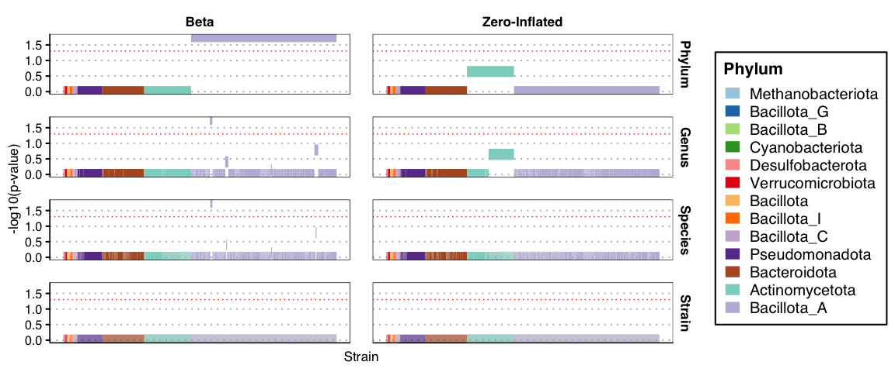
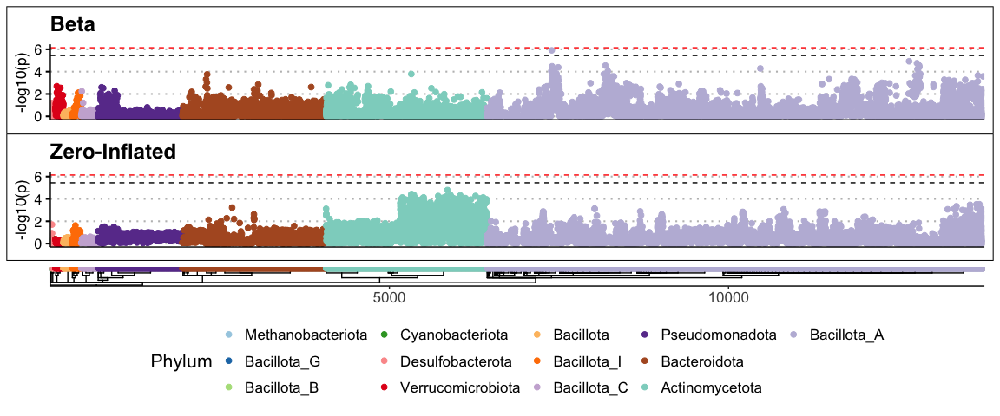
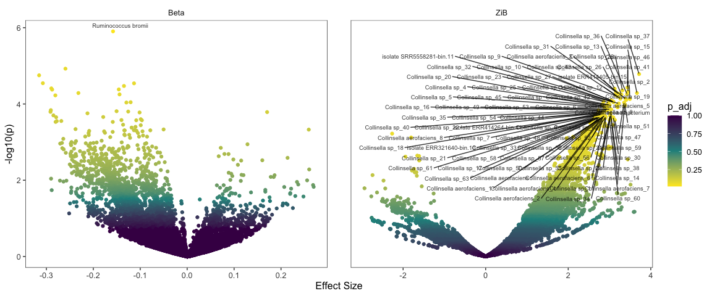
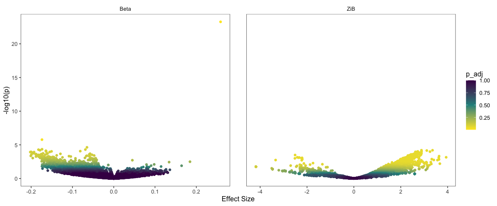

Analysis of rUTI metagenomes
================
2025-09-25

# Run ZiB analysis in q99 mode

## Load dependencies

``` r
library(SummarizedExperiment)
library(tidyverse)
library(strainspy)
library(dplyr)
library(ggplot2)
library(ggvenn)
library(stringr)
library(readxl)
library(stringdist)
```

## Load metadata

``` r
meta <- readRDS("./data/rUTI/meta.rds") 
# Remoe first column
meta = meta[,-1]
# Merged_samples
meta$Run = unname(sapply(meta$Run, function(x) unlist(strsplit(x, ','))[1]))
# set up contrasts/reference levels
meta$Cohort = factor(meta$Cohort, levels = c("Control", "rUTI"))
# set up subjects
meta$UMB = factor(meta$UMB)
# Set up sample type
meta$sample= factor(meta$sample)
```

## Load sylph outputs

### Containment ANI

``` r
sy <- read_sylph("./data/rUTI/combined_q_99.tsv.gz") # q99)
```

    ## Detected Sylph query output file.

``` r
sy <- filter_by_presence(sy, min_nonzero = 39) # filter at 10%
```

    ## Retained 13772 rows after filtering

``` r
# annoying renames to match meta V sylph file
colnames(sy) <- gsub("_1", "", colnames(sy))
colData(sy)$Sample_file <- gsub("_1", "", basename(colData(sy)$Sample_file))

dim(sy)
```

    ## [1] 13772   389

``` r
# Checks before merging metadata
all(colnames(sy) %in% meta$Run)
```

    ## [1] TRUE

``` r
all(meta$run_accession %in% colnames(sy))
```

    ## [1] TRUE

``` r
sy = modify_metadata(sy, meta)
```

### Abundance

``` r
sy_ab <- read_sylph("./data/rUTI/combined_p_95.tsv.gz", variable = 'Taxonomic_abundance')
```

    ## Detected Sylph profile output file.

``` r
sy_ab <- filter_by_presence(sy_ab, min_nonzero = 39) # filter at 10%
```

    ## Retained 351 rows after filtering

``` r
# annoying renames to match meta V sylph file
colnames(sy_ab) <- gsub("_1", "", colnames(sy_ab))
colData(sy_ab)$Sample_file <- gsub("_1", "", basename(colData(sy_ab)$Sample_file))

dim(sy_ab)
```

    ## [1] 351 387

``` r
# There are two samples missing here
meta_ab = meta[meta$Run %in% sy_ab$Sample_file, ]

# Checks before merging metadata
all(colnames(sy_ab) %in% meta_ab$Run)
```

    ## [1] TRUE

``` r
all(meta_ab$run_accession %in% colnames(sy_ab))
```

    ## [1] TRUE

``` r
sy_ab = modify_metadata(sy_ab, meta_ab)
```

# Differences between gut microbiomes

Take out the gut microbiome samples

``` r
meta_gut = meta[-which(meta$sample == "urine"), ]
sy_gut = sy[,-which(meta$sample == "urine")]

meta_ab_gut = meta_ab[-which(meta_ab$sample == "urine"), ]
sy_ab_gut = sy_ab[,-which(meta_ab$sample == "urine")]
```

## Baseline differences

### Retain only baseline samples

Exclude samples around 2 weeks of a UTI event and/or two weeks after
Antibiotic exposure

cANI:

``` r
meta_gut_bl = meta_gut

rUTI_idx = which(!meta_gut_bl$Cohort == "Control")

non_baseline_idx = sort(rUTI_idx[unique(c(which(meta_gut_bl$time_since_uti[rUTI_idx] <= 14), 
                                          which(meta_gut_bl$time_before_uti[rUTI_idx] >= -14), 
                                          which(meta_gut_bl$time_since_ab[rUTI_idx] <= 14)))])

meta_gut_bl = meta_gut_bl[-non_baseline_idx, ]

sy_gut_bl = sy_gut[,-non_baseline_idx]
sy_gut_bl = modify_metadata(sy_gut_bl, meta_gut_bl, replace = T)
```

Abundance:

``` r
meta_ab_gut_bl = meta_ab_gut

rUTI_idx = which(!meta_ab_gut_bl$Cohort == "Control")

non_baseline_idx = sort(rUTI_idx[unique(c(which(meta_ab_gut_bl$time_since_uti[rUTI_idx] <= 14), 
                                          which(meta_ab_gut_bl$time_before_uti[rUTI_idx] >= -14), 
                                          which(meta_ab_gut_bl$time_since_ab[rUTI_idx] <= 14)))])

meta_ab_gut_bl = meta_ab_gut_bl[-non_baseline_idx, ]


sy_ab_gut_bl = sy_ab_gut[,-non_baseline_idx]
sy_ab_gut_bl = modify_metadata(sy_ab_gut_bl, meta_gut_bl, replace = T)
```

### Baseline difference in composition

``` r
design <- as.formula("~ Cohort + (1 | UMB)")
save_path <- "output_rds/rUTI_zib_q_99_ebp_baseline.rds"
if(file.exists(save_path)){
  ZB_fit_bl <- readRDS(save_path)
} else {
  ebp = compute_eb_priors(sy_gut_bl, strainspy:::nobars_(design), nthreads = parallel::detectCores(),low_cutoff = 0, high_cutoff = Inf)
  ZB_fit_bl <- glmZiBFit(sy_gut_bl,  design, MAP_prior = ebp, nthreads = parallel::detectCores())
  saveRDS(ZB_fit_bl, save_path)
}

top_hits(ZB_fit_bl, method = "BH")
```

    ## Warning in top_hits(ZB_fit_bl, method = "BH"): Multiple testing correction
    ## using `BH`: No significant associations detected for coef = 2 at alpha =
    ## 0.050000

    ## # A tibble: 0 × 10
    ## # ℹ 10 variables: Contig_name <chr>, Genome_file <chr>, coefficient <dbl>,
    ## #   std_error <dbl>, p_value <dbl>, p_adjust <dbl>, zi_coefficient <dbl>,
    ## #   zi_std_error <dbl>, zi_p_value <dbl>, zi_p_adjust <dbl>

No statistically significance difference in strain composition between
groups

### Baseline difference in abundance

``` r
save_path <- "output_rds/rUTI_zib_q_99_ebp_baseline_abundance.rds"
if(file.exists(save_path)){
  abud_fit_bl <- readRDS(save_path)
} else {
  abud_fit_bl <- abundanceFit(sy_ab_gut_bl, design, transform = 'CLR', nthreads = parallel::detectCores())
  saveRDS(abud_fit_bl, save_path)
}

top_hits(abud_fit_bl, method = "BH")
```

    ## Warning in top_hits(abud_fit_bl, method = "BH"): Multiple testing correction
    ## using `BH`: No significant associations detected for coef = 2 at alpha =
    ## 0.050000

    ## # A tibble: 0 × 6
    ## # ℹ 6 variables: Contig_name <chr>, Genome_file <chr>, coefficient <dbl>,
    ## #   std_error <dbl>, p_value <dbl>, p_adjust <dbl>

No statistically significance difference in strain abundance between
groups.

### Load GTDB taxonomy

``` r
taxonomy <- read_taxonomy("data/TAXONOMY/sylph_DB_taxonomy_99.tsv")
```

### Top hits

``` r
# Top beta
strainspy:::add_tax2tophits(top_hits(ZB_fit_bl, alpha = 1), taxonomy, c("Family", "Species")) %>%
  group_by(Family) %>%
  slice_min(p_value, n = 1, with_ties = FALSE) %>%  # top species per family
  ungroup() %>%
  arrange(p_value) %>%                               # sort families by their top species' p-value
  slice_head(n = 10) %>%
  select(Family, Species)
```

    ## # A tibble: 10 × 2
    ##    Family               Species                       
    ##    <chr>                <chr>                         
    ##  1 Pasteurellaceae      Haemophilus_D parainfluenzae_Z
    ##  2 Streptococcaceae     Streptococcus thermophilus    
    ##  3 Enterobacteriaceae   Escherichia sp005843885       
    ##  4 Lachnospiraceae      Lachnospira sp003537285       
    ##  5 Bacteroidaceae       Bacteroides muris             
    ##  6 Propionibacteriaceae Cutibacterium acnes           
    ##  7 Oscillospiraceae     Dysosmobacter pullicola       
    ##  8 Acutalibacteraceae   UMGS1071 sp900542375          
    ##  9 UBA1381              Hominilimicola fabiformis     
    ## 10 Eggerthellaceae      Eggerthella lenta

``` r
# Top Zi
strainspy:::add_tax2tophits(top_hits(ZB_fit_bl, alpha = 1), taxonomy, c("Family", "Species")) %>%
  group_by(Family) %>%
  slice_min(zi_p_value, n = 1, with_ties = FALSE) %>%  # top species per family
  ungroup() %>%
  arrange(p_value) %>%                               # sort families by their top species' p-value
  slice_head(n = 10) %>%
  select(Family, Species)
```

    ## # A tibble: 10 × 2
    ##    Family                Species                          
    ##    <chr>                 <chr>                            
    ##  1 Propionibacteriaceae  Cutibacterium acnes              
    ##  2 UBA1381               Hominilimicola fabiformis        
    ##  3 QAND01                UMGS1975 sp959600905             
    ##  4 Monoglobaceae         Monoglobus pectinilyticus        
    ##  5 Pasteurellaceae       Haemophilus_D parainfluenzae_K   
    ##  6 Peptostreptococcaceae Intestinibacter bartlettii       
    ##  7 Akkermansiaceae       Akkermansia muciniphila          
    ##  8 Pseudomonadaceae      Pseudomonas_E guguanensis        
    ##  9 Acidaminococcaceae    Phascolarctobacterium sp900551745
    ## 10 Desulfovibrionaceae   Bilophila wadsworthia

``` r
# Top abundance
strainspy:::add_tax2tophits(top_hits(abud_fit_bl, alpha = 1), taxonomy, c("Family", "Species")) %>%
  group_by(Family) %>%
  slice_min(p_value, n = 1, with_ties = FALSE) %>%  # top species per family
  ungroup() %>%
  arrange(p_value) %>%                               # sort families by their top species' p-value
  slice_head(n = 10) %>%
  select(Family, Species)
```

    ## # A tibble: 10 × 2
    ##    Family             Species                       
    ##    <chr>              <chr>                         
    ##  1 Lachnospiraceae    UBA3402 sp003478355           
    ##  2 Eggerthellaceae    Anaerotardibacter sp000435675 
    ##  3 Bacteroidaceae     Phocaeicola sp900760795       
    ##  4 Ruminococcaceae    Ruthenibacterium merdipullorum
    ##  5 Rikenellaceae      Alistipes communis            
    ##  6 Anaerovoracaceae   CAG-238 sp900542245           
    ##  7 QAND01             UMGS1975 sp959600905          
    ##  8 Acutalibacteraceae UMGS1071 sp900542375          
    ##  9 Oscillospiraceae   Faecousia sp000434635         
    ## 10 CAG-138            PeH17 sp000435055

These don’t align with the paper findings much, but the paper results
are not corrected for multiple testing…

## Differences during UTI and Antibiotic events

``` r
meta_gut$UTI = as.factor(meta_gut$UTI_day | meta_gut$UTI_proximal_matched)
meta_gut$AB = meta_gut$time_since_ab <= 21 # Antibiotic exposure within 3 weeks
meta_gut$AB[is.na(meta_gut$AB)] = FALSE
meta_gut$AB = as.factor(meta_gut$AB)

sy_gut = modify_metadata(sy_gut, meta_gut, replace = T)
```

## Fit the full model on all gut microbiomes

``` r
design <- as.formula("~ Cohort + UTI + AB + (1 | UMB)")

save_path <- "output_rds/rUTI_zib_q_99_ebp.rds"
# Run with ebp - this looks a bit less noisy
if(file.exists(save_path)){
  ZB_fit <- readRDS(save_path)
} else {
  ebp = compute_eb_priors(sy_gut, strainspy:::nobars_(design), nthreads = parallel::detectCores(),low_cutoff = 0, high_cutoff = Inf)
  ZB_fit <- glmZiBFit(sy_gut,  design, MAP_prior = ebp, nthreads = parallel::detectCores())
  saveRDS(ZB_fit, save_path)
}

top_hits(ZB_fit, coef = 2, method = "BH")
```

    ## Warning in top_hits(ZB_fit, coef = 2, method = "BH"): Multiple testing
    ## correction using `BH`: No significant associations detected for coef = 2 at
    ## alpha = 0.050000

    ## # A tibble: 0 × 10
    ## # ℹ 10 variables: Contig_name <chr>, Genome_file <chr>, coefficient <dbl>,
    ## #   std_error <dbl>, p_value <dbl>, p_adjust <dbl>, zi_coefficient <dbl>,
    ## #   zi_std_error <dbl>, zi_p_value <dbl>, zi_p_adjust <dbl>

``` r
top_hits(ZB_fit, coef = 4, method = "BH")
```

    ## Warning in top_hits(ZB_fit, coef = 4, method = "BH"): Multiple testing
    ## correction using `BH`: No significant associations detected for coef = 4 at
    ## alpha = 0.050000

    ## # A tibble: 0 × 10
    ## # ℹ 10 variables: Contig_name <chr>, Genome_file <chr>, coefficient <dbl>,
    ## #   std_error <dbl>, p_value <dbl>, p_adjust <dbl>, zi_coefficient <dbl>,
    ## #   zi_std_error <dbl>, zi_p_value <dbl>, zi_p_adjust <dbl>

No real signal detected. For the cohorts (`coef = 2`) is not surprising,
given what we saw before, there aren’t many significant differences
between cohorts. Antibiotic usage and UTI are strongly correlated, I
expected some hits, but nothing comes up.

### Active infection vs. all other samples

``` r
plot_manhattan(ZB_fit, taxonomy = taxonomy, aggregate_by_taxa = T, coef = 3, method = 'BH')
```

    ## ! # Invaild edge matrix for <phylo>. A <tbl_df> is returned.
    ## ! # Invaild edge matrix for <phylo>. A <tbl_df> is returned.
    ## ! # Invaild edge matrix for <phylo>. A <tbl_df> is returned.
    ## ! # Invaild edge matrix for <phylo>. A <tbl_df> is returned.

<!-- -->

``` r
plot_manhattan(ZB_fit, taxonomy = taxonomy, aggregate_by_taxa = F, coef = 3) 
```

    ## ! # Invaild edge matrix for <phylo>. A <tbl_df> is returned.
    ## ! # Invaild edge matrix for <phylo>. A <tbl_df> is returned.
    ## ! # Invaild edge matrix for <phylo>. A <tbl_df> is returned.
    ## ! # Invaild edge matrix for <phylo>. A <tbl_df> is returned.
    ## ! # Invaild edge matrix for <phylo>. A <tbl_df> is returned.
    ## ! # Invaild edge matrix for <phylo>. A <tbl_df> is returned.

<!-- -->

``` r
plot_volcano(ZB_fit, coef = 3, label = T, method = "BH")
```

<!-- -->

Looks like there are hits. Dominated by presence/absence of many
Collinsella sp. and a strain replacement of *Ruminococcus bromi*.

## Differences in gut microbiome around infection compared to baseline in rUTI

``` r
# retain only patients who had an episode of UTI during trial
idx <- unlist(lapply(split(seq_len(nrow(meta_gut)), meta_gut$UMB),
                     function(x) if(!all(is.na(meta_gut$time_since_uti[x]))) x else NULL))

meta_ruti = meta_gut[idx, ]
# containment ANI
sy_gut_ruti = sy_gut[,idx]


sy_gut_ruti = filter_by_presence(sy_gut_ruti, min_nonzero = 20) # re apply 0 filter 
```

    ## Retained 12043 rows after filtering

``` r
meta_ruti$UTI = "baseline"
meta_ruti$UTI[which(meta_ruti$time_before_uti > -31)] = "pre"
meta_ruti$UTI[which(meta_ruti$time_since_uti < 15)] = "post"

table(meta_ruti$UTI, meta_ruti$AB)
```

    ##           
    ##            FALSE TRUE
    ##   baseline    79    6
    ##   post        16   15
    ##   pre         19    5

``` r
meta_ruti$UTI = factor(meta_ruti$UTI, levels = c("baseline", "pre", "post")) 

sy_gut_ruti = modify_metadata(sy_gut_ruti, meta_ruti, replace = T)
design <- as.formula("~ UTI + AB + (1 | UMB)")

save_path <- "output_rds/rUTI_infection_zib_q_99_ebp.rds"
# Run with ebp - this looks a bit less noisy
if(file.exists(save_path)){
  ZB_fit_inf <- readRDS(save_path)
} else {
  ebp = compute_eb_priors(sy_gut_ruti, strainspy:::nobars_(design), nthreads = parallel::detectCores(),low_cutoff = 0, high_cutoff = Inf)
  ZB_fit_inf2 <- glmZiBFit(sy_gut_ruti,  design, MAP_prior = ebp, nthreads = parallel::detectCores())
  saveRDS(ZB_fit_inf, save_path)
}

strainspy:::add_tax2tophits(top_hits(ZB_fit_inf, 2, method = "BH" ), taxonomy)
```

    ## # A tibble: 2 × 11
    ##   Contig_name  Genome_file coefficient std_error p_value p_adjust zi_coefficient
    ##   <chr>        <chr>             <dbl>     <dbl>   <dbl>    <dbl>          <dbl>
    ## 1 FR903212.1 … GCA_000438…     -0.0575   0.0106  6.68e-8 0.000805         -0.372
    ## 2 CARHVY01000… GCA_948990…     -0.0187   0.00414 6.37e-6 0.0383           -0.393
    ## # ℹ 4 more variables: zi_std_error <dbl>, zi_p_value <dbl>, zi_p_adjust <dbl>,
    ## #   Species <chr>

``` r
th = strainspy:::add_tax2tophits(top_hits(ZB_fit_inf, 3, method = "BH" ), taxonomy, columns = c("Species", "Genus"))
sort(table(th$Genus), decreasing = T) 
```

    ## 
    ##        Escherichia        Collinsella          Blautia_A            CAG-170 
    ##                529                416                 44                 15 
    ##    Alitiscatomonas        Phocaeicola              Dorea      Laedolimicola 
    ##                 10                 10                  7                  5 
    ##      Dysosmobacter      Enterocloster Pullilachnospira_A      Adlercreutzia 
    ##                  3                  3                  3                  2 
    ##  Lentihominibacter          Alistipes       Avimicrobium      Lawsonibacter 
    ##                  2                  1                  1                  1 
    ##         Limivivens             UBA866           UMGS1071           UMGS1696 
    ##                  1                  1                  1                  1 
    ##           UMGS1975 
    ##                  1

``` r
plot_volcano(ZB_fit_inf, coef = 3, method = "BH")
```

<!-- -->

There are clear effects of antibiotic exposure post UTI - disappearance
and replacement of butyrate produces such as *Blautia wexlerae* and the
disappearance of Collinsella sp. and many Escherechia sp.

## Closer investigation of the strains that disappear post infection

``` r
th_inf = strainspy:::add_tax2tophits(top_hits(ZB_fit_inf, coef = 3, method = "BH"), taxonomy, c("Family", "Species"))
# Mostly driven by E coli!
head(sort(table(th_inf$Species), decreasing = T))
```

    ## 
    ##          Escherichia coli      Blautia_A fusiformis Collinsella aerofaciens_G 
    ##                       527                        39                        15 
    ##     Alitiscatomonas aceti Collinsella aerofaciens_M       CAG-170 sp937967235 
    ##                        10                        10                         9

``` r
th_inf_ec = th_inf[th_inf$Species == "Escherichia coli", ]

# https://doi.org/10.1101/2025.04.13.648558 has a nice supplementary table classifying E coli strains - could be helpful
m1 = readxl::read_xlsx("./data/rUTI/media-1.xlsx", sheet = 2)
# Strain names don't match easily, let's try a few things - chatGPT solution
# --- 1. Normalize accessions: GCF -> GCA ---
th_inf_ec$Genome_file_norm <- sub("^GCF_", "GCA_", th_inf_ec$Genome_file)
m1$Accession_norm      <- sub("^GCF_", "GCA_", m1$`Accession ID`)

# --- 2. Direct accession match ---
th_inf_ec$direct_match_idx <- match(th_inf_ec$Genome_file_norm, m1$Accession_norm)

# --- 3. Clean strain names for fuzzy matching ---
clean_name <- function(x){
  x <- tolower(x)
  x <- gsub("chromosome|whole genome shotgun sequence|contig[0-9]+|_000[0-9]+|NODE_[0-9]+.*", "", x)
  x <- gsub("[^a-z0-9]", "", x)
  trimws(x)
}

th_inf_ec$strain_clean <- clean_name(th_inf_ec$Contig_name)
m1$strain_clean     <- clean_name(m1$Strain)

# --- 4. Fuzzy match for rows without direct accession match ---
no_match_idx <- which(is.na(th_inf_ec$direct_match_idx))
th_inf_ec$fuzzy_match_idx <- NA

if(length(no_match_idx) > 0){
  fuzzy_idx <- amatch(th_inf_ec$strain_clean[no_match_idx],
                      m1$strain_clean,
                      maxDist = 5)   # adjust tolerance
  th_inf_ec$fuzzy_match_idx[no_match_idx] <- fuzzy_idx
}

# --- 5. Combine indices ---
th_inf_ec$final_idx <- ifelse(!is.na(th_inf_ec$direct_match_idx),
                            th_inf_ec$direct_match_idx,
                            th_inf_ec$fuzzy_match_idx)

# --- 6. Pull only Strain and Pathogenicity type ---
th_inf_ec$Strain <- m1$Strain[th_inf_ec$final_idx]
th_inf_ec$Pathogenicity_type <- m1$`Pathogenicity type`[th_inf_ec$final_idx]
sort(table(th_inf_ec$Pathogenicity_type, useNA = 'always'), decreasing = T)
```

    ## 
    ##             <NA>        Commensal Other pathogenic             UPEC 
    ##              374               95               44                6 
    ##             AIEC             EHEC             NMEC             EPEC 
    ##                3                2                2                1

Antibiotic exposure depletes a substantial proportion of the *E. coli*
population, including a large number of commensals.

## Species that change in Abundance

``` r
sy_ab_gut_ruti = sy_ab_gut[,idx]
sy_ab_gut_ruti = modify_metadata(sy_ab_gut_ruti, meta_ruti, replace = T)

save_path <- "output_rds/rUTI_infection_zib_q_99_abud.rds"
if(file.exists(save_path)){
  abud_fit_inf <- readRDS(save_path)
} else {
  abud_fit_inf <- abundanceFit(sy_ab_gut_ruti, design, transform = 'CLR', nthreads = parallel::detectCores())
  saveRDS(abud_fit_inf, save_path)
}

strainspy:::add_tax2tophits(top_hits(abud_fit_inf, coef = 2, method = "BH"), taxonomy)
```

    ## # A tibble: 2 × 7
    ##   Contig_name         Genome_file coefficient std_error p_value p_adjust Species
    ##   <chr>               <chr>             <dbl>     <dbl>   <dbl>    <dbl> <chr>  
    ## 1 CAJFQY010000001.1 … GCA_904419…       0.639    0.151  4.30e-5   0.0150 Zongya…
    ## 2 NZ_CP102250.1 Alis… GCF_025144…      -0.266    0.0658 9.05e-5   0.0157 Alisti…

``` r
strainspy:::add_tax2tophits(top_hits(abud_fit_inf, coef = 3, method = "BH"), taxonomy)
```

    ## # A tibble: 1 × 7
    ##   Contig_name         Genome_file coefficient std_error p_value p_adjust Species
    ##   <chr>               <chr>             <dbl>     <dbl>   <dbl>    <dbl> <chr>  
    ## 1 NZ_CP102250.1 Alis… GCF_025144…      -0.327    0.0646 1.38e-6 0.000481 Alisti…

``` r
strainspy:::add_tax2tophits(top_hits(abud_fit_inf, coef = 4, method = "BH"), taxonomy)
```

    ## # A tibble: 7 × 7
    ##   Contig_name         Genome_file coefficient std_error p_value p_adjust Species
    ##   <chr>               <chr>             <dbl>     <dbl>   <dbl>    <dbl> <chr>  
    ## 1 NZ_CP102250.1 Alis… GCF_025144…       0.332    0.0671 2.29e-6 0.000798 Alisti…
    ## 2 NZ_NNBY01000001.1 … GCF_002834…       0.558    0.136  7.26e-5 0.0126   Rumino…
    ## 3 URFQ01000001.1 unc… GCA_900547…      -0.216    0.0575 2.53e-4 0.0293   Butyri…
    ## 4 NZ_CP102272.1 [Clo… GCF_025149…      -0.524    0.144  3.97e-4 0.0345   Entero…
    ## 5 NZ_JACRWC010000048… GCF_014306…      -0.539    0.152  5.26e-4 0.0366   Lentih…
    ## 6 JAGTTR010000010.1 … GCA_018223…      -0.385    0.111  7.40e-4 0.0429   JAGTTR…
    ## 7 CAAFEP010000001.1 … GCA_900761…      -0.462    0.137  9.60e-4 0.0477   HGM142…
